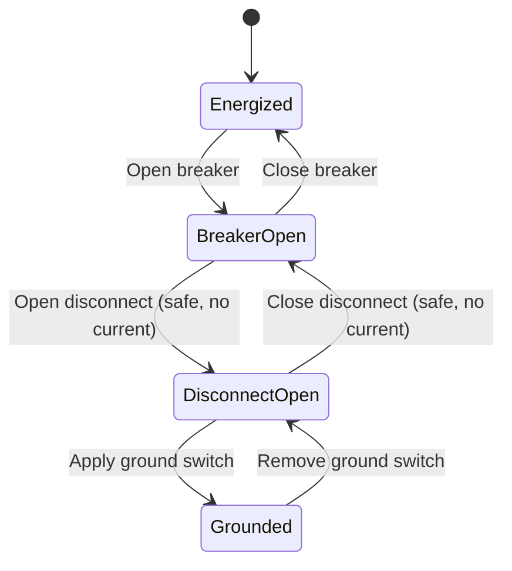

## Disconnect Switches and Isolation Equipment

### Overview

A disconnect switch (also called an isolator or disconnector) is a mechanical switching device that provides visible, physical isolation of a circuit section for safety during maintenance. Unlike circuit breakers, disconnect switches are **not designed to interrupt load current or fault current** under normal operating conditions — their contacts have no dedicated arc-extinguishing medium or mechanism, and switching under load can produce a sustained arc that the device cannot safely quench.

The defining functional requirement of a disconnect switch is providing a **visible break** in the circuit that personnel can confirm by direct observation, satisfying isolation requirements before work begins on de-energized equipment. This distinguishes disconnects from breakers, which provide isolation electrically but not necessarily visibly.

### Functional Role in Substation Design

- **Key Points**
  - Provides visible isolation point for maintenance personnel (lockout/tagout compliance)
  - Enables equipment bypass and bus transfer configurations without full circuit de-energization
  - Allows breaker maintenance by isolating the breaker from both source and load sides
  - Does not have fault-interrupting capability — operated only when current is negligible or zero (or via load-break variants for limited magnetizing/charging current)
  - Typically interlocked with associated circuit breakers to prevent hazardous operating sequences

### Operating Sequence Discipline

Because disconnects lack arc-interruption capability, strict operational sequencing is mandatory:

**De-energizing a circuit:**

1. Open the circuit breaker first (interrupts load current)
2. Open the disconnect switch(es) (now carrying no current — safe to open)
3. Apply grounding/earthing switches if required for maintenance

**Re-energizing a circuit:**

1. Close the disconnect switch(es) first (establishes connection with no current flow)
2. Close the circuit breaker (energizes the circuit)

Violating this sequence — opening a disconnect under load — can produce a sustained, uncontrolled arc, leading to equipment destruction, arc flash hazard, and potential system-wide fault propagation.

### Interlocking Systems

Mechanical and/or electrical interlocks prevent out-of-sequence operation:

- **Mechanical (key) interlocks**: physical key exchange mechanisms that only release the next device's operating handle after the prerequisite device is correctly positioned
- **Electrical interlocks**: auxiliary contacts on the breaker feed a permissive circuit to the disconnect's motor operator or control circuit, blocking operation unless the breaker is confirmed open
- **SCADA/logic-based interlocks**: modern digital substations implement interlock logic in the bay controller/IED, cross-checking breaker and disconnect status via IEC 61850 GOOSE messaging before permitting an operate command
- [Inference] The shift toward IEC 61850 GOOSE-based interlocking in new substation designs reduces dependency on hardwired auxiliary contacts, though many utilities retain hardwired interlocks as a backup scheme even in digital substations, reflecting a general defense-in-depth philosophy rather than a universally mandated standard.

### Classification by Mechanical Configuration

#### 1. Vertical (Center-Break) Switches

Two blade sections pivot from fixed posts and meet in the center. Common for outdoor AIS substations at various voltage classes.

- Simple construction, moderate footprint
- Ice and contamination on the horizontal blade can affect contact pressure

#### 2. Horizontal (Side-Break) Switches

Blade rotates in a horizontal plane, breaking to the side rather than the center.

- Lower profile than center-break for a given voltage class
- Common where structure height is constrained

#### 3. Double-End (Pantograph) Switches

Blade moves vertically like a pantograph, connecting to an overhead bus. Frequently used in high-density substation layouts where multiple bus connections must be made compactly (e.g., GIS-to-AIS transition yards, high-voltage switchyards with multiple bus sections).

- Space-efficient — reduces yard footprint by eliminating one fixed structure per switch
- Requires precise alignment and adjustment of the pantograph mechanism

#### 4. Knee-Type (V-Break) Switches

Blade breaks at a hinge point partway along its length, forming a V-shape when open.

- Compact break distance for the space occupied
- Commonly found at distribution and sub-transmission voltage classes

#### 5. GIS Disconnect Switches

Integrated into gas-insulated switchgear enclosures, operating within the SF6 (or alternative gas) environment. Contacts move within a sealed, factory-assembled module.

- Not visible externally — position confirmation relies on mechanical position indicators and auxiliary switch feedback rather than direct visual observation
- Compact, weatherproof, immune to external contamination
- Position indication reliability becomes a critical safety design consideration since the "visible break" principle cannot be satisfied by direct observation

### Load-Break Disconnect Switches

A variant equipped with auxiliary arcing horns, arc chutes, or a small integral interrupter, permitting switching of limited currents:

- **Line charging current**: capacitive current from an unloaded transmission line
- **Transformer magnetizing current**: small excitation current of an unloaded transformer
- **Bus transfer current**: circulating current when transferring a load between parallel buses of nearly equal voltage (ring bus/breaker-and-a-half schemes)

These are explicitly rated for such duty (per IEEE C37.32 or IEC 62271-102) and must not be confused with full load-break or fault-interrupting devices.

- [Unverified] The exact current magnitudes considered "safe" for load-break disconnect switching vary by manufacturer rating and specific horn/interrupter design; values should always be verified against the specific device's nameplate rating rather than generalized rules of thumb.

### Grounding (Earthing) Switches

A specialized isolation device, often integrated with or adjacent to the disconnect switch, used to positively ground a de-energized circuit section before personnel access — protecting against:

- Accidental re-energization
- Induced voltage from adjacent energized circuits (common on parallel transmission corridors)
- Trapped capacitive charge on long transmission lines

**Types:**

- **Manual ground switches**: hand-operated, mechanically simple, used at lower-risk locations
- **Motor-operated ground switches**: remotely operable, often interlocked with the line disconnect to prevent grounding an energized line
- **High-speed grounding switches (HSGS)**: designed to close rapidly into a fault-current-capable circuit as a protection scheme element (e.g., used in some transfer trip or breaker-failure backup schemes), distinct from standard maintenance grounding switches

### Rated Parameters

- **Rated voltage and insulation level (BIL)**: matches the associated bus/circuit rating
- **Rated continuous current**: thermal current-carrying capacity under normal conditions
- **Rated short-time withstand current**: the disconnect must survive (without interrupting) the mechanical and thermal stress of a through-fault while the breaker clears it, typically 1-3 seconds
- **Rated peak withstand current**: mechanical withstand against the peak asymmetrical fault current during the first half-cycle
- **Mechanical endurance class**: number of no-load operating cycles the switch is designed to withstand (per IEC 62271-102)

$$F \propto I_{peak}^2 \times \frac{1}{d}$$

where $F$ is the electromagnetic force between parallel current paths, $I_{peak}$ is the peak fault current, and $d$ is the conductor spacing — illustrating why disconnect switch blade design must account for electromagnetic repulsion/attraction forces during through-faults even though the switch itself never interrupts that current.

### Position Indication and Visible Break Verification

For outdoor AIS disconnects, the visible break principle is satisfied by direct line-of-sight observation of blade position, often assisted by:

- Mechanical position indicator flags synchronized to blade motion
- Auxiliary limit switches feeding SCADA/RTU status points
- Physical padlocking provisions on the operating mechanism for lockout/tagout

For GIS disconnects, since direct visual confirmation is impossible, reliance shifts to:

- Redundant mechanical position indicators viewable through an inspection window
- Dual auxiliary switch contacts (normally-open and normally-closed) cross-checked in control logic
- Manufacturer type-testing demonstrating indicator-to-contact correlation under IEC 62271-102 requirements
- [Inference] Because GIS disconnects cannot provide a true visible break, many utility safety procedures treat GIS isolation points with additional verification steps (e.g., mandatory voltage presence testing before grounding) beyond what is typically required for AIS visible-break disconnects, though specific procedural requirements are governed by individual utility safety programs rather than a single universal standard.

### Simplified Substation Bay Showing Breaker–Disconnect Relationship (svg_diagram)

<svg xmlns="http://www.w3.org/2000/svg" viewBox="0 0 640 360" font-family="sans-serif">
<text x="320" y="24" text-anchor="middle" font-size="16" font-weight="bold">Substation Bay: Breaker and Disconnect Arrangement (svg_diagram)</text>

<line x1="80" y1="60" x2="560" y2="60" stroke="#333" stroke-width="4" />
<text x="90" y="50" font-size="12">Main Bus</text>

<line x1="200" y1="60" x2="200" y2="100" stroke="#333" stroke-width="2" />

<g transform="translate(170,100)">
<line x1="0" y1="0" x2="60" y2="0" stroke="#333" stroke-width="2" />
<line x1="30" y1="0" x2="55" y2="-25" stroke="#c0392b" stroke-width="3" />
<circle cx="30" cy="0" r="3" fill="#333" />
<text x="30" y="20" text-anchor="middle" font-size="10">Bus DS (Open)</text>
</g>
<line x1="200" y1="100" x2="200" y2="150" stroke="#333" stroke-width="2" />

<rect x="165" y="150" width="70" height="50" fill="none" stroke="#333" stroke-width="2" rx="4" />
<text x="200" y="180" text-anchor="middle" font-size="11" font-weight="bold">CB</text>
<line x1="200" y1="200" x2="200" y2="240" stroke="#333" stroke-width="2" />

<g transform="translate(170,240)">
<line x1="0" y1="0" x2="60" y2="0" stroke="#333" stroke-width="2" />
<line x1="30" y1="0" x2="30" y2="-28" stroke="#27ae60" stroke-width="3" />
<circle cx="30" cy="0" r="3" fill="#333" />
<text x="30" y="20" text-anchor="middle" font-size="10">Line DS (Closed)</text>
</g>
<line x1="200" y1="240" x2="200" y2="270" stroke="#333" stroke-width="2" />

<g transform="translate(230,255)">
<line x1="0" y1="0" x2="30" y2="15" stroke="#7f8c8d" stroke-width="2" stroke-dasharray="3,2" />
<text x="35" y="20" font-size="9">Ground SW</text>
</g>

<line x1="200" y1="270" x2="200" y2="310" stroke="#333" stroke-width="2" />
<text x="200" y="330" text-anchor="middle" font-size="11">To Line/Feeder</text>

<rect x="400" y="120" width="200" height="90" fill="none" stroke="#999" stroke-width="1" />
<text x="410" y="138" font-size="11" font-weight="bold">Legend</text>
<line x1="410" y1="150" x2="430" y2="150" stroke="#c0392b" stroke-width="3" />
<text x="436" y="154" font-size="10">Open blade</text>
<line x1="410" y1="168" x2="430" y2="168" stroke="#27ae60" stroke-width="3" />
<text x="436" y="172" font-size="10">Closed blade</text>
<line x1="410" y1="186" x2="430" y2="186" stroke="#7f8c8d" stroke-width="2" stroke-dasharray="3,2" />
<text x="436" y="190" font-size="10">Ground switch</text>
</svg>

### Practical Example: Isolation Procedure for Breaker Maintenance

Scenario: A 69 kV feeder breaker requires maintenance; the bay has a bus-side disconnect (Bus DS), the breaker (CB), a line-side disconnect (Line DS), and a maintenance ground switch.

1. Confirm load has been transferred or feeder is acceptable to de-energize
2. Open CB (interrupts load current — breaker is rated for this)
3. Verify CB open via SCADA indication and mechanical position flag
4. Open Bus DS (now carrying zero current — safe to operate)
5. Open Line DS (now carrying zero current — safe to operate)
6. Visually confirm both disconnects show clear air gaps (visible break)
7. Test for absence of voltage on the isolated section
8. Close the maintenance ground switch to positively ground the isolated section
9. Apply personal lockout/tagout devices per utility safety procedure
10. Proceed with breaker maintenance

**Conclusion**

Disconnect switches and grounding switches form the isolation backbone of substation safety practice, complementing circuit breakers rather than competing with them functionally. Their defining value is the visible, verifiable break they provide — a property that must be re-engineered through redundant indication schemes when physical visibility is lost, as in GIS designs. Correct interlocking and strict operating sequence discipline are the primary safeguards against the catastrophic failure mode of attempting load interruption with a device not designed for it.

**Related Topics**

- Circuit breaker technologies and interrupting media
- Substation bus arrangements (single bus, breaker-and-a-half, ring bus, main-and-transfer)
- IEC 61850 substation automation and GOOSE-based interlocking
- Arc flash hazard analysis and PPE categorization
- Lockout/Tagout (LOTO) procedures for high-voltage isolation
- Gas-insulated switchgear (GIS) design and SF6 alternatives
- Instrument transformers (CTs/VTs) and their role in isolation verification
- Insulation coordination and BIL selection for switching equipment