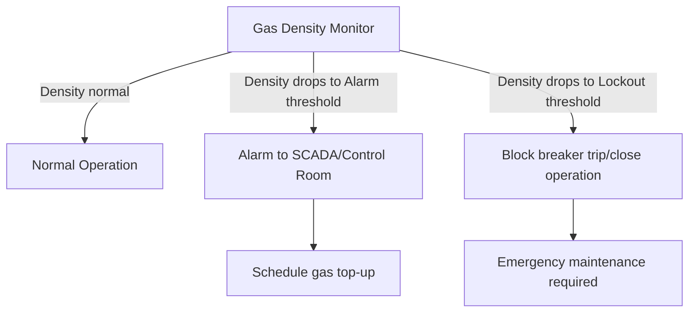

## Gas-Insulated Switchgear


### Overview

Gas-Insulated Switchgear (GIS) is a compact, metal-enclosed switchgear technology in which all live conductive parts — busbars, circuit breakers, disconnect switches, grounding switches, and instrument transformers — are housed within grounded metal enclosures filled with an insulating gas, predominantly SF6. The gas serves as both the dielectric medium between conductors and enclosure, and often the interrupting medium in the integrated circuit breaker module.

The core design driver is **footprint reduction**: GIS installations typically occupy 5-10% of the land area required by an equivalent air-insulated switchgear (AIS) installation at the same voltage class, because SF6's dielectric strength (roughly 2.5-3x that of air at atmospheric pressure) allows conductor spacing and clearance distances to shrink dramatically.

### Fundamental Design Principle

In AIS, phase-to-phase and phase-to-ground clearances are dictated by air's breakdown strength, requiring meters of clearance at transmission voltages. GIS confines each phase (or all three phases, in compact designs) within a sealed metal enclosure pressurized with SF6, typically at 0.3-0.6 MPa (3-6 bar) gauge pressure for busbar sections and higher for interrupter chambers.

$$E_{breakdown,SF6} \approx k \cdot P$$

where dielectric strength scales approximately linearly with gas pressure $P$ over the practical operating range, allowing engineers to trade gas pressure against enclosure diameter to hit a target BIL (Basic Insulation Level) in a compact envelope.

- **Key Points**
  - Enclosure is grounded, conductor is coaxially centered — a "coaxial cable" geometry at power frequency
  - Support insulators (typically cast epoxy resin cones) hold the conductor centered within the enclosure and often serve as gas compartment barriers
  - Enclosures may be single-phase (one enclosure per phase, common in transmission-class GIS) or three-phase common enclosure (all three phases share one enclosure, common in distribution/sub-transmission)

### Major Functional Modules

A GIS installation is assembled from standardized, factory-tested modules connected via bolted flanges:

1. **Circuit breaker module**: integrated SF6 puffer or self-blast interrupter (see Circuit Breaker Technologies)
2. **Disconnect switch module**: motor-operated blade contact within the gas compartment, providing isolation (visible break not possible — relies on redundant position indication)
3. **Grounding switch module**: maintenance earthing switch; some designs incorporate high-speed grounding switches for fault-current-capable rapid grounding
4. **Busbar module**: rigid tubular conductor within the enclosure, connecting bays
5. **Current transformer (CT) module**: typically toroidal CTs mounted around the conductor within the enclosure, non-invasive to the gas boundary
6. **Voltage transformer (VT) module**: capacitive or electromagnetic VTs adapted for the gas-insulated environment
7. **Cable sealing end / bushing module**: transition point from GIS to external cable or overhead line, requiring a gas-to-air or gas-to-oil interface
8. **Gas compartment barriers**: epoxy spacers dividing the GIS into independently sealed gas zones, limiting the consequence of a gas leak or internal fault to a single zone

### Gas Compartmentalization Strategy

GIS is divided into multiple independently sealed gas zones (compartments) rather than one continuous gas volume, for two reasons:

- **Fault containment**: an internal arcing fault or gas leak in one compartment does not depressurize the entire switchgear
- **Maintenance flexibility**: individual compartments can be isolated, evacuated, and serviced without de-gassing the whole installation

Each compartment has its own gas density monitor (pressure-temperature compensated), typically wired to alarm and lockout functions:

- **Alarm level**: signals gas loss requiring scheduled top-up
- **Lockout level**: gas density has dropped enough that interrupting capability or dielectric withstand can no longer be guaranteed — blocks breaker operation



### GIS vs AIS Comparison

| Attribute | GIS | AIS |
| --- | --- | --- |
| Footprint | 5-10% of AIS at same voltage | Baseline |
| Environmental exposure | Fully enclosed, immune to pollution/salt/ice | Exposed to weather, contamination |
| Visible break isolation | Not possible (indicator-based) | Direct visual confirmation |
| Installation environment | Can be fully indoor, suits urban/space-constrained sites | Typically outdoor, large yard |
| Maintenance access | Requires gas handling (evacuation, purification, refill) | Direct mechanical access |
| Initial cost | Higher | Lower |
| Lifecycle/environmental footprint | SF6 GWP concerns; leak management required | No greenhouse gas concern |
| Internal fault diagnosis | More difficult (enclosed); requires partial discharge monitoring | More directly observable |

### Instrument Transformers in GIS

- **CTs**: typically ring-core (toroidal) designs mounted around the primary conductor inside the enclosure — inherently gas-insulated, requiring no separate bushing
- **VTs**: often capacitive-divider or inductive designs integrated into a dedicated gas compartment; some designs use the gas itself as part of the dielectric between HV and LV windings

Both must be designed to withstand the compact geometric confines and electromagnetic environment of the sealed enclosure, and their accuracy classes are validated during factory acceptance testing under the specific GIS gas pressure and geometry.

### Failure Modes and Diagnostics

**Internal arcing faults**: An internal fault within a GIS enclosure — from insulation breakdown, foreign particle contamination, or manufacturing defect — produces an arc confined within a sealed metal vessel. This is a serious failure mode because:

- Rapid pressure rise from arc energy can rupture the enclosure if pressure relief devices (rupture discs/diaphragms) do not vent in time
- Decomposition byproducts of SF6 arcing (sulfur fluorides, metal fluorides) are toxic and corrosive, requiring careful handling during post-fault inspection
- Fault location within a sealed enclosure is not visually obvious, requiring diagnostic techniques

**Partial discharge (PD) monitoring**: Because internal defects (particle contamination, void formation in epoxy spacers, floating metallic components) often manifest as partial discharge activity before full breakdown, GIS installations increasingly incorporate:

- **UHF sensors**: detect electromagnetic emissions in the 300 MHz - 3 GHz range characteristic of PD events, mounted at spacer locations or via dedicated UHF windows
- **Acoustic sensors**: detect the mechanical/acoustic signature of PD or free-particle movement within the enclosure
- **Online gas decomposition analysis**: monitoring for SO2, SOF2, and other decomposition byproducts as indicators of internal arcing activity
- [Inference] The adoption of continuous online PD monitoring (as opposed to periodic offline testing) has become increasingly standard practice for new EHV/UHV GIS installations, reflecting the high consequence-of-failure profile of GIS relative to AIS, though specific monitoring requirements and sensor densities vary by utility specification and are not governed by a single universal mandate.

### Gas Handling Infrastructure

GIS operation and maintenance requires dedicated gas-handling equipment:

- **SF6 recovery/recycling carts**: evacuate gas from a compartment into storage cylinders before opening it for maintenance, minimizing atmospheric release
- **Gas purification units**: filter moisture and decomposition byproducts from recovered gas before reuse
- **Vacuum pumps**: evacuate air/moisture from a compartment before gas refill
- **Gas analyzers**: verify purity, moisture content (dew point), and SF6 concentration in mixtures before/after servicing
- **Key Points**
  - Moisture ingress is a critical concern: moisture reacts with SF6 decomposition byproducts (from any arcing) to form highly corrosive hydrofluoric acid (HF)
  - Molecular sieve desiccant is commonly incorporated within GIS compartments to absorb moisture and decomposition byproducts over the equipment's service life
  - SF6 handling procedures are increasingly regulated (e.g., EPA SF6 emission reduction partnership programs in the US, F-gas regulations in the EU) requiring leak tracking, recovery-rate reporting, and minimizing intentional venting

### SF6-Alternative GIS

Driven by SF6's high global warming potential (GWP ≈ 23,500), manufacturers now offer GIS using alternative gases:

- **Fluoronitrile/fluoroketone-CO2-O2 mixtures** (e.g., commercialized under trade names by major manufacturers): GWP reduction of 98%+ versus pure SF6, requiring modest pressure or geometry adjustments to match SF6's dielectric performance
- **Clean air (synthetic/dry air) GIS**: eliminates greenhouse gas concerns entirely but requires larger enclosure diameters due to air's lower dielectric strength, partially offsetting GIS's footprint advantage
- **Vacuum-SF6 hybrid designs**: use vacuum interrupters for the breaker function within an SF6 (or alternative gas) insulated busbar system, reducing total SF6 volume
- [Speculation] Full industry-wide standardization on a single SF6 replacement for transmission-voltage GIS has not yet occurred as of this writing; multiple competing chemistries and hybrid vacuum approaches remain under parallel commercial deployment and field evaluation, and the eventual dominant approach for EHV/UHV applications remains unsettled.

### Typical GIS Bay Layout (svg_diagram)

<svg xmlns="http://www.w3.org/2000/svg" viewBox="0 0 680 380" font-family="sans-serif">
<text x="340" y="24" text-anchor="middle" font-size="16" font-weight="bold">Single-Line GIS Bay Module Arrangement (svg_diagram)</text>

<rect x="60" y="50" width="560" height="60" fill="#eef2f5" stroke="#333" stroke-width="2" />
<text x="340" y="45" text-anchor="middle" font-size="12">Busbar Enclosure (SF6, ~0.4-0.6 MPa)</text>

<g transform="translate(320,110)">
<line x1="20" y1="0" x2="20" y2="30" stroke="#333" stroke-width="3" />



```

<rect x="0" y="30" width="40" height="30" fill="#d6e4f0" stroke="#333" stroke-width="1.5" />
<text x="20" y="50" text-anchor="middle" font-size="9">Bus DS</text>
<line x1="20" y1="60" x2="20" y2="90" stroke="#333" stroke-width="3" />


<rect x="-10" y="90" width="60" height="40" fill="#f0d6d6" stroke="#333" stroke-width="1.5" />
<text x="20" y="114" text-anchor="middle" font-size="10" font-weight="bold">CB Module</text>
<line x1="20" y1="130" x2="20" y2="160" stroke="#333" stroke-width="3" />


<rect x="0" y="160" width="40" height="25" fill="#e0f0d6" stroke="#333" stroke-width="1.5" />
<text x="20" y="176" text-anchor="middle" font-size="9">CT</text>
<line x1="20" y1="185" x2="20" y2="210" stroke="#333" stroke-width="3" />


<rect x="0" y="210" width="40" height="30" fill="#d6e4f0" stroke="#333" stroke-width="1.5" />
<text x="20" y="230" text-anchor="middle" font-size="9">Line DS</text>
<line x1="20" y1="240" x2="20" y2="260" stroke="#333" stroke-width="3" />


<g transform="translate(30,245)">
  <line x1="0" y1="0" x2="20" y2="12" stroke="#7f8c8d" stroke-width="2" stroke-dasharray="3,2" />
  <text x="24" y="16" font-size="8">Ground SW</text>
</g>


<rect x="0" y="260" width="40" height="25" fill="#f0ecd6" stroke="#333" stroke-width="1.5" />
<text x="20" y="276" text-anchor="middle" font-size="9">VT</text>
<line x1="20" y1="285" x2="20" y2="310" stroke="#333" stroke-width="3" />


<polygon points="0,310 40,310 30,340 10,340" fill="#ddd" stroke="#333" stroke-width="1.5" />
<text x="20" y="358" text-anchor="middle" font-size="9">Cable Sealing End</text>
```

</g>


<text x="60" y="130" font-size="10" fill="#555">Each shaded block = independently</text>

<text x="60" y="144" font-size="10" fill="#555">sealed gas compartment</text>

</svg>

### Practical Example: Compartment Isolation for Breaker Module Replacement

Scenario: A 245 kV GIS installation requires replacement of a circuit breaker interrupter module due to detected excessive contact wear.

1. De-energize and isolate the bay electrically (open breaker, then bus-side and line-side disconnects per interlocked sequence)
2. Close integrated grounding switches on both sides of the breaker module to establish a safe working zone
3. Verify zero energy using the GIS's built-in voltage presence indicating system (capacitive test points), since no direct visual verification is possible
4. Connect SF6 recovery cart to the breaker module's gas compartment service valve
5. Evacuate SF6 gas to storage cylinders, monitoring recovery efficiency (utility programs commonly target >97% recovery to minimize emissions)
6. Draw vacuum on the evacuated compartment to remove residual gas and moisture
7. Unbolt the compartment flange, extract the worn interrupter assembly, install the replacement module
8. Re-torque flange bolts per manufacturer specification (critical for compartment gas-tightness)
9. Evacuate compartment to remove air/moisture before gas fill
10. Refill with SF6 (or specified alternative gas) to rated pressure, verify with gas analyzer (moisture/purity)
11. Conduct dielectric and mechanical commissioning tests before returning the compartment to service

**Conclusion**

GIS technology trades higher capital cost and specialized gas-handling requirements for dramatic footprint reduction, weatherproof reliability, and immunity to environmental contamination — advantages that are often decisive at space-constrained urban substations, high-altitude/high-pollution sites, or where land acquisition costs are prohibitive. The central engineering tension in modern GIS design is balancing SF6's excellent dielectric and interrupting performance against mounting environmental and regulatory pressure, driving active development of lower-GWP gas alternatives and hybrid vacuum-gas architectures.

**Related Topics**

- Circuit breaker technologies and interrupting media
- Disconnect switches and isolation equipment
- Partial discharge monitoring and diagnostic techniques
- SF6 gas handling, recovery, and environmental regulation
- Substation bus arrangements (single bus, ring bus, breaker-and-a-half)
- Hybrid switchgear (mixed GIS/AIS) design considerations
- Insulation coordination and BIL selection for compact geometries
- IEC 62271-203 (GIS standard) and factory/site acceptance testing procedures