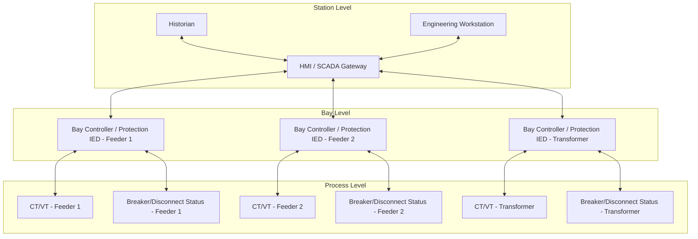

## Substation Automation and Protection Integration

### Overview

Substation automation refers to the integration of intelligent electronic devices (IEDs), communication networks, and software systems to monitor, protect, control, and manage substation equipment with reduced reliance on hardwired, point-to-point wiring and manual intervention. Modern substation automation systems (SAS) unify protection, control, monitoring, and metering functions under a common digital communication architecture, most commonly standardized under **IEC 61850**.

The shift from conventional (hardwired, electromechanical/analog) substations to automated digital substations fundamentally changes how protection, control, and data acquisition functions are implemented, tested, and maintained — replacing miles of copper control cabling with structured Ethernet networks and standardized data models.

### Substation Automation System (SAS) Architecture

A typical three-level hierarchical architecture is used:

**Station Level**: Human-machine interface (HMI), station computer/server, gateway to remote SCADA/EMS, engineering workstation, historian for event/data logging

**Bay Level**: Bay controllers and protection IEDs — one or more per switchgear bay, handling protection, local control, interlocking logic, and data concentration for that bay

**Process Level**: The interface to primary equipment — conventional hardwired connections to CTs/VTs/breaker contacts, or (in fully digital substations) merging units that digitize process-level signals and place them on the station bus

### IEC 61850: The Governing Standard

IEC 61850 is the dominant international standard for substation automation communication, defining a common data model, standardized services, and interoperability requirements across multi-vendor equipment. It replaced earlier proprietary and semi-standard protocols (Modbus, DNP3, various vendor-specific implementations) for intra-substation communication, though DNP3 and IEC 60870-5-101/104 remain heavily used for substation-to-control-center (SCADA/EMS) communication.

#### Core Communication Services

**MMS (Manufacturing Message Specification)** — carries station bus traffic: reports, control commands, configuration data between IEDs and the station HMI/SCADA gateway. Runs over standard TCP/IP, tolerant of normal network latency.

**GOOSE (Generic Object Oriented Substation Event)** — a peer-to-peer, publish-subscribe messaging mechanism for time-critical binary/analog status exchange directly between IEDs (e.g., breaker position, interlocking permissives, protection trip signals) without requiring a central server. Designed for very low latency (transfer times of a few milliseconds), retransmitted repeatedly to increase reliability over a lossy medium, and does not require acknowledgment from the receiver.

**Sampled Values (SV, IEC 61850-9-2)** — a publish-subscribe mechanism for streaming digitized analog waveform data (current, voltage) at high sample rates (commonly 80 or 256 samples per cycle) from merging units to protection/control IEDs, enabling fully digital process-level signal acquisition without analog copper wiring to each IED.

- **Key Points**
  - GOOSE messages are used for critical functions such as breaker failure initiation, interlocking, and inter-relay tripping — replacing traditional hardwired trip/permissive wiring between panels
  - SV requires precise time synchronization across all publishing merging units (commonly via IEEE 1588 Precision Time Protocol) so that samples from different points in the substation can be correctly time-aligned for protection algorithms
  - The IEC 61850 data model (Logical Nodes, Logical Devices) provides a standardized, self-describing naming convention (e.g., "XCBR" for circuit breaker, "PTOC" for time-overcurrent protection) enabling multi-vendor interoperability without proprietary point-mapping tables

#### The Substation Configuration Language (SCL)

IEC 61850 defines an XML-based configuration language (SCL) with standardized file types:

- **ICD (IED Capability Description)**: describes an individual IED's capabilities as shipped by the manufacturer
- **SSD (System Specification Description)**: describes the single-line diagram and functional requirements of the substation
- **SCD (Substation Configuration Description)**: the complete, integrated configuration of the entire substation, combining all IEDs' configurations and their GOOSE/SV communication associations
- **CID (Configured IED Description)**: the final, IED-specific configuration file downloaded to each device

This structured configuration approach is central to IEC 61850 engineering workflow, distinguishing it from ad hoc point-list mapping common in legacy SCADA protocol implementations.

### Protection Integration: From Discrete Relays to Multifunction IEDs

Legacy substations used discrete electromechanical or single-function static relays — one device per protection function (e.g., separate overcurrent, distance, and differential relays), each hardwired independently to CTs/VTs and the breaker trip circuit.

Modern numerical protection IEDs integrate many functions within a single microprocessor-based device:

- Multiple protection elements (overcurrent, distance, differential, under/over voltage and frequency) within one IED
- Integrated metering-quality measurement
- Local control (breaker open/close, disconnect operation where applicable)
- Event/fault recording (sequence of events, oscillography)
- Communication (GOOSE, MMS, and often SV) for both protection coordination and SCADA reporting

This consolidation reduces panel space, wiring complexity, and (with proper redundancy design) can improve overall protection system reliability, while introducing new engineering disciplines around IED configuration management, cybersecurity, and communication network design.

- [Inference] The consolidation of multiple protection functions into a single IED introduces a common-mode failure consideration not present in discrete-relay architectures — a single IED failure can affect multiple protection functions simultaneously — which is why redundant/duplicate protection IED schemes (primary and backup protection on physically separate IEDs) remain standard practice for critical transmission-class elements despite the multifunction capability of modern devices.

### Redundancy and Reliability Architecture

Given the criticality of protection functions, digital substation automation architectures typically incorporate:

- **Dual/redundant station bus networks**: parallel Ethernet networks (often using ring or dual-star topology with Rapid Spanning Tree Protocol or Parallel Redundancy Protocol/PRP per IEC 62439-3) so a single network fault does not disable communication
- **Redundant protection IEDs**: primary and backup protection implemented on separate physical devices, often from different manufacturers or at minimum separate hardware, to avoid common-mode failure
- **Redundant power supplies**: dual DC station battery systems feeding critical IEDs and trip circuits independently
- **Merging unit redundancy**: in fully digital (process-bus) architectures, dual merging units per CT/VT are common practice for critical protection functions, given that a merging unit failure would otherwise blind an entire bay's protection

### Cybersecurity Considerations

Digital substation networks introduce a cybersecurity attack surface not present in isolated hardwired systems, addressed through standards including **IEC 62351** (security for IEC 61850 and related protocols) and, in North America, **NERC CIP** compliance requirements for bulk electric system cyber assets.

- **Key Points**
  - Network segmentation (separating station bus, process bus, and corporate/SCADA-facing networks) limits attack propagation
  - GOOSE and SV messages, by design, prioritize low latency over built-in security overhead in early implementations — IEC 62351-6 defines message authentication mechanisms to address this
  - Role-based access control, secure remote access (VPN with multi-factor authentication), and IED firmware/configuration change management are standard components of a substation cybersecurity program
  - Physical security (access control to substation control houses and marshalling cabinets) remains a foundational layer of substation cybersecurity, since physical access to a station bus switch can bypass many network-layer protections
- [Unverified] Specific regulatory cybersecurity requirements for substation automation vary substantially by jurisdiction and by the classification of the substation within the applicable grid reliability framework (e.g., NERC CIP applicability thresholds); requirements referenced here are illustrative of common industry practice rather than a specific compliance checklist for any particular jurisdiction.

### Digital Substation Architecture Levels

| Architecture Level | Process-Level Signals | Station Bus | Process Bus |
| --- | --- | --- | --- |
| Conventional | Hardwired copper (CT/VT analog, trip contacts) | None or proprietary/serial | Not applicable |
| Hybrid digital substation | Hardwired for CT/VT; GOOSE for interlocking/tripping between IEDs | IEC 61850 MMS/GOOSE | Not implemented (or partial) |
| Fully digital substation | Merging units digitize CT/VT at process level | IEC 61850 MMS/GOOSE | IEC 61850-9-2 Sampled Values |

- [Speculation] Full process-bus (fully digital) substation adoption remains less widespread globally than hybrid digital substation architectures using GOOSE over a station bus with conventional hardwired process-level signals; the pace of transition to full process-bus designs varies significantly by utility, region, and the perceived engineering/commissioning complexity trade-off, and is not uniformly established industry practice as of this writing.

### Practical Example: GOOSE-Based Breaker Failure Interlocking

Scenario: A ring-bus substation implements breaker failure protection (50BF) using GOOSE messaging instead of hardwired trip/permissive wiring between bay IEDs.

1. Feeder protection IED detects a fault and issues a trip command to its local breaker, simultaneously initiating an internal breaker failure timer
2. If the breaker fails to interrupt current within the supervised time window (confirmed via continued current flow through the local CT and/or breaker status contact), the breaker failure element operates
3. The IED publishes a GOOSE message carrying the breaker failure trip signal
4. Adjacent bay IEDs (subscribed to this GOOSE message per the substation's SCD configuration) receive the message within milliseconds and trip their own associated breakers to clear the fault from all remaining infeed sources
5. Sequence-of-events recorders across all subscribing IEDs timestamp the GOOSE receipt and subsequent trip operation (synchronized via a common time source, e.g., GPS-disciplined clock) for post-event analysis
6. During commissioning, GOOSE message subscription and publishing associations are verified against the SCD file, and end-to-end timing is validated to confirm it meets the breaker failure protection scheme's required operating time

**Conclusion**

Substation automation, anchored by IEC 61850, represents a fundamental architectural shift from point-to-point hardwired protection and control schemes toward a structured, standardized digital communication framework. This shift delivers substantial benefits in wiring reduction, multi-vendor interoperability, and diagnostic/event-recording capability, but introduces new engineering disciplines: SCL-based configuration management, network redundancy design, time synchronization for process-bus architectures, and substation-specific cybersecurity practices that did not exist in the conventional hardwired substation paradigm. The transition from hybrid digital substations (GOOSE-based station bus, conventional process-level wiring) toward fully digital process-bus architectures using Sampled Values remains an active, evolving area of the industry rather than a settled endpoint.

**Related Topics**

- Instrument transformers and metering equipment (including non-conventional/optical CTs and merging units)
- Circuit breaker technologies and interrupting media
- Disconnect switches and isolation equipment (interlocking logic integration)
- Protective relay coordination principles (overcurrent, distance, differential)
- IEC 62351 cybersecurity for power system communications
- Precision Time Protocol (IEEE 1588) and time synchronization in digital substations
- SCADA/EMS integration and DNP3/IEC 60870-5-104 substation-to-control-center communication
- High-impedance bus differential and breaker failure protection schemes