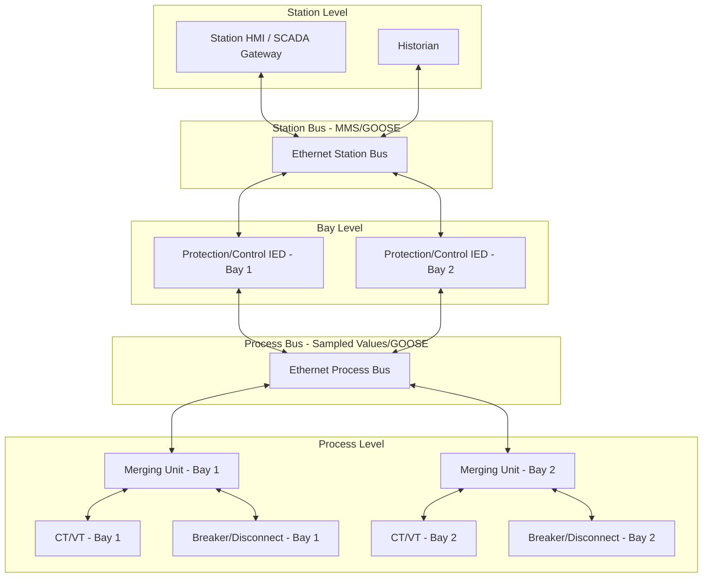

## Digital Substations and the IEC 61850 Standard

### Overview

A digital substation extends substation automation to its logical conclusion: replacing conventional analog and hardwired signal paths — not just between IEDs and the control room, but at the process level itself — with digitized, networked communication governed by IEC 61850. Where hybrid digital substations (covered under substation automation generally) use GOOSE messaging over a station bus while retaining conventional hardwired CT/VT connections, a fully digital substation digitizes voltage and current measurements at the primary equipment via **merging units** and transmits them as **Sampled Values (SV)** over a **process bus**, eliminating analog copper wiring between the switchyard and the control building entirely.

This item focuses specifically on the process-bus architecture, merging unit technology, and the deeper structural provisions of IEC 61850 that make a fully digital substation possible — building on, and going beyond, the station-bus-level automation concepts already covered.

### The Two-Bus Digital Substation Architecture

**Station bus**: carries MMS (client-server reports, control) and GOOSE (peer-to-peer event/status) traffic between bay-level IEDs and station-level systems — already standard in most modern automated substations.

**Process bus**: carries Sampled Values (digitized analog waveforms) and GOOSE (digitized binary status such as breaker position) between merging units at the switchyard and protection/control IEDs — the defining feature that makes a substation "fully digital" rather than merely "automated."

### Merging Units: The Process-Level Digitizer

A merging unit (MU) is the device that interfaces directly with conventional or non-conventional CTs/VTs and breaker/disconnect auxiliary contacts, converting analog measurements and binary states into digital Sampled Values and GOOSE messages placed onto the process bus.

#### Functional Requirements

- **Analog-to-digital conversion**: samples CT/VT secondary analog signals (or receives digital output directly from optical/Rogowski-coil non-conventional instrument transformers) at a standardized rate — commonly 80 samples/cycle for protection-class applications and up to 256 samples/cycle for power quality/metering applications, per IEC 61850-9-2
- **Precise time-stamping**: each sample must be tagged with a synchronized timestamp so that samples published by different merging units across the substation can be correctly time-aligned by receiving IEDs
- **Binary I/O interfacing**: digitizes breaker/disconnect position contacts and publishes them as GOOSE messages, and receives GOOSE trip/close commands from protection IEDs to operate breaker trip/close coils

#### 9-2LE: The Implementation Guideline

IEC 61850-9-2 defines the Sampled Values protocol framework generically; the **UCA International Users Group's "9-2LE" (Light Edition)** implementation guideline emerged as the de facto interoperability profile that fixed key parameters (sample rate, specific data set structure) that the base standard left as options — enabling multi-vendor merging units and protection IEDs to interoperate reliably. Most commercially deployed Sampled Values merging units and protection IEDs implement 9-2LE rather than the fully generic 9-2 standard.

- [Inference] The continued reliance on 9-2LE as a practical interoperability profile, rather than full multi-vendor compliance with every option in the base IEC 61850-9-2 standard, reflects the broader pattern in complex international standards where an industry-agreed implementation subset becomes the practical interoperability baseline; newer editions of IEC 61850-9-2 and associated technical reports continue to refine this, but 9-2LE-based deployments remain widespread in currently operating digital substations.

### Precision Time Protocol (PTP) — The Synchronization Backbone

Because Sampled Values from spatially distributed merging units must be time-aligned to microsecond-level precision for protection algorithms (particularly current differential protection comparing samples from different ends of a protected zone), digital substations rely on **IEEE 1588 Precision Time Protocol**, specifically the **IEC/IEEE 61850-9-3** (or IEC 62439-3 utility profile) power utility profile of PTP.

- **Grandmaster clock**: typically GPS/GNSS-disciplined, serves as the primary time reference for the substation
- **Boundary/transparent clocks**: Ethernet switches on the process bus that either participate in the PTP hierarchy (boundary clocks) or compensate for their own switching delay (transparent clocks) to maintain sub-microsecond accuracy across the network
- **Loss-of-sync handling**: merging units and protection IEDs must define behavior (alarm, hold-last-value, fallback to degraded operation) if PTP synchronization is lost — a critical failure mode consideration since unsynchronized samples can produce incorrect differential protection operation

$$\Delta t_{sync} < \frac{1}{f_{sample} \times k}$$

where $\Delta t_{sync}$ is the required synchronization accuracy, $f_{sample}$ is the sampling rate, and $k$ is a safety margin factor — illustrating why microsecond-class synchronization accuracy is necessary when comparing samples across a protection zone at typical 80-256 samples/cycle rates.

### GOOSE and Sampled Values on a Shared Process Bus

Both GOOSE and SV traffic can share the same physical Ethernet process bus network, requiring careful network engineering:

- **Prioritization/VLAN tagging**: IEEE 802.1Q VLAN priority tagging ensures time-critical GOOSE trip messages are not delayed behind high-volume, continuous SV streaming traffic
- **Multicast traffic management**: both GOOSE and SV use multicast Ethernet frames; switches must be configured (via IGMP snooping or static multicast filtering) to prevent unnecessary flooding of SV streams to devices that do not subscribe to them, since SV traffic volume is substantial (continuous streaming at high sample rates from every merging unit)
- **Network redundancy protocols**: Parallel Redundancy Protocol (PRP) or High-availability Seamless Redundancy (HSR), per IEC 62439-3, are commonly applied to process bus networks given the criticality of uninterrupted SV/GOOSE delivery to protection functions
- **Key Points**
  - PRP duplicates every frame across two independent, parallel network paths; the receiving device accepts the first-arriving copy and discards the duplicate, providing zero-recovery-time redundancy (no switchover delay, unlike Rapid Spanning Tree Protocol)
  - HSR achieves similar zero-recovery-time redundancy within ring topologies, commonly used for merging unit-to-IED connections within a bay or small process bus segment
  - Process bus network design and testing has emerged as a specialized engineering discipline distinct from conventional substation control wiring design, requiring network engineering expertise alongside traditional protection engineering knowledge

### Benefits and Trade-offs of Full Digital Substation Architecture

| Aspect | Conventional/Hybrid Substation | Fully Digital (Process Bus) Substation |
| --- | --- | --- |
| Yard wiring | Extensive copper multicore cabling for CT/VT and control | Fiber-optic Ethernet only |
| CT/VT burden concerns | Significant (long lead runs affect accuracy/saturation) | Largely eliminated (merging unit close to primary equipment) |
| Commissioning | Point-to-point continuity/wiring checks | SCD-based configuration verification, network/timing validation |
| Engineering skill set | Protection + conventional wiring | Protection + network engineering + precision timing |
| Scalability/flexibility | Rewiring required for changes | Configuration changes largely software-based |
| Failure mode complexity | Well-understood (open circuit, short circuit) | New failure modes (PTP loss, network congestion, merging unit failure) requiring new diagnostic approaches |

- [Speculation] The net lifecycle cost comparison between fully digital process-bus substations and conventional/hybrid designs depends heavily on project-specific factors (labor cost differentials for cabling versus fiber/network engineering, retrofit versus greenfield context, and long-term maintenance cost assumptions); general industry claims of cost advantage for either approach should be treated as context-dependent rather than universally established.

### SCD-Based Engineering Workflow for Digital Substations

The Substation Configuration Description (SCD) file becomes even more central in a digital substation, since it must now define not only station-bus GOOSE/MMS associations but also process-bus Sampled Values stream subscriptions between merging units and protection IEDs:

1. Substation single-line and functional requirements captured in an SSD file
2. Each merging unit and protection IED vendor provides an ICD file describing device capabilities (including supported SV stream configurations)
3. System integration tool combines ICDs against the SSD to produce the master SCD, defining every GOOSE and SV publisher-subscriber relationship across both station and process buses
4. CID files are generated per-device from the SCD and downloaded to each merging unit and IED
5. Commissioning validates that actual network traffic matches the SCD-defined associations, and that end-to-end sample timing and GOOSE transfer times meet protection scheme requirements

### Diagnostic and Testing Considerations Unique to Digital Substations

- **SV stream verification**: specialized test tools (SV/GOOSE analyzers) are required to inspect process bus traffic, since it cannot be observed with a conventional multimeter or continuity tester the way hardwired CT/VT circuits can
- **Merging unit substitution testing**: protection scheme testing requires either live merging units or SV simulators/publishers capable of injecting realistic test waveforms onto the process bus, replacing the conventional practice of injecting test current/voltage directly into relay terminals
- **Time synchronization verification**: PTP performance (offset, path delay, holdover behavior during grandmaster loss) must be explicitly tested as part of commissioning, a test category with no equivalent in conventional substation commissioning

### Practical Example: Commissioning a Process-Bus Differential Protection Scheme

Scenario: A digital substation implements line current differential protection across two ends of a transmission line, with each end's CTs digitized locally by a merging unit and communicated to a differential relay via Sampled Values (potentially over a wide-area digital communication link between substations, or locally within one substation for a busbar differential application).

1. Verify each merging unit's SV publication matches its ICD/CID configuration (correct sample rate, correct logical node mapping for the specific CT/VT circuit)
2. Confirm PTP grandmaster clock lock status and synchronization accuracy at each merging unit before proceeding
3. Using a calibrated SV analyzer, verify sample timestamps align correctly across merging units at both ends of the protected zone
4. Inject secondary test current into the CT circuit feeding each merging unit and confirm the differential protection IED correctly resolves the expected near-zero differential current under healthy (through-load) conditions
5. Simulate an internal fault condition (via test injection or SV stream simulation) and verify correct differential trip operation and GOOSE-based trip command delivery to the associated breaker
6. Deliberately interrupt PTP synchronization to one merging unit during a controlled test and verify the protection IED's defined fallback behavior (alarm, block, or degraded operation) executes as designed rather than mis-operating on unsynchronized data
7. Document all SV stream identifiers, GOOSE associations, and timing test results against the SCD file for the commissioning record

**Conclusion**

Digital substations built on the full IEC 61850 process-bus architecture represent the most complete realization of substation digitalization — eliminating analog copper wiring at the process level in favor of standardized, time-synchronized digital streams. This architecture directly addresses long-standing CT/VT burden and lead-length limitations while introducing genuinely new engineering disciplines: precision time synchronization, process bus network design, and SV-based testing methodologies that have no direct analog in conventional substation practice. As of current industry practice, hybrid architectures (GOOSE-based station bus with conventional process-level wiring) remain more widely deployed than fully digital process-bus substations, with full digitalization proceeding through pilot projects and selective greenfield deployments rather than wholesale industry-wide replacement of conventional wiring practice.

**Related Topics**

- Substation automation and protection integration (station bus, GOOSE, multifunction IEDs)
- Instrument transformers and metering equipment (non-conventional/optical CTs feeding merging units)
- Precision Time Protocol (IEEE 1588) and power utility profile time synchronization
- Parallel Redundancy Protocol (PRP) and High-availability Seamless Redundancy (HSR) network design
- Circuit breaker technologies and interrupting media
- Current differential and line differential protection principles
- Cybersecurity for digital substation networks (IEC 62351)
- Substation Configuration Language (SCL) engineering workflow and tools