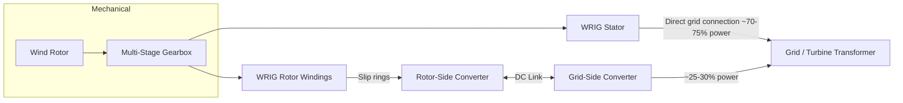

## Doubly-Fed Induction Generators and Full-Converter Wind Systems

### Overview

This item provides a focused, deeper technical treatment of the two dominant utility-scale wind generator architectures — the Doubly-Fed Induction Generator (DFIG, Type 3) and the Full-Converter system (Type 4) — building on their high-level classification to examine converter control structure, control loop design, DC-link management, and fault-handling implementation in greater depth.

### DFIG: Detailed Electrical Structure

A DFIG's wound-rotor induction machine has its stator windings connected directly to the grid (via the turbine transformer) and its rotor windings connected to a back-to-back voltage-source converter pair via slip rings and brushes (or, in brushless designs, via other rotor excitation coupling methods).

#### Back-to-Back Converter Structure

- **Rotor-Side Converter (RSC)**: connects to the rotor windings; controls rotor current magnitude, frequency, and phase to regulate generator torque and, indirectly, stator-side reactive power
- **DC Link**: a capacitor bank connecting the two converters, buffering power flow differences between rotor-side and grid-side converter switching
- **Grid-Side Converter (GSC)**: connects to the grid (in parallel with the stator, typically through its own smaller step-up transformer or a shared connection point); regulates DC link voltage and can independently control grid-side reactive power exchange

#### RSC Control Strategy: Field-Oriented Control

The RSC typically employs **stator-flux-oriented vector control**, decomposing rotor current into two orthogonal components analogous to DC machine control:

- **Torque-producing component** ($i_{qr}$): controls active power output/electromagnetic torque
- **Flux/magnetizing component** ($i_{dr}$): controls stator-side reactive power (and hence terminal voltage support capability)

$$P_{stator} \approx -\frac{3}{2} \times \frac{L_m}{L_s} \times V_s \times i_{qr}$$

$$Q_{stator} \approx -\frac{3}{2} \times \frac{V_s^2}{\omega_s L_s} + \frac{3}{2} \times \frac{L_m}{L_s} \times V_s \times i_{dr}$$

where $L_m$ is mutual inductance, $L_s$ is stator self-inductance, $V_s$ is stator voltage, and $\omega_s$ is synchronous electrical angular frequency. This decoupled control structure — mirroring the classic $d$-$q$ axis control used broadly in AC machine drives — allows the RSC to independently command active power (via torque/speed reference, typically following a maximum power point tracking curve) and reactive power/voltage support, within the converter's current rating limits.

- [Inference] The widespread use of stator-flux-oriented control (as opposed to alternative vector control references such as stator-voltage orientation) in commercial DFIG converter implementations reflects long-established industrial drives practice adapted to the DFIG application, though exact control implementation details are manufacturer-proprietary and specific tuning/reference-frame choices vary by vendor.

#### GSC Control Strategy

The GSC's primary control objective is maintaining constant DC link voltage regardless of the power flowing through the rotor circuit (which varies with slip and can reverse direction — flowing from grid to rotor at sub-synchronous speed, and from rotor to grid at super-synchronous speed). A secondary control loop manages grid-side reactive power exchange, providing additional voltage support capability independent of the RSC's stator-side reactive power contribution.

$$P_{DC-link} = P_{RSC} - P_{GSC} \approx 0 \text{ (in steady state, neglecting losses)}$$

### Sub-Synchronous vs Super-Synchronous Operation

A defining DFIG characteristic is bidirectional rotor power flow depending on operating point relative to synchronous speed:

- **Sub-synchronous operation** (rotor speed below synchronous speed): rotor circuit absorbs power from the grid through the converter (power flows GSC → DC link → RSC → rotor)
- **Super-synchronous operation** (rotor speed above synchronous speed): rotor circuit delivers power to the grid through the converter (power flows rotor → RSC → DC link → GSC → grid)
- **At synchronous speed**: rotor frequency (and ideally converter power flow) approaches zero

This bidirectional capability is what allows the partial-scale converter to support a wide speed range while remaining sized for only the slip-power fraction rather than full turbine rating.

### Crowbar and Chopper Protection in Detail

**Rotor crowbar**: A set of controlled switches (typically thyristor or IGBT-based) that, upon detecting rotor overcurrent during a grid fault, short-circuit the rotor windings through a resistor bank, diverting the fault-induced rotor current away from the RSC's power semiconductors.

- **Passive crowbar**: fires and remains engaged for a fixed duration or until current subsides, fully surrendering RSC control during that period
- **Active crowbar**: can be de-activated dynamically once rotor current returns to a safe level, minimizing the duration of lost control and improving the turbine's ability to meet reactive current injection requirements during the remainder of the fault

**DC-link chopper (braking resistor)**: A separate protection element addressing DC-link overvoltage — during a grid voltage sag, the GSC's ability to export power to the grid is reduced, but the RSC may still be delivering power into the DC link (in super-synchronous operation), causing DC-link voltage to rise. A chopper circuit switches a resistor across the DC link to dissipate this excess energy and protect the DC-link capacitors and both converters from overvoltage.

- **Key Points**
  - Crowbar and chopper protection are complementary, addressing different physical failure modes (rotor overcurrent versus DC-link overvoltage) that can occur simultaneously during severe grid faults
  - Post-fault recovery sequencing (crowbar de-engagement, resumption of normal RSC vector control, chopper de-engagement) must be carefully coordinated to avoid a second protection trip during the recovery transient
  - [Unverified] The specific coordination logic and timing thresholds for crowbar/chopper interaction are manufacturer-specific and not standardized across the industry; general behavior described here reflects common design patterns rather than a universal specification.

### Full-Converter (Type 4) System: Detailed Structure

#### Generator-Side Converter (Machine-Side Converter, MSC)

Controls the generator's electromagnetic torque (and hence rotor speed, typically following a maximum power point tracking curve) by regulating stator current in a $d$-$q$ reference frame appropriate to the generator type:

- **PMSG**: rotor flux is fixed by permanent magnets, so control reduces to regulating stator current magnitude/phase relative to the fixed rotor flux position (requiring accurate rotor position sensing or sensorless estimation)
- **Wound-field synchronous or induction generator variants**: additional field/excitation current control loop required alongside stator current control

#### Grid-Side Converter (Network-Side Converter, NSC)

Performs the same core function as the DFIG's GSC — regulating DC-link voltage and controlling grid-side reactive power/voltage support — but must be rated for 100% of turbine power rather than the ~25-30% slip-power fraction, since all generated power passes through this converter path.

$$P_{NSC} = P_{MSC} \text{ (full power, DC-link voltage regulation over entire operating range)}$$

#### DC-Link Sizing and Chopper Requirements

Because the entire power path flows through the DC link, DC-link capacitor sizing and chopper (braking resistor) capacity must accommodate the full turbine power rating during a grid fault, when the NSC's export capability is constrained by depressed grid voltage while the MSC continues delivering full generator power. This full-power chopper requirement is a direct consequence of full decoupling and represents one of the trade-offs against the DFIG's smaller partial-scale protection components.

- **Key Points**
  - Type 4 DC-link chopper/braking resistor is typically sized for full turbine rated power (versus DFIG's chopper sized around the slip-power fraction), reflecting the full power flow through the converter path
  - The complete electrical isolation of the generator from grid disturbances (provided by the DC link) means the MSC's control loop is largely undisturbed by grid faults — the generator continues operating near its pre-fault torque/speed point while the NSC and chopper manage the temporary power export limitation
  - This isolation is the core structural reason Type 4 systems generally exhibit simpler, more robust fault-ride-through behavior than DFIG systems, since no analog to the DFIG's rotor overcurrent problem exists in a fully decoupled architecture

### Comparative Control Architecture Summary

| Aspect | DFIG (Type 3) | Full-Converter (Type 4) |
| --- | --- | --- |
| Converter power rating | ~25-30% of turbine rating | 100% of turbine rating |
| Generator-facing converter | Rotor-Side Converter (RSC) | Machine-Side Converter (MSC) |
| Grid-facing converter | Grid-Side Converter (GSC) | Network-Side Converter (NSC) |
| Fault current exposure | Direct (stator hardwired to grid) | Isolated (full DC-link buffering) |
| Primary fault protection | Rotor crowbar + DC-link chopper (partial rating) | DC-link chopper (full rating) |
| Reactive power sources | Stator-side (via RSC) + grid-side (via GSC) — two independent paths | Grid-side only (via NSC), but full converter rating available for this purpose |
| Control complexity driver | Managing bidirectional slip power flow and fault current in directly-coupled stator | Managing full-power conversion and DC-link energy balance |

### DFIG Power Flow vs Slip (svg_diagram)

<svg xmlns="http://www.w3.org/2000/svg" viewBox="0 0 640 320" font-family="sans-serif">
<text x="320" y="24" text-anchor="middle" font-size="16" font-weight="bold">DFIG Rotor Power Flow vs Operating Speed (svg_diagram)</text>

<line x1="80" y1="160" x2="580" y2="160" stroke="#333" stroke-width="1.5" />
<line x1="330" y1="60" x2="330" y2="260" stroke="#333" stroke-width="1.5" />
<text x="580" y="180" font-size="11">Rotor Speed</text>
<text x="330" y="50" text-anchor="middle" font-size="11">Rotor Power</text>

<text x="200" y="178" text-anchor="middle" font-size="10">Sub-synchronous</text>

<text x="460" y="178" text-anchor="middle" font-size="10">Super-synchronous</text>

<text x="330" y="178" text-anchor="middle" font-size="10">Sync speed</text>

<line x1="120" y1="90" x2="330" y2="160" stroke="#c0392b" stroke-width="2.5" />
<line x1="330" y1="160" x2="540" y2="230" stroke="#27ae60" stroke-width="2.5" />

<text x="150" y="80" font-size="10" fill="`#c0392b`">Grid → Rotor</text>

<text x="150" y="95" font-size="10" fill="`#c0392b`">(absorbed)</text>

<text x="440" y="245" font-size="10" fill="`#27ae60`">Rotor → Grid</text>

<text x="440" y="260" font-size="10" fill="`#27ae60`">(delivered)</text>

<circle cx="330" cy="160" r="4" fill="#333" />
<text x="330" y="285" text-anchor="middle" font-size="10">Zero rotor power at synchronous speed</text>
</svg>

### Practical Example: MPPT and Reactive Power Coordination in a DFIG

Scenario: A DFIG-based turbine operates at moderate wind speed, running at 1.15 per-unit rotor speed (super-synchronous), while the wind farm operator's plant controller commands 0.95 lagging power factor at the point of interconnection for voltage support.

1. Turbine controller's aerodynamic MPPT algorithm determines the torque reference corresponding to optimal tip-speed ratio at the current wind speed
2. RSC's torque-producing current component ($i_{qr}$) is commanded to deliver this torque reference, setting stator active power output accordingly
3. Plant-level reactive power controller translates the 0.95 lagging power factor target into a stator-side reactive power setpoint
4. RSC's flux-producing current component ($i_{dr}$) is adjusted to deliver the required stator reactive power, working within the RSC's remaining current capacity headroom (total RSC current is limited by its rating, so active and reactive current commands must be coordinated to avoid exceeding it)
5. Since operating super-synchronously, rotor power flows from the rotor windings through the RSC to the DC link and out through the GSC to the grid — the GSC's DC-link voltage control loop adjusts its own current to absorb this incoming rotor power while maintaining constant DC-link voltage
6. If the GSC has remaining current headroom, it can additionally contribute grid-side reactive power to help meet the overall plant reactive power target, supplementing the stator-side contribution from the RSC

**Conclusion**

Both DFIG and full-converter architectures achieve variable-speed, grid-frequency-independent operation through vector-controlled power electronic converters, but differ fundamentally in where and how much of the total power path is electronically decoupled from the grid. DFIG's partial-scale converter design achieves substantial cost savings by exploiting the slip-power characteristic of the wound-rotor induction machine, at the cost of direct stator-grid coupling that necessitates crowbar-based fault protection. Full-converter systems trade higher power electronics cost and full-power chopper sizing for complete electrical isolation between generator and grid, yielding structurally simpler and more robust fault-ride-through behavior — a trade-off increasingly favoring full-converter adoption as power electronics costs decline and grid codes demand more sophisticated fault response.

**Related Topics**

- Wind turbine generator technologies and configurations (Type 1-4 overview)
- Field-oriented (vector) control principles for AC machine drives
- Grid code Low-Voltage-Ride-Through (LVRT) requirements and compliance testing
- DC-link capacitor sizing and power electronics thermal design
- Maximum Power Point Tracking (MPPT) algorithms for variable-speed wind turbines
- STATCOM and grid-side reactive power compensation for wind plants
- Synthetic inertia and grid-forming converter control for renewable generation
- Wind farm plant-level controller architecture and SCADA integration