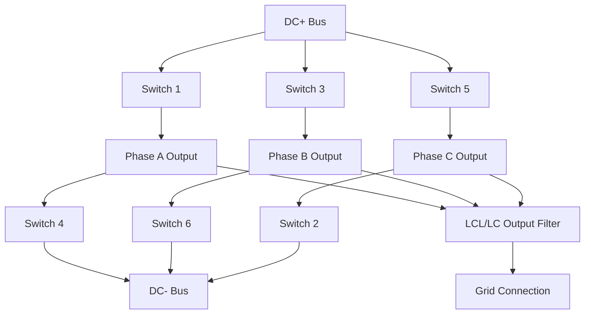

## Grid-Tied Inverter Fundamentals

### Overview

A grid-tied (grid-connected) inverter converts DC power from a source — photovoltaic arrays, battery storage, or the DC link of a wind turbine full-converter system — into AC power synchronized with the utility grid's voltage and frequency. While previous items examined wind and solar system architecture at the plant level, this item focuses on the inverter itself: its power semiconductor topology, switching modulation, synchronization mechanism, and protective functions that are common across virtually all grid-tied inverter-based resources regardless of the DC source feeding them.

### Core Functional Requirements

A grid-tied inverter must simultaneously:

1. **Convert DC to AC** at the grid's fundamental frequency (50 or 60 Hz) with low harmonic distortion
2. **Synchronize** phase, frequency, and voltage magnitude with the grid before and during connection
3. **Control power flow** (active and, where required, reactive power) within the DC source's available capacity and the inverter's current rating
4. **Detect abnormal grid conditions** (loss of grid, over/under voltage or frequency) and disconnect per applicable interconnection standards, preventing unintentional islanding
5. **Protect itself and connected equipment** from overcurrent, overvoltage, overtemperature, and fault conditions

### Power Semiconductor Topology

#### Two-Level Voltage Source Inverter (VSI)

The most common basic topology: three half-bridge legs (one per AC phase), each consisting of two switching devices (commonly IGBTs for lower-voltage/medium-power applications, or increasingly SiC/GaN MOSFETs for higher-efficiency, higher-frequency designs) that alternately connect the AC output terminal to the positive or negative DC bus rail.

#### Multi-Level Topologies

For higher-power or higher-voltage applications, multi-level topologies reduce output voltage step size and harmonic content compared to a basic two-level design:

- **Neutral-Point-Clamped (NPC) three-level**: adds clamping diodes to produce an intermediate voltage level, commonly used in utility-scale central PV inverters and medium-voltage drive applications
- **Modular Multilevel Converter (MMC)**: cascades many low-voltage sub-modules to synthesize a high-voltage, low-harmonic-distortion waveform; dominant in modern HVDC transmission converter stations due to excellent harmonic performance and scalability to very high voltages
- [Inference] The trend toward wide-bandgap semiconductors (SiC, GaN) in grid-tied inverter design is generally understood to enable higher switching frequencies, reduced switching losses, and smaller passive filter components compared to traditional silicon IGBT-based designs, though the specific efficiency and cost trade-offs depend on the application's voltage/power class and remain an active area of ongoing power electronics development rather than a fully settled universal replacement of silicon devices across all inverter classes.

### Pulse-Width Modulation (PWM)

The switching pattern that synthesizes a sinusoidal AC output from DC bus voltage by rapidly switching devices on and off, with the ratio of on-time to off-time (duty cycle) varied sinusoidally to produce the desired fundamental output waveform after filtering.

#### Sinusoidal PWM (SPWM)

Compares a sinusoidal reference waveform (at the desired output frequency) against a high-frequency triangular carrier waveform; the switch state is determined by which signal is instantaneously larger.

$$m_a = \frac{V_{ref,peak}}{V_{carrier,peak}}$$

where $m_a$ is the modulation index, controlling output voltage magnitude relative to the DC bus voltage.

#### Space Vector Modulation (SVM/SVPWM)

Represents the three-phase output as a rotating voltage vector in a two-dimensional $\alpha$-$\beta$ reference frame, selecting switching states and their durations to approximate the desired reference vector. Generally provides better DC bus voltage utilization (higher achievable output voltage for a given DC bus voltage) and lower harmonic distortion than basic SPWM, and is widely used in modern digital inverter control implementations.

- **Key Points**
  - Switching frequency (commonly several kHz to tens of kHz depending on device technology and power level) is a key design trade-off: higher switching frequency reduces output filter size and improves waveform quality but increases switching losses
  - Output LCL or LC filters attenuate switching-frequency harmonic content before the inverter output connects to the grid, since raw PWM output contains substantial high-frequency harmonic energy around the switching frequency and its multiples that must be filtered to meet grid harmonic injection limits

### Grid Synchronization: The Phase-Locked Loop (PLL)

Before connecting to the grid, and continuously during grid-following operation, the inverter must track grid voltage phase angle, frequency, and magnitude precisely. This is accomplished via a Phase-Locked Loop control algorithm operating on the measured grid voltage.

**Synchronous Reference Frame PLL (SRF-PLL)**: the most common implementation, transforms measured three-phase grid voltage into a rotating $d$-$q$ reference frame; under correct synchronization, the $q$-axis component drives to zero, and the tracked angle feeds forward into the inverter's current control loop to align injected current with the correct phase relative to grid voltage.

- **Key Points**
  - PLL bandwidth is a critical tuning parameter: too slow, and the inverter cannot track legitimate rapid grid frequency changes; too fast, and the PLL becomes overly sensitive to grid voltage distortion/imbalance, potentially causing control instability — particularly relevant in weak grid conditions (low short-circuit ratio) where inverter-grid interaction dynamics become more significant
  - PLL performance under unbalanced or distorted grid voltage conditions is an active area of control design refinement, since standard SRF-PLL implementations can exhibit double-frequency ripple in the tracked angle under voltage imbalance, requiring enhanced PLL variants (e.g., decoupled double synchronous reference frame PLL) for robust performance in such conditions

### Current Control Loop Structure

Once synchronized, the inverter's inner control loop regulates injected AC current to follow a reference determined by the outer power control loop (active power reference from MPPT or plant dispatch command, reactive power reference from voltage support or power factor requirements).

$$i_d^* \leftarrow P^*_{ref}, \quad i_q^* \leftarrow Q^*_{ref}$$

Current control is typically implemented in the same synchronous $d$-$q$ reference frame established by the PLL, using proportional-integral (PI) controllers for each axis, since DC quantities in this rotating frame (corresponding to AC quantities in the stationary frame) allow zero-steady-state-error PI control — a design pattern common across grid-tied inverters, DFIG rotor-side converters, and full-converter wind systems alike.

### Anti-Islanding Protection

A critical safety function unique to grid-tied inverter operation: the inverter must detect if it has become isolated from the main grid (e.g., due to an upstream breaker opening) while still connected to a local load, and cease energizing within a specified time — because continued operation ("islanding") poses serious hazards to utility line workers who may reasonably assume a de-energized line is safe to work on.

#### Passive Detection Methods

Monitor grid voltage and frequency for abnormal deviations indicative of islanding (since, once islanded, the inverter's own output must supply the local load without the grid's stabilizing influence, often causing voltage/frequency to drift outside normal limits):

- Over/under voltage protection (OV/UV)
- Over/under frequency protection (OF/UF)
- Rate-of-change-of-frequency (ROCOF) detection

**Limitation**: passive methods have a **non-detection zone** — if the local load happens to closely match the inverter's output (both active and reactive power balance), voltage and frequency may remain within normal limits even while islanded, defeating passive detection.

#### Active Detection Methods

Deliberately perturb the inverter's output slightly to detect grid presence/absence, since a stiff grid connection will suppress such perturbations while an islanded condition will not:

- **Frequency shift methods** (e.g., Sandia Frequency Shift, Active Frequency Drift): inject a slight frequency bias into the output current reference, which the grid suppresses when connected but which causes a drifting frequency deviation when islanded, triggering OF/UF protection
- **Impedance measurement methods**: periodically inject a small current perturbation and measure the resulting voltage response to estimate effective grid impedance, since islanded operation typically presents a much higher impedance path than a strong grid connection
- [Unverified] Active anti-islanding method effectiveness and the specific non-detection zone characteristics vary by method and implementation; the general concepts described are standard reference material in power electronics/PV interconnection literature, though performance claims for any specific commercial implementation should be verified against manufacturer test data and applicable certification standards (e.g., IEEE 1547, UL 1741).

### Interconnection Standards

- **IEEE 1547**: the primary US standard governing interconnection of distributed energy resources (including grid-tied inverters) with electric power systems, defining voltage/frequency ride-through requirements, anti-islanding requirements, and increasingly, "smart inverter" functions (voltage regulation, ramp-rate control, reactive power support) as grid codes evolve to accommodate higher distributed PV penetration
- **UL 1741 (US)**: product safety and functional standard for inverters, including anti-islanding test procedures, often referenced alongside IEEE 1547 for certification
- **IEC 62109 / IEC 61727 and regional grid codes**: analogous international and national standards governing inverter safety and grid interconnection requirements outside the US
- [Inference] Regulatory and grid code requirements for grid-tied inverters continue to evolve toward requiring more active grid-support functionality ("smart inverter" capability — voltage regulation, ramp rate control, and in some jurisdictions grid-forming capability) as distributed and utility-scale inverter-based resource penetration increases; the specific mandatory functions and their required parameters vary substantially by jurisdiction and utility, so any specific compliance requirement should be verified against the applicable local interconnection standard rather than assumed universal.

### Smart Inverter Functions

Modern grid-tied inverters increasingly implement standardized grid-support functions beyond basic power injection, often configurable/commandable via the plant SCADA system or, in distributed contexts, via defined communication protocols (e.g., IEEE 2030.5, SunSpec Modbus):

- **Volt-VAR control**: automatically adjusts reactive power output based on measured local voltage to help regulate voltage on the distribution feeder
- **Volt-Watt control**: curtails active power output at high voltage conditions to prevent the inverter from exacerbating overvoltage
- **Frequency-Watt (droop) response**: adjusts active power output in response to frequency deviations, providing a grid-supportive function analogous to conventional generator governor droop response
- **Fixed or dispatched power factor/reactive power control**: operates at a commanded power factor or reactive power setpoint per utility or plant operator instruction

### Grid-Tied Inverter Control Block Structure (svg_diagram)

<svg xmlns="http://www.w3.org/2000/svg" viewBox="0 0 700 340" font-family="sans-serif">
<text x="350" y="24" text-anchor="middle" font-size="16" font-weight="bold">Grid-Tied Inverter Control Loop Structure (svg_diagram)</text>
<rect x="40" y="60" width="100" height="50" fill="#d6e4f0" stroke="#333" stroke-width="1.5" />
<text x="90" y="90" text-anchor="middle" font-size="10">DC Source (PV/BESS)</text>
<line x1="140" y1="85" x2="190" y2="85" stroke="#333" stroke-width="2" />
<rect x="190" y="60" width="110" height="50" fill="#f0d6d6" stroke="#333" stroke-width="1.5" />
<text x="245" y="80" text-anchor="middle" font-size="10">VSI Power Stage</text>
<text x="245" y="94" text-anchor="middle" font-size="9">(PWM switched)</text>
<line x1="300" y1="85" x2="350" y2="85" stroke="#333" stroke-width="2" />
<rect x="350" y="60" width="90" height="50" fill="#f0e6d6" stroke="#333" stroke-width="1.5" />
<text x="395" y="90" text-anchor="middle" font-size="10">LCL Filter</text>
<line x1="440" y1="85" x2="490" y2="85" stroke="#333" stroke-width="2" />
<rect x="490" y="60" width="90" height="50" fill="#eee" stroke="#333" stroke-width="1.5" />
<text x="535" y="90" text-anchor="middle" font-size="10">Grid</text>

<rect x="190" y="180" width="110" height="40" fill="#e0d6f0" stroke="#333" stroke-width="1.5" />
<text x="245" y="204" text-anchor="middle" font-size="10">Current Controller (d-q PI)</text>
<rect x="350" y="180" width="90" height="40" fill="#e0d6f0" stroke="#333" stroke-width="1.5" />
<text x="395" y="204" text-anchor="middle" font-size="10">PLL (grid sync)</text>
<rect x="490" y="180" width="130" height="40" fill="#d6f0e0" stroke="#333" stroke-width="1.5" />
<text x="555" y="200" text-anchor="middle" font-size="9">Anti-Islanding /</text>
<text x="555" y="212" text-anchor="middle" font-size="9">Protection Functions</text>
<line x1="245" y1="110" x2="245" y2="180" stroke="#333" stroke-width="1" stroke-dasharray="3,2" />
<line x1="490" y1="85" x2="490" y2="200" stroke="#333" stroke-width="1" stroke-dasharray="3,2" />
<line x1="395" y1="200" x2="300" y2="200" stroke="#333" stroke-width="1.5" marker-end="url(#arr)" />
<line x1="490" y1="200" x2="440" y2="200" stroke="#333" stroke-width="1.5" />
<rect x="60" y="270" width="580" height="40" fill="none" stroke="#999" stroke-width="1" />
<text x="350" y="294" text-anchor="middle" font-size="10">PLL measures grid voltage → establishes reference angle → current controller aligns injected current phase/magnitude</text>
</svg>

### Practical Example: Response to a Sudden Grid Voltage Sag

Scenario: A grid-tied PV inverter operating at rated power experiences a sudden voltage sag to 60% of nominal at its point of connection due to a nearby transmission fault, with the applicable grid code requiring Low-Voltage-Ride-Through rather than immediate disconnection.

1. Voltage sensing detects the sag; the inverter's ride-through logic determines the sag depth and duration fall within the required ride-through curve (must remain connected) rather than triggering trip protection
2. The PLL continues tracking the (now reduced-magnitude, potentially phase-shifted) grid voltage to maintain synchronization throughout the sag
3. Current control loop limits injected current to the inverter's maximum rated current, since maintaining pre-sag active power output at reduced voltage would require current beyond the semiconductor devices' safe rating ($P = V \times I$, so lower $V$ at constant $P$ demands higher $I$)
4. Per grid code requirements, the inverter may be commanded to prioritize reactive current injection (voltage support) over active current during the sag, reducing active power output to remain within total current limits while injecting reactive current to help support the depressed voltage
5. Once the fault clears and voltage recovers, the inverter ramps active power output back to its pre-fault or MPPT-determined setpoint at a controlled rate to avoid contributing to post-fault voltage/frequency oscillation
6. Throughout the event, anti-islanding logic must correctly distinguish this ride-through-qualifying grid disturbance from an actual loss-of-grid condition, avoiding a false islanding trip during a legitimate ride-through event

**Conclusion**

Grid-tied inverter fundamentals — voltage source inverter topology, PWM switching, PLL-based synchronization, d-q current control, and anti-islanding protection — form the common technical foundation underlying virtually all modern inverter-based renewable resources, whether feeding from a PV array, a wind turbine's DC link, or a battery energy storage system. As inverter-based resources constitute a growing share of total generation, the sophistication demanded of these control functions has grown correspondingly: from simple grid-following current injection toward increasingly capable smart inverter functions and, in leading-edge deployments, grid-forming control — reflecting the broader industry shift from renewable inverters as passive, grid-following power sources toward active participants in grid stability and control.

**Related Topics**

- Solar photovoltaic system architecture (central, string, and module-level inverter contexts)
- Doubly-fed induction generators and full-converter wind systems (shared d-q control concepts)
- Grid-forming vs grid-following inverter control and inertia emulation
- IEEE 1547 and interconnection standards for distributed energy resources
- Battery energy storage system (BESS) power conversion system (PCS) architecture
- Harmonic distortion, filter design, and power quality compliance for inverters
- Weak grid interaction and inverter control stability at low short-circuit ratio
- HVDC modular multilevel converter (MMC) topology and applications