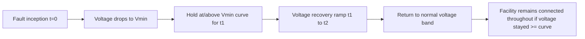

## Low-Voltage and Fault Ride-Through Requirements

### Overview

This item provides a deeper technical treatment of Low-Voltage-Ride-Through (LVRT) and Fault-Ride-Through (FRT), the specific requirement category introduced at a high level under Grid Codes for Renewable Interconnection. Here the focus narrows to the FRT voltage-time curve's mathematical structure, the dynamic reactive current injection requirement that typically accompanies it, the specific converter-level implementation challenges for each generator technology, and the testing/verification methodology used to demonstrate compliance.

### The FRT Voltage-Time Curve

The core of any FRT requirement is a curve (or piecewise-linear/stepped boundary) defining the minimum retained voltage a generating facility must tolerate, as a function of time since fault initiation, while remaining connected to the grid.

**Typical curve structure** (illustrative, not universal):

- An initial very low voltage threshold (sometimes near zero) that must be tolerated for a short duration (commonly on the order of 150 ms), representing the immediate post-fault-inception period before protective clearing
- A recovery ramp, during which the minimum required retained voltage rises over a defined period (commonly 1-3 seconds) back toward near-nominal voltage
- A final steady-state threshold at which point normal operation (full voltage) must be restored

$$V_{min}(t) = \begin{cases} V_1 & 0 \leq t < t_1 \\ V_1 + (V_2 - V_1)\frac{t - t_1}{t_2 - t_1} & t_1 \leq t < t_2 \\ V_2 & t \geq t_2 \end{cases}$$

where $V_1$ is the minimum immediate post-fault retained voltage threshold, $t_1$ is the duration this minimum must be tolerated, and the curve then ramps linearly to a recovery voltage $V_2$ by time $t_2$.

- [Inference] The exact numerical values for $V_1$, $t_1$, $V_2$, and $t_2$ vary considerably across different grid codes worldwide, reflecting different system strength characteristics, fault clearing time practices, and historical grid disturbance experience in each jurisdiction; the structural pattern described (a low-voltage floor held briefly, followed by a recovery ramp) is a common conceptual template found across many grid codes, but specific parameter values must always be obtained from the applicable grid code document rather than assumed from a generic example.

### Zero-Voltage Ride-Through (ZVRT)

Many modern grid codes have progressively tightened FRT requirements to include **Zero-Voltage-Ride-Through**, requiring the generating facility to remain connected even through a fault causing retained voltage to drop to (or very near) zero at the point of interconnection for a brief period — the most demanding case within the FRT curve family, since the generator must survive with essentially no terminal voltage reference for the duration of the requirement.

- **Key Points**
  - ZVRT is particularly challenging for directly grid-coupled generator technologies (DFIG stator, or any design with a hardwired AC connection point exposed to the fault) since near-zero terminal voltage removes the normal voltage reference the control system uses for synchronization and power control during the event
  - Fully decoupled architectures (Type 4 wind, PV/BESS inverters via their DC link) handle ZVRT structurally more gracefully in one sense (the DC-side source is unaffected), but must still manage the corresponding DC-link energy imbalance (chopper/braking resistor engagement) discussed under DFIG and full-converter systems, and must maintain the ability to resynchronize correctly once voltage recovers

### Dynamic Reactive Current Injection Requirement

Beyond simply remaining connected, most modern FRT requirements mandate **active reactive current injection** proportional to the depth of the voltage sag, intended to help support system voltage recovery during and immediately after the fault — a behavior loosely analogous to a conventional synchronous generator's natural reactive current contribution during a fault, but here implemented as an explicit control requirement.

**Common structure:**

$$\Delta I_q = k \times (V_{ref} - V_{measured}), \quad \text{for } V_{measured} < V_{threshold}$$

where $\Delta I_q$ is the additional reactive current injected, $k$ is a gain (commonly required to be within a specified range, e.g., $k \geq 2$ per unit reactive current per per-unit voltage deviation in some grid codes), $V_{ref}$ is nominal voltage, and $V_{measured}$ is the actual retained voltage — meaning deeper voltage sags require proportionally greater reactive current injection, up to the converter's current limit.

- **Key Points**
  - This requirement directly competes with active current for the converter's finite total current rating during the fault: $\sqrt{i_d^2 + i_q^2} \leq I_{max}$, meaning the control system must prioritize between active power delivery and reactive current injection when both cannot be simultaneously satisfied within the current limit
  - Most grid codes with this requirement mandate prioritizing reactive current over active current during the fault, since voltage support is considered more critical to system stability in the immediate fault period than continued active power delivery
  - Required response time for reactive current injection is typically very fast (commonly specified in tens of milliseconds), demanding a fast inner current control loop bandwidth in the converter control system design
- [Unverified] The specific required reactive current gain value, activation voltage threshold, and response time vary across grid codes and are sometimes still subject to ongoing revision as system operators refine requirements based on operational experience with increasing inverter-based resource penetration; specific numerical requirements referenced in this item are illustrative of common structural patterns rather than a specific applicable standard.

### Technology-Specific Implementation Challenges

#### DFIG (Type 3)

As detailed under Doubly-Fed Induction Generators, the DFIG's directly grid-coupled stator makes it structurally the most challenged architecture for FRT/ZVRT compliance:

- Severe voltage sags induce large transient rotor EMF and current, historically requiring crowbar engagement that temporarily surrenders converter control — directly conflicting with the reactive current injection requirement during exactly the period it is most needed
- Modern DFIG FRT compliance strategies focus on minimizing crowbar engagement duration (active crowbar with fast de-engagement) and/or adding series rotor-side impedance or enhanced current-limiting control to avoid crowbar engagement altogether for all but the most severe fault levels, preserving converter control (and hence reactive current injection capability) through a larger portion of the FRT requirement's voltage range

#### Full-Converter (Type 4) Wind and PV/BESS Inverters

The fully decoupled DC-link architecture (covered under Full-Converter Wind Systems, Solar PV Architecture, and Grid-Tied Inverter Fundamentals) handles the voltage-side disturbance without direct generator/array exposure, but faces its own specific FRT engineering challenges:

- DC-link overvoltage management during the sag, since generator/array-side power input may temporarily exceed grid-side export capability at reduced voltage — requiring adequately sized chopper/braking resistor capacity (full turbine or inverter rating, as discussed previously) to prevent DC-link overvoltage trip
- PLL synchronization robustness under severely distorted or near-zero voltage conditions, since the PLL's ability to track a valid phase reference degrades as measured voltage approaches zero — requiring enhanced PLL designs (e.g., using pre-fault phase memory or alternative synchronization strategies during the most severe portion of a ZVRT event) to maintain correct current injection phase alignment
- Current limiting strategy design to correctly prioritize reactive current injection per the grid code's dynamic voltage support requirement while avoiding converter overcurrent trip

### Fault-Ride-Through Voltage-Time Curve Illustration (svg_diagram)

<svg xmlns="http://www.w3.org/2000/svg" viewBox="0 0 640 340" font-family="sans-serif">
<text x="320" y="24" text-anchor="middle" font-size="16" font-weight="bold">Illustrative FRT Voltage-Time Curve (svg_diagram)</text>

<line x1="80" y1="260" x2="580" y2="260" stroke="#333" stroke-width="1.5" />
<line x1="80" y1="260" x2="80" y2="60" stroke="#333" stroke-width="1.5" />
<text x="580" y="280" font-size="11">Time (s)</text>
<text x="40" y="60" font-size="11">V (p.u.)</text>

<text x="65" y="260" text-anchor="end" font-size="10">0.0</text>

<text x="65" y="215" text-anchor="end" font-size="10">0.2</text>

<text x="65" y="170" text-anchor="end" font-size="10">0.5</text>

<text x="65" y="90" text-anchor="end" font-size="10">0.9</text>

<line x1="75" y1="215" x2="580" y2="215" stroke="#ddd" stroke-width="1" />
<line x1="75" y1="170" x2="580" y2="170" stroke="#ddd" stroke-width="1" />
<line x1="75" y1="90" x2="580" y2="90" stroke="#ddd" stroke-width="1" />

<path d="M 80,215 L 160,215 L 160,215 L 320,170 L 460,90 L 580,90" fill="none" stroke="`#c0392b`" stroke-width="3" />

<text x="160" y="230" text-anchor="middle" font-size="9">t1 ~150ms</text>

<text x="320" y="245" text-anchor="middle" font-size="9">Recovery ramp</text>

<text x="460" y="245" text-anchor="middle" font-size="9">t2 ~2-3s</text>

<path d="M 80,215 L 160,215 L 320,170 L 460,90 L 580,90 L 580,260 L 80,260 Z" fill="`#c0392b`" fill-opacity="0.08" />

<text x="330" y="130" text-anchor="middle" font-size="11" fill="`#c0392b`" font-weight="bold">Must remain connected in this region</text>

<text x="330" y="300" text-anchor="middle" font-size="10" fill="#555">Disconnection permitted if voltage falls below the curve</text>

</svg>

### Testing and Compliance Verification for FRT

#### Type Testing (Equipment-Level)

Performed once for a given turbine/inverter model and control software version, typically at a specialized test facility capable of imposing controlled voltage sags (using impedance-based or power-electronic voltage sag generators) on a full-scale or representative-scale unit under test.

- Verifies the equipment remains connected and injects the required reactive current profile across a matrix of test points spanning the applicable FRT curve (varying sag depth and duration combinations)
- Results are typically documented in a standardized test report format, increasingly per international guideline documents intended to harmonize FRT test methodology across manufacturers and test laboratories

#### Simulation-Based Compliance (Plant-Level)

Since full-scale, full-plant fault testing is generally impractical, plant-level FRT compliance is demonstrated via detailed simulation using manufacturer-validated models (as discussed under Grid Codes for Renewable Interconnection), incorporating:

- The specific turbine/inverter model's validated FRT control response
- The actual plant collector system impedance and configuration
- The specific point of interconnection's system strength characteristics (source impedance, short-circuit ratio)
- **Key Points**
  - Simulation-based verification is necessary because plant-level system strength at the actual point of interconnection differs from the type-test facility's test conditions, and this difference can meaningfully affect FRT dynamic performance (particularly reactive current injection effectiveness, which depends on the interaction between injected current and local system impedance)
  - Model validation and accreditation processes (verifying that a manufacturer's simulation model accurately represents the actual equipment's FRT behavior) have become an increasingly important and standardized part of the compliance ecosystem, since system operators must be able to trust simulation results submitted during the interconnection study process
- [Speculation] The degree of standardization and mutual recognition of FRT type-test results and validated simulation models across different countries/system operators continues to evolve; while harmonization efforts exist, the extent to which a type test or model validation performed for one jurisdiction's grid code is directly accepted by another jurisdiction without additional verification varies and is not universally established as of this writing.

### Practical Example: Diagnosing an FRT Compliance Gap

Scenario: During interconnection study simulations for a new solar PV plant using Type 4-equivalent (full-converter) string inverters, the plant model shows a brief voltage collapse below the required FRT curve during a specific nearby three-phase fault scenario, despite each individual inverter's type-test data showing FRT compliance in isolation.

1. Engineers first verify the discrepancy is not a modeling error — confirming inverter model parameters, plant collector system impedance data, and fault scenario definition all match the intended study case
2. Investigation reveals that the plant's aggregate reactive current injection during the fault, while individually correct per each inverter's type-tested response, interacts with the specific local system impedance at this plant's point of interconnection in a way that produces less voltage support than at the type-test facility's different system strength conditions — a system-strength-dependent effect not visible in equipment-level type testing alone
3. Engineers evaluate mitigation options: adjusting the plant-level reactive current injection gain/coordination logic (if the inverter's control system allows plant-level tuning within the manufacturer's certified range), or adding supplementary dynamic reactive compensation (e.g., a plant-level STATCOM) to improve local system strength and voltage support during the fault
4. Revised simulation confirms the selected mitigation brings the plant's aggregate FRT performance back within the required curve across the full test scenario matrix
5. Updated compliance documentation, including the mitigation measure and revised simulation results, is submitted as part of the interconnection study package

**Conclusion**

FRT/LVRT requirements sit at the intersection of grid code policy and converter control engineering: the voltage-time curve and reactive current injection gain define what the system operator needs for grid stability, while the generator technology's specific electrical architecture (directly-coupled DFIG stator versus fully-decoupled DC-link systems) determines how difficult that requirement is to satisfy and what protective trade-offs (crowbar engagement, chopper sizing, PLL robustness) must be engineered to meet it. As FRT requirements have tightened toward zero-voltage-ride-through with mandatory dynamic reactive support, the engineering burden has shifted decisively toward the fully decoupled architectures' inherent structural advantage, while system-strength-dependent effects — visible only in plant-level simulation rather than equipment-level type testing — increasingly determine whether a compliant individual inverter or turbine model translates into a compliant overall plant.

**Related Topics**

- Grid codes for renewable interconnection (broader requirement categories)
- Doubly-fed induction generators and full-converter wind systems (crowbar/chopper implementation)
- Grid-tied inverter fundamentals (PLL synchronization, current control limits)
- System strength, short-circuit ratio, and weak-grid interaction
- STATCOM and dynamic reactive power compensation
- Electromagnetic transient (EMT) simulation and model validation/accreditation
- Solar photovoltaic system architecture (inverter current limiting during faults)
- Synchronous condensers for system strength enhancement in renewable-dense grids