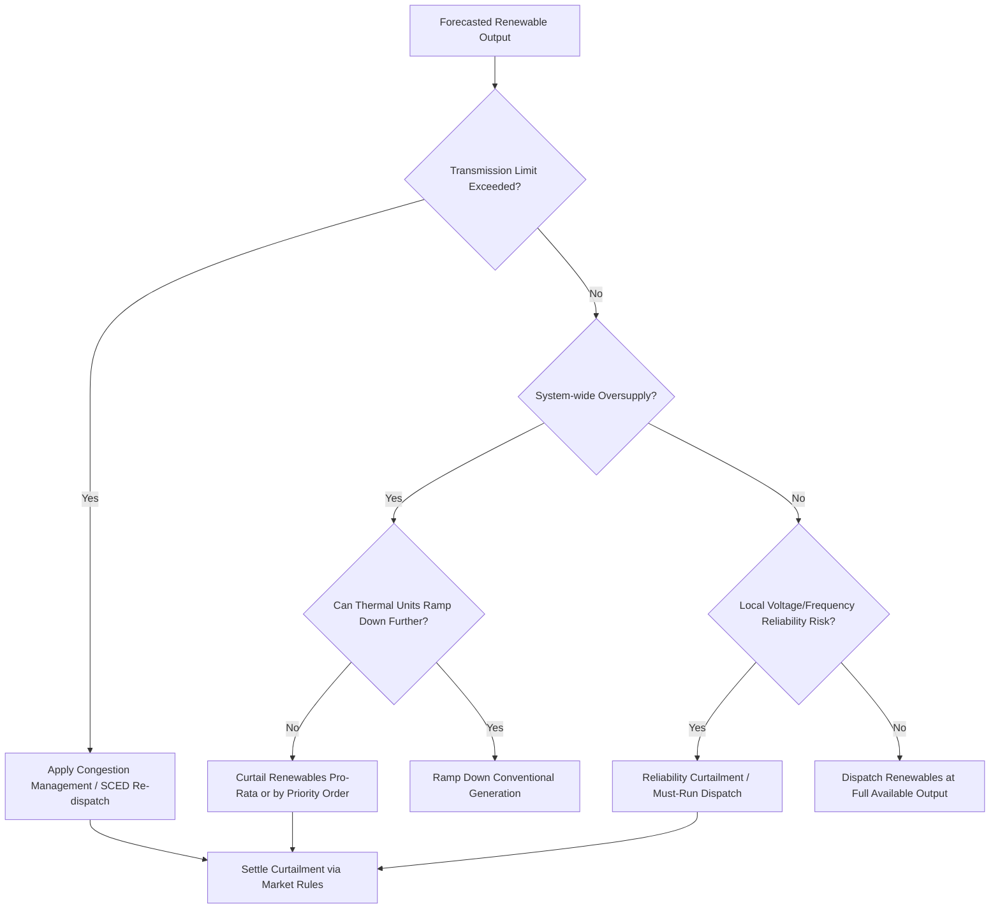

## Curtailment and Renewable Variability Management

### Definition and Scope

Curtailment is the deliberate reduction of output from a generating resource below what it could otherwise produce, given available fuel (wind, solar irradiance, or water). Renewable variability management is the broader set of planning, market, and operational tools used to accommodate the stochastic, non-dispatchable output of wind and solar resources while maintaining grid reliability.

Curtailment is a symptom; variability management is the discipline that tries to minimize the need for it while preserving system security.

### Root Causes of Curtailment

**Transmission-constrained curtailment**

Occurs when generation exceeds the thermal, voltage, or stability limits of the transmission network delivering it to load. Common in regions where wind/solar development has outpaced transmission buildout (e.g., West Texas prior to CREZ lines, or offshore wind zones awaiting interconnection upgrades).

**Oversupply/economic curtailment**

Occurs when system-wide generation exceeds demand plus export capability, even without local transmission limits. Typical in high-solar systems (e.g., CAISO "duck curve" midday minimums) where must-run thermal units, minimum generation constraints, and inflexible baseload (nuclear, some CHP) cannot ramp down further.

**Reliability/must-run curtailment**

Grid operators curtail renewables to maintain minimum levels of synchronous generation for inertia, voltage support, or frequency response, particularly in weak-grid areas with low short-circuit ratio (SCR).

**Negative pricing curtailment**

Market-driven: when locational marginal prices (LMPs) go negative (often due to production tax credit economics keeping wind online), some resources self-curtail or economic dispatch curtails them.

**Local network/distribution curtailment**

On distribution feeders, high penetration of behind-the-meter solar can cause reverse power flow, voltage rise beyond ANSI C84.1 limits, or thermal overloads, triggering inverter-level curtailment (e.g., California's Rule 21).

### Quantifying Curtailment

$$C_{\%} = \frac{E_{potential} - E_{actual}}{E_{potential}} \times 100$$

Where $E_{potential}$ is the energy the resource could have produced (estimated from wind speed/irradiance and the power curve) and $E_{actual}$ is metered output. This requires a **counterfactual model** — since the curtailed energy was never generated, $E_{potential}$ must be inferred, typically via:

- Manufacturer power curves applied to measured meteorological data
- Nearby uncurtailed reference plants
- SCADA-reported "available capacity" signals from the plant controller

### Curtailment Order and Priority Rules

Independent System Operators (ISOs) apply curtailment via defined priority stacks, which vary by jurisdiction:

- **Pro-rata curtailment**: all similarly-situated resources reduced proportionally (common in CAISO, ERCOT for local constraints)
- **Last-in-first-out (LIFO)**: newest interconnecting resources curtailed first, based on interconnection queue position
- **Economic/bid-based curtailment**: lowest-bid resources curtailed first in security-constrained economic dispatch (SCED)
- **Exceptional dispatch**: out-of-market instructions issued for reliability, later settled financially

**Example — ERCOT SCED logic (simplified)**

ERCOT co-optimizes energy and ancillary services every 5 minutes. If a transmission constraint binds, SCED re-dispatches resources by shift factor and bid price until the constraint is relieved; renewables bid at or near $0/MWh are typically dispatched down first when the constraint requires it, unless in a designated must-run status.

### Mermaid: Curtailment Decision Flow

### Mitigation Strategies

**1. Transmission expansion**

Building new lines or upgrading conductors relieves congestion-driven curtailment. Long lead times (5–10+ years) make this a slow lever; interconnection-wide planning studies (e.g., MISO LRTP, ERCOT RPG) attempt to anticipate renewable buildout.

**2. Energy storage co-location and standalone BESS**

Batteries charge during oversupply periods (absorbing what would be curtailed) and discharge during scarcity, effectively time-shifting renewable energy. This directly reduces curtailment percentage and captures otherwise-lost energy value.

**3. Demand-side flexibility**

Time-of-use rates, demand response programs, and electrification of loads (EV charging, electrolyzers for hydrogen) that can be scheduled to coincide with renewable surplus periods reduce the oversupply condition.

**4. Grid-forming inverters and synthetic inertia**

By providing voltage/frequency support without relying on synchronous machines, grid-forming inverter-based resources reduce the need for reliability-driven must-run curtailment, raising the effective renewable penetration limit before stability constraints bind.

**5. Improved forecasting**

Short-term wind/solar forecasting (numerical weather prediction combined with machine learning) reduces the reserve margins operators must hold "just in case," lowering the reliability-based curtailment threshold. Forecast errors are a key driver of conservative reliability curtailment.

**6. Wider balancing areas / market coupling**

Combining balancing areas (e.g., the Western Energy Imbalance Market, EIM) allows renewable surplus in one region to serve load in another, smoothing variability across a larger footprint and reducing curtailment.

**7. Flexible must-run unit commitment**

Reducing minimum stable generation levels of thermal units, or retiring/repowering inflexible baseload, increases the "headroom" available for renewables before curtailment is triggered.

**8. Negative pricing and market design reform**

Removing or capping production tax credit-driven negative bidding behavior, and improving nodal pricing granularity, aligns generator incentives with true system needs.

### Variability Metrics Used in Planning

- **Ramp rate**: MW/minute change in aggregate renewable output; used to size regulation and load-following reserves
- **Capacity factor variability**: standard deviation of hourly output relative to nameplate capacity
- **Net load ramp**: $P_{load} - P_{renewable}$; the "duck curve" problem is fundamentally a net-load ramp management issue
- **Effective Load Carrying Capability (ELCC)**: statistical measure of how much a renewable resource contributes to resource adequacy, which decreases at the margin as penetration increases (diminishing capacity credit)

### Worked Example — Duck Curve Ramp

Assume a system with 10 GW peak load and 8 GW installed solar capacity. At midday, solar output reaches 6 GW while load is 5 GW, creating -1 GW net load (export or curtailment condition). By 6 PM, solar output falls to near zero over 3 hours while load rises to 9 GW.

$$\text{Net Load Ramp Rate} = \frac{\Delta P_{load} - \Delta P_{solar}}{\Delta t} = \frac{(9-5) - (0-6)}{3\text{ hr}} = \frac{4+6}{3} \approx 3.33 \text{ GW/hr}$$

This 3.33 GW/hr ramp must be met by fast-starting or fast-ramping conventional generation, imports, or discharging storage — a defining operational challenge that CAISO's duck curve popularized.

### SVG: Duck Curve Illustration (svg_diagram)

<svg xmlns="http://www.w3.org/2000/svg" viewBox="0 0 700 400">
<rect x="0" y="0" width="700" height="400" fill="#ffffff" />
<text x="350" y="25" font-size="16" text-anchor="middle" font-family="sans-serif" font-weight="bold">Net Load Duck Curve (svg_diagram)</text>
<line x1="60" y1="340" x2="660" y2="340" stroke="#333" stroke-width="1.5" />
<line x1="60" y1="340" x2="60" y2="50" stroke="#333" stroke-width="1.5" />
<text x="360" y="380" font-size="12" text-anchor="middle" font-family="sans-serif">Hour of Day</text>
<text x="20" y="200" font-size="12" text-anchor="middle" font-family="sans-serif" transform="rotate(-90 20 200)">Net Load (GW)</text>
<text x="70" y="355" font-size="10" font-family="sans-serif">0</text>
<text x="240" y="355" font-size="10" font-family="sans-serif">6</text>
<text x="410" y="355" font-size="10" font-family="sans-serif">12</text>
<text x="580" y="355" font-size="10" font-family="sans-serif">18</text>
<text x="650" y="355" font-size="10" font-family="sans-serif">24</text>
<polyline points="60,180 130,175 200,160 270,120 340,90 410,85 480,110 550,180 620,240 660,230" fill="none" stroke="#1a73e8" stroke-width="3" />
<text x="480" y="70" font-size="11" fill="#1a73e8" font-family="sans-serif">Midday Belly (oversupply)</text>
<text x="560" y="200" font-size="11" fill="#d93025" font-family="sans-serif">Evening Ramp</text>
<line x1="480" y1="115" x2="550" y2="185" stroke="#d93025" stroke-width="2" stroke-dasharray="4,3" />
</svg>

### Regulatory and Market Mechanisms

- **Curtailment compensation**: Some jurisdictions (e.g., ERCOT for certain contracts, various European feed-in-tariff schemes) compensate curtailed renewable generators for lost revenue; others (most US wholesale markets) do not, exposing generators to full merchant curtailment risk.
- **Interconnection queue reform**: FERC Order 2023 (US) addresses queue backlogs that contribute to under-built transmission relative to renewable interconnection requests, an indirect curtailment driver. [Inference: specific state-level implementation timelines vary and should be verified against current FERC compliance filings.]
- **Must-offer/must-take obligations**: Power purchase agreements (PPAs) may include "take-or-pay" clauses that shift curtailment financial risk to the offtaker rather than the generator.

### Practical Engineering Considerations

- Plant controllers must support **remote curtailment instructions** via SCADA/AGC-style setpoints (percent curtailment or absolute MW cap), typically compliant with IEEE 1547 (US) or grid codes such as ENTSO-E RfG for European interconnections.
- Inverter firmware must support **ramp-rate limiting** and **volt-VAR/volt-watt curtailment modes** for distribution-level voltage management.
- Curtailment telemetry (available vs. actual output) is essential for accurate settlement and for feeding back into future interconnection and transmission planning studies.

### Key Points

- Curtailment arises from transmission congestion, oversupply, reliability constraints, negative pricing, or local distribution limits — each requiring a different mitigation strategy.
- Storage, demand flexibility, wider balancing footprints, and improved forecasting are the primary tools to reduce curtailment without sacrificing reliability.
- Compensation and market design determine who bears the financial risk of curtailment, which significantly affects renewable project economics.
- Behavior of specific ISO/RTO curtailment algorithms may vary by jurisdiction and evolve with tariff revisions; consult current market rules for binding operational detail.

**Related Topics**

- Battery Energy Storage System (BESS) Sizing and Dispatch Optimization
- Effective Load Carrying Capability (ELCC) and Capacity Accreditation
- Grid-Forming vs. Grid-Following Inverter Control
- Locational Marginal Pricing (LMP) and Congestion Components
- Interconnection Queue Reform (FERC Order 2023)
- Demand Response and Time-of-Use Rate Design
- Inertia and Frequency Response in Low-Inertia Grids
- Wide-Area Balancing Markets and Energy Imbalance Markets (EIM)