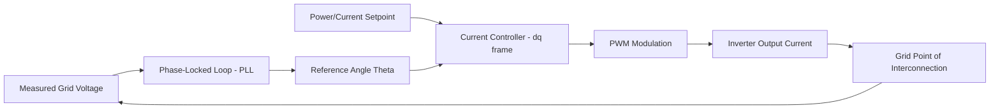
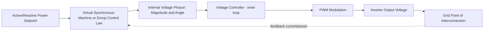

## Grid-Following versus Grid-Forming Inverter Control

### Overview

Inverter-based resources (IBRs) — wind, solar, and battery storage — interface with the AC grid through power electronic converters rather than the rotating synchronous machines used by conventional generation. The control algorithm governing that converter falls into two fundamental categories: **grid-following (GFL)** and **grid-forming (GFM)**. This distinction determines how the resource behaves during normal operation, disturbances, and in weak-grid or islanded conditions, and is central to reliability planning as synchronous generation is displaced.

### Grid-Following Control

**Operating principle**

A grid-following inverter behaves as a controlled current source. It measures the grid voltage waveform via a phase-locked loop (PLL), synchronizes to that reference, and injects current at a commanded magnitude and phase relative to the measured voltage angle. It requires a pre-existing, stable voltage waveform to lock onto.

**Control structure**

**Characteristics**

- Contributes negligible inertia; provides no autonomous voltage or frequency reference
- Requires Short-Circuit Ratio (SCR) typically above ~1.5–2.0 at the point of interconnection to maintain stable PLL synchronization; in weak grids, PLL bandwidth interacts adversely with network impedance, risking instability
- Fast response to commanded active/reactive power setpoints, well suited for maximum power point tracking (MPPT) in solar and variable-speed wind
- Fault ride-through governed by grid codes (e.g., IEEE 1547-2018, NERC PRC-024) specifying voltage/frequency ride-through curves and momentary cessation behavior
- Dominant architecture in the installed base of utility-scale solar and wind inverters today

**Limitation in high-penetration scenarios**

As synchronous generation retires and GFL IBR penetration rises, system SCR falls in constrained areas, degrading PLL stability margins. This is a documented driver of curtailment and interconnection restrictions in high-renewable zones (e.g., West Texas panhandle, parts of the UK and Ireland grids).

### Grid-Forming Control

**Operating principle**

A grid-forming inverter behaves as a controlled voltage source behind an impedance, analogous to a synchronous machine's internal EMF behind synchronous reactance. It establishes its own voltage magnitude and phase angle reference internally, does not require a PLL to synchronize to an existing waveform, and can energize a de-energized system (black start) or operate in an island.

**Control structure**

**Core control algorithms**

- **Droop control**: mimics governor and AVR droop, adjusting frequency and voltage output based on active and reactive power deviations, analogous to $\Delta f = -k_p (P - P_{ref})$
- **Virtual Synchronous Machine (VSM) / Synchronverter**: emulates swing-equation dynamics explicitly, giving the inverter a programmable virtual inertia constant $H$ and damping coefficient
- **Matching control**: maps DC-link voltage dynamics to emulate synchronous machine rotor dynamics without a separate inertia emulation loop

**Characteristics**

- Provides synthetic/virtual inertia, contributing to system frequency stability during large disturbances (e.g., generator trip)
- Autonomously sets voltage and frequency; multiple GFM units can operate in parallel and share load via droop without a communication link
- Capable of black start and stable microgrid/islanded operation, since it does not depend on an external voltage reference
- Requires current-limiting strategies (virtual impedance, current saturation logic) during faults, since voltage-source behavior can otherwise attempt to deliver fault currents beyond semiconductor ratings — this is an active area of standards development (e.g., NERC's GFM guidance, IEEE P2800.2)
- Improves effective short-circuit strength contribution to the local grid, unlike GFL which contributes essentially zero fault current support beyond code-mandated minimums

### Comparative Table

**Key Points**

- **Reference behavior**: GFL synchronizes to grid via PLL (current source); GFM establishes own reference (voltage source)
- **Weak grid performance**: GFL degrades as SCR falls; GFM improves stability in weak-grid/low-SCR conditions
- **Inertia contribution**: GFL contributes ~0 inertia; GFM can provide programmable synthetic inertia
- **Black start capability**: GFL cannot black start (needs live voltage); GFM can energize a dead system
- **Fault current behavior**: GFL limited to near-rated current by design; GFM requires explicit current-limiting to avoid thermal damage, since its natural voltage-source response would otherwise attempt higher fault currents
- **Maturity/deployment**: GFL is the mature, dominant installed base; GFM is commercially available but at earlier deployment scale, with several utility-scale GFM battery projects in service (e.g., Hornsdale Power Reserve in Australia uses GFM-capable control, various ERCOT and AEMO pilot deployments)

### Worked Example — Frequency Response Comparison

Following a sudden generation loss of $\Delta P = 500$ MW on a system with total inertia constant $H_{sys}$ and nominal frequency $f_0 = 60$ Hz:

$$\frac{df}{dt} = \frac{-\Delta P \cdot f_0}{2 H_{sys} \cdot S_{base}}$$

A grid dominated by GFL IBRs contributes negligible $H$, concentrating system inertia in remaining synchronous units and steepening the Rate of Change of Frequency (RoCoF), potentially triggering RoCoF-based protective relay trips (a documented factor in the 2016 South Australia blackout event analysis). Replacing a portion of that IBR fleet with GFM units, each contributing virtual inertia $H_{virtual}$, increases $H_{sys}$ in the denominator, reducing RoCoF magnitude and buying time for primary frequency response (governor droop, fast frequency response services) to act. [Inference: exact RoCoF improvement is highly system- and parameter-specific and requires dynamic simulation, not a generalized number.]

### Grid Code and Standards Landscape

- **IEEE 2800-2022**: Interconnection and interoperability standard for IBRs to transmission systems in North America; establishes baseline ride-through and control requirements applicable to both GFL and GFM resources
- **NERC Reliability Guideline on Grid Forming Technology**: provides recommended functional specifications for GFM performance during faults, islanding, and black start
- **ENTSO-E / European grid codes**: increasingly reference "Fast Fault Current Injection" and synthetic inertia requirements distinct from simple GFL ride-through
- **AEMO (Australia)**: has issued specific technical requirements for GFM BESS given the National Electricity Market's early high-IBR-penetration experience

### Practical Deployment Considerations

- Retrofitting existing GFL fleets to GFM is generally not feasible at the hardware level; GFM requires converter and control hardware/firmware designed for voltage-source operation with appropriate current-limiting circuitry
- System operators are beginning to specify minimum percentages of GFM capacity in interconnection studies for weak-grid zones or islanded systems (e.g., isolated island grids, offshore wind hub HVDC schemes)
- Hybrid plants (e.g., battery + solar) can pair a GFM-capable BESS inverter with GFL solar inverters, using the BESS to provide the voltage/frequency reference for the collector system

### Next Steps

- Short-Circuit Ratio (SCR) and Weak Grid Interconnection Assessment
- Synthetic Inertia and Fast Frequency Response (FFR) Markets
- IEEE 2800-2022 Interconnection Requirements Deep Dive
- Battery Energy Storage System (BESS) Sizing and Dispatch Optimization
- Black Start and Microgrid Restoration Using Inverter-Based Resources
- Sub-Synchronous Control Interaction (SSCI) and Oscillation Risks in IBR-Dominated Grids
- Virtual Synchronous Machine (VSM) Parameter Tuning