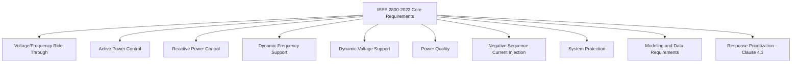
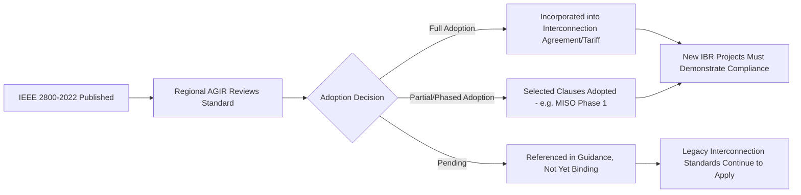

## IEEE Std 2800-2022 Interconnection Requirements

### Purpose and Scope

IEEE 2800-2022, formally titled "IEEE Standard for Interconnection and Interoperability of Inverter-Based Resources (IBRs) Interconnecting with Associated Transmission Electric Power Systems," establishes uniform technical minimum requirements for the interconnection, capability, and lifetime performance of inverter-based resources interconnecting with transmission and sub-transmission systems. It is the first continent-wide, technology-neutral standard consolidating IBR performance expectations that had previously been fragmented across individual utility and ISO/RTO interconnection agreements. [IEEE Xplore](https://ieeexplore.ieee.org/document/9762253/)

The standard applies to wind, solar PV, and battery storage plants connecting at transmission and sub-transmission voltage levels, and it also applies to isolated inverter-based resources interconnected to an AC transmission system via a dedicated voltage-source-converter HVDC (VSC-HVDC) transmission facility, in which case the standard governs the combined IBR-plus-HVDC facility rather than the IBR in isolation. [BSB Edge](https://www.bsbedge.com/standard/ieee-standard-for-interconnection-and-interoperability-of-inverter-based-resources-ibrs-interconnecting-with-associated-transmission-electric-power-systems/IEEE2800)

**Applicable audience** per the standard: electric utilities, power system owners, planners, designers, and operators; equipment manufacturers (IBR, supplemental device, transformer, HVDC-VSC); power plant owners and developers; system integrators; and regulatory and government bodies. [BSB Edge](https://www.bsbedge.com/standard/ieee-standard-for-interconnection-and-interoperability-of-inverter-based-resources-ibrs-interconnecting-with-associated-transmission-electric-power-systems/IEEE2800)

### Core Technical Requirement Categories

The standard's requirements, per its scope statement, cover: voltage and frequency ride-through, active power control, reactive power control, dynamic active power support under abnormal frequency conditions, dynamic voltage support under abnormal voltage conditions, power quality, negative sequence current injection, and system protection. [IEEE Xplore](https://ieeexplore.ieee.org/document/9762253/)[ANSI](https://webstore.ansi.org/standards/ieee/ieee28002022)

### Voltage and Frequency Ride-Through

IBRs must remain connected and continue operating through defined disturbance envelopes rather than tripping prematurely:

- **Continuous operating range**: IBRs must operate continuously within a defined voltage range (typically 0.95–1.05 p.u.) [Keentel Engineering](https://keentelengineering.com/ieee-2800-compliance-inverter-based-resources)
- **Frequency ride-through**: the standard defines mandatory frequency ranges (e.g., 57–62 Hz for 60 Hz systems) and ride-through times, requiring generators to remain online and contribute during frequency deviations, not disconnect prematurely [Keentel Engineering](https://keentelengineering.com/ieee-2800-compliance-inverter-based-resources)[Keentel Engineering](https://keentelengineering.com/ieee-2800-compliance-inverter-based-resources)
- **No nuisance tripping**: generators must not trip during low- or high-voltage events unless system protection requires it, and the standard specifies detailed voltage-duration ride-through curves defining mandatory operating time at each voltage level [Keentel Engineering](https://keentelengineering.com/ieee-2800-compliance-inverter-based-resources)[Keentel Engineering](https://keentelengineering.com/ieee-2800-compliance-inverter-based-resources)

### Active and Reactive Power Control

- **Reactive capability**: reactive power capability curves ensure dynamic voltage support under both steady-state and disturbed conditions [Keentel Engineering](https://keentelengineering.com/ieee-2800-compliance-inverter-based-resources)
- **Frequency-responsive active power**: autonomous control of real power output for grid frequency stability is mandatory, underpinning Fast Frequency Response (FFR) and Primary Frequency Response (PFR) functions [Keentel Engineering](https://keentelengineering.com/ieee-std-2800-2022-compliance-for-inverter-based-resources-a-practical-guide-for-generator-owners)
- **Operator dispatch commands**: IBRs are required to respond to operator-issued commands, such as real/reactive power setpoints and curtailment signals [Zero-Emission Grid](https://www.zeroemissiongrid.com/insights-press-zeg-blog/ieee-2800-standard-how-it-impacts-ibr-interconnection-and-what-developers-must-know/)

### Response Prioritization (Clause 4.3)

A distinguishing feature of IEEE 2800-2022 is its explicit coordination logic for simultaneous control-mode activations. Standardized prioritization of responses is a way to coordinate simultaneous responses from different functions or modes — for example, resolving conflicts when voltage support, frequency support, and current-limiting logic would otherwise issue competing commands to the same converter during a single disturbance. Regional entities such as MISO have begun citing the standard directly for future adoption proposals, though [Unverified: not all adopting regions have implemented every prioritization clause in initial adoption phases] — for instance, not all clauses listed in the prioritization of responses requirements are included in the first round of MISO's IEEE 2800 adoption. [Inverter-Based Resource Performance Requirements +2](https://cdn.misoenergy.org/20230502%20IPWG%20Item%2004%20IBR%20Performance%20Requirements628714.pdf)

### Monitoring, Telemetry, and Communication Requirements

- **Real-time telemetry**: IBRs must provide real-time telemetry, including voltage, frequency, active/reactive power, and status signals to grid operators [Zero-Emission Grid](https://www.zeroemissiongrid.com/insights-press-zeg-blog/ieee-2800-standard-how-it-impacts-ibr-interconnection-and-what-developers-must-know/)
- **Control interface**: converters must accept and execute remote setpoint and curtailment instructions from the operator, forming the SCADA/AGC interface layer described in curtailment management practice
- **Cybersecurity**: [Inference: the standard references but does not itself fully prescribe cybersecurity implementation] — although IEEE 2800 does not prescribe specific cyber[security requirements in full detail], it establishes the data-exchange framework that cybersecurity controls must protect [Zero-Emission Grid](https://www.zeroemissiongrid.com/insights-press-zeg-blog/ieee-2800-standard-how-it-impacts-ibr-interconnection-and-what-developers-must-know/)

### Modeling Requirements

Generator owners must supply validated dynamic models (positive-sequence RMS and, increasingly, electromagnetic transient/EMT models) representing the plant's ride-through, frequency-response, and voltage-support behavior for use in interconnection studies. Engineering practice for compliance typically involves simulation in PSCAD, PSS/E, EMT, and ETAP dynamic modeling platforms to validate performance against the standard's curves prior to energization. [Keentel Engineering](https://keentelengineering.com/ieee-std-2800-2022-compliance-for-inverter-based-resources-a-practical-guide-for-generator-owners)

### Companion and Successor Documents

IEEE 2800-2022 sits within a broader standards suite:

- **IEEE P2800.2**: draft IEEE P2800.2 Recommended Practice for Test and Verification Procedures for Inverter-based Resources (IBRs) Interconnecting with Bulk Power Systems. This document was approved and published, providing recommended practices for test and verification procedures that should be used to confirm plant-level conformance of IBRs, complementing IEEE 2800 with specifications for the equipment, conditions, tests, modeling methods, and other verification procedures needed to demonstrate conformance. [i2X Forum for the Implementation of Reliability Standards for +2](https://www.energy.gov/sites/default/files/2024-07/i2x%20FIRST%20Meeting%20Notes%20through%2006-25-2024.pdf)
- Per an IEEE PES update, IEEE 2800.2-2026, an IEEE Recommended Practice for Test and Verification Procedures for IBRs Interconnecting with Bulk Power Systems, was approved and published in spring 2026, and is positioned as supporting, if not at least complementing, compliance assessment of North American Generator Owners with new NERC reliability standards like PRC-029. [Unverified: PRC-029 finalization status and effective dates should be confirmed against current NERC filings, as this postdates standard reference material and reflects a fast-moving regulatory area.] [IEEE Power &amp; Energy Society](https://ieee-pes.org/trending-tech/inverter-based-resources-standards-in-electric-power-grids/)[IEEE Power &amp; Energy Society](https://ieee-pes.org/trending-tech/inverter-based-resources-standards-in-electric-power-grids/)
- The wider effort is described as an evolving IEEE 2800.x standards suite establishing comprehensive technical, testing, and performance requirements to support the reliable interconnection, compliance, and future grid-forming capabilities of inverter-based resources across North American bulk power systems — indicating that grid-forming-specific requirements are an active extension area beyond the base 2800-2022 document. [IEEE Power &amp; Energy Society](https://ieee-pes.org/trending-tech/inverter-based-resources-standards-in-electric-power-grids/)

### Regulatory Adoption Pathway

IEEE 2800-2022 is not self-executing; it becomes binding only when adopted by a jurisdiction's Authority Governing Interconnection Requirements (AGIR) — typically an ISO/RTO, transmission owner, or regulatory body.

- Some grid operators (e.g., CAISO, PJM) have started referencing IEEE 2800 principles in updated interconnection guidance or pilot programs [Zero-Emission Grid](https://www.zeroemissiongrid.com/insights-press-zeg-blog/ieee-2800-standard-how-it-impacts-ibr-interconnection-and-what-developers-must-know/)
- IEEE 2800 is expected to become a required standard for all new IBRs seeking interconnection to the transmission grid, with utilities and developers need[ing] to show conformance as part of the application and commissioning process [Inference: "expected to become required" reflects industry trajectory at the time of the source; actual mandate timing is jurisdiction-specific and evolving] [Zero-Emission Grid](https://www.zeroemissiongrid.com/insights-press-zeg-blog/ieee-2800-standard-how-it-impacts-ibr-interconnection-and-what-developers-must-know/)[Zero-Emission Grid](https://www.zeroemissiongrid.com/insights-press-zeg-blog/ieee-2800-standard-how-it-impacts-ibr-interconnection-and-what-developers-must-know/)
- The interplay between overall IEEE 2800 adoption and implementation strategies, ride-through requirements, measurement and monitoring requirements, modeling requirements, frequency support requirements, [and] voltage support/reactive support requirements is being actively coordinated through DOE-facilitated forums such as i2X FIRST, alongside the role of regional interconnection requirements (including regional adoption of IEEE 2800-2022) versus NERC Reliability Standards versus FERC Orders [Department of Energy](https://www.energy.gov/sites/default/files/2024-07/i2x%20FIRST%20Meeting%20Notes%20through%2006-25-2024.pdf)[Department of Energy](https://www.energy.gov/sites/default/files/2024-07/i2x%20FIRST%20Meeting%20Notes%20through%2006-25-2024.pdf)

### Rationale: Why the Standard Exists

The underlying reliability concern the standard addresses: traditional synchronous machines inherently contribute inertia, voltage support, and fault current, stabilizing the grid during disturbances. In contrast, IBRs behave differently—offering less inertia and relying on advanced control systems. As the resource mix shifts from synchronous to inverter-based generation, IEEE 2800-2022 was developed to harmonize IBR interconnections, ensuring they contribute positively to bulk power system reliability while remaining interoperable across multiple utilities and transmission operators. [Keentel Engineering](https://keentelengineering.com/ieee-2800-compliance-inverter-based-resources)[Keentel Engineering](https://keentelengineering.com/ieee-2800-compliance-inverter-based-resources)

### Practical Compliance Workflow for Project Developers

**Key Points**

- Engage the Authority Governing Interconnection Requirements (AGIR) early to confirm which version/clauses of IEEE 2800-2022 apply, since adoption is regional and often phased
- Commission dynamic models (RMS and EMT) validated against manufacturer type-test data for submission in interconnection studies
- Design protection coordination studies specifically addressing ROCOF and anti-islanding behavior, since these interact directly with ride-through and frequency-response clauses [Keentel Engineering](https://keentelengineering.com/ieee-std-2800-2022-compliance-for-inverter-based-resources-a-practical-guide-for-generator-owners)
- Budget for power quality assessments and harmonic mitigation studies as part of compliance documentation [Keentel Engineering](https://keentelengineering.com/ieee-std-2800-2022-compliance-for-inverter-based-resources-a-practical-guide-for-generator-owners)
- Anticipate future test/verification obligations under the IEEE P2800.2 companion practice, which formalizes commissioning-stage conformance testing

### Conclusion

IEEE 2800-2022 functions as the technical backbone for a grid increasingly composed of inverter-based generation, replacing what were previously inconsistent, utility-by-utility interconnection requirements with a harmonized minimum performance bar. Its practical effect on system reliability depends heavily on the pace and completeness of regional adoption by AGIRs, and on the maturation of companion test/verification practices (P2800.2) and coordinated NERC reliability standards — an area that continues to evolve materially year over year, so current adoption status should always be verified against the relevant ISO/RTO's latest interconnection procedures.

**Related Topics**

- Authority Governing Interconnection Requirements (AGIR) and Interconnection Study Process
- NERC PRC-024 and PRC-029 Reliability Standards for IBR Performance
- Grid-Forming vs. Grid-Following Inverter Control (extension requirements under IEEE 2800.x)
- Fault Ride-Through Curve Design and Voltage-Duration Compliance
- Fast Frequency Response (FFR) and Primary Frequency Response (PFR) Market Design
- EMT and RMS Dynamic Modeling for IBR Interconnection Studies
- IEEE P2800.2 Test and Verification Procedures
- Short-Circuit Ratio (SCR) and Weak Grid Interconnection Assessment