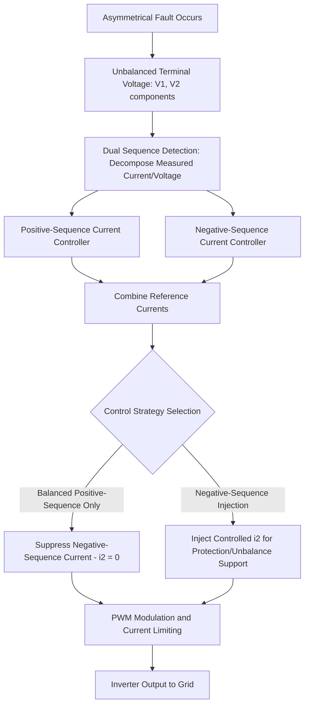
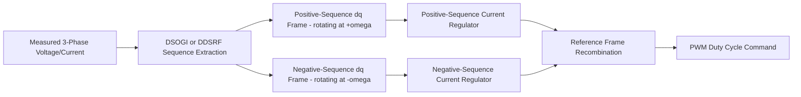

## Negative-Sequence Current Control During Asymmetrical Faults

### Background: Sequence Component Framework

Asymmetrical faults (single-line-to-ground, line-to-line, double-line-to-ground) produce unbalanced three-phase voltages and currents. Symmetrical component theory decomposes any unbalanced three-phase set into three balanced sequence networks:

$$\begin{bmatrix} V_0 \\ V_1 \\ V_2 \end{bmatrix} = \frac{1}{3}\begin{bmatrix} 1 & 1 & 1 \\ 1 & a & a^2 \\ 1 & a^2 & a \end{bmatrix} \begin{bmatrix} V_a \\ V_b \\ V_c \end{bmatrix}, \quad a = e^{j120°}$$

Where $V_0$, $V_1$, $V_2$ are zero-, positive-, and negative-sequence voltage phasors respectively. During balanced operation only $V_1$ exists; during asymmetrical faults, $V_2$ (and often $V_0$) appears in proportion to the fault's asymmetry.

For inverter-based resources (IBRs), how the converter's current controller responds to this negative-sequence voltage component during a fault is a critical design choice affecting protection coordination, converter thermal survivability, and voltage unbalance mitigation.

### Why Negative-Sequence Current Matters for IBRs

Unlike synchronous machines, which inherently produce negative-sequence fault current determined by their negative-sequence impedance ($Z_2$, roughly equal to subtransient reactance $X_d''$), inverter-based resources have no fixed physical impedance governing fault response — their fault current is entirely a function of the control algorithm's programmed response. This makes negative-sequence current injection (or suppression) a deliberate, tunable control decision rather than a fixed electromagnetic property.

### Control Strategy 1: Balanced Positive-Sequence Current Control (Suppress i2)

**Approach**: The controller actively forces negative-sequence current output to zero, injecting only positive-sequence current regardless of the voltage unbalance present at the terminals.

**Advantages**

- Produces smooth, ripple-free active power output (avoids double-frequency (2ω) oscillations in active power that arise from the interaction of positive-sequence current with negative-sequence voltage, or vice versa)
- Simplifies converter current controller design and current limiting logic
- Reduces peak phase current during unbalanced faults, easing semiconductor thermal stress in the worst-affected phase

**Disadvantages**

- Contributes negligible negative-sequence fault current, which can desensitize negative-sequence-based protection elements (e.g., negative-sequence overcurrent relays, 46 relays) that utilities rely on to detect and clear unbalanced faults, particularly in networks with declining synchronous generation share
- Provides no active support for voltage unbalance mitigation at the point of interconnection

### Control Strategy 2: Negative-Sequence Current Injection

**Approach**: The controller deliberately injects a controlled negative-sequence current component, sized as a function of measured negative-sequence voltage, analogous to how a synchronous machine's fixed $Z_2$ would naturally produce negative-sequence current.

$$I_2 = k_2 \cdot V_2, \quad \text{typically bounded by } I_2 \leq I_{2,max}$$

Where $k_2$ is a negative-sequence gain (droop-like coefficient) and $I_{2,max}$ is a converter thermal/rating-based ceiling.

**Advantages**

- Supplies meaningful negative-sequence fault current to support conventional protection schemes (directional negative-sequence overcurrent, negative-sequence differential elements) in networks with significant IBR penetration
- Assists in mitigating steady-state voltage unbalance under conditions such as unbalanced loading or single-phase reclosing
- Increasingly required or recommended by evolving grid codes as synchronous generation retires and reliance on negative-sequence fault current for protection grows

**Disadvantages**

- Introduces double-frequency active and reactive power oscillations at the DC link and AC terminals unless a compensating control (e.g., Positive-Negative Sequence Compensation, PNSC) is applied
- Requires more complex dual sequence-frame (dual dq) control architecture and faster, more accurate sequence extraction
- Consumes a portion of the converter's total current rating budget, competing with positive-sequence active/reactive current for the same thermal headroom during current-limited fault conditions

### Control Objective Trade-offs Under Current Limiting

During a fault, total converter current is limited to a value near rated current (typically 1.0–1.2 p.u.) to protect semiconductors. This creates a three-way allocation problem among:

1. Positive-sequence active current (supports frequency/active power)
2. Positive-sequence reactive current (supports voltage recovery per ride-through requirements, e.g., $k \geq 2$ p.u. reactive current per p.u. voltage dip under IEEE 2800-2022 and similar grid codes)
3. Negative-sequence current (supports protection coordination/unbalance mitigation)

$$I_{total} = \sqrt{I_{1,active}^2 + I_{1,reactive}^2 + I_2^2} \leq I_{max}$$

Prioritization logic (often codified in grid codes, e.g., IEEE 2800-2022 Clause 4.3's response prioritization framework) typically ranks positive-sequence reactive current support highest during severe voltage dips, with negative-sequence injection and active current allocation prioritized according to system-specific or manufacturer-specific control settings. [Inference: exact numeric priority ordering is grid-code- and manufacturer-specific; consult the applicable interconnection standard for binding values.]

### Sequence Extraction and Control Architecture

**Dual Second-Order Generalized Integrator (DSOGI) / Dual dq-Frame Control**

Practical implementations extract positive- and negative-sequence components in real time using techniques such as:

- Dual Second-Order Generalized Integrator with Frequency-Locked Loop (DSOGI-FLL)
- Decoupled Double Synchronous Reference Frame (DDSRF) with notch filters to remove cross-coupling oscillations

### Worked Example — SLG Fault Current Allocation

Consider a converter rated at $I_{max} = 1.1$ p.u. experiencing a single-line-to-ground fault producing $V_2 = 0.15$ p.u. at the terminals. If the grid code mandates reactive current injection $I_{1,reactive} = 2 \times (1 - V_1) $ p.u. up to a cap, and $V_1 = 0.6$ p.u. during the fault:

$$I_{1,reactive} = 2 \times (1 - 0.6) = 0.8 \text{ p.u.}$$

Remaining current budget for active and negative-sequence current:

$$\sqrt{I_{1,active}^2 + I_2^2} \leq \sqrt{1.1^2 - 0.8^2} \approx 0.755 \text{ p.u.}$$

If the plant controller allocates a fixed negative-sequence gain producing $I_2 = 0.2$ p.u., the remaining budget for positive-sequence active current is:

$$I_{1,active} \leq \sqrt{0.755^2 - 0.2^2} \approx 0.728 \text{ p.u.}$$

This illustrates the direct competition for current headroom between voltage support, negative-sequence injection, and active power delivery during asymmetrical faults. [Inference: this is a simplified illustrative allocation; real plant controllers apply manufacturer-specific and grid-code-specific prioritization logic that may differ from a simple square-root budget split.]

### Protection Coordination Implications

- **Negative-sequence relays (device 46, 50Q/51Q)**: sized and coordinated assuming a certain minimum negative-sequence fault current contribution; IBR fleets that suppress $I_2$ to zero can cause under-reach or failure to operate for remote unbalanced faults, a documented concern raised in NERC and IEEE PES technical reports as synchronous generation retires
- **Directional elements**: negative-sequence directional overcurrent protection relies on both magnitude and angle of $I_2$ relative to $V_2$; converter control must produce a consistent, predictable phase relationship (often mimicking an equivalent negative-sequence impedance angle) for directional elements to operate correctly
- **Sympathetic tripping risk**: excessive or poorly coordinated negative-sequence injection from IBRs during faults on adjacent circuits can, in some network configurations, contribute to unintended relay operations; utility-specific protection studies are typically required to validate IBR negative-sequence settings against existing relay schemes

### Standards and Grid Code Context

- IEEE 2800-2022 explicitly lists negative sequence current injection among its core technical requirement categories, reflecting the growing consensus that IBR negative-sequence behavior must be standardized rather than left to individual manufacturer defaults
- European grid codes (ENTSO-E RfG) and some national grid codes increasingly specify negative-sequence current injection requirements analogous to positive-sequence Fault Ride-Through (FRT) reactive current requirements
- [Unverified: specific numeric negative-sequence gain requirements vary by jurisdiction and are still evolving in several markets; verify against the current version of the applicable interconnection standard before use in a compliance filing.]

### Key Points

- Negative-sequence current response in IBRs is a control-software decision, not a fixed hardware property, unlike synchronous machines
- Suppressing negative-sequence current smooths power output but can desensitize legacy negative-sequence protection schemes
- Injecting negative-sequence current supports protection coordination and unbalance mitigation but competes for limited converter current headroom during faults and requires more complex dual-sequence control architecture
- Grid codes including IEEE 2800-2022 are increasingly specifying negative-sequence injection requirements as synchronous generation retires and system reliance on IBR-supplied fault current grows
- Protection coordination studies specific to the interconnecting utility's relay schemes are essential when finalizing negative-sequence control settings

**Related Topics**

- Symmetrical Component Analysis for Unbalanced Fault Studies
- IEEE Std 2800-2022 Interconnection Requirements (reactive current and prioritization clauses)
- Positive-Sequence Voltage Ride-Through and Reactive Current Injection Curves
- Protection Coordination in High-IBR-Penetration Networks
- Double Synchronous Reference Frame (DDSRF) Control Design
- Grid-Forming vs. Grid-Following Inverter Fault Response
- Converter Current Limiting Strategies During Voltage Sags