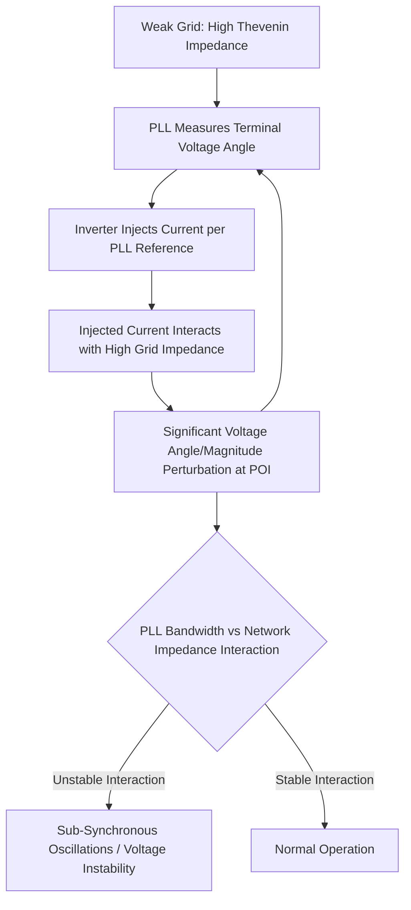

## Short-Circuit Strength in IBR-Dominant Systems

### Definition and Fundamental Concept

Short-circuit strength (or "grid strength") describes the ability of a power system to maintain a stiff, stable voltage at a given point when subjected to a disturbance or when interconnected equipment draws current. It is fundamentally governed by the system's Thevenin equivalent impedance as seen from the point of interconnection (POI): a lower impedance (higher fault level) means a "stronger" grid, while a higher impedance (lower fault level) means a "weaker" grid.

Traditionally supplied almost entirely by synchronous generators (whose subtransient reactance sets a low, predictable impedance) and the transmission network topology, short-circuit strength has become a first-order planning concern as synchronous generation is displaced by inverter-based resources (IBRs), which contribute negligible fault current relative to their MW rating.

### Short-Circuit Ratio (SCR)

The primary metric used to quantify grid strength at an IBR's point of interconnection:

$$SCR = \frac{S_{sc}}{P_{rated}}$$

Where $S_{sc}$ is the three-phase short-circuit MVA available at the POI (from the Thevenin equivalent) and $P_{rated}$ is the rated MW capacity of the interconnecting IBR plant.

**Interpretation bands** (commonly cited, though thresholds vary by study and technology):

- $SCR > 3$: Strong grid — conventional grid-following (GFL) control performs reliably
- $1.5 < SCR \leq 3$: Weak grid — GFL control may exhibit degraded performance, requiring tuning studies
- $SCR \leq 1.5$: Very weak grid — GFL control faces significant stability risk; grid-forming (GFM) control or supplemental stabilizing equipment is often required

**Composite Short-Circuit Ratio (CSCR)**

When multiple IBR plants interconnect electrically close to one another, their combined effect on grid strength must be assessed jointly, since each additional inverter reduces the effective strength seen by its neighbors:

$$CSCR = \frac{S_{sc}}{\sum P_{rated,i}}$$

This is the standard metric used in interconnection-wide studies (e.g., ERCOT, MISO generation interconnection studies) evaluating clusters of wind/solar plants in the same electrical area.

### Why Weak Grids Destabilize Grid-Following Control

Grid-following control relies on a phase-locked loop (PLL) that assumes the measured terminal voltage is an independent, stiff reference. In a weak grid, the inverter's own injected current materially changes the terminal voltage it is measuring (since $V_{POI} = E_{Thevenin} - I \cdot Z_{Thevenin}$, and $Z_{Thevenin}$ is large). This creates a closed-loop interaction between the PLL dynamics and the network impedance: as PLL bandwidth increases (for faster tracking), the risk of this loop becoming unstable increases in proportion to grid weakness, manifesting as sustained oscillations, harmonic instability, or loss of synchronism.

### Consequences of Low Short-Circuit Strength

- **PLL instability and oscillatory behavior**: documented in multiple real-world events (e.g., sub-synchronous oscillation events in Texas panhandle wind plants, and broader industry analysis following the 2016 South Australia blackout)
- **Reduced voltage ride-through performance**: weak-grid conditions can amplify voltage excursions during faults, challenging ride-through compliance
- **Harmonic resonance amplification**: weak grids have less damping, allowing converter-switching harmonics to resonate with network impedance at problematic frequencies
- **Reactive power/voltage control interaction**: multiple nearby IBRs each attempting independent voltage regulation in a weak, electrically-coupled area can create control interaction instability (documented in interconnection-wide stability studies)
- **Curtailment and interconnection restrictions**: transmission planners may cap the MW of new IBR interconnection in a weak area, or require specific mitigation equipment, directly linking short-circuit strength to project economics

### Mitigation Strategies

**1. Synchronous condensers**

Rotating machines with no prime mover, spun as motors, that provide rotational inertia and a low-impedance fault current path without generating active power. Widely deployed in weak-grid renewable zones (e.g., West Texas, South Australia, Northern Ireland) specifically to raise local SCR.

**2. Grid-forming inverter control**

As discussed in the grid-forming vs. grid-following comparison, GFM converters establish their own internal voltage reference rather than relying on a PLL to track a (potentially unstable) terminal voltage, fundamentally improving stability margins in weak-grid conditions. This is increasingly the preferred long-term mitigation as GFM technology matures and standards (IEEE 2800.x suite) formalize its requirements.

**3. Static synchronous compensators (STATCOMs) and SVCs**

FACTS devices that provide fast reactive power support and can improve local voltage stiffness, though they do not add inertia or true fault current the way a synchronous condenser or GFM converter does.

**4. Transmission network reinforcement**

Adding transmission lines or transformers in parallel reduces the Thevenin impedance at the POI directly, raising SCR — the most fundamental but slowest-to-implement mitigation.

**5. PLL and current-controller retuning**

For GFL plants, reducing PLL bandwidth and adjusting current-controller gains can improve stability margins in moderately weak grids, though this trades off dynamic response speed and may not be sufficient below certain SCR thresholds.

**6. Reducing composite IBR concentration (CSCR management)**

Transmission planners may sequence or geographically distribute new interconnection requests to avoid excessive CSCR degradation in a single electrical area, sometimes requiring new projects to fund network upgrades or stabilizing equipment as an interconnection condition.

### Worked Example — SCR and Interconnection Screening

A 300 MW wind plant proposes interconnection at a POI where the system's three-phase fault MVA is calculated at 750 MVA.

$$SCR = \frac{750 \text{ MVA}}{300 \text{ MW}} = 2.5$$

This falls in the "weak grid" band (1.5–3), triggering a mandatory weak-grid stability study per typical ISO interconnection procedures. If two additional 150 MW solar plants later propose interconnection in the same electrical area (unchanged fault MVA):

$$CSCR = \frac{750}{300 + 150 + 150} = \frac{750}{600} = 1.25$$

This drop into the "very weak grid" band (below 1.5) would likely require mitigation — synchronous condenser installation, GFM control specification, or network reinforcement — before the later interconnection requests could be approved. [Inference: exact screening thresholds and required mitigations are ISO/utility-specific; figures here illustrate the general screening logic, not a universal numeric standard.]

### Assessment Methodology in Interconnection Studies

- **Fault MVA calculation**: derived from short-circuit analysis (IEC 60909 or ANSI/IEEE methods) of the transmission network model at the POI, typically for both maximum and minimum system conditions (the minimum-fault-level case is usually the binding constraint for SCR screening)
- **Electromagnetic transient (EMT) simulation**: required for detailed weak-grid stability assessment beyond simple SCR screening, since SCR is a linearized, steady-state approximation that does not fully capture nonlinear control interactions, especially for CSCR values near or below 2
- **Multi-infeed interaction studies**: when several IBR or HVDC infeeds share electrical proximity, dedicated multi-infeed short-circuit ratio (MISCR) studies assess interaction effects beyond simple CSCR aggregation

### Standards and Industry Guidance

- IEEE 2800-2022 references grid-strength-related performance expectations as part of its ride-through and control requirement framework, though detailed SCR screening methodology is typically governed by individual ISO/RTO interconnection procedures rather than the IEEE standard itself
- NERC and IEEE PES technical reports have published weak-grid screening and mitigation guidance reflecting accumulated industry experience from high-renewable-penetration regions
- [Unverified: specific SCR/CSCR threshold values used for mandatory study triggers differ across ERCOT, MISO, SPP, and other ISOs; consult the applicable current interconnection procedures for binding figures.]

### Key Points

- Short-circuit strength, quantified via SCR/CSCR, measures how "stiff" a grid's voltage remains under disturbance and is the key screening metric for weak-grid risk to IBR interconnections
- Grid-following control degrades in weak grids due to PLL-network impedance interaction; grid-forming control and synchronous condensers are the primary structural mitigations
- CSCR captures cumulative weakening from multiple nearby IBR plants and is the standard metric for cluster-level interconnection studies
- Mitigation options span equipment-based (synchronous condensers, STATCOMs, GFM converters), network-based (transmission reinforcement), and control-based (PLL retuning) approaches, chosen based on severity and project economics
- Behavior at low SCR/CSCR is inherently nonlinear and system-specific; EMT simulation is required to validate stability beyond simple screening-level SCR calculations

**Related Topics**

- Grid-Following versus Grid-Forming Inverter Control
- Synchronous Condenser Application and Sizing
- Sub-Synchronous Control Interaction (SSCI) in IBR-Dominated Grids
- Multi-Infeed Short-Circuit Ratio (MISCR) Studies for HVDC and IBR Clusters
- IEEE Std 2800-2022 Interconnection Requirements
- Electromagnetic Transient (EMT) Modeling for Weak-Grid Stability Studies
- FACTS Devices: STATCOM and SVC Application in Renewable Integration