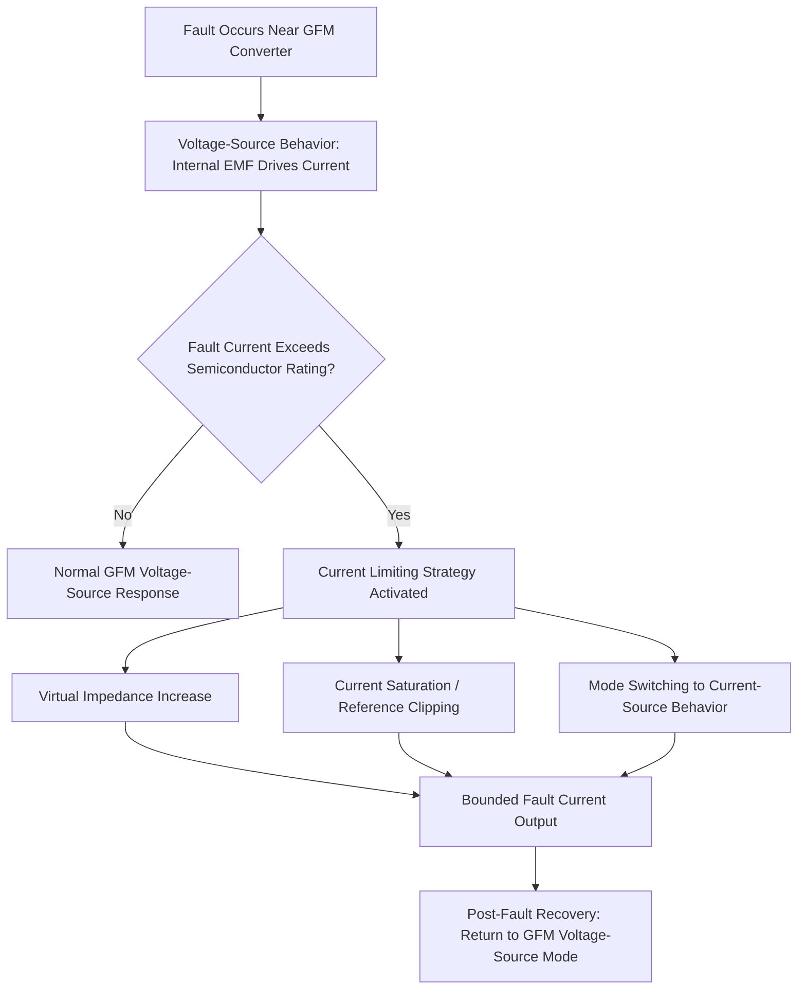

## Fault Current Limiting and Virtual Impedance Control

### The Fault Current Limiting Problem in Inverter-Based Resources

Power semiconductor devices (IGBTs, SiC/GaN MOSFETs) used in grid-tied converters have thermal and instantaneous current ratings dramatically lower than the fault current a synchronous generator of equivalent MW rating would naturally supply. A typical utility-scale inverter can withstand only 1.1–2.0 per-unit current for tens of milliseconds to a few seconds before risking device damage, compared to synchronous machines that can sustain 5–8 p.u. subtransient fault current. This fundamental hardware constraint means every grid-connected inverter — regardless of grid-following (GFL) or grid-forming (GFM) control type — must actively limit its fault current response, and the method used to do so materially affects protection coordination, fault ride-through compliance, and multi-inverter stability.

### Why Grid-Forming Converters Need Explicit Current Limiting

Grid-following converters are inherently current-source controlled, so limiting peak current is a relatively direct saturation of the current reference. Grid-forming converters, by contrast, behave as voltage sources behind an impedance — their natural (unconstrained) response to a nearby fault is to attempt to deliver whatever current the fault impedance and the converter's internal voltage magnitude dictate, exactly as a synchronous machine would. Without added current-limiting logic, this voltage-source behavior would drive the converter well beyond safe semiconductor ratings during a close-in fault.

### Current Limiting Strategy 1: Virtual Impedance Control

**Principle**

Virtual impedance control inserts a software-computed impedance term into the voltage reference calculation, effectively increasing the converter's apparent output impedance during high-current conditions without adding any physical hardware. The control law modifies the voltage reference as:

$$V_{ref} = E_{internal} - Z_{virtual} \cdot I_{measured}$$

Where $E_{internal}$ is the voltage the power/frequency droop or VSM control law would otherwise command, and $Z_{virtual}$ is a dynamically adjustable virtual impedance (resistive, inductive, or a combination) that increases as measured current approaches the rating limit.

**Adaptive virtual impedance**

Rather than a fixed value, $Z_{virtual}$ is typically scheduled as a function of current magnitude:

$$Z_{virtual}(I) = Z_{v,min} + k \cdot \max(0, |I| - I_{threshold})$$

This keeps virtual impedance near zero during normal operation (preserving the converter's intended low-impedance, stiff-voltage grid-forming behavior) while sharply increasing it once current approaches the semiconductor limit, effectively "backing off" the voltage-source characteristic exactly when needed.

**Advantages**

- Preserves voltage-source (grid-forming) characteristics during normal and moderately disturbed conditions
- Smooth, continuous transition into current limiting avoids abrupt control-mode switching transients
- Can be tuned to maintain some degree of fault current contribution useful for protection coordination, rather than fully suppressing it

**Disadvantages**

- Introduces a nonlinear, current-dependent impedance that complicates small-signal stability analysis
- If poorly tuned, can interact adversely with other nearby GFM or GFL converters sharing the same weak network area
- Response speed is bounded by control-loop bandwidth, which may not be fast enough for the very first cycles of a severe close-in fault

### Current Limiting Strategy 2: Current Saturation / Reference Clipping

**Principle**

The simpler and more common approach in practice: the current reference computed by the outer control loop (droop/VSM law) is directly clipped to a maximum magnitude before being passed to the inner current controller, using a saturation function:

$$I_{ref,limited} = I_{ref} \cdot \min\left(1, \frac{I_{max}}{|I_{ref}|}\right)$$

This is often implemented per-phase or in the dq-frame with independent limits on active and reactive current components, frequently combined with the sequence-based prioritization discussed in negative-sequence current control (allocating limited current budget among positive-sequence active, positive-sequence reactive, and negative-sequence components).

**Advantages**

- Computationally simple, fast, and deterministic — critical for protecting semiconductors within the first few milliseconds of a fault
- Well-understood from decades of grid-following converter design experience
- Straightforward to integrate with grid-code-mandated reactive current prioritization (e.g., IEEE 2800-2022 ride-through requirements)

**Disadvantages**

- Abrupt transition from voltage-source to effectively current-source behavior during saturation, which can cause the converter to temporarily lose its grid-forming voltage reference exactly when neighboring equipment (relays, other converters) most needs a stable reference
- Can create synchronization challenges if multiple GFM units in the same microgrid or islanded system saturate simultaneously, since none retains authoritative voltage-source behavior during that interval
- May undersupply the negative- or positive-sequence fault current that protection schemes are counting on, if the clipping logic is not carefully coordinated with protection studies

### Hybrid and Advanced Approaches

**Virtual impedance with current saturation backstop**

Most commercial GFM implementations combine both strategies: virtual impedance provides smooth, continuous current shaping for moderate disturbances, while a hard current-saturation limit acts as a final backstop guaranteeing semiconductor protection even if virtual impedance alone is insufficient for a severe close-in fault.

**Mode-switching (dual-mode) control**

Some designs explicitly switch the converter from voltage-source (GFM) mode to current-source (GFL-like) mode upon detecting a fault beyond a threshold severity, then switch back to GFM mode once the fault clears and current returns within limits. This trades a discrete transition event for guaranteed protection but requires careful design of the transition logic to avoid oscillatory mode-chattering near the threshold.

**Model predictive current limiting**

[Inference: an active area of academic and early commercial research] — some emerging designs apply model predictive control (MPC) to directly optimize the current trajectory during fault transients, respecting both the semiconductor current limit and grid-code ride-through requirements as explicit constraints, rather than using a fixed droop-based virtual impedance schedule.

### Interaction With Fault Ride-Through and Protection Requirements

- **Reactive current priority**: Ride-through standards such as IEEE 2800-2022 mandate a minimum reactive current injection proportional to voltage dip depth; current-limiting logic must allocate the constrained current budget to satisfy this requirement before allocating remaining headroom to active power or negative-sequence current
- **Negative-sequence coordination**: as covered in negative-sequence current control, current-limiting strategy directly determines how much sequence-component current headroom remains available for protection-supporting negative-sequence injection
- **Protection blinding risk**: if virtual impedance or saturation logic suppresses fault current too aggressively, downstream overcurrent and distance relays calibrated assuming synchronous-machine-like fault current levels may fail to detect or correctly locate faults — a widely cited concern in IBR-dominant feeder and transmission protection studies

### Worked Example — Virtual Impedance Sizing

A 100 MVA GFM battery inverter has a maximum instantaneous current rating of $I_{max} = 1.2$ p.u. Under normal conditions its internal control targets a near-zero effective output impedance ($Z_{v,min} \approx 0.02$ p.u.) to maintain stiff voltage regulation. During a nearby fault, measured current would (unconstrained) reach 3.5 p.u. Applying an adaptive virtual impedance with gain $k = 0.5$ p.u. impedance per p.u. overcurrent above a threshold $I_{threshold} = 1.0$ p.u.:

$$Z_{virtual} = 0.02 + 0.5 \times (3.5 - 1.0) = 0.02 + 1.25 = 1.27 \text{ p.u.}$$

This substantially raises the effective output impedance, which — combined with the network's fault impedance — reduces the actual fault current delivered toward the 1.2 p.u. rating. A hard saturation limit at 1.2 p.u. would still be retained as a backstop in case the virtual impedance response is not fast enough within the first fault cycle. [Inference: this is an illustrative simplified calculation; production controllers use more sophisticated, often nonlinear or piecewise gain schedules validated through EMT simulation and hardware-in-the-loop testing.]

### Testing and Validation Practices

- **Electromagnetic transient (EMT) simulation**: required to validate current-limiting behavior at the sub-cycle timescale that RMS/phasor models cannot capture
- **Hardware-in-the-loop (HIL) testing**: increasingly used by manufacturers and independent test labs to validate actual converter firmware current-limiting response against grid-code ride-through curves before field deployment
- **Type testing under IEEE P2800.2**: the companion test and verification recommended practice to IEEE 2800-2022 is expected to formalize standardized test procedures for fault-current-limiting compliance verification as the standard matures

### Key Points

- All grid-connected inverters must actively limit fault current due to semiconductor thermal/instantaneous ratings far below synchronous machine fault current capability
- Grid-forming converters face a distinct challenge because their natural voltage-source behavior would otherwise attempt to deliver excessive fault current, unlike inherently current-limited grid-following converters
- Virtual impedance control provides smooth, continuous current shaping that preserves voltage-source characteristics longer into a disturbance, while current saturation/clipping provides a fast, deterministic hard limit
- Most practical implementations combine both approaches, with virtual impedance as the primary shaping mechanism and saturation as a guaranteed backstop
- Current-limiting strategy directly affects protection coordination and ride-through compliance; behavior during severe faults should be validated via EMT simulation and hardware-in-the-loop testing rather than assumed from steady-state analysis alone

**Related Topics**

- Grid-Following versus Grid-Forming Inverter Control
- Negative-Sequence Current Control During Asymmetrical Faults
- Short-Circuit Strength in IBR-Dominant Systems
- IEEE Std 2800-2022 Interconnection Requirements
- Electromagnetic Transient (EMT) Modeling for IBR Fault Studies
- Protection Coordination in High-IBR-Penetration Networks
- Virtual Synchronous Machine (VSM) Parameter Tuning