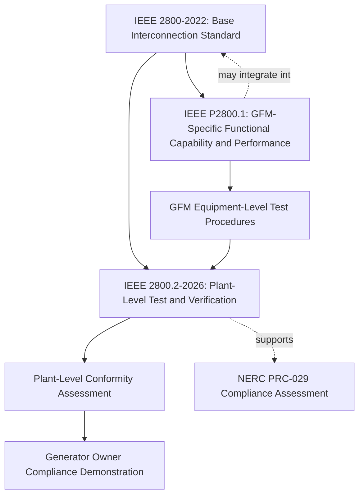
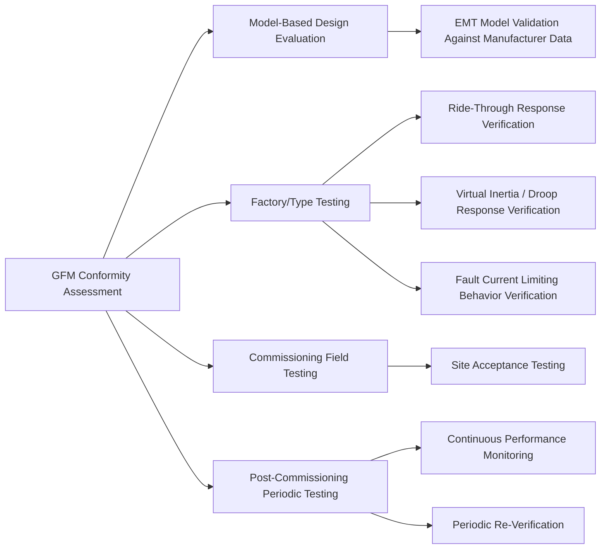

## Grid-Forming Inverter Test and Verification Procedures

### Standards Landscape Overview

Grid-forming (GFM) inverter conformity assessment sits within the broader IEEE 2800.x standards suite, which is actively evolving as GFM technology transitions from pilot deployments to mainstream specification. As of the current standards landscape, three interrelated documents govern this space:

- **IEEE 2800-2022**: the base interconnection and interoperability standard establishing minimum technical requirements for all IBRs (grid-following and grid-forming)
- **IEEE 2800.2-2026**: a Recommended Practice for Test and Verification Procedures for IBRs Interconnecting with Bulk Power Systems, approved and published in spring 2026, providing recommendations for IBR plant Conformity Assessment and possibly supporting, if not at least complementing, compliance assessment of North American Generator Owners with new NERC reliability standards like PRC-029
- **IEEE P2800.1** (in development): a forthcoming Recommended Practice for Functional Capabilities and Performance of Grid Forming Equipment in Inverter-Based Resources (IBRs)/Converter-Based Resources (CBRs), which will specify technical minimum functional and performance capabilities of grid-forming inverter-based resource equipment, including associated performance verification test procedures and criteria

### Scope of IEEE 2800.2 (Test and Verification Practice)

IEEE 2800.2 establishes a framework recommending technical minimum functional capability and performance requirements as well as model-based test procedures and test criteria for grid-forming equipment used in inverter/converter-based resource (IBR/CBR) plants. It applies to IBRs/CBRs of any scale that are connected to and operate in parallel with electric power systems, though grid-forming equipment that does not interface with the power system via power electronics is explicitly excluded from scope.

Importantly, the practice specifies capabilities and performance requirements; actual utilization of these capabilities in any given application is outside of the scope of this standard — meaning the test practice verifies that a GFM converter *can* perform certain functions, not that a given interconnection agreement *requires* those functions to be actively enabled. This amendment applies modifications to IEEE 2800-2022 to help reduce potential technical barriers to IBRs/CBRs containing grid-forming equipment where justified considering power system reliability and security needs.

### Conformity Assessment Framework Structure

This document defines recommended practices for conformity assessment procedures that should be used to verify plant-level conformity with IEEE Std 2800 for IBR plants interconnecting with a bulk power system. The document applies to IBRs in transmission and sub-transmission systems, and may also apply to isolated IBRs interconnected via dedicated voltage-source-converter HVDC (VSC-HVDC) transmission facilities, e.g., offshore wind farms.

The practice complements the IEEE 2800 test and verification framework with specifications for the equipment, conditions, tests, modeling methods, and other conformity assessment procedures that should be used to demonstrate conformance with IEEE 2800 technical minimum requirements for interconnection, capability, and performance of applicable IBRs.

### Test Verification Categories

Based on the underlying IEEE 2800-2022 requirement structure that 2800.2 verifies, conformity assessment for GFM equipment spans several functional test domains:

**Model-based design evaluation**

Since many GFM capabilities operate on very fast electromagnetic timescales, evaluation methodology distinguishes between what can be tested via type/factory tests versus what must be validated purely through modeling: some of the capability or performance requirements that aren't explicitly modeled may be monitored (e.g., phase angle jump, ROCOF) while others act on very fast time scales that may be modeled in design evaluation but not standard positive sequence models. This reflects a core technical challenge — GFM behavior during sub-cycle transients (virtual impedance activation, current-limiting engagement) is often only observable through electromagnetic transient (EMT) simulation rather than steady-state or RMS/phasor modeling.

**Post-commissioning monitoring and periodic testing**

The conformity framework extends beyond initial commissioning: additional considerations are included such as post-commissioning monitoring, and periodic tests and verifications, recognizing that firmware updates, component replacements, or control retuning over a plant's operating life can alter conformance status established at initial interconnection.

### Working Group Structure and Governance

The standard is developed under the Inverter-Based Resources Interconnection Working Group (IBRI-WG) — renamed from the IEEE P2800.2 Working Group in August 2025 — operating under EPRI's (referenced in source material as "EDPG's") Wind and Solar Power Plant Interconnection and Design Subcommittee (WSPPID-SC), itself under the IEEE PES Transmission Subcommittee. [Unverified: the exact parent-organization acronym expansion should be confirmed against current IEEE PES working group documentation, as working group names and reporting structures have been actively reorganized during this standard's development.]

Plant-level GFM requirements may be considered for integration into the revision of IEEE 2800 that is ongoing concurrently under the same working group, and assessing GFM performance at plant-level may require further changes to IEEE 2800.2 — indicating this is an actively moving target rather than a finalized, static framework.

### Relationship to NERC Reliability Standards

IEEE 2800.2-2026 is positioned as supporting, if not at least complementing, compliance assessment of North American Generator Owners with new NERC reliability standards like PRC-029. [Unverified: PRC-029's scope, effective date, and final requirements should be verified against current NERC standard development documentation, as this reflects an evolving regulatory process running in parallel with the IEEE standards effort.] The conformance assessment process itself remains under active development, with active working group IEEE P2800.2 leading the way in defining the detailed test procedures.

### Practical Conformity Assessment Workflow (Synthesized from Standard Development Materials)

Drawing on the documented ERCOT IBR Performance Taskforce presentation on "The 2800 Conformity Assessment Paradigm," the general conformity assessment sequence for a GFM plant follows this pattern:

1. **Pre-interconnection design review**: generator owner submits GFM equipment specifications and manufacturer type-test data against IEEE 2800/2800.2 minimum functional requirements
2. **Dynamic model submission and validation**: EMT and positive-sequence RMS models submitted for the specific GFM control implementation, validated against manufacturer factory type-test records where available
3. **Site-specific study integration**: the validated GFM model is incorporated into interconnection-wide stability studies (including weak-grid/SCR screening as discussed in short-circuit strength assessment)
4. **Commissioning-stage field verification**: site acceptance tests confirm as-commissioned behavior matches the studied and modeled performance, within a defined tolerance
5. **Post-commissioning monitoring**: ongoing telemetry-based verification (per IEEE 2800-2022's monitoring/communication requirements) supports periodic re-verification of continued conformance
6. **Change management triggers**: firmware updates or control parameter changes to deployed GFM equipment may trigger re-verification obligations, given the standard's recognition of periodic tests and verifications as an ongoing requirement rather than a one-time commissioning event

[Inference: this workflow synthesizes the general conformity assessment paradigm described in available working-group materials; the finalized IEEE 2800.2-2026 document should be consulted directly for the authoritative, detailed procedural steps, test tolerances, and documentation requirements.]

### Industry Coordination and Implementation Support

The DOE-facilitated i2X FIRST forum (Forum for the Implementation of Reliability Standards for [IBRs]) has served as an industry coordination venue specifically covering IEEE 2800-2022 adoption and the upcoming IEEE P2800.2 recommended practices, with topics including IBR ride-through, modeling, monitoring, frequency and voltage support, and evolving technologies like grid forming inverters. This reflects the broader reality that test and verification procedures for GFM equipment are being developed concurrently with, rather than strictly following, the base interconnection standard — utilities and developers engaging with GFM projects during this period should expect evolving guidance rather than a fully settled procedural framework.

### Key Points

- GFM test and verification procedures are governed by an actively evolving suite: IEEE 2800-2022 (base requirements), IEEE 2800.2-2026 (plant-level conformity assessment), and the forthcoming IEEE P2800.1 (GFM-specific functional/performance requirements)
- The framework specifies GFM capabilities and test criteria but does not itself mandate that all capabilities be actively utilized in every interconnection — utilization requirements are set by the interconnecting authority
- Some GFM performance characteristics (e.g., phase angle jump response, ROCOF behavior) act on timescales that may only be verifiable through modeling/EMT simulation rather than standard field or factory tests
- Conformity assessment extends beyond commissioning to include post-commissioning monitoring and periodic re-verification
- This standards area is under active, concurrent development across multiple working documents; project teams should verify current document status and version before treating any specific procedural detail as final or binding

**Related Topics**

- IEEE Std 2800-2022 Interconnection Requirements
- Grid-Following versus Grid-Forming Inverter Control
- Fault Current Limiting and Virtual Impedance Control
- Short-Circuit Strength in IBR-Dominant Systems
- Electromagnetic Transient (EMT) Modeling for IBR Compliance Studies
- NERC PRC-024 and PRC-029 Reliability Standards for IBR Performance
- Virtual Synchronous Machine (VSM) Parameter Tuning