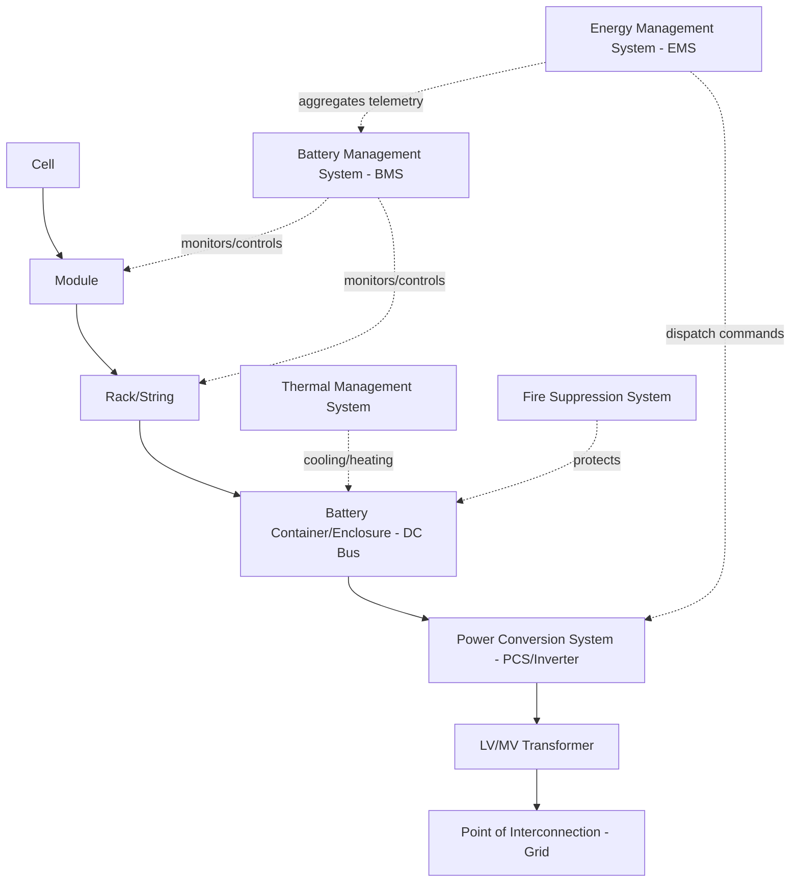

## Battery Energy Storage System Architecture and Chemistries

### System Architecture Overview

A utility-scale Battery Energy Storage System (BESS) is a hierarchical assembly of electrochemical, electrical, thermal, and control subsystems designed to store and dispatch electrical energy on demand. Understanding the architecture from cell to grid interconnection is foundational to sizing, protection, and interconnection engineering.

### Hierarchical Component Breakdown

**Cell**: the fundamental electrochemical unit (e.g., cylindrical 21700 format, prismatic, or pouch cell) producing a nominal voltage (typically 3.2–3.7 V depending on chemistry) and a rated capacity in ampere-hours.

**Module**: cells connected in series and/or parallel (commonly notated as an SxP configuration, e.g., 14S1P) to reach an intermediate voltage and capacity, packaged with local voltage/temperature sensing.

**Rack (String)**: modules connected in series to reach the DC bus voltage target (commonly 600–1500 V DC for utility-scale systems), with a rack-level BMS controller monitoring string current, voltage, and often including a disconnect/fuse.

**Container/Enclosure**: multiple racks connected in parallel within a thermally managed enclosure (HVAC or liquid cooling), forming the DC source feeding one or more Power Conversion Systems (PCS).

**Power Conversion System (PCS)**: the bidirectional inverter converting DC battery power to grid-synchronous AC (or vice versa during charging), incorporating the grid-following or grid-forming control functions discussed in inverter control topics.

### Battery Management System (BMS) Architecture

The BMS is organized in a distributed hierarchy mirroring the physical pack structure:

- **Cell Supervision Circuit (CSC) / Module-level BMS**: measures individual cell voltage and temperature, performs passive or active cell balancing
- **Rack-level BMS (Rack Controller)**: aggregates module data, computes State of Charge (SOC) and State of Health (SOH) estimates for the string, manages rack-level contactors and protection
- **System/Pack-level BMS (Master BMS)**: aggregates rack data, communicates with the PCS and Energy Management System (EMS) via protocols such as Modbus TCP/RTU or CAN bus, enforces system-wide charge/discharge limits

**Core BMS functions**:

- Overvoltage/undervoltage protection at cell, module, and rack levels
- Overcurrent and short-circuit protection
- Overtemperature/undertemperature protection and thermal runaway detection
- Cell balancing (passive resistive bleed or active charge-transfer balancing)
- SOC/SOH estimation via coulomb counting, open-circuit voltage correlation, and increasingly model-based (Kalman filter) estimation techniques
- Insulation resistance monitoring (ground fault detection on the DC bus)

### Battery Chemistries for Grid-Scale Storage

**Lithium Iron Phosphate (LFP, LiFePO4)**

The dominant chemistry for utility-scale stationary storage as of the current market.

- Nominal cell voltage: ~3.2 V
- Advantages: superior thermal stability (higher onset temperature for thermal runaway relative to NMC), excellent cycle life (typically 4,000–8,000+ cycles to 80% capacity depending on depth of discharge and temperature management), lower cost per kWh, no cobalt content (supply chain/ethical sourcing advantage)
- Disadvantages: lower energy density than NMC (meaning larger footprint per MWh), reduced performance at low temperatures without active heating, flatter voltage-SOC curve which can complicate SOC estimation accuracy
- Dominant application: stationary grid storage, where footprint is less constrained than in mobile applications and cycle life/safety are prioritized over energy density

**Nickel Manganese Cobalt (NMC, LiNiMnCoO2)**

- Nominal cell voltage: ~3.6–3.7 V
- Advantages: higher energy density than LFP, better low-temperature performance, well-established manufacturing base (shared with EV supply chains)
- Disadvantages: lower thermal stability threshold than LFP (higher thermal runaway risk profile), shorter cycle life at high depth-of-discharge cycling, cobalt supply chain cost/ethical concerns
- Application trend: historically more common in early grid-scale deployments and remains used in some high-energy-density applications, though LFP has become the dominant chemistry choice for new utility-scale stationary projects in recent years

**Sodium-Ion**

An emerging chemistry gaining commercial traction for stationary storage.

- Advantages: no lithium, cobalt, or nickel dependency (addresses critical mineral supply chain risk), good low-temperature performance, potentially lower raw material cost at scale
- Disadvantages: lower energy density than LFP, less mature manufacturing scale and long-term field performance data
- [Inference/Speculation: sodium-ion is positioned by several manufacturers as a future lower-cost alternative for stationary storage, but its market share and long-term degradation characteristics in utility-scale service remain less established than LFP; current claims regarding cycle life and degradation should be treated as manufacturer-reported until independently verified over multi-year field deployment.]

**Flow Batteries (Vanadium Redox, Zinc-Bromine)**

- Architecture fundamentally differs: energy is stored in liquid electrolyte tanks external to the power-conversion "stack," decoupling power rating (stack size) from energy rating (tank volume)
- Advantages: very long cycle life (minimal degradation from cycling since no solid-state phase changes occur), inherently non-flammable in most formulations, easy capacity scaling by adding electrolyte volume
- Disadvantages: lower round-trip efficiency (typically 65–80% vs. 85–95% for lithium-ion), lower energy density (larger footprint), higher capital cost per kWh in current market conditions, more mechanical complexity (pumps, plumbing)
- Application niche: long-duration storage (4+ hours) applications where cycle life and safety outweigh footprint and efficiency concerns

**Comparative Chemistry Summary**

**Key Points**

- **LFP**: best safety/cycle-life profile, dominant for utility-scale stationary storage, moderate energy density
- **NMC**: higher energy density, historically used in early grid storage and shared EV supply chains, higher thermal runaway risk requiring more robust thermal/fire protection design
- **Sodium-ion**: emerging, addresses critical mineral supply risk, lower energy density, less field-proven at utility scale
- **Flow batteries**: best cycle life and safety for long-duration applications, lower efficiency and higher current cost, decoupled power/energy sizing

### DC Bus Voltage and PCS Interface Architecture

**Centralized architecture**: multiple battery racks connect in parallel to a single high-power PCS (e.g., 2–5 MW per PCS unit), simplifying the AC-side interconnection but creating a larger single point of failure and requiring careful DC bus current sharing among racks.

**String/distributed architecture**: each rack or small group of racks connects to its own smaller DC/DC converter or dedicated PCS channel, improving fault isolation and enabling independent SOC management per string, at higher component count and cost.

$$P_{PCS} = V_{DC,bus} \times I_{DC,max} \times \eta_{PCS}$$

Where $\eta_{PCS}$ (typical utility-scale PCS efficiency 97–99%) represents conversion losses that factor into round-trip efficiency calculations for the overall system.

### Thermal Management Systems

- **Forced-air (HVAC) cooling**: simpler, lower capital cost, adequate for LFP systems in moderate climates but with larger temperature gradients across racks
- **Liquid cooling**: cold plates or immersion cooling circulating coolant directly at the module/rack level, providing tighter temperature uniformity (critical for cycle life and safety margin), increasingly standard in high energy-density installations and larger project scales
- Thermal management directly affects cycle life, since elevated and non-uniform temperatures accelerate capacity fade and increase internal resistance divergence between cells, which in turn stresses the BMS balancing function

### Safety and Fire Protection Architecture

- **Thermal runaway propagation prevention**: physical barriers, spacing, and thermal-fuse/venting design between cells and modules to prevent cascading failure (a design area subject to evolving standards such as UL 9540A test methodology for thermal runaway fire propagation)
- **Gas detection**: off-gas sensors (detecting hydrogen, carbon monoxide, or specific electrolyte decomposition byproducts) providing early warning before visible smoke or fire
- **Suppression systems**: clean agent suppression (e.g., aerosol or fluorinated ketone systems) or, in some designs, deliberate deflagration venting architecture designed to direct gas release safely rather than suppress it entirely, reflecting an industry recognition that lithium-ion thermal runaway can be difficult to fully suppress once initiated
- **Standards context**: NFPA 855 (Standard for the Installation of Stationary Energy Storage Systems) governs siting, spacing, and fire protection design in most U.S. jurisdictions; UL 9540 (system-level safety) and UL 9540A (thermal runaway fire propagation test method) are the primary equipment safety and testing standards referenced in permitting and interconnection

### Energy Management System (EMS) Integration

The EMS sits above the BMS/PCS layer, translating grid-level dispatch signals (from the system operator, market clearing, or a plant controller) into charge/discharge commands while respecting BMS-reported SOC, SOH, and thermal constraints. This is the layer where market participation logic (energy arbitrage, ancillary services bidding, capacity commitments) interfaces with the physical asset's real-time operating limits.

### Worked Example — Sizing a BESS DC Bus

A 20 MW / 80 MWh (4-hour duration) LFP BESS project targets a DC bus voltage of 1500 V. Using an LFP module with nominal voltage 51.2 V (16S configuration) per module:

$$\text{Modules per string} = \frac{1500 \text{ V}}{51.2 \text{ V}} \approx 29.3 \rightarrow 29 \text{ modules (giving} \approx 1485 \text{ V nominal)}$$

If each module is rated 5.12 kWh, total energy per string:

$$E_{string} = 29 \times 5.12 \text{ kWh} = 148.5 \text{ kWh}$$

Number of parallel strings required for 80 MWh total (before accounting for depth-of-discharge derating and augmentation margin):

$$N_{strings} = \frac{80{,}000 \text{ kWh}}{148.5 \text{ kWh}} \approx 539 \text{ strings}$$

[Inference: actual project sizing includes additional augmentation capacity (to offset projected long-term capacity fade), depth-of-discharge limits protecting cycle life, and auxiliary load allowances — this simplified example omits those design margins for illustrative clarity.]

### Key Points

- BESS architecture is hierarchical: cell → module → rack → container → PCS → grid, with BMS and EMS layers providing protection, estimation, and dispatch coordination respectively
- LFP is the dominant chemistry for utility-scale stationary storage due to its safety and cycle-life advantages, despite lower energy density than NMC
- Chemistry selection directly drives thermal management and fire protection design requirements, since thermal runaway risk profiles differ substantially between LFP, NMC, and flow battery architectures
- Flow batteries offer decoupled power/energy sizing and superior cycle life for long-duration applications at the cost of efficiency and footprint
- DC bus architecture (centralized vs. distributed/string-level) trades off simplicity against fault isolation and per-string SOC management granularity

**Related Topics**

- Battery Energy Storage System Sizing and Dispatch Optimization
- Round-Trip Efficiency and Degradation Modeling for BESS
- NFPA 855 and UL 9540A Fire Safety Compliance for Stationary Storage
- Grid-Forming Battery Inverter Control (BESS as Grid-Forming Resource)
- State of Charge and State of Health Estimation Techniques
- Ancillary Services Market Participation for BESS Assets
- Long-Duration Energy Storage Technologies (Flow, Thermal, Mechanical)