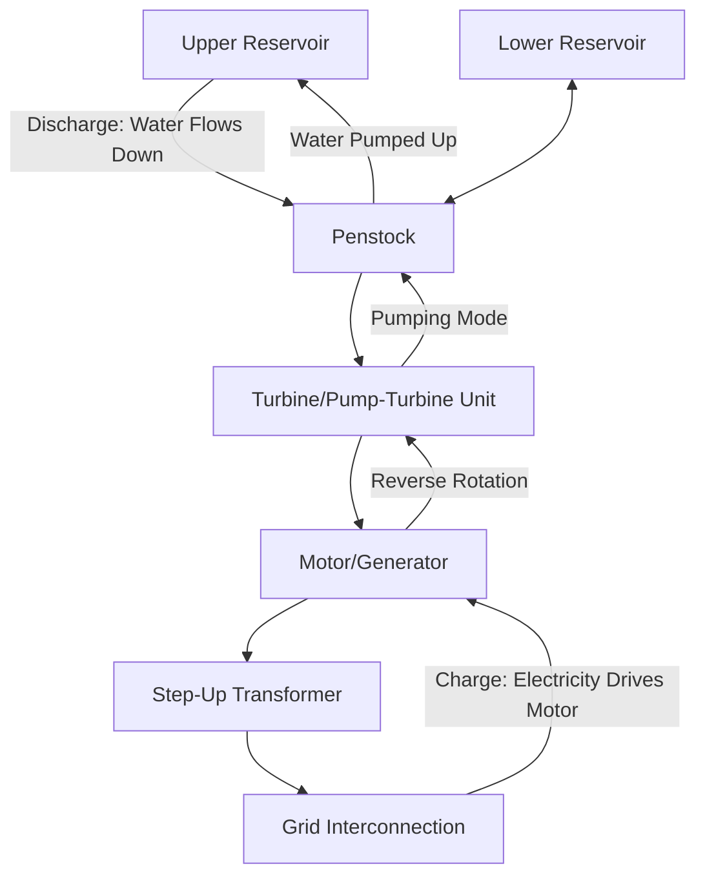
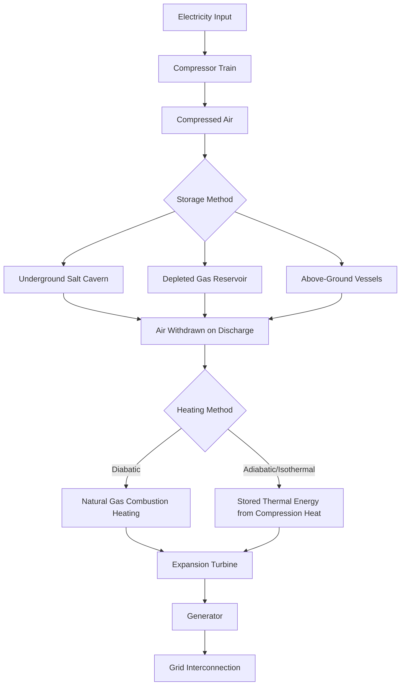

## Pumped Hydro and Mechanical Storage Technologies

### Overview

Mechanical energy storage technologies store electrical energy by converting it into gravitational potential energy, kinetic energy, or compressed gas potential energy, then reversing the conversion to return electricity to the grid on demand. Unlike electrochemical batteries, these technologies are generally characterized by very long asset lifetimes (decades), long duration capability (hours to multi-day), and minimal chemical degradation over cycling — trading these advantages against siting constraints, capital intensity, and geographic dependency.

### Pumped Hydro Energy Storage (PHES)

**Operating principle**

Pumped hydro is the dominant grid-scale storage technology globally by installed capacity. It uses two water reservoirs at different elevations: during periods of surplus or low-cost electricity, water is pumped from the lower reservoir to the upper reservoir; during periods of high demand or high price, water is released downhill through turbines to generate electricity.

**Energy storage capacity**

$$E = \rho \cdot g \cdot h \cdot V \cdot \eta$$

Where $\rho$ is water density (~1000 kg/m³), $g$ is gravitational acceleration (9.81 m/s²), $h$ is the effective head (elevation difference between reservoirs), $V$ is usable water volume, and $\eta$ is the round-trip efficiency of the pump-turbine and electrical conversion chain.

**Round-trip efficiency**: typically 70–85% for conventional PHES, among the highest of any long-duration storage technology, though efficiency depends on head height, turbine/pump design, and pipeline (penstock) friction losses.

**Configuration types**:

- **Conventional (open-loop)**: connected to a natural flowing river or water body, with environmental permitting complexity related to river ecology and downstream flow impacts
- **Closed-loop (off-river)**: uses two constructed reservoirs not connected to a continuously flowing natural water body, reducing environmental and hydrological permitting complexity relative to open-loop systems
- **Seawater pumped hydro**: uses the ocean as the lower reservoir with an upper reservoir at elevation near the coast; deployed in limited installations (e.g., Okinawa, Japan) where suitable elevation exists near a coastline

**Variable-speed pump-turbines**

Modern PHES increasingly uses variable-speed (doubly-fed induction machine or full-converter) pump-turbine units rather than fixed-speed synchronous machines, enabling:

- Continuous active power regulation in pumping mode (fixed-speed units can typically only pump at a fixed power level)
- Improved hydraulic efficiency across a wider operating range
- Enhanced ancillary service provision (frequency regulation in both generating and pumping modes)

**Advantages**:

- Very long asset life (50–100 years for civil infrastructure, with electromechanical equipment refurbishment cycles)
- High round-trip efficiency relative to other long-duration options
- Mature, well-understood technology with decades of global operating experience
- Can provide black start capability and, with synchronous machines, natural inertia contribution to the grid — a distinguishing advantage over most battery and compressed-air alternatives

**Disadvantages**:

- Highly site-constrained: requires specific topography (sufficient elevation difference, suitable reservoir siting) and water availability
- Long development lead times (often 8–15 years including permitting) and high capital cost
- Environmental and land-use impact, particularly for open-loop configurations affecting river ecosystems
- Limited siting flexibility means new capacity additions cannot be deployed as modularly or rapidly as battery storage

### Compressed Air Energy Storage (CAES)

**Operating principle**

Electricity drives a compressor to store compressed air in an underground geological formation (salt cavern, depleted natural gas reservoir, or aquifer) or above-ground vessels; on discharge, the compressed air is released, heated (traditionally via natural gas combustion, or via stored thermal energy in advanced designs), and expanded through a turbine to generate electricity.

**Configuration types**:

- **Diabatic CAES**: compression heat is vented/wasted, and natural gas combustion reheats the air before expansion (the two commercial legacy plants — Huntorf, Germany and McIntosh, Alabama — use this approach); round-trip efficiency is typically lower (~40–55%) and carries direct fuel consumption/emissions
- **Adiabatic CAES**: compression heat is captured and stored (e.g., in a thermal storage medium) and reused during expansion, eliminating fuel combustion and improving round-trip efficiency (theoretically 60–70%), though with added system complexity for thermal storage integration
- **Isothermal CAES**: compression and expansion are performed as close to isothermally as possible (using heat exchange to minimize temperature rise during compression), an approach pursued by several newer commercial developers to avoid both fuel combustion and complex separate thermal storage
- **Above-ground/tank-based CAES**: used for smaller-scale or non-geologically-suited sites, using engineered pressure vessels rather than underground caverns, trading geological siting constraints for higher per-unit capital cost

**Advantages**:

- Long discharge duration capability, well suited to multi-hour to multi-day storage applications
- Long asset life relative to batteries
- Underground geological storage can achieve large energy capacity at relatively low incremental storage cost once the cavern is developed

**Disadvantages**:

- Traditional diabatic CAES requires natural gas combustion, undermining decarbonization goals and introducing fuel price exposure
- Site-dependent (suitable geological formations for underground storage are geographically limited)
- Lower round-trip efficiency than pumped hydro or lithium-ion batteries in most configurations
- Historically limited deployment scale (only two major diabatic plants operating for decades); newer adiabatic/isothermal designs are earlier in commercial deployment maturity [Inference: commercial track record for advanced CAES variants remains more limited than for pumped hydro, so performance and cost figures from newer developers should be treated with appropriate caution until validated by multi-year operating data.]

### Gravity-Based Mechanical Storage

An emerging category using solid mass rather than water as the working medium for gravitational potential energy storage.

**Operating principle**: electric motors raise solid weights (concrete blocks, composite blocks, or aggregate) using a crane, rail, or shaft/mineshaft mechanism; on discharge, the weights descend, driving generators through the same motor/hoist mechanism in reverse (regenerative braking-style energy recovery).

**Variants**:

- **Tower/crane-based systems**: multi-armed cranes stack and unstack composite blocks around a central tower structure
- **Rail-based systems**: weighted railcars ascend and descend graded rail tracks on hillsides
- **Shaft-based systems**: repurpose disused mine shafts, raising and lowering weighted skips within the vertical shaft

**Advantages**:

- Can be sited more flexibly than pumped hydro (does not require water resources, only elevation change or vertical shaft access)
- No chemical degradation mechanism, implying very long cycle life
- Can repurpose disused mining infrastructure (shaft-based variants), offering an economic transition pathway for former mining regions

**Disadvantages**:

- Considerably less commercial deployment history than pumped hydro or batteries; efficiency and cost figures are largely vendor-reported at current market maturity [Speculation: long-term mechanical wear characteristics (cable, hoist, and structural fatigue over tens of thousands of cycles) are not yet demonstrated at the multi-decade timescale that would allow direct comparison with pumped hydro's established track record.]
- Lower energy density per unit of civil infrastructure than pumped hydro in most proposed designs, given the physical density difference between rock/water and typical mass discharge heights

### Flywheel Energy Storage

Distinct from the long-duration technologies above, flywheels store energy as rotational kinetic energy in a spinning rotor, typically operating in magnetically levitated, vacuum-sealed enclosures to minimize friction losses.

$$E_k = \frac{1}{2} I \omega^2$$

Where $I$ is the rotor's moment of inertia and $\omega$ is angular velocity.

**Application niche**: flywheels are optimized for high power, short-duration (seconds to minutes) applications such as frequency regulation and power quality support, not long-duration energy storage — they are typically deployed in fleets providing fast-ramping regulation services rather than energy arbitrage, given their limited energy-to-power ratio.

**Advantages**: extremely fast response time, very high cycle life (millions of cycles with negligible degradation, since there is no chemical wear mechanism), and no chemical hazard profile

**Disadvantages**: low energy density per unit cost for anything beyond short-duration applications, standby losses from residual friction/windage even in vacuum-sealed, magnetically-levitated designs

### Comparative Technology Summary

**Key Points**

- **Pumped hydro**: highest round-trip efficiency and longest track record among long-duration options; highly site-constrained and capital/lead-time intensive
- **Diabatic CAES**: long duration capability but relies on natural gas combustion, undermining decarbonization value; limited deployment scale historically
- **Adiabatic/isothermal CAES**: addresses the fuel-combustion drawback but has a shorter commercial track record and higher engineering complexity
- **Gravity-based mechanical storage**: flexible siting and no chemical degradation, but limited commercial deployment history relative to pumped hydro
- **Flywheels**: not a long-duration technology; optimized for fast-response, short-duration ancillary services rather than energy arbitrage

### Role in Grid Planning

Mechanical storage technologies are typically evaluated in resource planning alongside batteries for their **duration** characteristics rather than as direct substitutes across all use cases:

- **Short duration (seconds to ~30 min)**: flywheels, some battery applications — frequency regulation, power quality
- **Medium duration (1–8 hours)**: lithium-ion batteries, some CAES configurations — daily arbitrage, capacity/reliability support, duck-curve ramp management (as discussed in curtailment and renewable variability management)
- **Long duration (8+ hours to multi-day)**: pumped hydro, CAES, gravity storage, flow batteries — seasonal or multi-day renewable variability smoothing, resource adequacy in high-renewable systems

This duration-based complementarity means mechanical storage is generally assessed as part of a diversified long-duration energy storage (LDES) portfolio alongside chemical alternatives, rather than as a single universal solution.

### Worked Example — Pumped Hydro Sizing

A proposed closed-loop PHES project has a usable reservoir volume of $2 \times 10^6$ m³ and an effective head of 400 m, with an assumed round-trip efficiency of 80% (applied at the generation stage for this simplified calculation):

$$E = \rho \cdot g \cdot h \cdot V \cdot \eta = 1000 \times 9.81 \times 400 \times (2 \times 10^6) \times 0.80$$

$$E \approx 6.28 \times 10^{12} \text{ J} \approx 1{,}744 \text{ MWh}$$

If the plant is rated at 400 MW generating capacity, this yields an approximate discharge duration of:

$$\text{Duration} = \frac{1{,}744 \text{ MWh}}{400 \text{ MW}} \approx 4.4 \text{ hours}$$

[Inference: this simplified calculation omits penstock friction losses, reservoir drawdown effects on available head, and pump-side efficiency separate from generation-side efficiency; detailed project engineering requires full hydraulic modeling.]

### Conclusion

Mechanical storage technologies — led by pumped hydro's mature, high-efficiency, long-duration capability — remain a core pillar of grid-scale energy storage planning, particularly for multi-hour and multi-day renewable variability management where lithium-ion battery economics become less favorable. Emerging technologies (adiabatic/isothermal CAES, gravity-based storage) aim to extend mechanical storage's siting flexibility and decarbonization profile, but carry less-established commercial track records than pumped hydro's decades of global operating history, and their cost/performance claims should be evaluated against that more limited body of independent field data.

**Next Steps**

- Long-Duration Energy Storage (LDES) Technology Portfolio Comparison
- Battery Energy Storage System Architecture and Chemistries
- Hydraulic and Penstock Design for Pumped Hydro Plants
- Variable-Speed Pump-Turbine Control and Grid Services
- Flywheel Energy Storage for Frequency Regulation Markets
- Curtailment and Renewable Variability Management
- Resource Adequacy Modeling with Long-Duration Storage