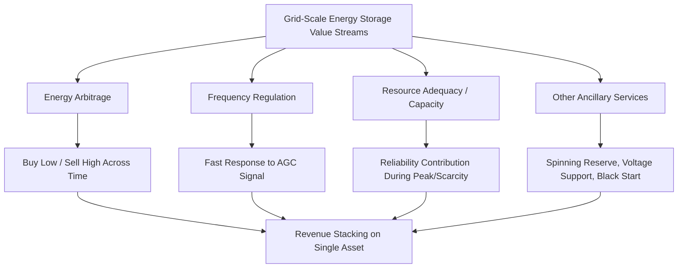
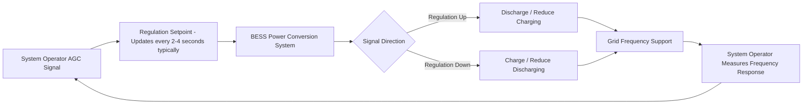

## Storage Applications: Arbitrage, Regulation, and Capacity

### Overview

Grid-scale energy storage generates value across multiple distinct application categories, each with different revenue mechanisms, dispatch behaviors, and technical performance requirements. A single storage asset often "stacks" value across several of these applications simultaneously (revenue stacking), but understanding each application in isolation is essential for sizing, market participation strategy, and technical specification.

### Energy Arbitrage

**Definition**: purchasing (charging) electricity when prices are low and selling (discharging) it when prices are high, capturing the price spread as revenue.

**Mechanics**

The value of arbitrage is driven by the magnitude and frequency of price spreads in the applicable wholesale market (day-ahead and/or real-time), which are themselves increasingly shaped by renewable generation patterns — high solar penetration creates predictable midday price troughs (as discussed in the duck-curve dynamics under curtailment and renewable variability management) and evening price peaks as solar output falls while demand remains elevated.

$$\text{Arbitrage Revenue} = \sum_{t} \left[ P_{discharge}(t) \cdot \pi(t) - \frac{P_{charge}(t) \cdot \pi(t)}{\eta_{RT}} \right]$$

Where $\pi(t)$ is the locational marginal price at time $t$, and $\eta_{RT}$ is round-trip efficiency, which directly discounts arbitrage profitability since more energy must be purchased to charge than is later available to sell.

**Key technical drivers of arbitrage value**:

- **Round-trip efficiency**: higher efficiency chemistries/architectures capture more of the available price spread
- **Duration**: longer-duration storage can capture wider daily price spreads (e.g., charging across an extended midday solar trough) but at higher capital cost per MW
- **Degradation cost allocation**: cycling for arbitrage accelerates battery degradation, so dispatch optimization must weigh marginal arbitrage revenue against the levelized cost of the cycle consumed (often modeled as an implicit "cost of cycling" input to the dispatch algorithm)
- **Forecast accuracy**: arbitrage value realization depends on accurate day-ahead and real-time price forecasting to correctly time charge/discharge decisions; forecast error directly erodes captured value relative to a perfect-foresight benchmark

**Worked example — simple daily arbitrage**

A 50 MW / 200 MWh (4-hour) battery charges during a 4-hour window averaging $20/MWh and discharges during a 4-hour peak window averaging $80/MWh, with round-trip efficiency of 88%:

$$\text{Energy purchased} = \frac{200 \text{ MWh}}{0.88} \approx 227.3 \text{ MWh}$$

$$\text{Daily gross margin} = (200 \times \$80) - (227.3 \times \$20) = \$16{,}000 - \$4{,}545 = \$11{,}455$$

[Inference: this simplified single-cycle example omits degradation cost allocation, non-energy market revenue, and the reality that actual dispatch is typically optimized against sub-hourly real-time price volatility rather than simple fixed-window averages.]

### Frequency Regulation

**Definition**: continuously adjusting output (charge or discharge) in near-real-time response to an Automatic Generation Control (AGC) signal issued by the system operator to maintain the balance between generation and load, keeping system frequency within tight tolerance around nominal (60 Hz in North America, 50 Hz in most other regions).

**Why storage excels at this service**

Batteries can respond to AGC signals within seconds (often sub-second for the initial ramp), far faster than the minutes-scale response of conventional thermal generation ramping. Some ISO markets (e.g., PJM's RegD signal, a fast-response regulation product) were specifically designed to leverage and compensate this fast-response capability at a premium relative to slower conventional regulation resources.

**Technical requirements**:

- Fast ramp rate (near-instantaneous response relative to thermal generation)
- Bidirectional capability (regulation up and regulation down within the same service)
- State-of-charge management: since regulation signals are typically zero-mean over an operating period but not perfectly so, the BESS must maintain adequate SOC headroom in both directions to avoid being unable to respond to the signal — this SOC management logic is a core function of the EMS layer described in BESS architecture
- **Performance-based compensation**: markets such as PJM and CAISO compensate regulation resources based on both capacity (availability) and performance (accuracy of tracking the signal, often scored via a mileage-and-accuracy metric), directly rewarding storage's fast, precise response characteristics relative to slower resources

**Revenue characteristics**: regulation markets typically offer higher per-MW compensation than energy arbitrage on a pure price basis, but total addressable market size (MW of regulation needed system-wide) is much smaller than the energy market, meaning regulation-only strategies face a market-saturation ceiling as more storage capacity enters a given regulation market.

### Resource Adequacy and Capacity Value

**Definition**: the contribution a storage resource makes toward ensuring the system has sufficient generating capacity to reliably meet peak demand, typically compensated through capacity markets or resource adequacy (RA) obligations rather than energy dispatch itself.

**Effective Load Carrying Capability (ELCC)**

Unlike a firm thermal generator whose capacity credit is close to its nameplate rating, a duration-limited storage resource's capacity credit is assessed via ELCC — a statistical measure of how much the resource reduces the probability of a loss-of-load event, accounting for the resource's limited energy duration relative to the length of typical system stress periods.

$$ELCC_{\%} = \frac{\Delta \text{Firm Capacity Equivalent}}{\text{Nameplate Capacity}} \times 100$$

**Key ELCC dynamics for storage**:

- A storage resource's ELCC declines as its penetration increases within a given system, since additional storage increasingly competes to serve the same limited-duration net-load peak (a "diminishing returns" pattern analogous to the ELCC decline discussed for renewable resources in curtailment and renewable variability management)
- Duration is a first-order driver: a 4-hour battery typically achieves substantially higher ELCC than a 1-hour battery in most system studies, since it can cover more of the sustained net-load peak duration, though [Inference: exact ELCC-vs-duration relationships are system-specific, dependent on net-load shape, and require dedicated resource adequacy studies rather than a universal duration-to-ELCC formula]
- As renewable penetration increases and shifts the system's peak net-load risk window (e.g., from afternoon to evening under high solar penetration), storage duration requirements for maintaining high ELCC tend to increase over time, a dynamic several ISOs have documented in evolving resource adequacy studies

**Market mechanisms**:

- **Capacity markets** (e.g., PJM Capacity Market, ISO-NE Forward Capacity Market): storage resources bid into forward capacity auctions, receiving capacity payments based on their qualified capacity value (ELCC-derived) in exchange for a must-offer/availability obligation during system stress events
- **Resource Adequacy programs** (e.g., CAISO's RA framework): load-serving entities procure sufficient qualifying capacity, including storage, to meet planning reserve margin requirements, with storage capacity counted via jurisdiction-specific ELCC or effective capacity methodologies

### Revenue Stacking

Modern BESS economics typically depend on combining multiple value streams within technical and market constraints:

**Key Points**

- **Capacity commitment as the base layer**: a resource may commit its full nameplate capacity to a capacity market obligation, which sets an availability floor but does not preclude other uses outside called events
- **Regulation and arbitrage layered on top**: during normal (non-emergency) hours, the same asset participates in regulation and/or arbitrage, subject to reserving sufficient SOC and power headroom to meet capacity/reliability call obligations if triggered
- **SOC management complexity**: the EMS must continuously solve a constrained optimization balancing current-hour arbitrage/regulation opportunity against maintaining sufficient reserve margin for potential capacity-market dispatch calls or emergency operator instructions
- **Degradation cost allocation across stacked services**: since cycling from regulation and arbitrage both consume battery cycle life, economic dispatch optimization increasingly incorporates a degradation cost term to avoid over-cycling the asset chasing marginal revenue that is smaller than the incremental degradation cost incurred

### Market-Specific Considerations

- **FERC Order 841**: removed barriers to electric storage resource participation in U.S. wholesale capacity, energy, and ancillary services markets, directing RTOs/ISOs to establish market rules recognizing storage's unique physical and operational characteristics (e.g., duration limitations, bidirectional capability) — this order underlies much of the current market access framework storage assets rely on in U.S. organized markets
- **Duration requirements evolving in RA frameworks**: several ISOs (notably CAISO) have moved toward multi-hour minimum duration requirements for full RA credit as net-load peak duration has lengthened with rising solar penetration, directly linking capacity-market storage economics to the duration decisions discussed in BESS architecture and sizing
- [Unverified: specific ELCC values, capacity market clearing prices, and duration-credit rules are jurisdiction- and year-specific, changing with each resource adequacy study cycle; current values should be verified against the applicable ISO's most recent published study rather than treated as fixed figures.]

### Conclusion

Storage value is fundamentally multi-dimensional: arbitrage monetizes time-shifting of energy value, regulation monetizes fast dynamic response precision, and capacity monetizes reliability contribution during scarcity — each governed by different market mechanisms, different technical performance drivers, and different degradation/dispatch trade-offs. Optimal BESS economics in most current markets depend on sophisticated revenue-stacking strategies that dynamically balance these competing uses against a shared, degrading physical asset, making dispatch optimization software and accurate degradation cost modeling as economically important as the underlying hardware specification.

**Related Topics**

- Battery Energy Storage System Architecture and Chemistries
- Battery Energy Storage System Sizing and Dispatch Optimization
- Effective Load Carrying Capability (ELCC) and Capacity Accreditation
- FERC Order 841 and Storage Market Participation Rules
- Curtailment and Renewable Variability Management
- Ancillary Services Market Design for Fast-Response Resources
- Degradation Modeling and Cycle-Life Cost Allocation for BESS