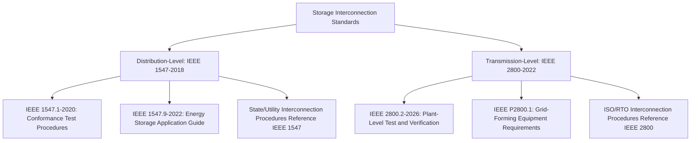
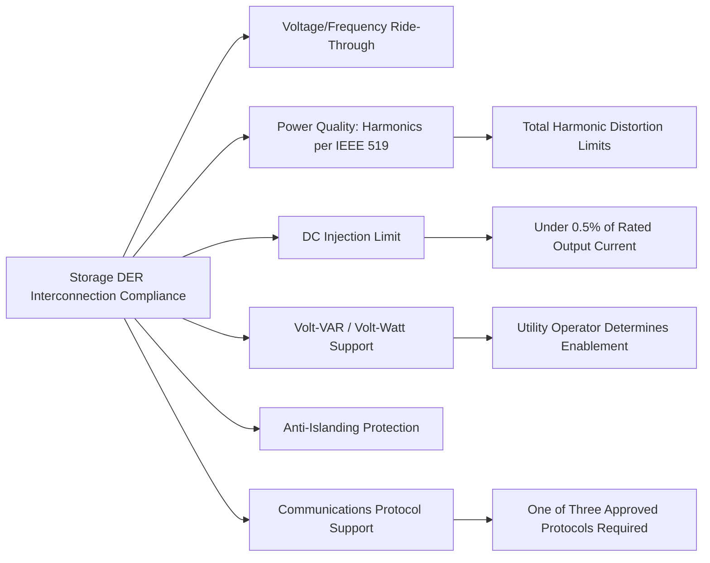

## Storage Interconnection and Interoperability Standards

### Standards Landscape for Storage Interconnection

Energy storage interconnection is governed by a layered set of standards distinguished primarily by voltage level and interconnection point: distribution-connected storage falls under IEEE 1547-2018 and its energy-storage-specific guide (IEEE 1547.9-2022), while transmission-connected utility-scale storage falls under IEEE 2800-2022 (covered in the inverter-based resource interconnection topic). This entry focuses on the distribution-level framework, which governs the large majority of behind-the-meter and community-scale storage interconnections.

### IEEE 1547-2018 Scope and Foundational Role

IEEE 1547-2018, formally "IEEE Standard for Interconnection and Interoperability of Distributed Energy Resources with Associated Electric Power Systems Interfaces," is the foundational U.S. standard for distributed energy resource (DER) interconnection at distribution and sub-transmission voltage. Its scope establishes criteria and requirements for interconnection of distributed energy resources (DER) with electric power systems (EPS), and associated interfaces, and it provides requirements relevant to the performance, operation, testing, safety considerations, and maintenance of the interconnection, including general requirements, response to abnormal conditions, power quality, islanding, and test specifications and requirements for design, production, installation evaluation, commissioning, and periodic tests.

The stated requirements are universally needed for interconnection of DER, including synchronous machines, induction machines, or power inverters/converters, applicable to all DER technologies interconnected to EPSs at typical primary and/or secondary distribution voltages — making it technology-neutral across solar PV, wind, storage, and combined heat and power systems, applying to DERs up to 10 MVA.

**Regulatory adoption context**: the Energy Policy Act (2005) cites and requires consideration of IEEE 1547 Standards and Best Practices for Interconnection, and all states use or cite IEEE Std 1547. On February 12, 2020, NARUC's Board of Directors unanimously approved a resolution recommending state commissions adopt and implement the newly revised IEEE 1547-2018, while granting flexibility for state commissions recognizing the unique procedures, priorities and needs for each state.

### Storage-Specific Provisions Within IEEE 1547-2018

**Operational State of Charge**: the standard defines Operational State of Charge as a term used in IEEE 1547-2018, with the standard's Table 29 addressing operational state of charge across the 0% to 100% range of operational energy storage capacity — recognizing that unlike continuously-fueled DG, storage's ability to respond to grid support functions is inherently bounded by its current charge state.

**Volt-VAR support while charging**: the standard clarifies volt-var support modes while charging, addressing a storage-specific nuance not applicable to generation-only DER: since storage can be actively drawing power from the grid (charging) rather than only injecting it, reactive power support obligations must be explicitly defined for both operating directions.

**Applicability trigger**: critically, the guide's scope includes ES DER that are capable of exporting active power to an EPS — meaning storage systems configured purely for on-site backup or self-consumption without grid export capability fall outside the primary technical requirements in certain respects, though the interconnection evaluation must still confirm this operational boundary. Any energy storage DER that is "capable of active power export" triggers the standard's full applicability.

**Excluded use cases**: energy storage use cases such as self-consumption, backup power, and peak shaving are not addressed by IEEE 1547 directly as distinct functional categories — but these use cases can typically be supported while maintaining export or import limits at the Point of Common Coupling (PCC) in compliance with the interconnection requirements, meaning the interaction between these operational use cases and the PCC's export/import limits must be understood during interconnection evaluation.

### Rule 21 Point of Applicability (RPA) for Storage

The standard's Reference Point of Applicability (RPA) — where its technical requirements are measured and enforced — can be located at the Point of Common Coupling (PCC), the Point of DER Connection (PoC), a point between PCC and PoC, or there could be multiple RPAs for different DER units. For storage, this flexibility matters because a storage system paired with co-located generation (e.g., a solar-plus-storage hybrid) may have its compliance boundary drawn differently depending on whether the storage and generation share a single interconnection point or have distinguishable metering/control boundaries.

### IEEE 1547.9-2022: Energy Storage Application Guide

Because IEEE 1547-2018's base text was drafted with DER interconnection broadly in mind, a dedicated companion guide addresses storage-specific nuances not fully resolved in the base standard: application of IEEE Std 1547-2018 to the interconnection of energy storage distributed energy resources (ES DER) to electric power systems (EPSs) is described in this guide, along with examples of such interconnection and guidance on prudent and technically sound approaches to these interconnections. The guide's scope includes ES DER that are capable of exporting active power to an EPS.

Importantly, IEEE 1547.9-2022 also considers energy storage-related topics that are not currently addressed or fully covered in IEEE Std 1547-2018 and sets a basis for future development of industry best practices for ES DER-specific interconnection requirements that could be considered in future revisions of IEEE Std 1547 — signaling that storage interconnection technical practice continues to mature ahead of the base standard's formal revision cycle.

**Islanding and system restoration guidance**: for intentional islands connecting to an already-energized Area EPS, there is no provision in the base standard for connecting a de-energized part of an Area EPS to an energized intentional island; however, 1547.9 suggests that this kind of assistance with restoration can be allowed, in coordination with the Area EPS operator, with synchronization conditions, adjustments to some parameters, and ensuring ES DER operator awareness of the responsibilities concomitant with participation in system restoration all discussed in the guide — directly relevant to storage's potential role in microgrid restoration and black-start-adjacent applications at the distribution level.

**Recommended performance category**: it is recommended that ES DER comply with Normal Operating Performance Category B, one of the standard's tiered performance categories governing ride-through and response requirements.

### IEEE 1547.1-2020: Conformance Test Procedures

IEEE 1547.1-2020 is the industry standard for "Conformance Test Procedures for Equipment Interconnecting Distributed Energy Resources with Electric Power Systems and Associated Interfaces." Together with the base 1547-2018 standard, these two IEEE standards define advanced functions and three approved communication protocols that DER is required to support if they wish to connect to the grid and export power — the IEEE 1547-2018 standard mandates that DER support at least one (of three approved) communications protocols for that purpose, enabling utility operators to issue advanced grid-support function commands (curtailment, volt-VAR setpoints, etc.) to interconnected storage assets.

### Core Technical Requirements Applicable to Storage

**Power quality**: harmonics must comply with IEEE 519 total harmonic distortion limits to avoid waveform distortion, and DC injection must remain under 0.5% of rated output current — both requirements applying to the storage system's power conversion equipment regardless of the underlying battery chemistry.

**Voltage regulation functions**: DERs, including storage, must have voltage regulation capabilities such as Volt-VAR or Volt-Watt, but utility operators determine whether to enable them — meaning the equipment must be certified capable of these functions, while activation is a site-specific interconnection agreement decision made by the interconnecting utility.

**Cybersecurity**: cybersecurity is of critical importance but out of scope for the core technical requirements of IEEE 1547-2018 itself — it can be addressed through mutual agreement or possible regulatory requirements outside the standard's direct technical scope, reflecting a gap that utilities and regulators typically address through separate interconnection agreement provisions or state-level cybersecurity requirements.

**Inertial response**: for storage systems paired with grid-forming or advanced grid-support control capability, inertial response is defined as the capability for DERs to modulate active power in proportion to the rate of change of frequency (RoCoF) — a mandatory capability for certain performance categories under high-frequency conditions and mandatory for those categories under low-frequency conditions as well, connecting distribution-level storage interconnection requirements to the broader grid-forming and synthetic inertia concepts discussed in transmission-level inverter control topics.

### Interconnection Evaluation Process Considerations for Storage

Given storage's bidirectional power flow capability and duration-limited operation, interconnection evaluations for storage-specific projects typically require attention to:

- **Export limit compliance**: confirming that the PCC-level export limit is respected across the full range of the storage system's charge/discharge operating envelope, not merely at rated discharge power
- **Interaction with co-located generation**: for hybrid solar-plus-storage or wind-plus-storage projects, evaluating whether the storage and generation components share a single aggregate interconnection agreement or require separate technical review, particularly regarding combined export limits and ride-through coordination
- **Charging-mode grid impact**: since storage charging represents a load condition rather than generation, some interconnection procedures require separate technical screening of charging-mode impacts (voltage rise/drop, thermal loading) distinct from discharge-mode generation impacts
- **Multiple Reference Points of Applicability**: as noted above, complex sites may require multiple RPAs for different DER units, requiring careful technical scoping during the interconnection application review

### Relationship to State and Utility Interconnection Procedures (Rule 21 and Equivalents)

IEEE 1547-2018 functions as a technical baseline that individual jurisdictions incorporate into binding interconnection procedures (in California, this incorporation occurs through the CPUC's Rule 21 tariff; other states have analogous processes). The standard itself does not directly regulate interconnection commercially or contractually — that function is performed by the state/utility-level interconnection procedures that reference and incorporate IEEE 1547's technical requirements, with NARUC's 2020 resolution specifically encouraging this alignment across states while preserving jurisdiction-specific flexibility.

### Key Points

- Distribution-connected storage interconnection is governed by IEEE 1547-2018 (base technical requirements), IEEE 1547.1-2020 (conformance testing), and IEEE 1547.9-2022 (storage-specific application guidance), distinct from the transmission-level IEEE 2800-2022 framework
- IEEE 1547-2018 is technology-neutral but includes storage-specific provisions: Operational State of Charge definitions, volt-VAR support while charging, and applicability keyed to active power export capability
- IEEE 1547.9-2022 explicitly acknowledges gaps in the base standard's storage coverage and is positioned to inform future 1547 revisions, indicating this area of standards practice remains actively evolving
- Cybersecurity is explicitly out of scope for the core technical standard, requiring separate contractual or regulatory treatment
- Actual binding interconnection requirements are set by state/utility-level procedures (e.g., Rule 21) that incorporate IEEE 1547 by reference; project-specific compliance should always be verified against the applicable jurisdiction's current interconnection procedures rather than the IEEE standard text alone

**Related Topics**

- IEEE Std 2800-2022 Interconnection Requirements
- Battery Energy Storage System Architecture and Chemistries
- Grid-Forming Inverter Test and Verification Procedures
- Volt-VAR and Volt-Watt Control for Distributed Energy Resources
- Microgrid Islanding and Intentional Island Restoration Procedures
- Storage Applications: Arbitrage, Regulation, and Capacity
- Distribution System Interconnection Studies for High DER Penetration