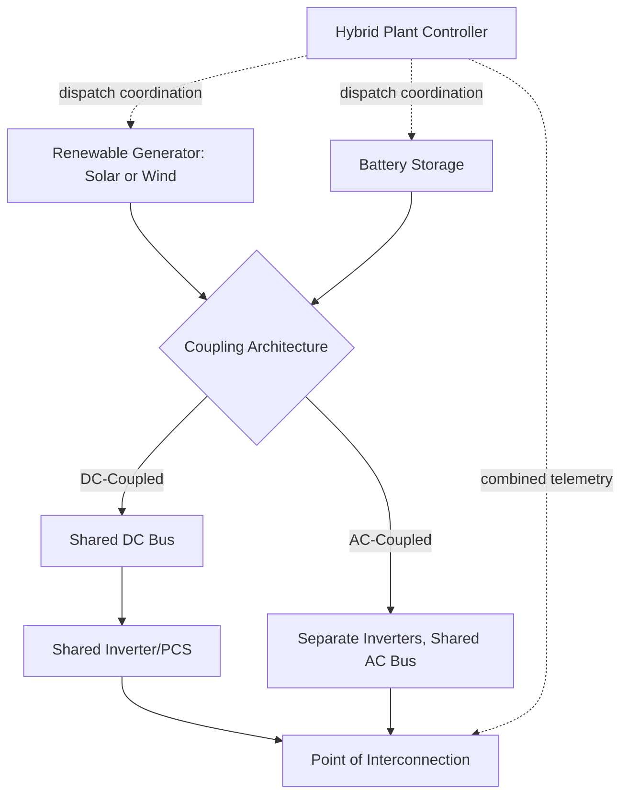
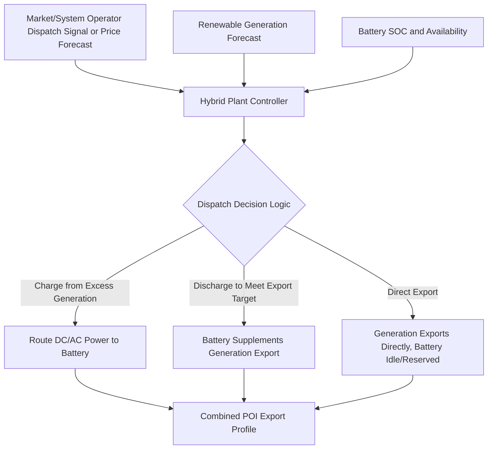

## Hybrid Generation-Storage Resource Design

### Definition and Motivation

A hybrid generation-storage resource combines a variable renewable generator (typically solar PV or wind) with battery storage at a shared point of interconnection (POI), operating under coordinated control as a single dispatchable-capable plant. The design intent is to capture synergies unavailable to standalone resources: smoothing variable output, shifting energy delivery to higher-value periods, improving capacity value (ELCC), and often reducing combined interconnection and land-use costs relative to two separate, independently-sited projects.

### Coupling Architectures

**DC-Coupled Configuration**

The renewable generator and battery storage share a common DC bus, connecting to the grid through a single shared inverter (or shared inverter bank).

- **Advantages**: avoids one full stage of DC-AC-DC conversion when charging storage directly from co-located solar (solar DC output charges the battery without first inverting to AC), improving round-trip efficiency for the "solar-to-storage-to-grid" energy path; potentially lower total equipment cost via shared inverter capacity
- **Disadvantages**: less operational flexibility, since the shared inverter's total capacity is split between generation export and storage charge/discharge in real time, and either subsystem's downtime can more directly affect the other; DC-side protection and short-circuit coordination becomes more complex with multiple DC sources on a shared bus
- **Typical application**: solar-plus-storage projects where the design intent centers on shifting solar production into evening hours, capturing the direct-charge efficiency benefit

**AC-Coupled Configuration**

The renewable generator and battery storage each have independent inverters/PCS units, combined only at the AC collector bus before the shared POI.

- **Advantages**: independent operation and sizing flexibility — the battery can be sized, dispatched, and even retrofitted independently of the generation asset; simpler protection and fault-current coordination since each subsystem has its own inverter with independent control; storage can charge from either the co-located generator or (where permitted) the grid without routing through generation-specific DC infrastructure
- **Disadvantages**: incurs the DC-AC-DC-AC conversion penalty when charging storage from co-located solar (solar DC → AC at solar inverter → AC → DC at battery inverter for charging → AC again at discharge), reducing round-trip efficiency for that specific energy path relative to DC-coupled designs
- **Typical application**: retrofits (adding storage to an existing solar or wind plant), wind-plus-storage projects (given wind's less naturally complementary DC integration), and projects prioritizing operational independence over marginal efficiency gains

### Interconnection Capacity Accounting

A central hybrid plant design decision is how the combined resource's export capability relates to the interconnection agreement's capacity limits:

$$P_{export}(t) \leq P_{POI,limit}$$

**Key configurations**:

- **Inverter Loading Ratio (ILR) / oversizing with storage**: since a solar plant's DC array is often oversized relative to its inverter/POI export limit (to capture more energy during non-peak sun-angle hours, a practice already common in standalone solar), adding storage allows the plant to capture energy that would otherwise be clipped (lost due to exceeding inverter capacity) and shift it to later dispatch, improving overall capacity factor and reducing clipping losses
- **Firm export shaping**: the combined resource can be contracted or dispatched to deliver a smoother, more predictable export profile than the underlying renewable resource alone, valuable both for market participation and for meeting contractual delivery shape requirements in a power purchase agreement (PPA)
- **Charging source restrictions**: as noted in storage interconnection standards, interconnection agreements may restrict storage to charging only from the co-located generator (not the grid), which affects both interconnection capacity accounting and the plant's ability to participate in grid-charging arbitrage strategies

### Worked Example — Clipping Recovery via DC-Coupled Storage

A solar plant has a 150 MW DC array feeding a 100 MW AC inverter/POI limit (an ILR of 1.5). On a clear summer day, DC array output exceeds 100 MW between 10 AM and 3 PM, peaking at 140 MW at solar noon.

$$\text{Clipped energy (without storage)} = \int_{10\text{AM}}^{3\text{PM}} \max(0, P_{DC}(t) - 100\text{ MW}) \, dt$$

If this integral evaluates to approximately 80 MWh of clipped energy on a representative day, a DC-coupled battery sized to absorb this midday excess can charge directly from the otherwise-clipped DC power (avoiding the AC conversion penalty), then discharge that captured energy during the evening peak — converting energy that would have been entirely lost into dispatchable, typically higher-value evening generation. [Inference: actual clipping recovery value depends on site-specific DC/AC ratio, battery power rating relative to the clipped power profile, and battery duration; this example illustrates the mechanism rather than a universal recovery percentage.]

### Plant Controller and Dispatch Coordination

The hybrid plant controller sits above the individual generation and storage EMS/PCS layers, executing the coordinated dispatch strategy:

Core coordination functions:

- **Forecast-informed charge scheduling**: using short-term renewable output forecasting (as discussed in curtailment and renewable variability management) to anticipate periods of excess generation available for charging without curtailment
- **Export shape optimization**: solving a constrained dispatch problem balancing current-period price/value signals, battery SOC constraints, degradation cost, and any contractual delivery shape obligations
- **Curtailment avoidance prioritization**: preferentially routing otherwise-curtailed renewable energy into storage charging before allowing curtailment, directly linking hybrid plant design to the curtailment mitigation strategies discussed in the renewable variability chapter
- **Grid service coordination**: allocating battery capability between hybrid-plant-internal functions (smoothing, shifting) and grid-facing ancillary service obligations (regulation, capacity commitments) as discussed in storage applications

### Technical Study Implications

**Sizing methodology**

Hybrid plant sizing requires joint optimization rather than independent sizing of each component:

- Battery power rating (MW) is typically sized relative to the generation plant's capacity and the targeted export-shaping or clipping-recovery objective, not solely as an independent storage project sizing exercise
- Battery duration (MWh) is sized based on the target evening delivery window length and/or contractual shape requirements, often informed by ELCC considerations (as discussed in storage applications) since duration directly drives the hybrid resource's capacity market credit

**Interconnection and protection studies**

- Combined short-circuit contribution studies must account for both the renewable generator's fault response (per its inverter control type, GFL or GFM) and the battery's fault response, which may differ in control strategy even within the same plant
- Weak-grid/SCR screening (per short-circuit strength in IBR-dominant systems) must consider the combined effective MW rating of the hybrid resource at the shared POI, since CSCR calculations aggregate all inverter-based capacity in the electrical area

### Grid-Forming Hybrid Plant Design

An increasingly important design pattern pairs a grid-forming-capable battery inverter with grid-following renewable generation inverters within the same hybrid plant:

- The GFM battery establishes the voltage/frequency reference for the plant's internal collector system, allowing the GFL solar or wind inverters to synchronize to a stable, plant-internal reference rather than depending entirely on the external grid's voltage stiffness
- This architecture can improve the hybrid plant's weak-grid performance and provide islanding/microgrid capability for the combined resource, extending the grid-forming benefits discussed in grid-following versus grid-forming inverter control to the plant level rather than requiring standalone GFM deployment
- [Inference: specific control coordination requirements between a plant-level GFM reference and multiple GFL generation inverters within the same plant are an active area of control system design and are typically validated through detailed EMT simulation during interconnection studies, rather than governed by a single settled industry-standard architecture at this time.]

### Contractual and Market Design Considerations

- **PPA structuring**: hybrid resource power purchase agreements increasingly specify delivery shape requirements (e.g., a flattened or evening-shifted delivery profile) rather than simple as-generated output, directly monetizing the shaping capability the storage component provides
- **Tax incentive structuring**: in some jurisdictions, storage paired with renewable generation may qualify for different investment tax credit treatment than standalone storage, depending on charging-source restrictions and ownership structure — a rapidly evolving area where [Unverified: specific eligibility rules should be confirmed against current tax authority guidance, as these provisions have been subject to legislative change] applies
- **Capacity market qualification**: as discussed in storage applications, the hybrid resource's combined ELCC-based capacity credit is a key economic driver, often requiring dedicated resource adequacy studies specific to the hybrid configuration rather than simple summation of the individual components' standalone capacity values

### Key Points

- DC-coupled hybrid plants improve round-trip efficiency for direct solar-to-storage charging but reduce operational independence; AC-coupled plants prioritize flexibility and retrofit-friendliness at some efficiency cost
- Storage enables clipping recovery in oversized (high-ILR) solar plants, converting otherwise-lost energy into dispatchable evening generation
- The hybrid plant controller performs coordinated dispatch optimization across forecast-informed charging, export shaping, curtailment avoidance, and grid-service allocation — a materially more complex control problem than either component operating independently
- Grid-forming battery inverters paired with grid-following renewable inverters within a hybrid plant is an emerging design pattern extending GFM benefits to the plant level
- Interconnection capacity accounting, charging-source restrictions, and tax/market qualification rules for hybrid resources vary by jurisdiction and continue to evolve, requiring verification against current local rules for any specific project

**Related Topics**

- Battery Energy Storage System Architecture and Chemistries
- Storage Applications: Arbitrage, Regulation, and Capacity
- Storage Interconnection and Interoperability Standards
- Curtailment and Renewable Variability Management
- Grid-Following versus Grid-Forming Inverter Control
- Effective Load Carrying Capability (ELCC) and Capacity Accreditation
- Inverter Loading Ratio and Solar Plant Clipping Analysis