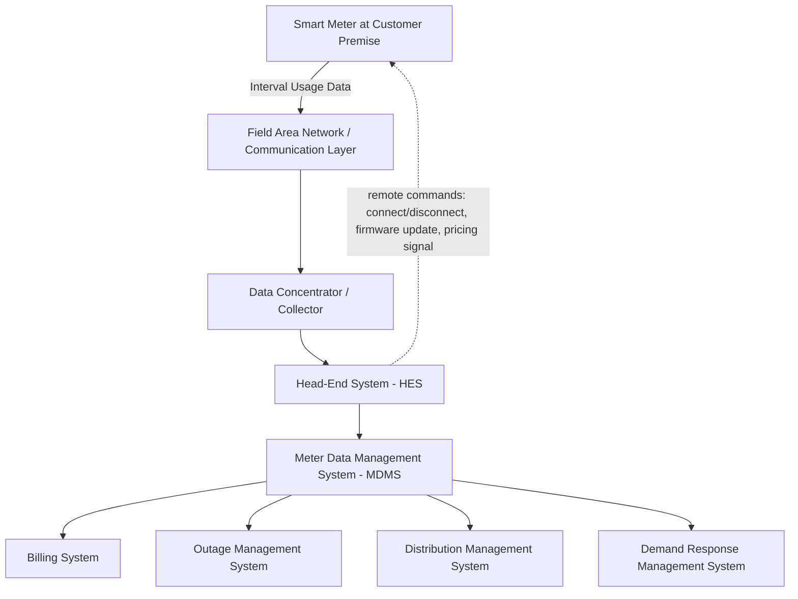

## Advanced Metering Infrastructure (AMI)

### Definition and Scope

Advanced Metering Infrastructure (AMI) is the integrated system of smart meters, two-way communication networks, and data management systems that enables utilities to remotely measure, collect, and analyze energy usage data at high time resolution, and to communicate control signals back to the meter or connected devices. AMI represents a fundamental architectural shift from legacy Automatic Meter Reading (AMR), which supported one-way data collection only, to a bidirectional, near-real-time information and control platform.

### Core Architectural Components

**Smart Meter (Endpoint)**

The customer-premise device measuring energy consumption (and, increasingly, distributed generation export) at defined intervals (typically 15 minutes to 1 hour), with capabilities including:

- Remote connect/disconnect switching (eliminating truck-rolls for service connection/disconnection)
- Power quality event logging (voltage sags, swells, outage timestamps)
- Tamper and reverse-power-flow detection (relevant for distributed generation interconnection monitoring)
- Local Home Area Network (HAN) interface for customer-facing energy management devices

**Communication Network**

The layer connecting meters to utility back-end systems, using one or a combination of:

- **RF Mesh networks**: meters relay data hop-by-hop through neighboring meters to a collector, offering good scalability and resilience without dependency on external telecom infrastructure
- **Power Line Carrier (PLC)**: data transmitted over the existing distribution power lines, avoiding dedicated wireless infrastructure but subject to noise and attenuation challenges on some feeder types
- **Cellular (3G/4G/5G, or LTE-M/NB-IoT for low-bandwidth IoT applications)**: leverages existing telecom carrier infrastructure, reducing utility-owned network buildout but introducing ongoing carrier service cost and dependency
- **Point-to-multipoint RF or licensed spectrum**: used in some utility territories, particularly for lower meter density service areas where mesh networking is less efficient

**Head-End System (HES)**

Software managing the communication network, meter configuration, firmware updates, and command dispatch (e.g., remote disconnect, pricing table updates, demand response signals) to the meter population.

**Meter Data Management System (MDMS)**

The central repository validating, cleansing, and storing interval usage data (a Validation, Estimation, and Editing — VEE — process is applied to identify and correct missing or anomalous readings), then making that data available to downstream systems: billing, outage management, demand response, and distribution planning/analytics applications.

### Data Volume and Management Considerations

AMI deployment represents an order-of-magnitude increase in utility data volume relative to legacy monthly meter reading:

$$\text{Annual interval readings per meter} = \frac{365 \times 24 \times 60}{\Delta t_{interval}}$$

For a 15-minute interval meter: $\frac{525{,}600}{15} = 35{,}040$ readings per meter per year, compared to 12 monthly reads under legacy AMR — a roughly 2,900x increase in raw data points per customer. For a utility with several million meters, this necessitates purpose-built MDMS architecture (often cloud-based or hybrid) with scalable time-series data storage, rather than adapting legacy billing-system databases designed for monthly granularity.

### Applications Enabled by AMI

**Key Points**

- **Time-of-use and dynamic pricing**: interval data enables tariff structures that vary price by time period, supporting demand response and load-shifting incentives that flat monthly billing cannot support
- **Outage detection and restoration**: "last gasp" signals (a meter's brief transmission upon losing power) and "power restored" pings provide near-real-time outage extent and restoration confirmation, reducing reliance on customer phone calls to detect outages and improving Outage Management System (OMS) accuracy
- **Non-technical loss and theft detection**: interval consumption pattern analysis combined with tamper alarms helps identify meter tampering or unauthorized bypass
- **Distributed energy resource (DER) visibility**: reverse power flow detection and interval export data support distribution planning for rooftop solar and other customer-sited generation, complementing the interconnection and hosting-capacity analysis performed at the substation/feeder level
- **Demand response program enablement**: AMI provides the metering foundation (both baseline measurement and event verification) required for demand response programs to settle customer payments accurately
- **Voltage optimization support**: interval voltage readings from meters can feed Conservation Voltage Reduction (CVR) programs, allowing utilities to verify that voltage remains within ANSI C84.1 limits across the feeder while optimizing voltage levels for energy savings
- **Remote connect/disconnect**: reduces the cost and response time for service connection/disconnection for both routine account transitions and, in some jurisdictions, controversial applications such as non-payment disconnection, which has drawn specific regulatory and consumer-protection scrutiny in several jurisdictions [Unverified: specific disconnection practice restrictions vary substantially by state/jurisdiction and are subject to ongoing regulatory proceedings]

### Standards and Protocols

- **ANSI C12.18/C12.19/C12.22**: North American standards governing meter data tables (C12.19), the optical port protocol for local meter communication (C12.18), and the network communication protocol for AMI networks (C12.22)
- **IEC 62056 (DLMS/COSEM)**: the predominant international (particularly European) standard suite for smart meter data exchange, analogous in function to the ANSI C12 suite
- **ZigBee Smart Energy Profile / IEEE 2030.5**: Home Area Network (HAN) protocols enabling the meter to communicate with in-home displays, smart thermostats, and customer energy management systems
- **Multi-Speak**: an interoperability standard commonly used by smaller/cooperative and municipal utilities to integrate AMI data with other utility software systems (billing, GIS, outage management) without requiring a single monolithic vendor platform

### Security Considerations

AMI's bidirectional command capability (particularly remote connect/disconnect and firmware update functions) introduces cybersecurity considerations distinct from legacy one-way AMR systems:

- **Meter-to-HES authentication and encryption**: protecting against unauthorized command injection (e.g., unauthorized mass disconnect commands) requires robust mutual authentication and encrypted communication channels
- **Firmware update integrity**: remote firmware update capability, while operationally valuable, requires cryptographic signing and verification to prevent malicious firmware injection across a large meter fleet
- **Data privacy**: high-resolution interval consumption data can reveal detailed information about customer behavior patterns (occupancy, appliance usage), raising privacy considerations that several jurisdictions address through specific data governance and customer consent requirements for third-party data sharing
- **NERC CIP applicability**: while individual AMI meters are generally not classified as Bulk Electric System (BES) Cyber Assets under NERC Critical Infrastructure Protection standards, the head-end systems and their integration points with utility control center networks require careful security architecture to avoid creating an unintended pathway into more critical operational technology (OT) systems

### Worked Example — Interval Data VEE Impact

A utility deploys AMI across 500,000 meters at 15-minute intervals. If the communication network experiences a 2% daily read failure rate requiring estimation (VEE) rather than actual measurement:

$$\text{Estimated reads per day} = 500{,}000 \times 96 \times 0.02 = 960{,}000 \text{ intervals estimated daily}$$

This substantial estimation volume underscores why VEE algorithm quality (using historical load profiles, weather correlation, and neighboring meter data for estimation) directly affects billing accuracy and downstream analytics reliability at scale — a small per-meter failure rate compounds into a large absolute volume of estimated (non-measured) data across a large meter population. [Inference: actual failure rates vary substantially by network technology, terrain, and meter age; this example illustrates the scaling effect rather than a representative industry-average failure rate.]

### Integration with Broader Grid Modernization

AMI functions as a foundational data layer supporting several other smart grid capabilities:

- **Distribution Management System (DMS) integration**: AMI voltage and loading data supports more granular, near-real-time distribution state estimation than SCADA telemetry alone typically provides at the low-voltage/secondary level
- **Advanced Distribution Management (ADMS) and DER hosting capacity analysis**: interval export data from customer-sited generation informs hosting capacity studies used to screen new distributed generation interconnection requests
- **Grid edge analytics**: some newer AMI deployments incorporate edge computing capability directly at the meter or collector level, performing preliminary anomaly detection or voltage analysis locally before transmitting only summary data upstream, reducing communication network bandwidth requirements

### Conclusion

AMI transforms the metering function from a passive monthly billing input into a foundational, bidirectional grid intelligence and control platform. Its value extends well beyond automated meter reading into demand response enablement, outage management, distribution planning support, and DER visibility — while introducing data management scale challenges and cybersecurity considerations that require dedicated architectural attention distinct from legacy metering system design. The specific technology choices (communication network type, data interval, security architecture) are typically driven by service territory characteristics (density, terrain, existing telecom infrastructure) and should be evaluated against the utility's specific deployment context rather than assumed universal across all territories.

**Related Topics**

- Demand Response Program Design and Dispatch
- Distribution Management Systems (DMS) and Advanced DMS Architecture
- DER Hosting Capacity Analysis
- Time-of-Use and Dynamic Pricing Tariff Design
- NERC Critical Infrastructure Protection (CIP) Standards Overview
- Conservation Voltage Reduction (CVR) and Volt-VAR Optimization
- Outage Management Systems and Fault Location Isolation and Service Restoration (FLISR)