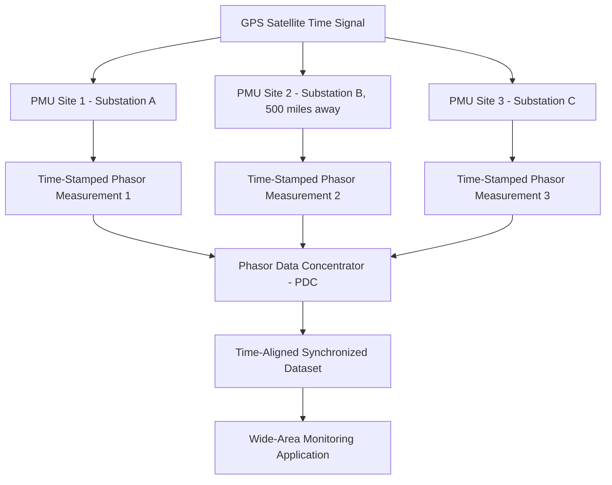
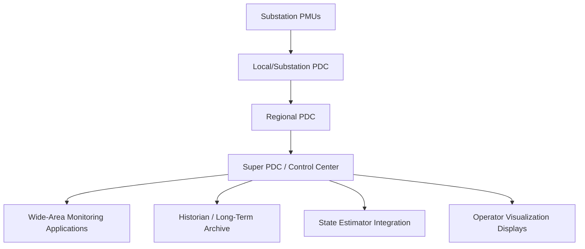

## Phasor Measurement Units and Wide-Area Monitoring Systems

### Definition and Fundamental Principle

A Phasor Measurement Unit (PMU) is a device that measures the voltage and current phasors (magnitude and phase angle) at a point on the power system, time-synchronized to a common time reference via GPS (or another satellite time source), enabling direct comparison of measurements taken simultaneously across geographically distant locations. This synchronization is the defining feature distinguishing PMU-based measurement from conventional SCADA telemetry, which lacks the time precision needed to compare phase angles meaningfully across a wide area.

$$\bar{X} = X_m \angle \theta = X_m(\cos\theta + j\sin\theta)$$

Where $\bar{X}$ is the synchrophasor representing either voltage or current, $X_m$ is the RMS magnitude, and $\theta$ is the phase angle referenced to a common absolute time standard (typically UTC via GPS).

### Why Time Synchronization Matters

Conventional SCADA systems report data on a Remote Terminal Unit (RTU) polling cycle of seconds to tens of seconds, with no guarantee that measurements from different substations were captured at the same instant. PMUs report at 30–60 samples per second (in North America; 25–50 in 50 Hz systems), each stamped with a GPS-derived timestamp accurate typically to within 1 microsecond, per the IEEE C37.118 standard. This allows the phase angle difference between two widely separated buses to be directly and meaningfully compared — a measurement that is physically meaningless without precise common-time referencing, since phase angle is inherently a relative, time-dependent quantity.

### Why Phase Angle Difference Matters for Grid Operations

The phase angle difference between two buses is directly related to the real power flow between them:

$$P_{12} \approx \frac{V_1 V_2}{X_{12}} \sin(\theta_1 - \theta_2)$$

Where $V_1, V_2$ are voltage magnitudes at buses 1 and 2, $X_{12}$ is the reactance of the connecting path, and $\theta_1 - \theta_2$ is the phase angle difference. Monitoring this angle difference in real time provides direct visibility into transmission line loading and system stress that is not as readily apparent from voltage magnitude and power flow measurements alone — a widening or oscillating angle difference is a classic early indicator of approaching angular (transient) instability.

### PMU Hardware and Measurement Architecture

**Core measurement chain**:

- **Instrument transformers**: voltage transformers (VTs/CVTs) and current transformers (CTs) step down high-voltage/high-current signals to measurable levels, as in conventional protection and metering
- **Analog-to-digital conversion**: high-speed sampling (typically several kHz sampling rate internally, decimated to the reported 30–60 samples/second phasor output rate)
- **Phasor estimation algorithm**: applies signal processing (commonly a Discrete Fourier Transform-based approach) to extract the fundamental frequency phasor magnitude and angle from the sampled waveform
- **GPS time receiver**: provides the absolute time reference for timestamping each phasor estimate, typically synchronized to within 1 microsecond per IEEE C37.118 accuracy requirements, corresponding to a phase angle error of approximately 0.022° at 60 Hz [Inference: this angle-error correspondence is a direct trigonometric consequence of the timing accuracy specification and 60 Hz fundamental frequency, not itself an independently stated requirement of the standard]
- **Communication interface**: transmits time-stamped phasor data continuously via the IEEE C37.118.2 communication protocol to a Phasor Data Concentrator

### Phasor Data Concentrator (PDC) Architecture

PDCs are organized hierarchically:

- **Local/substation PDC**: aggregates multiple PMU streams within a single substation
- **Regional PDC**: aggregates data across multiple substations within a utility or balancing authority
- **Super/central PDC**: aggregates across multiple regional PDCs, often at an ISO/RTO or interconnection-wide level, providing the data foundation for wide-area situational awareness spanning multiple utility footprints

PDCs perform time-alignment (buffering and matching timestamps across streams arriving with different latencies), data quality flagging, and often basic redundancy/failover functions to maintain continuous data availability for downstream applications.

### Wide-Area Monitoring System (WAMS) Applications

**Key Points**

- **Oscillation detection and damping monitoring**: PMU data enables real-time identification of inter-area oscillation modes (low-frequency power swings between regions of the interconnection, typically 0.1–1 Hz), allowing operators to detect declining damping before it develops into a sustained or growing oscillation — a capability central to preventing events resembling the WECC's historical inter-area oscillation incidents
- **Voltage stability monitoring**: tracking voltage phasor trends across a region can provide early warning of voltage collapse risk under heavy loading conditions, complementing traditional static voltage stability margin calculations with real-time dynamic visibility
- **Frequency and Rate of Change of Frequency (RoCoF) monitoring**: wide-area frequency measurement supports faster and more geographically precise detection of generation-load imbalance events, directly relevant to the frequency response dynamics discussed in grid-forming versus grid-following inverter control
- **Model validation**: comparing actual PMU-recorded system response during real disturbances against planning-model predictions (EMT or RMS simulation) allows utilities to validate and correct dynamic models, a practice that has revealed and corrected significant modeling inaccuracies in several documented industry post-event analyses
- **Post-event forensic analysis**: high-resolution, time-synchronized PMU records provide detailed disturbance reconstruction capability for events such as major blackouts, substantially improving root-cause analysis relative to asynchronous SCADA-only data (a key lesson driving expanded PMU deployment following the 2003 Northeast Blackout in North America)
- **Special Protection Schemes (SPS) / Remedial Action Schemes (RAS)**: some wide-area protection schemes use real-time PMU data as an input to trigger automated remedial actions (generation runback, load shedding, network reconfiguration) faster than an operator could respond manually

### Standards Governing PMU Technology

- **IEEE C37.118.1**: defines synchrophasor measurement requirements, including accuracy specifications under both steady-state and dynamic (transient) conditions, characterized via the Total Vector Error (TVE) metric:

$$TVE = \sqrt{\frac{(X_r^{measured} - X_r^{true})^2 + (X_i^{measured} - X_i^{true})^2}{(X_r^{true})^2 + (X_i^{true})^2}}$$

Where $X_r$ and $X_i$ are the real and imaginary components of the measured versus true phasor; the standard specifies a maximum allowable TVE (commonly 1%) under defined test conditions.

- **IEEE C37.118.2**: defines the communication protocol and data frame format for transmitting synchrophasor data between PMUs, PDCs, and applications
- **IEC 61850-90-5**: an alternative/complementary communication mapping enabling synchrophasor data transmission over IEC 61850-based substation communication infrastructure, relevant for utilities standardizing on IEC 61850 for broader substation automation

### Deployment Context in North America

Following the 2003 Northeast Blackout, the North American Synchrophasor Initiative (NASPI) — a collaborative effort involving NERC, the U.S. Department of Energy, and industry stakeholders — has coordinated substantially expanded PMU deployment across the North American grid, along with the development of shared data-sharing architecture and analytical tool standards. [Unverified: current total PMU deployment counts and specific coverage statistics change over time as deployment continues; consult NASPI's current published data for up-to-date figures rather than relying on a fixed historical count.]

### Worked Example — Oscillation Detection

An inter-area oscillation mode is observed in PMU angle-difference data between two regions, exhibiting a damped sinusoidal decay:

$$\Delta\theta(t) = \Delta\theta_0 \cdot e^{-\zeta \omega_n t} \cdot \cos(\omega_d t)$$

If the measured damping ratio $\zeta$ trends downward across successive PMU-based mode estimation windows (a technique known as ambient-noise mode estimation, extracting oscillation characteristics from PMU data even without a discrete triggering event), this declining trend serves as an early warning indicator that the system is approaching reduced stability margin for that oscillation mode, prompting operator or planning intervention (e.g., adjusting generation dispatch, activating Power System Stabilizers) before the oscillation potentially grows to problematic amplitude. [Inference: the specific threshold damping ratio triggering operator action is utility/ISO-specific operating procedure, not a universal fixed value.]

### Relevance to Inverter-Based Resource Integration

Wide-area PMU monitoring is increasingly relevant to IBR-dominant systems because:

- Sub-synchronous and inter-area oscillation modes involving IBR control interactions (as referenced in short-circuit strength in IBR-dominant systems) can be more difficult to anticipate purely from planning-stage modeling, making real-time PMU-based oscillation monitoring a valuable operational complement
- PMU data increasingly feeds model validation efforts specifically targeting IBR dynamic model accuracy, given the documented history of dynamic model-versus-actual-response discrepancies for inverter-based generation during real grid disturbances
- Wide-area frequency and RoCoF visibility supports operational decision-making regarding grid-forming resource deployment and reserve requirements as synchronous inertia declines across an interconnection

### Conclusion

PMU-based wide-area monitoring provides a qualitatively different visibility layer than conventional SCADA — precise, time-synchronized phase angle measurement across geographically dispersed points that directly supports oscillation detection, voltage stability monitoring, dynamic model validation, and post-event forensic analysis. As inverter-based resources reshape system dynamic behavior, wide-area synchrophasor data is increasingly central not just to post-event analysis but to real-time operational decision-making regarding an interconnection's evolving stability margins.

**Next Steps**

- Wide-Area Special Protection Schemes and Remedial Action Schemes (RAS)
- Power System Oscillation Analysis and Damping Control
- State Estimation and Distribution/Transmission Model Validation
- Short-Circuit Strength in IBR-Dominant Systems
- Grid-Following versus Grid-Forming Inverter Control
- Advanced Metering Infrastructure (AMI)
- NASPI and Synchrophasor Data Sharing Architecture