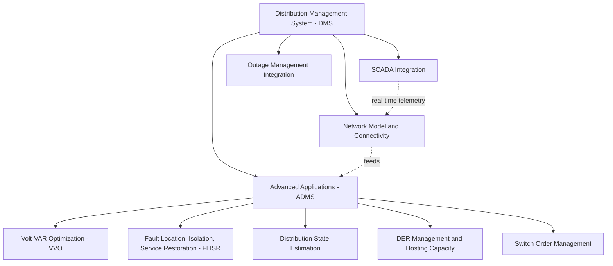
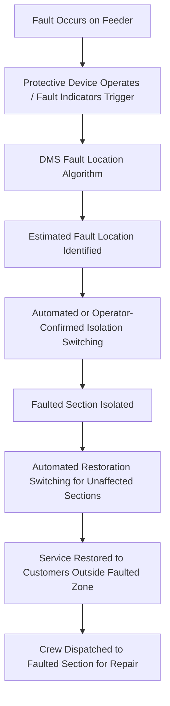
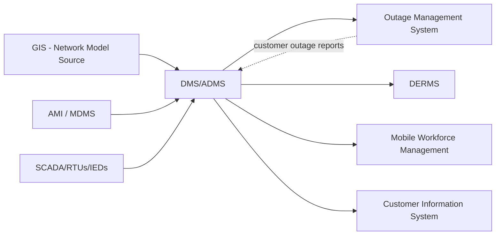

## Distribution Management System Functions

### Definition and Position in Grid Operations

A Distribution Management System (DMS) is the software platform enabling utility operators to monitor, control, and optimize the electric distribution network in real time. Positioned analogously to how an Energy Management System (EMS) serves transmission-level operations, the DMS provides situational awareness and control capability across substations, feeders, and — increasingly — distributed energy resources (DERs) connected at the distribution level. An Advanced DMS (ADMS) extends the base DMS with model-driven analytical applications that go beyond simple monitoring and manual control into automated optimization and self-healing capability.

### Core Foundational Functions

**Network Model and Connectivity (Geographic Information System Integration)**

The DMS maintains a connectivity model of the distribution network — feeders, switches, transformers, protective devices, and customer connection points — typically synchronized with the utility's Geographic Information System (GIS) as the authoritative source of network topology. This connectivity model underlies every advanced application, since functions like fault location or switching optimization require an accurate, current representation of how network elements are electrically connected.

**SCADA Integration**

The DMS ingests real-time telemetry (voltage, current, power flow, switch/breaker status) from Remote Terminal Units (RTUs) and Intelligent Electronic Devices (IEDs) deployed across substations and increasingly along feeders (via pole-top reclosers, sectionalizing switches, and feeder monitors), providing the real-time operational picture underlying situational awareness displays and automated applications.

**Switch Order Management**

Supports operators in planning, sequencing, and executing manual or semi-automated switching operations (e.g., for planned maintenance outages or manual restoration), incorporating safety interlocking logic to prevent switching sequences that would create unsafe conditions such as inadvertent backfeed to a de-energized, grounded section.

### Advanced DMS Applications

**Volt-VAR Optimization (VVO)**

VVO coordinates voltage regulation devices (load tap changing transformers, voltage regulators, and switched capacitor banks) across a feeder to achieve one or more operational objectives:

$$\text{Objective: } \min \sum_{i} P_{loss,i} \quad \text{subject to } V_{min} \leq V_i \leq V_{max} \, \forall i$$

- **Conservation Voltage Reduction (CVR)**: deliberately operates the feeder at the lower end of the acceptable voltage band (per ANSI C84.1, typically 0.95–1.05 p.u.), exploiting the fact that many loads consume less real power at lower voltage, yielding measurable system-wide energy savings without requiring any customer behavior change
- **Loss minimization**: optimizes reactive power dispatch (capacitor bank switching, regulator tap positions) to reduce $I^2R$ losses across the feeder
- **DER-aware VVO**: as distributed generation increases, VVO algorithms must account for voltage rise from reverse power flow and, increasingly, coordinate with smart inverter volt-VAR functions (per IEEE 1547-2018) operating autonomously at the DER itself, creating a two-layer control coordination challenge between centralized DMS optimization and localized autonomous inverter response

**Fault Location, Isolation, and Service Restoration (FLISR)**

FLISR automates or semi-automates the sequence of locating a fault, isolating the smallest possible affected section, and restoring service to unaffected customers via alternate feeder paths (where network topology and tie switches permit), substantially reducing the customer-minutes of outage relative to fully manual restoration:

- **Fault location**: uses a combination of protective device operation sequence, fault current magnitude (impedance-based fault location estimation), and increasingly, AMI "last gasp" outage signals (as discussed in Advanced Metering Infrastructure) to narrow the probable fault location
- **Isolation**: automatically or semi-automatically operates sectionalizing switches to isolate the smallest feasible section containing the fault, minimizing the customer count left without service pending repair
- **Restoration**: where the network topology includes normally-open tie switches to adjacent feeders, FLISR can automatically reconfigure the network to restore power to customers outside the isolated faulted section, typically within seconds to a few minutes rather than the tens of minutes to hours a fully manual process might require
- **Reliability metric impact**: successful FLISR deployment directly improves standard reliability indices (SAIDI — System Average Interruption Duration Index, and SAIFI — System Average Interruption Frequency Index) by reducing the duration component of outages affecting the unfaulted, restored portions of the feeder

**Distribution State Estimation**

Distribution networks have historically had far less real-time telemetry coverage than transmission networks (fewer sensors per mile, given the much larger number of distribution circuits), making full observability challenging. Distribution state estimation addresses this using:

- **Pseudo-measurements**: statistically typical load profiles (often informed by customer class and, where available, AMI historical interval data) used to estimate loading at points lacking direct real-time telemetry
- **Weighted least-squares estimation**: combining available real-time SCADA measurements with pseudo-measurements to produce a best-estimate state (voltage, current, power flow) across the full network model, analogous in mathematical structure to transmission-level state estimation but adapted for distribution's typically lower measurement redundancy and unbalanced (single-phase and multi-phase) network topology
- **AMI-enhanced state estimation**: incorporating high-resolution AMI interval data substantially improves distribution state estimation accuracy relative to pseudo-measurement-only approaches, representing a key synergy between AMI deployment and ADMS analytical capability

**DER Management and Hosting Capacity Analysis**

As distributed generation (particularly rooftop and community solar) penetration increases, the DMS increasingly incorporates functions to manage DER interconnection and operational visibility:

- **Hosting capacity analysis**: pre-computed or on-demand analysis identifying how much additional DER capacity a given feeder or feeder segment can accommodate before violating voltage, thermal, or protection coordination limits, used to screen new interconnection applications more efficiently than individual case-by-case engineering studies for every request
- **DER Management System (DERMS) integration**: coordinating dispatch signals to aggregated DER fleets (e.g., for demand response, voltage support via smart inverter functions, or emergency curtailment) often operates as an adjunct or module to the core ADMS, bridging the aggregate DER fleet's collective grid impact with individual DMS-managed feeder operations
- **Reverse power flow and protection coordination monitoring**: tracking situations where DER export causes power flow reversal at points not originally designed for bidirectional flow (e.g., certain voltage regulator control schemes, some protection relay directional settings), which the hosting capacity and interconnection screening functions must account for

### Integration Architecture Across Utility Systems

- **GIS**: authoritative network connectivity and asset data source, requiring careful data synchronization discipline since DMS analytical accuracy depends directly on GIS model currency and accuracy
- **Outage Management System (OMS)**: closely integrated with (in some vendor architectures, unified with) the DMS, since fault location and restoration functions directly drive and are informed by outage tracking and customer notification
- **AMI/MDMS**: supplies both outage detection signals and interval data supporting distribution state estimation, as discussed above
- **Mobile Workforce Management**: receives switching orders and repair dispatch instructions generated from DMS/OMS fault analysis, closing the loop from automated fault detection through field crew dispatch

### Standards and Interoperability

- **IEC 61968/61970 (Common Information Model, CIM)**: defines standardized data models for utility network representation and information exchange, increasingly used to enable interoperability between DMS, GIS, OMS, and other utility enterprise systems from different vendors
- **IEC 61850**: substation automation communication standard relevant where DMS integrates directly with substation-level IEDs for real-time control and monitoring
- **DNP3**: commonly used protocol for SCADA communication between the DMS and field RTUs/IEDs across the distribution network

### Worked Example — FLISR Restoration Time Improvement

A feeder segment fault affects 800 customers under a fully manual restoration process, requiring an average of 90 minutes from fault occurrence to full restoration (accounting for outage call-in reporting, crew dispatch, and manual switching). With automated FLISR deployed:

- **Fault detection and isolation**: reduced from ~20 minutes (customer call-based) to under 1 minute (automated protective device signals and fault indicators)
- **Restoration of unaffected sections**: automated tie-switch reconfiguration restores approximately 600 of the 800 affected customers (those outside the isolated faulted section) within 2–5 minutes, rather than waiting for the full 90-minute manual repair-and-restore cycle
- **Remaining 200 customers** (within the isolated faulted section) still require physical repair before restoration, unaffected by FLISR's automation benefit

$$\text{Customer-Minutes Saved} \approx 600 \times (90 - 5) = 51{,}000 \text{ customer-minutes for this single event}$$

[Inference: this is an illustrative single-event example; actual system-wide SAIDI/SAIFI improvement from FLISR deployment depends on network topology (tie-switch availability), fault frequency, and the proportion of faults occurring on FLISR-enabled feeder segments, requiring statistical analysis across many events rather than extrapolation from a single case.]

### Key Points

- DMS/ADMS extends foundational SCADA monitoring and network modeling into advanced optimization applications: Volt-VAR Optimization, FLISR, distribution state estimation, and DER hosting capacity management
- VVO and CVR exploit voltage-dependent load behavior to reduce system losses and energy consumption without customer behavior change, while increasingly needing to coordinate with autonomous smart inverter functions as DER penetration rises
- FLISR substantially reduces outage duration for customers outside the immediately faulted section by automating fault isolation and tie-switch-based restoration
- Distribution state estimation faces greater observability challenges than transmission state estimation due to historically sparser distribution-level telemetry, addressed through pseudo-measurements and increasingly AMI-enhanced estimation
- DMS analytical accuracy is fundamentally dependent on GIS network model currency, making data governance and model synchronization a critical, often underappreciated, prerequisite for ADMS application performance

**Related Topics**

- Advanced Metering Infrastructure (AMI)
- Phasor Measurement Units and Wide-Area Monitoring Systems
- DER Hosting Capacity Analysis
- Conservation Voltage Reduction and Volt-VAR Optimization
- Outage Management Systems and Reliability Metrics (SAIDI/SAIFI)
- DER Management Systems (DERMS) and Aggregated Dispatch
- Common Information Model (CIM) and Utility System Interoperability