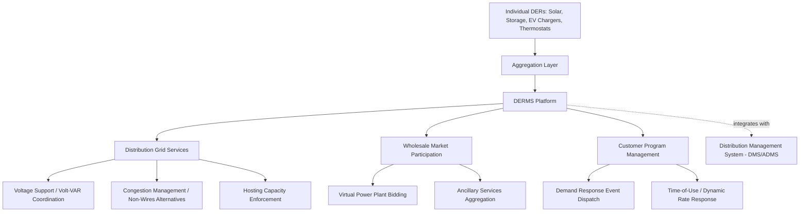
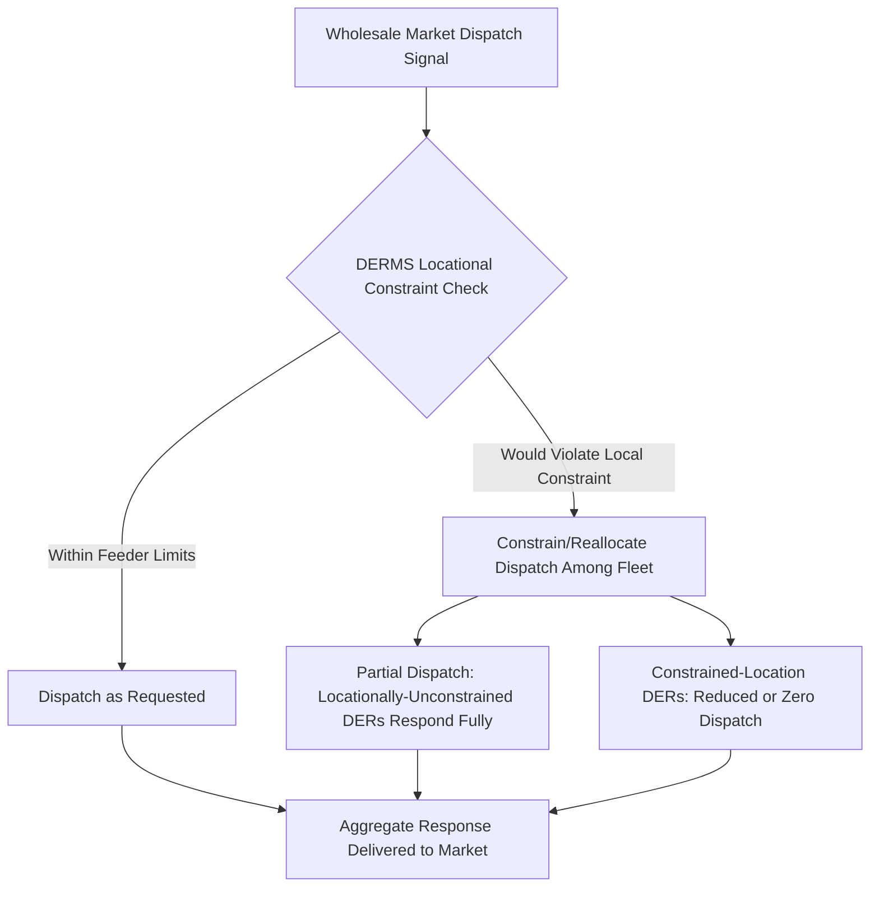

## Distributed Energy Resource Management Systems (DERMS)

### Definition and Rationale

A Distributed Energy Resource Management System (DERMS) is a software platform that provides visibility into, and control coordination of, a fleet of distributed energy resources (DERs) — rooftop and community solar, behind-the-meter and front-of-meter battery storage, electric vehicle chargers, smart thermostats, and other grid-edge devices — dispersed across the distribution network. As DER penetration grows from a negligible fraction of system capacity to a significant share of both generation and flexible load, utilities and grid operators need a coordination layer that sits between the aggregate scale of thousands to millions of small, independently-owned devices and the operational needs of the distribution and, indirectly, transmission grid.

### Core Functional Layers

**Visibility and Registration**

DERMS maintains a registry of individual DER assets — their location on the distribution network (down to the specific feeder and, ideally, transformer), technical characteristics (capacity, response speed, duration for storage), and current operational status (online/offline, state of charge, current output). This registry underpins every downstream function, since accurate network-location mapping is what allows a DERMS to distinguish a grid-support action that is locationally relevant (e.g., voltage support on a specific overloaded feeder) from one that is not.

**Aggregation**

Individual DER units are typically too small (a single residential battery might be 5–13 kWh) to participate meaningfully in wholesale markets or provide dispatchable grid services on their own. DERMS aggregates many individual resources into a "virtual" resource of meaningful scale:

$$P_{aggregate}(t) = \sum_{i=1}^{n} P_i(t) \cdot A_i(t)$$

Where $P_i(t)$ is each individual DER's available capacity at time $t$ and $A_i(t)$ is a binary or fractional availability factor accounting for that unit's current online status, state of charge, or customer opt-out status — critically, aggregate availability is inherently probabilistic and time-varying in a way that a single utility-owned dispatchable asset is not, requiring the DERMS to manage this uncertainty explicitly in its dispatch and bidding logic.

**Dispatch and Control**

Once aggregated, the DERMS issues dispatch signals to the fleet (or subsets of it) to achieve a desired collective response, using one of several control architectures:

- **Direct load/device control**: DERMS sends specific setpoints directly to individual devices (common for utility-owned or utility-program-enrolled DERs with a direct communication pathway)
- **Price/incentive signaling**: DERMS broadcasts a price or incentive signal, and individual DER controllers (or their own local optimization logic) respond autonomously — used where direct control authority is not available or not desired (e.g., independently-owned behind-the-meter batteries operating under a bring-your-own-device demand response program)
- **Hierarchical aggregator-mediated control**: a third-party aggregator manages a fleet of customer-owned devices and interfaces with the DERMS at the aggregate level, common in markets where FERC Order 2222 (or equivalent) enables aggregated DER participation

### Grid Services Enabled by DERMS

**Key Points**

- **Voltage support and Volt-VAR coordination**: DERMS coordinates smart inverter reactive power (volt-VAR) functions across many DERs on a feeder, working in conjunction with (and sometimes as an extension of) the Volt-VAR Optimization functions performed by the DMS, resolving the two-layer coordination challenge between centralized feeder-level optimization and autonomous inverter-level response referenced in distribution management system functions
- **Congestion management and Non-Wires Alternatives (NWAs)**: DERMS can dispatch localized DER response (e.g., discharging batteries or curtailing solar export on a specific overloaded feeder segment) to defer or avoid a traditional capital infrastructure upgrade, a strategy increasingly formalized as a Non-Wires Alternative in utility distribution planning
- **Hosting capacity enforcement**: rather than relying solely on static, pre-computed hosting capacity limits (as discussed in DMS functions), a DERMS can dynamically manage DER output in real time to stay within actual instantaneous network limits, potentially allowing higher DER interconnection levels than static limits alone would permit — an approach sometimes termed "dynamic hosting capacity" or "flexible interconnection"
- **Virtual Power Plant (VPP) wholesale market participation**: aggregated DER fleets can bid into wholesale energy, capacity, and ancillary services markets as a single resource, following market access frameworks such as FERC Order 2222 in U.S. organized markets, extending the market participation logic discussed in storage applications to heterogeneous, geographically distributed fleets rather than a single co-located asset
- **Demand response program dispatch and settlement**: DERMS manages the operational dispatch of demand response events and, working with AMI interval data (as discussed in Advanced Metering Infrastructure), supports baseline calculation and performance verification needed for accurate program settlement payments

### Locational Awareness as a Distinguishing DERMS Capability

A key technical distinction between a DERMS and a simpler wholesale-market-facing VPP platform is locational grid-awareness: a DERMS must be able to answer not just "how much aggregate capacity is available" but "how much capacity is available *at a specific network location*, without violating that location's voltage or thermal limits." This requires:

- Integration with the distribution network model (typically via the same GIS/CIM-based connectivity model discussed in DMS functions)
- The ability to compute or receive locational constraints (from hosting capacity analysis or real-time distribution state estimation) and translate them into location-specific dispatch limits for the DER fleet
- Coordination logic to avoid a scenario where a DERMS dispatch decision optimized for wholesale market value (e.g., a large coincident regional discharge event) inadvertently creates a local distribution violation on a specific constrained feeder — a documented emerging operational challenge as DERMS platforms mature from simple aggregation toward grid-aware dispatch

### Architecture and System Integration

**Communication protocols and standards**:

- **IEEE 2030.5 (Smart Energy Profile 2.0)**: commonly used for utility-to-DER communication, particularly for smart inverter function management (connect/disconnect, volt-VAR curve updates, curtailment signals) as referenced in storage interconnection standards
- **OpenADR (Open Automated Demand Response)**: a widely adopted protocol specifically for demand response event signaling between utilities/aggregators and customer-sited devices
- **SunSpec Modbus**: device-level protocol for solar inverter and storage system communication and control, as discussed in BESS architecture
- **IEEE 2030.5 and OpenFMB**: emerging field-message-bus architectures supporting more granular, distributed DER coordination at the grid edge

**Integration with DMS/ADMS**: DERMS functionality may be delivered as a standalone platform, a module within a broader ADMS suite, or a hybrid architecture where a standalone DERMS handles aggregation/market functions while relying on the DMS for network model and real-time state estimation data — architectural choice varies significantly by vendor and utility deployment strategy. [Inference: no single DERMS-DMS integration architecture has become a universal industry standard; utilities evaluate vendor-specific integration approaches based on their existing ADMS investment and DER penetration trajectory.]

### Worked Example — Aggregate Capacity with Locational Constraint

A DERMS manages 2,000 residential batteries (average 8 kWh capacity, 5 kW power rating) distributed across a utility service territory, with 90% average availability (accounting for customer opt-outs and low-SOC units at a given dispatch moment):

$$P_{aggregate} = 2000 \times 5 \text{ kW} \times 0.90 = 9{,}000 \text{ kW} = 9 \text{ MW}$$

If 300 of these batteries (1.5 MW potential contribution) sit on a single feeder currently within 200 kW of its thermal limit, the DERMS must cap that feeder's collective discharge contribution to 200 kW rather than allowing the full 1.5 MW from that feeder's batteries to respond to a system-wide dispatch signal, redistributing the remaining aggregate response need across DERs on unconstrained feeders:

$$P_{feeder,limited} = \min(1{,}500 \text{ kW}, 200 \text{ kW}) = 200 \text{ kW}$$

$$P_{remaining\_needed} = P_{aggregate,target} - 200 \text{ kW}, \text{ sourced from unconstrained feeders}$$

[Inference: this simplified example illustrates the locational-constraint reallocation principle; production DERMS optimization typically solves a more complex multi-feeder, multi-constraint allocation problem incorporating customer enrollment terms, degradation cost, and market price signals simultaneously.]

### Market and Regulatory Context

- **FERC Order 2222**: requires U.S. RTOs/ISOs to remove barriers to aggregated DER participation in wholesale markets, directly enabling the VPP wholesale market participation function described above; implementation timelines and specific participation models vary by RTO/ISO
- **State-level DER interconnection and hosting capacity mandates**: several states have adopted or are developing requirements for utilities to publish hosting capacity maps and, in some cases, implement dynamic/flexible interconnection approaches that a DERMS's locational dispatch capability directly supports
- [Unverified: specific FERC Order 2222 implementation status and state-level DERMS/hosting-capacity mandate details vary by jurisdiction and continue to evolve; verify against the applicable RTO/ISO's current compliance filings and state regulatory proceedings for binding detail.]

### Key Distinctions from Related Systems

**Key Points**

- **DERMS vs. DMS**: the DMS focuses on utility-owned distribution network infrastructure monitoring and control (as discussed in DMS functions); the DERMS focuses on coordinating customer-sited and third-party-owned DER assets, though the two increasingly need tight integration as DER penetration rises
- **DERMS vs. VPP platform**: a VPP platform may focus primarily on wholesale market aggregation and bidding without deep distribution-network locational awareness; a full DERMS incorporates that locational grid-constraint layer as a core differentiating capability
- **DERMS vs. BESS EMS**: the Energy Management System within a single BESS asset (as discussed in BESS architecture) optimizes dispatch for that one asset; a DERMS coordinates potentially thousands of heterogeneous, independently-owned assets across an entire service territory

### Conclusion

DERMS represents the coordination layer necessitated by the shift from a small number of large, centrally-dispatched generation assets to a large number of small, distributed, often independently-owned resources. Its core value proposition — aggregating scale while respecting distribution-network locational constraints — distinguishes it from simpler wholesale-market-only aggregation platforms and positions it as an increasingly essential complement to the DMS/ADMS as DER penetration continues to grow. The specific architectural boundary between DERMS and DMS functionality remains an area of active vendor and utility experimentation rather than a settled industry-standard division of responsibility.

**Related Topics**

- Distribution Management System Functions
- Advanced Metering Infrastructure (AMI)
- Storage Applications: Arbitrage, Regulation, and Capacity
- Hybrid Generation-Storage Resource Design
- FERC Order 2222 and Aggregated DER Market Participation
- DER Hosting Capacity Analysis and Dynamic/Flexible Interconnection
- Virtual Power Plant Design and Wholesale Market Bidding Strategy