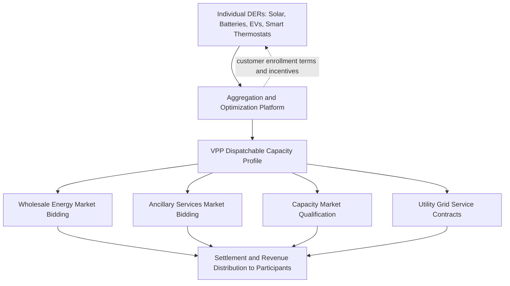

## Virtual Power Plants and DER Aggregation

### Definition and Conceptual Foundation

A Virtual Power Plant (VPP) is a coordinated aggregation of distributed energy resources — residential and commercial solar, battery storage, electric vehicle chargers, smart thermostats, and controllable loads — operated as a single dispatchable entity that can participate in wholesale electricity markets and provide grid services in a manner functionally analogous to a conventional centralized power plant, despite consisting of no single physical generation asset. The "virtual" designation reflects that the plant's capacity exists only as an aggregate, software-coordinated capability distributed across potentially thousands of independently-owned, geographically dispersed devices.

### Distinguishing VPPs from DERMS

A VPP is conceptually the market-facing aggregation and monetization function, while a DERMS (as discussed in Distributed Energy Resource Management Systems) is the broader technical platform that may include locational grid-constraint management alongside aggregation. In practice, these terms overlap substantially and are sometimes used interchangeably by vendors, but a useful distinction is:

- **VPP**: emphasizes the business/market model — aggregating DER capacity into a tradeable, dispatchable product for markets and programs
- **DERMS**: emphasizes the technical platform — which may serve a VPP's aggregation needs but also handles distribution-network-locational constraint enforcement that a pure market-facing VPP platform may or may not incorporate

[Inference: industry terminology usage varies considerably between vendors, utilities, and regulatory contexts; the distinction offered here reflects a common conceptual framing rather than a universally standardized definitional boundary.]

### VPP Business and Operating Models

**Utility-operated VPP**: the utility itself aggregates and dispatches enrolled customer DERs, typically through a formal demand response or DER program, with the utility bearing dispatch and settlement responsibility directly.

**Third-party aggregator VPP**: an independent aggregator company enrolls customers (often across multiple utility territories), owns or licenses the aggregation/dispatch software platform, and interfaces with wholesale markets or utility programs on behalf of its enrolled customer fleet, sharing program or market revenue with participants per the enrollment contract terms.

**Bring-your-own-device (BYOD) vs. utility/aggregator-owned asset models**: some VPPs aggregate customer-owned devices (rooftop solar, home batteries purchased independently by the customer) under a participation agreement, while others involve the utility or aggregator directly owning, installing, or subsidizing the DER hardware in exchange for dispatch rights — these models carry different customer economics, enrollment friction, and control authority implications.

### Aggregation and Dispatch Mechanics

The core technical challenge of VPP operation is converting a large number of small, heterogeneous, individually uncertain resources into a reliable, tradeable capacity commitment:

$$P_{VPP}(t) = \sum_{i=1}^{n} P_i(t) \cdot A_i(t) \cdot (1 - \delta)$$

Where $P_i(t)$ is each device's technical capability at time $t$, $A_i(t)$ is its availability (online status, SOC for storage, occupancy/comfort constraints for thermostats), and $\delta$ is a derating factor the VPP operator applies to account for aggregate forecast uncertainty — since committing the full theoretical aggregate capacity into a firm market bid risks under-delivery penalties if actual fleet availability falls short of the forecast at dispatch time.

**Forecast-dependent resource types create asymmetric aggregation risk**:

- **High-certainty resources**: utility-controlled or contractually-firm-commitment batteries with guaranteed availability windows
- **Moderate-certainty resources**: BYOD batteries where customers retain override/opt-out rights, requiring statistical modeling of historical opt-out rates
- **Weather/behavior-dependent resources**: smart thermostats (whose available demand-response capacity depends on outdoor temperature and occupant comfort tolerance) and EV chargers (whose availability depends on vehicle plug-in behavior patterns), requiring more sophisticated behavioral and weather-correlated forecasting models

### Market Participation Pathways

**Key Points**

- **Wholesale energy market participation**: VPPs bid aggregate discharge/curtailment capability into day-ahead and real-time energy markets, monetizing the same arbitrage logic discussed in storage applications but applied across a distributed fleet rather than a single co-located asset
- **Ancillary services participation**: fast-responding aggregated resources (particularly battery-heavy VPP fleets) can participate in frequency regulation markets, leveraging the same fast-response value proposition discussed for individual BESS assets, now aggregated across many smaller devices
- **Capacity market participation**: VPPs can qualify for capacity market payments based on their aggregate Effective Load Carrying Capability or an analogous accreditation methodology, subject to the same duration and reliability considerations discussed in storage applications, adapted for an aggregate, multi-device resource
- **Utility non-wires alternative and grid service contracts**: rather than (or in addition to) wholesale market participation, VPPs may contract directly with a utility to provide localized, demand-response, or peak-shaving services supporting distribution planning objectives, as discussed under Non-Wires Alternatives in DERMS

### Regulatory Enablement: FERC Order 2222

FERC Order 2222 is the principal U.S. regulatory driver enabling VPP wholesale market participation, requiring RTOs/ISOs to establish market rules allowing Distributed Energy Resource Aggregations to participate directly in organized wholesale markets on a comparable basis to other resource types. Key implementation considerations include:

- **Aggregation across utility distribution territories**: since a single VPP aggregator's fleet may span multiple distribution utility service areas within one RTO/ISO footprint, coordination rules must address how the aggregator interfaces with each affected distribution utility for interconnection, telemetry, and safety coordination purposes
- **Minimum size requirements and technical participation models**: each RTO/ISO establishes its own minimum aggregate size threshold and bidding parameter structure, resulting in participation model variation across markets similar to the ISO-specific variation noted for standalone storage under FERC Order 841
- **Distribution utility coordination requirements**: Order 2222 implementation generally requires mechanisms for the distribution utility to be aware of, and in some cases have visibility or veto rights over, DER aggregation dispatch that could affect local distribution system safety or reliability — directly connecting VPP wholesale dispatch to the locational-constraint coordination challenge discussed in DERMS
- [Unverified: specific RTO/ISO compliance filing status, implementation timelines, and finalized participation model details continue to evolve and vary by region; current status should be verified against the applicable RTO/ISO's latest FERC compliance filings.]

### Worked Example — VPP Bid Derating for Forecast Uncertainty

A residential battery VPP has 5,000 enrolled units with an aggregate nameplate discharge capacity of 25 MW (5 kW average per unit). Historical dispatch event data shows actual average fleet availability of 82% during called events, with a standard deviation of 6 percentage points across past events.

To avoid a high probability of under-delivery relative to a firm market commitment, the VPP operator might bid conservatively at, for example, the 10th percentile of historical availability (approximately $82\% - 1.28\sigma = 82\% - 7.7\% \approx 74.3\%$, assuming approximately normal distribution of historical availability outcomes):

$$P_{bid} = 25 \text{ MW} \times 0.743 \approx 18.6 \text{ MW}$$

This conservative bid sacrifices some potential revenue (bidding less than the statistically expected 82% availability would imply) in exchange for reduced risk of triggering under-performance penalties in the market or program the VPP is participating in. [Inference: the specific percentile/confidence-level choice for bid derating is a risk-management decision made by each VPP operator based on the specific market's penalty structure, not a value prescribed by any single universal standard; this example illustrates the general statistical logic rather than a mandated methodology.]

### Technical and Operational Challenges

- **Telemetry and verification**: markets and programs generally require verifiable performance measurement (via AMI data, as discussed in Advanced Metering Infrastructure, or dedicated telemetry) to confirm that a VPP's aggregate dispatch actually matched its committed bid, since settlement and penalty calculations depend on this verified performance
- **Customer retention and enrollment churn**: unlike a utility-owned physical asset, a VPP's aggregate capacity can decline over time due to customer opt-outs, equipment failures, or enrollment attrition, requiring ongoing customer relationship management as an operational function alongside the technical dispatch platform
- **Cybersecurity across a distributed, heterogeneous device fleet**: coordinating dispatch commands across potentially many different device manufacturers and communication protocols creates a broader attack surface than a single centralized asset, requiring robust authentication and communication security architecture spanning multiple third-party device ecosystems
- **Locational constraint coordination**: as discussed in DERMS, a VPP's wholesale-optimal dispatch decision can conflict with local distribution network constraints on specific feeders where its enrolled fleet is concentrated, requiring coordination mechanisms with the distribution utility that are still maturing in many jurisdictions

### Comparative Value Proposition vs. Centralized Storage

**Key Points**

- **Advantages of VPP/DER aggregation over new centralized storage**: can leverage existing customer-sited assets without new siting or interconnection of a large centralized facility; potentially faster deployment timeline since it aggregates already-installed or incrementally-installed distributed devices rather than requiring a single large capital project
- **Disadvantages relative to centralized storage**: lower aggregate reliability/certainty due to fleet heterogeneity and customer behavior dependency; more complex telemetry, verification, and customer relationship management overhead; potentially lower per-unit efficiency or technical performance (e.g., residential battery inverters may have lower efficiency than utility-scale PCS units)
- **Complementary rather than purely substitutable roles**: many system planning studies treat VPP/DER aggregation and centralized storage as complementary resources serving different niches within the overall resource adequacy and grid service portfolio, rather than direct competitors for identical use cases

### Conclusion

Virtual Power Plants represent the market-facing culmination of DER aggregation technology, converting the collective capability of many small, independently-owned devices into a tradeable resource that can participate in wholesale markets and utility grid service programs on a basis increasingly comparable to conventional generation and storage assets. Their growth is closely tied to regulatory enablement (particularly FERC Order 2222 in U.S. markets), the maturation of aggregation and forecasting technology to manage fleet uncertainty, and the ongoing resolution of coordination challenges between wholesale-market-optimal dispatch and localized distribution network constraints — an area where DERMS platforms and evolving utility-aggregator coordination frameworks continue to develop rather than having reached settled industry-standard practice.

**Related Topics**

- Distributed Energy Resource Management Systems (DERMS)
- Storage Applications: Arbitrage, Regulation, and Capacity
- FERC Order 2222 and Aggregated DER Market Participation
- Advanced Metering Infrastructure (AMI)
- Distribution Management System Functions
- Effective Load Carrying Capability (ELCC) and Capacity Accreditation
- Demand Response Program Design and Baseline Methodology