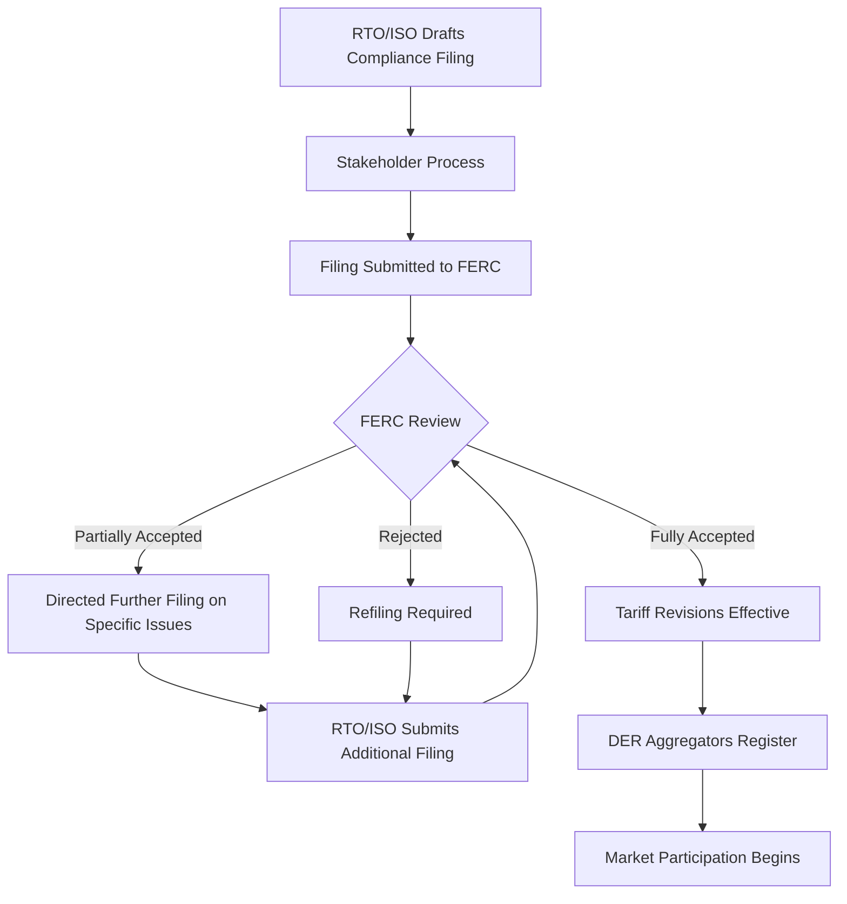

## FERC Order 2222 and Wholesale Market Participation of DERs

### Regulatory Background and Purpose

**Key Points**

- FERC Order 2222 was issued September 17, 2020, amending prior policy to require Regional Transmission Organizations (RTOs) and Independent System Operators (ISOs) to remove barriers preventing Distributed Energy Resources (DERs) and DER Aggregations from participating directly in wholesale electricity markets.
- The order builds on the foundation established by Order 841 (2018), which addressed energy storage participation, by extending similar market-access principles to the broader category of DERs.
- The core legal basis is FERC's authority under the Federal Power Act to ensure that rates, terms, and conditions of wholesale market participation are just, reasonable, and not unduly discriminatory.

DERs are defined broadly under the order to include any resource located on the distribution system, any subsystem thereof, or behind a customer meter, including but not limited to: distributed generation, energy storage, demand response, energy efficiency, electric vehicles and their supply equipment, and thermal storage. This deliberately technology-neutral definition allows heterogeneous small resources to be pooled by a third-party aggregator, called a DER Aggregator, into a single dispatchable resource that meets an RTO/ISO's minimum size and telemetry requirements.

**Rationale**

Before Order 2222, DERs faced a structural barrier: individual resources were typically too small (often under 100 kW) to meet wholesale market minimum bid-size thresholds, and RTO/ISO market rules were designed around utility-scale, transmission-connected generation. Order 2222 requires each RTO/ISO to establish DER Aggregation participation models covering:

1. Energy markets
2. Capacity markets (where they exist)
3. Ancillary services markets (regulation, spinning/non-spinning reserves, voltage support)

### Core Requirements of the Order

**Key Points**

- Minimum size requirements: RTOs/ISOs must permit aggregations as small as 100 kW, though they may adopt smaller minimums; NYISO, for example, initially proposed and defended a 10 kW minimum threshold before facing pushback on timelines to implement it.
- Locational requirements: DER Aggregations may be composed of resources located across multiple distribution nodes ("multi-nodal aggregation"), not just within a single interconnection point, provided reliability can be maintained.
- Information sharing: RTOs/ISOs must establish coordination frameworks with distribution utilities to share the data (interconnection status, telemetry, metering) needed to verify DER Aggregation performance without compromising distribution system reliability.
- Market participation agreements: A DER Aggregator, not each individual DER owner, becomes the Market Participant of record, taking on associated market obligations (bidding, settlement, performance compliance).

**Distribution utility coordination**

A central design tension in Order 2222 is preserving the distribution utility's right to review and object to a DER's participation in wholesale aggregation if participation would violate a distribution interconnection or operational safety requirement. FERC required RTOs/ISOs to establish:

- A dispute resolution process for opt-out disagreements between DER owners, aggregators, and distribution utilities.
- Coordination and data-sharing protocols so distribution utilities retain visibility into which of their connected resources are enrolled in wholesale aggregations.
- Metering and telemetry standards sufficient for settlement-quality measurement of aggregated output at the wholesale level.

**Double-counting prevention**

Because a single DER could theoretically be compensated simultaneously for a distribution-level service (e.g., a utility demand response tariff) and a wholesale-level service (e.g., an RTO capacity payment) for the same physical response, compliance filings must include double-counting mitigation mechanisms — typically requiring the DER owner or aggregator to disclose enrollment status and preventing concurrent enrollment in overlapping programs for the same operational response.

### Implementation Timeline and Compliance Filing Status

Each RTO/ISO was required to submit a compliance filing proposing tariff revisions, and FERC has engaged in an iterative accept/reject/directed-refiling process with most entities over several years. As of early 2026, the compliance landscape is uneven across regions:

| RTO/ISO | Compliance Status (approx.) | Notes |
| --- | --- | --- |
| CAISO | Substantially implemented | Accepted with directed revisions to the participation model for aggregations |
| ISO-NE | Iterative filings ongoing | FERC has directed ISO-NE to submit additional filings specifying metering and telemetry practices for DER aggregations |
| NYISO | Phased, extended timeline | FERC granted NYISO's extension request moving full tariff implementation from Q4 2022 to December 31, 2026, with 2023 covering initial energy/ancillary/capacity market participation and 2024 adding automation software features |
| PJM | Compliance filings under review | Multiple rounds of FERC directives on participation model details |
| MISO | Significantly delayed | MISO has proposed a two-stage approach — a demand response category available in 2026, with full DER aggregation market participation remaining on a 2030 timeline that FERC has previously found does not justify the multi-year gap between market platform completion and the first DER aggregation registrations |
| SPP | Partial compliance | FERC found SPP partially complies with Order 2222, directing another compliance filing |

**[Unverified]** Exact current-quarter filing statuses shift frequently as dockets progress; practitioners should verify the live status of a specific RTO/ISO's compliance docket (e.g., via FERC's eLibrary under the relevant docket number such as ER21-2460 for NYISO) rather than relying on a static reference, since new orders, rehearing requests, and refiling deadlines are issued on a rolling basis.

This staggered, region-by-region rollout means an engineer or market participant must always confirm the specific RTO/ISO's current tariff language rather than assuming uniform national implementation — Order 2222 sets a floor of requirements, but each grid operator's approved tariff is the operative document governing actual participation mechanics.

### Technical Architecture of DER Aggregation Participation

**Key Points**

- The aggregation model requires a data and control pipeline connecting individual DER telemetry to a wholesale-market-facing bid/dispatch interface.
- Baseline methodologies are critical for behind-the-meter resources, since performance is measured as a deviation from a counterfactual "business as usual" consumption/generation baseline.
- Settlement requires reconciling aggregate-level wholesale payments back down to individual DER contributions.

A typical DER Aggregator's technical stack includes:

1. **Telemetry and SCADA integration** — real-time (typically 4-second to 6-second resolution for regulation, longer intervals for energy/reserves) data collection from each enrolled DER via a Distributed Energy Resource Management System (DERMS).
2. **Aggregation and bidding engine** — software that rolls up individual DER capabilities into a composite bid curve, accounting for availability, state of charge (for storage), and any distribution-level constraints communicated by the utility.
3. **Dispatch signal disaggregation** — when the RTO/ISO dispatches the aggregation, the aggregator's control system must translate the aggregate instruction into individual setpoints for each DER, respecting local constraints (e.g., a feeder thermal limit) and the DER owner's own preferences (e.g., an EV owner's minimum state of charge).
4. **Settlement and metering reconciliation** — revenue-grade metering (or FERC-approved alternative, such as calculated baseline-and-deviation methods) at both the aggregate point of interconnection and, where required, at the individual DER level for internal compensation.

$$P_{agg}(t) = \sum_{i=1}^{n} P_i(t) \cdot \mathbb{1}_{available,i}(t)$$

Where $P_{agg}(t)$ is the aggregate power output/reduction at time $t$, $P_i(t)$ is the individual DER's contribution, and $\mathbb{1}_{available,i}(t)$ is an indicator function representing whether DER $i$ is enrolled, online, and not subject to a distribution-level curtailment or opt-out at time $t$.

### Aggregation and Dispatch Flow (svg_diagram)

<svg xmlns="http://www.w3.org/2000/svg" viewBox="0 0 900 480" font-family="Arial, sans-serif">
<text x="450" y="28" font-size="18" font-weight="bold" text-anchor="middle" fill="#1a1a1a">DER Aggregation Wholesale Market Flow (svg_diagram)</text>

<rect x="30" y="70" width="140" height="50" rx="6" fill="#dbeafe" stroke="#2563eb" stroke-width="1.5" />
<text x="100" y="100" font-size="12" text-anchor="middle">Rooftop Solar</text>
<rect x="30" y="140" width="140" height="50" rx="6" fill="#dbeafe" stroke="#2563eb" stroke-width="1.5" />
<text x="100" y="170" font-size="12" text-anchor="middle">Battery Storage</text>
<rect x="30" y="210" width="140" height="50" rx="6" fill="#dbeafe" stroke="#2563eb" stroke-width="1.5" />
<text x="100" y="240" font-size="12" text-anchor="middle">EV Charging</text>
<rect x="30" y="280" width="140" height="50" rx="6" fill="#dbeafe" stroke="#2563eb" stroke-width="1.5" />
<text x="100" y="310" font-size="12" text-anchor="middle">Demand Response</text>

<line x1="170" y1="95" x2="260" y2="175" stroke="#555" stroke-width="1.5" marker-end="url(#arrow)" />
<line x1="170" y1="165" x2="260" y2="185" stroke="#555" stroke-width="1.5" marker-end="url(#arrow)" />
<line x1="170" y1="235" x2="260" y2="200" stroke="#555" stroke-width="1.5" marker-end="url(#arrow)" />
<line x1="170" y1="305" x2="260" y2="215" stroke="#555" stroke-width="1.5" marker-end="url(#arrow)" />

<rect x="260" y="150" width="180" height="90" rx="8" fill="#fef3c7" stroke="#d97706" stroke-width="2" />
<text x="350" y="180" font-size="13" font-weight="bold" text-anchor="middle">DER Aggregator</text>
<text x="350" y="198" font-size="12" text-anchor="middle">Platform (DERMS)</text>
<text x="350" y="216" font-size="11" text-anchor="middle" fill="#555">Bid formation &amp;</text>
<text x="350" y="230" font-size="11" text-anchor="middle" fill="#555">setpoint disaggregation</text>

<rect x="260" y="290" width="180" height="80" rx="8" fill="#fee2e2" stroke="#dc2626" stroke-width="2" />
<text x="350" y="318" font-size="13" font-weight="bold" text-anchor="middle">Distribution Utility</text>
<text x="350" y="336" font-size="11" text-anchor="middle" fill="#555">Interconnection review,</text>
<text x="350" y="350" font-size="11" text-anchor="middle" fill="#555">opt-out, reliability data</text>

<line x1="350" y1="290" x2="350" y2="240" stroke="#dc2626" stroke-width="1.5" stroke-dasharray="4,3" marker-end="url(#arrowRed)" marker-start="url(#arrowRed)" />
<text x="365" y="268" font-size="10" fill="#dc2626">coordination</text>

<line x1="440" y1="195" x2="560" y2="195" stroke="#555" stroke-width="2" marker-end="url(#arrow)" />
<text x="500" y="185" font-size="10" text-anchor="middle">Bids / Telemetry</text>

<rect x="560" y="130" width="200" height="130" rx="8" fill="#dcfce7" stroke="#16a34a" stroke-width="2" />
<text x="660" y="158" font-size="14" font-weight="bold" text-anchor="middle">RTO/ISO</text>
<text x="660" y="176" font-size="12" text-anchor="middle">Wholesale Market</text>
<text x="660" y="198" font-size="11" text-anchor="middle" fill="#555">Energy Market</text>
<text x="660" y="216" font-size="11" text-anchor="middle" fill="#555">Capacity Market</text>
<text x="660" y="234" font-size="11" text-anchor="middle" fill="#555">Ancillary Services</text>

<line x1="560" y1="230" x2="440" y2="220" stroke="#16a34a" stroke-width="2" marker-end="url(#arrowGreen)" />
<text x="500" y="250" font-size="10" text-anchor="middle" fill="#16a34a">Dispatch Signal</text>

<rect x="600" y="300" width="160" height="60" rx="8" fill="#ede9fe" stroke="#7c3aed" stroke-width="1.5" />
<text x="680" y="325" font-size="12" font-weight="bold" text-anchor="middle">Settlement</text>
<text x="680" y="342" font-size="10" text-anchor="middle" fill="#555">Aggregate to per-DER</text>
<line x1="660" y1="260" x2="680" y2="300" stroke="#7c3aed" stroke-width="1.5" marker-end="url(#arrowPurple)" />
</svg>

### Compliance Filing Lifecycle (Mermaid)

### Participation Models by Market Type

**Energy Market Participation**

DER Aggregations submit bids/offers analogous to conventional generators, subject to:

- Minimum bid size (RTO/ISO-specific, often as low as 100 kW aggregate)
- Bid parameters accounting for aggregate ramp rate and availability windows
- Locational marginal pricing (LMP) settlement, often using a distribution-system reference bus or a weighted average of interconnection points for multi-nodal aggregations

**Capacity Market Participation**

Where a capacity market exists (e.g., PJM's Reliability Pricing Model, ISO-NE's Forward Capacity Market), DER Aggregations must demonstrate:

- Firm, verifiable capacity contribution, often derated based on historical performance (an Effective Load Carrying Capability, or ELCC, methodology for weather-dependent resources)
- Performance obligations with financial penalties for non-performance during capacity events, structurally similar to those imposed on conventional generators

**Ancillary Services Participation**

DER Aggregations are well-suited to fast-response ancillary products:

- Frequency regulation (requires sub-minute telemetry and response)
- Spinning and non-spinning reserves
- Voltage support (more constrained by distribution-level technical requirements)

[Inference] Given battery storage's fast ramp characteristics, aggregated storage-heavy portfolios are likely to see disproportionate early participation in regulation and reserve products relative to their capacity market share, though the degree varies by RTO/ISO market design and has not been uniformly benchmarked across regions.

### Practical Example: Hypothetical Aggregation Bid

Consider a DER Aggregator managing a portfolio in an ISO-NE-like market:

- 40 residential batteries, 5 kW / 13.5 kWh each → 200 kW aggregate nameplate
- 15 commercial rooftop solar sites, average 12 kW each → 180 kW aggregate nameplate
- Demand response commitments from 25 small commercial customers, average 8 kW curtailable each → 200 kW aggregate

**Aggregate bid construction:**

For a day-ahead energy market bid during a projected peak hour, the aggregator would:

1. Forecast solar output (subtracting expected self-consumption) — contributes an estimated 90 kW net.
2. Determine battery state-of-charge availability across the fleet — commits 150 kW for a 2-hour discharge window, reserving remainder for reliability/backup obligations to individual owners.
3. Confirm demand response customer opt-in status for the bid window — commits 160 kW of the 200 kW curtailable capacity, holding back non-opted-in customers.
4. Submit a combined bid of 400 kW at a calculated marginal cost reflecting battery degradation cost, DR customer compensation, and a risk-adjusted forecast error margin for solar.

**Output**

The aggregator's total cleared bid, if awarded at the market clearing price, is settled at the aggregate level by the RTO/ISO, then internally disaggregated by the aggregator's platform to compensate each individual DER owner according to their contractual revenue-sharing terms — commonly a per-kWh or per-kW-availability rate defined in the DER owner's aggregation participation agreement.

### Key Challenges and Open Issues

**Key Points**

- Cybersecurity and data privacy for behind-the-meter telemetry remain an active regulatory and technical concern, given the volume of granular customer usage data flowing to third-party aggregators.
- Cost allocation for any distribution system upgrades triggered by aggregation-enabled DER growth is contested between DER owners, aggregators, and other distribution ratepayers.
- Small utility opt-out provisions allow certain smaller, non-RTO-member distribution utilities to elect out of mandatory DER Aggregation participation facilitation, subject to specific criteria, creating a patchwork of DER accessibility even within a single RTO/ISO footprint.

[Speculation] Because full compliance timelines extend to 2029–2030 for the largest and most complex footprints such as MISO, the practical, at-scale market impact of Order 2222 across the entire U.S. RTO/ISO landscape may not be fully realized until the early-to-mid 2030s, materially later than the order's original policy intent when issued in 2020.

### Related Topics

- FERC Order 841 and Energy Storage Wholesale Market Participation
- DERMS (Distributed Energy Resource Management System) Architecture
- Locational Marginal Pricing (LMP) and Nodal Pricing Fundamentals
- Effective Load Carrying Capability (ELCC) Methodology
- Distribution-to-Transmission Coordination and Advanced Distribution Management Systems (ADMS)
- Virtual Power Plants (VPPs) as a Commercial Aggregation Model
- Interconnection Standards (IEEE 1547) for DER Grid Integration
- Baseline Methodologies for Demand Response Measurement and Verification