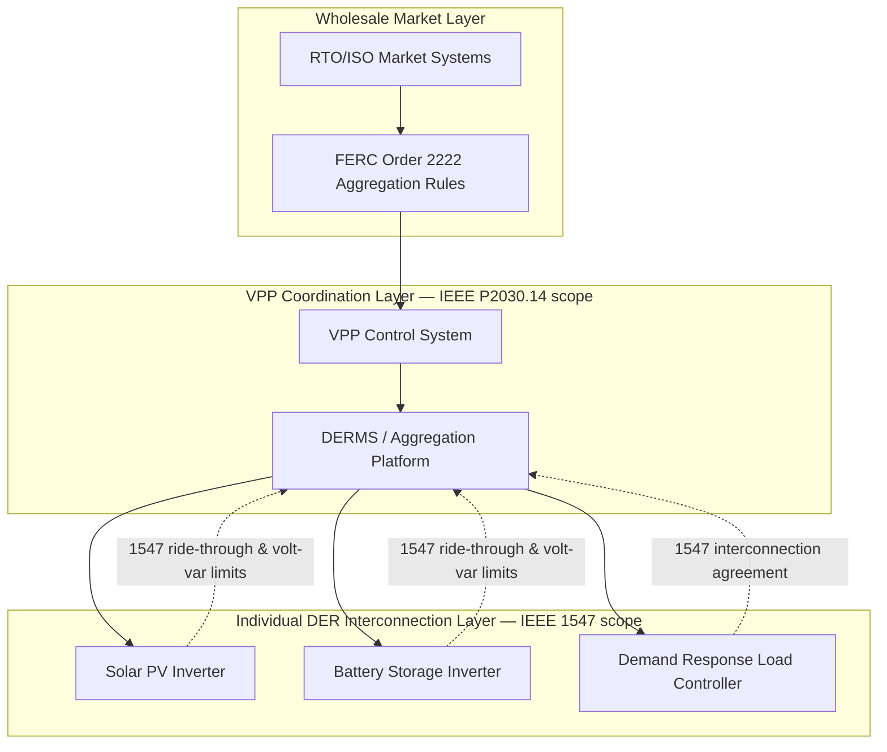

## IEEE 1547 and IEEE P2030.14 Interoperability Standards

### Overview and Relationship Between the Two Standards

**Key Points**

- IEEE 1547 is a mature, published, and binding-by-adoption interconnection standard governing how individual DERs physically and electrically interconnect with electric power systems.
- IEEE P2030.14 is an in-development (not yet published as of early 2026) Guide addressing the functional specification of Virtual Power Plants (VPPs) that aggregate and coordinate multiple DERs, including those governed at the individual-unit level by IEEE 1547.
- The two standards operate at different layers of the system: IEEE 1547 defines the "how do individual devices connect safely" layer; P2030.14 defines the "how do we functionally coordinate many connected devices as one dispatchable entity" layer.

**[Unverified]** As P2030.14 remains an active Working Group project without a finalized published standard, specific clause numbers, mandatory requirements, and finalized terminology described below reflect the working group's publicly disclosed scope and direction as of its most recent advisories, and are subject to change before formal IEEE-SA balloting and publication.

### IEEE 1547: Interconnection and Interoperability Fundamentals

**Key Points**

- Full title: IEEE Standard for Interconnection and Interoperability of Distributed Energy Resources with Associated Electric Power Systems Interfaces.
- The most significant modern revision is IEEE 1547-2018, which substantially updated the original 2003 standard (last amended 2014) to reflect high-penetration DER scenarios.
- IEEE 1547.1 is the companion conformance test standard; IEEE 1547.2 provides an application guide.

**Scope and applicability**

IEEE 1547-2018 applies to DERs interconnected with primary and secondary distribution circuits, covering:

- Voltage and frequency ride-through requirements (rather than simple trip-off behavior), enabling DERs to remain connected and support the grid during transient disturbances.
- Voltage regulation functions, including four selectable volt-var modes and volt-watt control, allowing inverter-based DERs to autonomously manage reactive and active power in response to local voltage conditions.
- Frequency-watt (frequency-droop) response for primary frequency support.
- Anti-islanding protection, ensuring a DER disconnects appropriately when the local grid is de-energized, to protect utility line workers.
- Communication and interoperability requirements referencing protocols such as IEEE 2030.5 (Smart Energy Profile), IEC 61850, DNP3, and SunSpec Modbus for monitoring and control interfaces.

**Key technical functions**

$$Q(V) = \begin{cases} Q_{max} & V \leq V_1 \\ Q_{max} - \dfrac{Q_{max}-Q_{min}}{V_2-V_1}(V-V_1) & V_1 < V < V_2 \\ Q_{min} & V \geq V_2 \end{cases}$$

The equation above represents a simplified piecewise-linear volt-var curve, where $Q(V)$ is the reactive power output as a function of measured terminal voltage $V$, and $V_1$, $V_2$ define the deadband and slope boundaries configured per utility or RTO/ISO requirements.

**Ride-through requirement categories**

IEEE 1547-2018 defines three performance categories (Category I, II, III) with progressively more stringent ride-through and disturbance-response requirements, with Category III generally required for higher-penetration or grid-supportive applications and often referenced by RTO/ISO interconnection procedures for aggregated resources.

### IEEE 1547 Voltage Ride-Through Curve (svg_diagram)

<svg xmlns="http://www.w3.org/2000/svg" viewBox="0 0 800 420" font-family="Arial, sans-serif">
<text x="400" y="26" font-size="17" font-weight="bold" text-anchor="middle">IEEE 1547 Voltage Ride-Through Region — Category III (svg_diagram)</text>

<line x1="80" y1="360" x2="740" y2="360" stroke="#333" stroke-width="1.5" />
<line x1="80" y1="360" x2="80" y2="50" stroke="#333" stroke-width="1.5" />
<text x="410" y="395" font-size="13" text-anchor="middle">Time (seconds)</text>
<text x="30" y="200" font-size="13" text-anchor="middle" transform="rotate(-90 30 200)">Voltage (p.u.)</text>

<line x1="80" y1="200" x2="740" y2="200" stroke="#999" stroke-width="1" stroke-dasharray="3,3" />
<text x="745" y="204" font-size="11" fill="#666">1.0 p.u.</text>

<polygon points="80,140 200,140 200,90 400,90 400,60 740,60 740,120 400,120 400,150 200,150 200,180 80,180" fill="`#bbf7d0`" opacity="0.5" />

<path d="M80,60 L740,60" stroke="#dc2626" stroke-width="1.5" stroke-dasharray="5,3" />
<text x="745" y="64" font-size="10" fill="#dc2626">1.20 p.u. trip</text>

<path d="M80,140 L200,140 L200,90 L400,90 L400,60" fill="none" stroke="#16a34a" stroke-width="2.5" />

<path d="M80,260 L150,260 L150,300 L300,300 L300,330 L740,330" fill="none" stroke="#2563eb" stroke-width="2.5" />

<path d="M80,340 L740,340" stroke="#dc2626" stroke-width="1.5" stroke-dasharray="5,3" />
<text x="745" y="344" font-size="10" fill="#dc2626">0.45 p.u. trip</text>

<text x="120" y="130" font-size="10" fill="`#16a34a`">Momentary OV cessation</text>

<text x="120" y="250" font-size="10" fill="`#2563eb`">Momentary UV cessation</text>

<text x="420" y="105" font-size="11" fill="`#166534`" font-weight="bold">Mandatory Ride-Through Zone</text>

<text x="80" y="380" font-size="10" text-anchor="middle">0</text>

<text x="200" y="380" font-size="10" text-anchor="middle">0.16s</text>

<text x="400" y="380" font-size="10" text-anchor="middle">2s</text>

<text x="740" y="380" font-size="10" text-anchor="middle">300s</text>

</svg>

### IEEE P2030.14: Virtual Power Plant Functional Specification Guide

**Key Points**

- Full working title: "Guide for Virtual Power Plant Functional Specification for Alternate and Multi-Source Generation."
- IEEE-SA approved the Project Authorization Request (PAR) for the P2030.14 Working Group on June 29, 2023.
- The Working Group reports to the IEEE PES Transmission & Distribution Committee, reflecting that VPP functional scope spans both transmission and distribution system interfaces.
- Working Group participants include utilities, technology vendors, National Labs, academia, ISOs/RTOs, DOE, FERC, and NERC — indicating an intentionally cross-stakeholder standard aimed at supporting practical FERC Order 2222 compliance implementations.

**Scope and objectives**

According to the Working Group's public advisories, P2030.14 is intended to:

1. **Define a VPP functionally** as an electric power plant capable of supplying electrical power to the grid and to local loads, aggregating heterogeneous ("alternate and multi-source") generation and storage assets.
2. **Specify VPP control system architecture**, addressing the basic functional building blocks needed to coordinate diverse, geographically distributed resources as a single dispatchable entity.
3. **Address integration requirements** for DERs into VPP structures such that grid integrity (voltage, frequency, and protection coordination) is maintained even as VPP-level aggregation abstracts away individual resource visibility from the wholesale/transmission-facing interface.
4. **Support interoperability** between VPP control platforms, DERMS, and grid operator (RTO/ISO, distribution utility) systems — directly complementing the operational needs created by FERC Order 2222 compliance filings.

[Inference] Because the guide is explicitly scoped to "alternate and multi-source generation" and involves DOE, FERC, and NERC as participants, its eventual published content will likely be structured to interoperate closely with FERC Order 2222 aggregation participation models and NERC reliability standards, though the specific normative cross-references cannot be confirmed until a public draft or final text is released.

### How IEEE 1547 and P2030.14 Interrelate

**Key Points**

- IEEE 1547 governs the individual DER-to-grid interconnection point; P2030.14 governs the aggregation and control layer that sits above many individually 1547-compliant DERs.
- A well-formed VPP architecture must ensure that aggregate-level dispatch instructions issued under a P2030.14-consistent control framework never command an individual DER to violate its IEEE 1547 interconnection agreement (e.g., commanding a reactive power setpoint that falls outside the DER's approved 1547 volt-var configuration).
- Communication interoperability protocols referenced by IEEE 1547 (such as IEEE 2030.5, IEC 61850, and DNP3) are likely candidates for reuse or reference within P2030.14's control system architecture, given the existing ecosystem of DER communication standards.

### Layered Standards Architecture (Mermaid)

### Practical Example: Coordinated Dispatch Respecting Interconnection Limits

Consider a VPP aggregating 60 residential solar-plus-storage systems, each interconnected under IEEE 1547-2018 Category III with a configured volt-var curve.

1. The RTO/ISO, under an Order 2222-compliant tariff, dispatches the VPP aggregation for 250 kW of reactive power support during a voltage excursion event.
2. The VPP control platform (functionally specified per P2030.14-guide principles) disaggregates this instruction across the 60 sites.
3. For each site, the control platform checks the site's individual IEEE 1547 volt-var configuration and available reactive power headroom (a function of current real power output and inverter apparent power rating) before issuing a local setpoint.
4. If a subset of sites cannot contribute their allocated share without violating their 1547-configured limits (e.g., an inverter already near its apparent power ceiling), the VPP control system must reallocate the shortfall across other available sites in near real time.

**Output**

The VPP successfully delivers the aggregate 250 kW reactive power dispatch to the RTO/ISO while every individual DER remains within its IEEE 1547 interconnection agreement — illustrating why a functional VPP specification (P2030.14) must be designed with explicit awareness of, and constraint-checking against, the interconnection standard (IEEE 1547) governing each underlying asset.

### Comparison of Standard Characteristics

| Attribute | IEEE 1547 | IEEE P2030.14 |
| --- | --- | --- |
| Document type | Standard (mandatory requirements) | Guide (non-mandatory recommended practice) |
| Current status | Published (2018 edition; active) | Working Group drafting stage (PAR approved June 2023) |
| Primary scope | Individual DER-to-grid electrical interconnection | VPP functional and control system architecture |
| System layer | Point of common coupling (PCC) | Aggregation / coordination layer above multiple PCCs |
| Sponsoring body | IEEE PES (Power System Relaying and Control / DER subcommittees) | IEEE PES Transmission & Distribution Committee |
| Companion standards | 1547.1 (conformance testing), 1547.2 (application guide) | Expected to reference existing DER communication/control standards |

### Related Topics

- IEEE 1547.1 Conformance Test Procedures for DER Interconnection
- IEEE 2030.5 (Smart Energy Profile) Communication Protocol
- IEC 61850 for Substation and DER Automation
- FERC Order 2222 and Wholesale Market Participation of DERs
- DERMS Architecture and VPP Control System Design
- IEEE P2800 Interconnection Standard for Transmission-Connected Inverter-Based Resources
- Volt-VAR and Volt-Watt Autonomous Inverter Functions
- NERC Reliability Standards Intersection with DER Aggregation