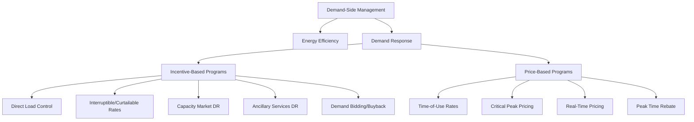

## Demand Response and Demand-Side Management

### Foundational Definitions and Distinctions

**Key Points**

- Demand-Side Management (DSM) is the umbrella discipline encompassing all utility- or grid-operator-initiated efforts to influence customer electricity consumption patterns, including energy efficiency, load shaping, and demand response.
- Demand Response (DR) is the specific subset of DSM focused on short-term, event-driven or price-driven changes in electricity consumption in response to grid conditions or price signals.
- The key distinction: energy efficiency permanently reduces consumption (a kWh saved every hour), while DR shifts or reduces consumption temporarily in response to a specific trigger (a kW reduced during a specific window).

DSM programs are typically categorized into:

1. **Energy Efficiency (EE)** — permanent reduction in energy consumption through improved equipment, insulation, lighting, or controls.
2. **Demand Response (DR)** — temporary, event-based load modification.
3. **Load Management / Load Shaping** — a broader category including valley-filling, peak clipping, load shifting, strategic conservation, and strategic load growth, of which DR is the primary event-driven mechanism.

### Classification of Demand Response Programs

**Key Points**

- DR programs are broadly split into incentive-based programs (IBPs) and price-based programs (PBPs).
- Incentive-based programs pay customers to reduce load on request; price-based programs rely on customers voluntarily responding to time-varying prices.
- Programs also differ by dispatch mechanism: utility/RTO-dispatched (direct load control, capacity/reliability programs) versus customer-initiated (economic/price-responsive).

**Incentive-Based Programs (IBPs)**

- **Direct Load Control (DLC)**: Utility remotely cycles or shuts off customer equipment (typically residential air conditioners, water heaters) during peak events, usually with a bill credit or rebate.
- **Interruptible/Curtailable Rates**: Large commercial/industrial customers agree contractually to curtail load on request in exchange for reduced rates, with penalties for non-compliance.
- **Demand Bidding/Buyback Programs**: Customers submit bids specifying how much load they will curtail at a given price.
- **Emergency Demand Response Programs (EDRP)**: Voluntary programs activated only during system emergencies (e.g., PJM's EDRP, ISO-NE's Real-Time Demand Response).
- **Capacity Market DR**: DR resources bid into capacity markets (e.g., PJM's Reliability Pricing Model, ISO-NE's Forward Capacity Market) as a substitute for generation capacity, receiving capacity payments in exchange for a firm curtailment obligation during system peak or emergency conditions.
- **Ancillary Services DR**: Fast-responding loads (or aggregations) provide frequency regulation or reserves, similar to DER Aggregation participation enabled by FERC Order 2222.

**Price-Based Programs (PBPs)**

- **Time-of-Use (TOU) rates**: Fixed price blocks that vary by time of day/season (e.g., higher afternoon/evening rates).
- **Critical Peak Pricing (CPP)**: A much higher price applied on a limited number of pre-designated critical peak days/hours, layered on top of a TOU or flat rate.
- **Real-Time Pricing (RTP)**: Prices vary hourly (or sub-hourly) reflecting wholesale market conditions, requiring customers or automated systems to respond dynamically.
- **Peak Time Rebate (PTR)**: Customers are paid a rebate for reducing consumption below a calculated baseline during designated peak events, without penalty for non-participation (an "opt-in upside" structure).

### DR Program Taxonomy (Mermaid)

### Technical Architecture of a Demand Response System

**Key Points**

- A DR delivery pipeline requires signal generation (utility/RTO), signal transport (communication standard), and load-side execution (building/facility automation or smart devices).
- OpenADR (Open Automated Demand Response) is the predominant industry communications standard for automating DR signal delivery.
- Baseline calculation methodology is the technical foundation for measuring and verifying DR performance and settlement, particularly in capacity and economic DR programs.

**Signal chain components**

1. **DR signal origination**: A utility, RTO/ISO, or DR aggregator issues an event notification (often via OpenADR 2.0a/2.0b) specifying event start time, duration, and target reduction magnitude or price signal.
2. **Communication transport**: OpenADR uses a VTN (Virtual Top Node, the signal issuer) to VEN (Virtual End Node, the signal recipient, typically a building energy management system or DR aggregator gateway) architecture over a RESTful/XML or EXI-encoded payload.
3. **Building/facility-level execution**: A Building Automation System (BAS), smart thermostat, or industrial process controller executes the pre-configured curtailment strategy (e.g., raising cooling setpoint by 2°C, dimming non-critical lighting, shifting a batch process).
4. **Measurement and verification (M&V)**: Interval metering data is compared against a calculated baseline to determine actual performance for settlement.

**Baseline methodologies**

Common baseline calculation approaches include:

- **Average of X of Y days**: Average consumption from a specified number of similar recent non-event days (e.g., "10 of 10" or "high 4 of 5" methodologies commonly used in PJM).
- **Regression-based baselines**: Statistical models incorporating weather and calendar variables for improved accuracy, especially for weather-sensitive loads like HVAC.
- **Day-of adjustment**: A same-day scaling factor applied to the historical baseline using pre-event hours to correct for day-specific deviations from the historical average.

$$B_{adj}(t) = B_{hist}(t) \cdot \frac{\bar{P}_{pre-event}}{\bar{P}_{hist,pre-event}}$$

Where $B_{adj}(t)$ is the day-of adjusted baseline at time $t$, $B_{hist}(t)$ is the historical average baseline, $\bar{P}_{pre-event}$ is the average metered load in the pre-event adjustment window on the event day, and $\bar{P}_{hist,pre-event}$ is the average metered load in the same window across the historical baseline days.

### DR Signal and Execution Flow (svg_diagram)

<svg xmlns="http://www.w3.org/2000/svg" viewBox="0 0 880 400" font-family="Arial, sans-serif">
<text x="440" y="26" font-size="17" font-weight="bold" text-anchor="middle">OpenADR Signal Flow and Load Execution (svg_diagram)</text>
<rect x="30" y="70" width="170" height="70" rx="8" fill="#dcfce7" stroke="#16a34a" stroke-width="2" />
<text x="115" y="98" font-size="13" font-weight="bold" text-anchor="middle">RTO/ISO or Utility</text>
<text x="115" y="116" font-size="11" text-anchor="middle" fill="#555">(OpenADR VTN)</text>
<text x="115" y="130" font-size="10" text-anchor="middle" fill="#777">Issues DR Event</text>
<line x1="200" y1="105" x2="290" y2="105" stroke="#333" stroke-width="2" marker-end="url(#a1)" />
<text x="245" y="95" font-size="10" text-anchor="middle">Event Signal</text>
<rect x="290" y="70" width="170" height="70" rx="8" fill="#fef3c7" stroke="#d97706" stroke-width="2" />
<text x="375" y="98" font-size="13" font-weight="bold" text-anchor="middle">DR Aggregator</text>
<text x="375" y="116" font-size="11" text-anchor="middle" fill="#555">(OpenADR VEN/VTN)</text>
<text x="375" y="130" font-size="10" text-anchor="middle" fill="#777">Fans out to portfolio</text>
<line x1="460" y1="105" x2="550" y2="105" stroke="#333" stroke-width="2" marker-end="url(#a1)" />
<rect x="550" y="30" width="170" height="60" rx="8" fill="#dbeafe" stroke="#2563eb" stroke-width="1.5" />
<text x="635" y="55" font-size="12" font-weight="bold" text-anchor="middle">Commercial BAS</text>
<text x="635" y="72" font-size="10" text-anchor="middle" fill="#555">HVAC setpoint shift</text>
<rect x="550" y="105" width="170" height="60" rx="8" fill="#dbeafe" stroke="#2563eb" stroke-width="1.5" />
<text x="635" y="130" font-size="12" font-weight="bold" text-anchor="middle">Industrial Controller</text>
<text x="635" y="147" font-size="10" text-anchor="middle" fill="#555">Process load shift</text>
<rect x="550" y="180" width="170" height="60" rx="8" fill="#dbeafe" stroke="#2563eb" stroke-width="1.5" />
<text x="635" y="205" font-size="12" font-weight="bold" text-anchor="middle">Smart Thermostat</text>
<text x="635" y="222" font-size="10" text-anchor="middle" fill="#555">Residential setback</text>
<line x1="460" y1="120" x2="550" y2="60" stroke="#333" stroke-width="1.5" marker-end="url(#a1)" />
<line x1="460" y1="135" x2="550" y2="210" stroke="#333" stroke-width="1.5" marker-end="url(#a1)" />

<path d="M635,240 C635,300 375,300 375,140" fill="none" stroke="#7c3aed" stroke-width="1.5" stroke-dasharray="5,3" marker-end="url(#a2)" />
<text x="500" y="310" font-size="10" fill="#7c3aed">Metered performance (M&amp;V)</text>
<rect x="30" y="180" width="170" height="80" rx="8" fill="#fee2e2" stroke="#dc2626" stroke-width="1.5" />
<text x="115" y="208" font-size="12" font-weight="bold" text-anchor="middle">Settlement</text>
<text x="115" y="226" font-size="10" text-anchor="middle" fill="#555">Baseline vs. actual</text>
<text x="115" y="242" font-size="10" text-anchor="middle" fill="#555">Payment calculation</text>
<path d="M115,180 C115,150 115,150 200,110" fill="none" stroke="#dc2626" stroke-width="1.5" stroke-dasharray="4,3" marker-end="url(#a3)" />
</svg>

### Practical Example: Commercial Building DR Event Response

Consider a commercial office building enrolled in an RTO capacity DR program, with a calculated baseline of 850 kW during the relevant event window.

1. **Event notification**: The RTO's VTN issues an OpenADR event notification the prior day: event window 2:00 PM–6:00 PM, target reduction of 150 kW (approximately 18% of baseline).
2. **BAS pre-event staging**: The building automation system pre-cools the building starting at 1:00 PM, lowering interior temperature by 1°C below normal setpoint to build thermal mass "storage" ahead of the event.
3. **Event execution**: At 2:00 PM, the BAS raises cooling setpoints by 2°C, dims non-critical corridor and parking-garage lighting by 30%, and staggers elevator bank operation.
4. **Real-time monitoring**: Interval metering (typically 15-minute or 5-minute intervals) tracks actual demand throughout the event window against the day-of adjusted baseline.

**Output**

Metered demand during the event averages 705 kW against an adjusted baseline of 850 kW, yielding a verified reduction of 145 kW —97% of the target — which is settled according to the program's performance-payment structure (commonly a per-kW capacity payment scaled by performance ratio, with a minimum performance threshold, often around 80–90%, required to avoid a non-performance penalty).

### Behavioral and Technology-Enabled Demand Response

**Key Points**

- Behavioral Demand Response (BDR) uses non-device-based interventions — home energy reports, notifications, gamification — to encourage voluntary conservation, typically yielding smaller but lower-cost-per-participant reductions.
- Automated Demand Response (ADR) removes the human decision step entirely, using pre-programmed control logic triggered directly by the DR signal.
- Grid-interactive efficient buildings (GEBs) represent a convergence point where efficiency, DR, and on-site DERs are jointly optimized through a unified building energy management strategy.

[Inference] As smart thermostats, connected water heaters, and residential battery/EV-integrated DR programs proliferate, the boundary between traditional utility-run DLC and DER-Aggregator-run FERC Order 2222 wholesale participation is likely to blur further at the residential scale, though the specific regulatory treatment (retail DR program vs. wholesale DER aggregation) depends on program design choices made by individual utilities and RTO/ISOs rather than a settled industry-wide convention.

### Economic and Grid Reliability Value of DR

**Key Points**

- DR reduces the need for peaking generation capacity, deferring transmission/distribution infrastructure upgrades, and can suppress wholesale market clearing prices during high-demand periods (a phenomenon often termed the "demand response price-suppression effect").
- DR provides a fast, often lower-cost alternative to fast-ramping generation for balancing services, especially valuable as variable renewable generation penetration increases net load volatility (the "duck curve" phenomenon).
- Cost-effectiveness is typically evaluated using standardized utility cost-effectiveness tests (e.g., the Total Resource Cost test, Program Administrator Cost test, Ratepayer Impact Measure test).

**Duck curve context**

As solar penetration increases, net load (total load minus variable renewable generation) exhibits a steep evening ramp as solar output declines while demand remains elevated. DR programs — particularly those targeting evening peak load shifting or pre-cooling strategies that shift consumption earlier in the day — are increasingly positioned as a tool to flatten this ramp alongside battery storage.

### Related Topics

- FERC Order 2222 and Wholesale Market Participation of DERs
- OpenADR 2.0/3.0 Protocol Architecture and VTN/VEN Communication
- Grid-Interactive Efficient Buildings (GEB) Design Principles
- Baseline Methodologies for DR Measurement and Verification
- Time-of-Use and Dynamic Pricing Rate Design
- Duck Curve and Net Load Ramp Management Strategies
- Building Automation Systems (BAS) and HVAC Load Control Integration
- Capacity Market Design and DR Resource Adequacy Contribution