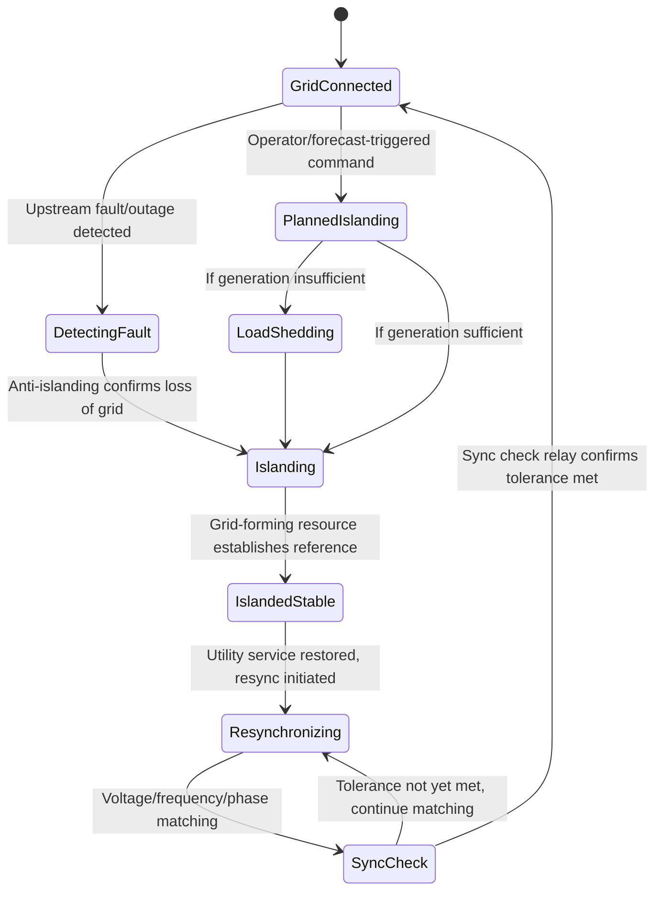

## Grid-Connected and Islanded Operating Modes

### Fundamental Mode Definitions

**Key Points**

- Grid-connected mode is the operating state in which a microgrid or DER is electrically synchronized with, and exchanges power with, the upstream utility distribution system through a closed Point of Common Coupling (PCC).
- Islanded mode (or island mode) is the operating state in which the microgrid is electrically isolated from the upstream utility, with the PCC open, and internal resources solely responsible for serving internal load and maintaining voltage/frequency stability.
- The transition between these two modes — in either direction — is the most operationally and technically demanding aspect of microgrid control, requiring coordinated action across protection, control, and communication systems.

### Grid-Connected Mode Operation

**Key Points**

- In grid-connected mode, the utility grid effectively acts as an infinite bus, providing the voltage and frequency reference that all DER inverters synchronize to (grid-following operation).
- DERs in this mode typically operate in a power-dispatch or power-following control mode, injecting or absorbing power according to economic dispatch, DR signals, or FERC Order 2222-style wholesale market instructions, without needing to independently regulate system-wide frequency.
- Protection coordination in grid-connected mode is designed around utility-supplied fault current levels, which are substantially higher than inverter-limited fault currents available in islanded mode.

**Grid-following inverter behavior**

Grid-following inverters use a Phase-Locked Loop (PLL) to track the voltage phase angle of the external grid and inject current synchronized to that reference. The controlled variable is typically active and reactive current injection, not voltage or frequency, since the latter are established externally by the bulk grid.

$$I_{ref} = \frac{P_{ref}}{V_{grid}} \cos(\theta) + j\frac{Q_{ref}}{V_{grid}}\sin(\theta)$$

Where $I_{ref}$ is the commanded current injection, $P_{ref}$ and $Q_{ref}$ are the active/reactive power setpoints from the dispatch layer, $V_{grid}$ is the measured grid voltage magnitude, and $\theta$ is the phase angle tracked by the PLL.

**Grid-connected functions per IEEE 1547**

Under IEEE 1547-2018, grid-connected DERs are required to support:

- Voltage ride-through (remaining connected through transient voltage excursions rather than tripping).
- Frequency ride-through.
- Autonomous voltage regulation (volt-var, volt-watt) and frequency-watt response.
- Anti-islanding protection — actively detecting unintentional loss of grid connection and disconnecting to protect personnel and equipment, unless the system is specifically designed and certified for intentional islanding.

### Islanded Mode Operation

**Key Points**

- In islanded mode, no external grid reference exists, so at least one resource within the microgrid must operate in grid-forming mode, establishing the voltage magnitude and frequency that all other resources synchronize to.
- Islanded mode typically requires more conservative operational margins (frequency and voltage bands) and active load-generation balancing, since the "infinite bus" cushioning effect of the bulk grid is no longer available.
- System inertia is dramatically lower in islanded, inverter-dominated microgrids compared to grid-connected operation backed by the bulk power system's rotating mass, making frequency response speed and control tuning critical.

**Grid-forming inverter behavior**

Grid-forming inverters behave as a controlled voltage source behind an internal impedance (analogous to a synchronous generator's internal EMF and reactance), autonomously setting voltage magnitude and frequency according to droop characteristics rather than tracking an external reference.

$$\omega = \omega_0 - m_p P$$

$$V = V_0 - n_q Q$$

These are the same droop relationships used in primary control (see Microgrid Control Hierarchies), but in islanded mode they are the *sole* mechanism establishing system frequency and voltage — there is no external grid to fall back on if droop parameters are poorly tuned or if resources reach their capacity limits.

**Islanded protection challenges**

With no utility fault current contribution, available fault current is limited to the sum of inverter current limits (commonly 1.1–1.5 per-unit of rated current for most grid-forming/grid-following inverters, versus many multiples of rated current from a utility source). This substantially reduces the ability of conventional overcurrent protection schemes to reliably discriminate faults, often requiring adaptive protection schemes, differential protection, or communication-assisted protection specifically configured for islanded operation.

### Mode Comparison Table

| Attribute | Grid-Connected Mode | Islanded Mode |
| --- | --- | --- |
| Voltage/frequency reference | External utility grid | Internal grid-forming resource(s) |
| Inverter control mode | Grid-following (current source) | Grid-forming (voltage source) required for at least one unit |
| Fault current availability | High (utility-backed) | Low (inverter-limited, ~1.1–1.5 p.u.) |
| System inertia | High (bulk grid rotating mass) | Low (unless synchronous generator present) |
| Frequency/voltage tolerance bands | Wide (utility-regulated, IEEE 1547 ride-through) | Often narrower, actively managed |
| Economic dispatch objective | Cost minimization, market participation, DR | Load-generation balance, critical load prioritization |
| Anti-islanding protection | Active (must trip on unintentional islanding) | N/A (intentional islanding, protection scheme differs) |

### Mode Transition Mechanics

**Key Points**

- Transition from grid-connected to islanded mode can be either unintentional (triggered by an upstream fault or outage, requiring rapid anti-islanding detection and disconnection) or intentional/planned (triggered proactively, e.g., ahead of forecast severe weather or for scheduled maintenance).
- Transition from islanded back to grid-connected mode always requires an active resynchronization process, matching voltage magnitude, frequency, and phase angle before the PCC breaker recloses.
- A poorly executed resynchronization (closing the PCC breaker while out of phase) can produce a severe transient current and torque event, potentially damaging equipment — making synchronization check relays (25 device, per ANSI/IEEE numbering) a mandatory protection element at the PCC.

**Unintentional islanding detection**

Anti-islanding schemes fall into two categories:

1. **Passive methods**: Monitor local voltage, frequency, or rate-of-change-of-frequency (ROCOF) for anomalies indicating loss of grid, without injecting any disturbance. Fast and simple but can fail to detect islanding when local generation and load are closely balanced (a known "non-detection zone" problem).
2. **Active methods**: Deliberately inject a small perturbation (e.g., a slight frequency or reactive power shift) and monitor the system's response; if the response indicates loss of the stiff grid reference, islanding is confirmed. More reliable but introduces minor power quality disturbance during normal grid-connected operation.

**Planned islanding sequence**

1. Tertiary control layer receives the islanding command (operator-initiated or automated based on forecast/alert).
2. Non-critical loads are shed if generation/storage capacity is insufficient to cover full campus/facility load.
3. PCC breaker is commanded open under controlled conditions (as opposed to fault-cleared opening).
4. Pre-designated grid-forming resource (typically a BESS with grid-forming inverter firmware, or a synchronous generator) immediately assumes the voltage/frequency reference role.
5. Secondary control corrects any transient droop-induced deviation to stabilize at the islanded-mode nominal setpoint.

**Resynchronization sequence**

1. The microgrid controller monitors utility-side voltage and frequency via PCC instrumentation.
2. The islanded microgrid's grid-forming resource incrementally adjusts its frequency and phase angle to match the utility reference (a "slip frequency" matching process, targeting a small positive slip to ensure convergence).
3. A synchronization check relay confirms voltage magnitude difference, frequency difference, and phase angle difference are all within acceptable tolerance windows (commonly within a few percent voltage, a few tenths of a Hz frequency, and a few electrical degrees phase).
4. The PCC breaker closes, re-establishing the electrical connection.
5. Control authority transitions back to grid-following mode for the previously grid-forming resource, and tertiary control resumes grid-connected economic dispatch objectives.

### Mode Transition State Diagram (Mermaid)

### Practical Example: Unintentional Islanding Event Sequence

Consider a commercial microgrid with 1.5 MW solar PV, a 2 MW/4 MWh BESS (grid-forming capable), and standard commercial loads averaging 1.2 MW.

1. **Fault occurrence**: An upstream utility feeder fault causes a voltage collapse detected at the PCC.
2. **Anti-islanding trip**: Passive ROCOF-based detection (backed by an active perturbation method for the non-detection zone) confirms loss of grid within approximately 2 cycles of the fault, and the PCC breaker opens.
3. **Automatic transition**: The BESS inverter, pre-configured with grid-forming firmware and highest droop priority, immediately begins sourcing the internal voltage/frequency reference. Because BESS capacity (2 MW) exceeds instantaneous facility load (1.2 MW average, with normal diversity), no load shedding is required.
4. **Stabilization**: Secondary control within the microgrid controller corrects the initial droop-induced frequency dip back to islanded nominal (e.g., 60.00 Hz) within several seconds.
5. **Sustained operation**: Solar PV continues operating in grid-following mode relative to the BESS-established reference, with the BESS absorbing/releasing power to balance the intermittent solar output against load.
6. **Utility restoration and resync**: Once utility crews restore the upstream feeder, the microgrid controller detects stable utility voltage/frequency at the PCC and initiates the resynchronization sequence, gradually adjusting the BESS-established frequency to match the returning utility reference.

**Output**

The synchronization check relay confirms all tolerance criteria are met after approximately 30–90 seconds of active matching (duration is system- and configuration-dependent), the PCC breaker recloses without transient disturbance, and the BESS inverter transitions back to grid-following economic dispatch mode, resuming normal grid-connected operation.

### Related Topics

- Microgrid Architectures and Control Hierarchies
- Grid-Forming vs. Grid-Following Inverter Control
- Anti-Islanding Protection: Passive and Active Detection Methods
- Synchronization Check Relay (ANSI 25) Application and Settings
- Protection Coordination Challenges in Low-Fault-Current Islanded Systems
- Black Start Procedures and Resource Sequencing
- IEEE 1547 and IEEE P2030.14 Interoperability Standards
- Frequency and Voltage Ride-Through Requirements for DERs