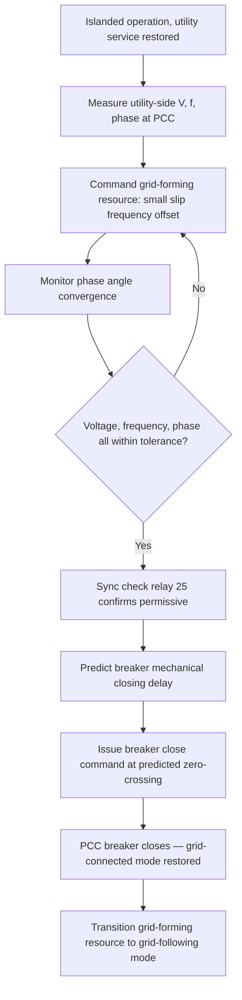

## Seamless Transition and Resynchronization Control

### Concept and Motivation

**Key Points**

- Seamless transition refers to a microgrid's ability to switch between grid-connected and islanded operating modes without a perceptible interruption in voltage or frequency supplied to critical loads — ideally with no loss of power quality that would trip sensitive downstream equipment.
- The term is most rigorously applied to the grid-connected-to-islanded transition (unplanned islanding), where "seamless" specifically means avoiding the momentary loss of voltage that conventional break-before-make islanding schemes introduce.
- Resynchronization control governs the reverse transition (islanded-to-grid-connected), and while it cannot be instantaneous by nature (voltage, frequency, and phase must be actively matched), a well-tuned resynchronization scheme minimizes the transient disturbance at the moment of reclosure.

Conventional (non-seamless) islanding relies on a "break-before-make" sequence: the PCC breaker opens first (break), after which the microgrid's internal control detects the loss of grid reference and only then transitions a resource into grid-forming mode (make). This inherently introduces a brief voltage interruption — often tens to hundreds of milliseconds — during the detection and control-mode-switch interval, which can be sufficient to disrupt sensitive loads (data centers, precision manufacturing, medical equipment) even though the outage is far shorter than a conventional utility restoration time.

### Seamless Transfer Architecture

**Key Points**

- Seamless transfer is achieved by having the designated grid-forming resource continuously track the grid voltage and phase angle *before* the transition occurs, so that when the PCC breaker opens, the resource's internal voltage reference is already synchronized and requires no discontinuous jump.
- This requires the grid-forming (or "dual-mode") inverter's control system to run a synchronization/tracking loop in parallel with its normal grid-connected current-control loop, ready to switch its output stage from current-source to voltage-source behavior at the instant of islanding.
- The control-mode switch itself (current-source to voltage-source) must occur within a very short window (typically sub-cycle to a few cycles) to avoid a detectable voltage dip or phase jump.

**Dual-mode inverter control concept**

A seamless-transfer-capable inverter maintains two control loops simultaneously during grid-connected operation:

1. **Active control loop**: The standard grid-following current control loop, actually commanding the inverter's power electronics based on $P_{ref}$/$Q_{ref}$ dispatch setpoints.
2. **Shadow/standby control loop**: A voltage-control (droop-based) loop that is continuously calculated (but not applied to the physical output) using the same real-time voltage and frequency measurements, so its internal state (integrator values, reference angle) stays aligned with actual grid conditions at all times.

When islanding is triggered, control authority switches from the active current-loop to the pre-synchronized standby voltage-loop, and because the standby loop's reference was already tracking actual grid conditions, the transition produces a minimal voltage discontinuity.

$$\Delta V_{transfer} = |V_{grid}(t^-) - V_{island,ref}(t^+)|$$

Where $\Delta V_{transfer}$ is the transfer voltage discontinuity, $V_{grid}(t^-)$ is the grid voltage the instant before islanding, and $V_{island,ref}(t^+)$ is the islanded-mode voltage reference the instant after transition; a well-designed seamless transfer scheme minimizes this quantity toward zero.

### Seamless Transfer Sequence (svg_diagram)

<svg xmlns="http://www.w3.org/2000/svg" viewBox="0 0 880 380" font-family="Arial, sans-serif">
<text x="440" y="26" font-size="17" font-weight="bold" text-anchor="middle">Seamless vs. Conventional Islanding Transfer (svg_diagram)</text>

<text x="30" y="70" font-size="13" font-weight="bold" fill="`#dc2626`">Conventional (break-before-make)</text>

<line x1="30" y1="110" x2="850" y2="110" stroke="#999" stroke-width="1" stroke-dasharray="2,2" />

<path d="M30,110 L400,110 L400,180 L470,180 L470,110 L850,110" fill="none" stroke="`#dc2626`" stroke-width="2.5" />

<text x="410" y="200" font-size="10" fill="`#dc2626`">Voltage interruption</text>

<text x="400" y="130" font-size="10" fill="#666">Grid loss</text>

<text x="470" y="130" font-size="10" fill="#666">GF mode active</text>

<text x="30" y="240" font-size="13" font-weight="bold" fill="`#16a34a`">Seamless Transfer</text>

<line x1="30" y1="280" x2="850" y2="280" stroke="#999" stroke-width="1" stroke-dasharray="2,2" />

<path d="M30,280 L400,280 L410,278 L850,278" fill="none" stroke="`#16a34a`" stroke-width="2.5" />

<text x="400" y="300" font-size="10" fill="`#16a34a`">Minimal transient (control authority switch, no voltage gap)</text>

<text x="400" y="260" font-size="10" fill="#666">Standby loop pre-synchronized</text>

<line x1="400" y1="330" x2="400" y2="60" stroke="#333" stroke-width="1" stroke-dasharray="4,2" />
<text x="400" y="350" font-size="10" text-anchor="middle" fill="#333">Islanding trigger instant</text>
</svg>

### Resynchronization Control Design

**Key Points**

- Resynchronization is fundamentally a control problem of driving three simultaneous error terms — voltage magnitude difference, frequency difference, and phase angle difference — to within acceptable tolerance bands before permitting breaker reclosure.
- Frequency matching is typically achieved by commanding the islanded grid-forming resource to adopt a small deliberate frequency offset ("slip") relative to the utility reference, causing the phase angle difference to steadily converge toward zero in a predictable, monotonic manner rather than oscillating.
- A synchronization check relay (ANSI device number 25) provides the final permissive interlock, independently verifying that all three parameters are within tolerance immediately before allowing the breaker close command to execute.

**Typical synchronization tolerance windows**

While exact values are utility- and equipment-specific, commonly referenced industry tolerance bands for automatic synchronization include:

- Voltage magnitude difference: within approximately 2–5% of nominal.
- Frequency difference: within approximately 0.05–0.5 Hz (tighter bands generally preferred to minimize transient torque/current at closure).
- Phase angle difference: within approximately 5–10 electrical degrees.

**[Unverified]** Exact tolerance values are set per utility interconnection standards, equipment manufacturer specifications, and the specific synchronizing relay's configurable settings; the ranges above represent commonly cited industry practice rather than a single universal numeric standard, and the applicable interconnection agreement or relay manual should always govern actual settings.

**Slip-frequency matching technique**

Rather than attempting to instantaneously match frequency exactly (which risks overshoot and oscillatory convergence), the resynchronization controller commands the islanded system to run at a small, controlled frequency offset (commonly a fraction of a Hz above or below the utility frequency). This causes the phase angle between the two systems to change at a slow, predictable rate:

$$\frac{d\theta}{dt} = 2\pi (f_{island} - f_{grid}) = 2\pi \Delta f_{slip}$$

The controller monitors $\theta(t)$ and, once it approaches zero (in phase) while $\Delta f_{slip}$ and voltage magnitude are also within tolerance, issues the breaker close command at the predicted zero-crossing instant, accounting for the breaker's own mechanical closing time delay.

### Resynchronization Control Loop (Mermaid)

### Practical Example: Resynchronization After Extended Islanding

Consider a hospital campus microgrid that has been islanded for 6 hours during a utility outage, powered by a diesel generator (grid-forming) and supplemented by solar PV.

1. **Utility restoration signal**: The microgrid controller detects stable voltage returning on the utility side of the open PCC breaker, sustained for a qualification period (commonly 5 minutes per many utility interconnection requirements, to avoid resynchronizing against a transient or unstable restoration).
2. **Frequency slip command**: The controller commands the diesel generator's governor to adopt a slip frequency of +0.1 Hz relative to the measured utility frequency (e.g., islanded system running at 60.10 Hz against a 60.00 Hz utility reference).
3. **Phase convergence monitoring**: With a 0.1 Hz slip, the phase angle between the two systems cycles through 360 degrees approximately every 10 seconds, giving the controller a fast, predictable opportunity to catch a low phase-error window.
4. **Voltage magnitude trim**: Simultaneously, the generator's automatic voltage regulator (AVR) is trimmed to bring voltage magnitude within the required tolerance band of the utility-side measurement.
5. **Sync check confirmation and closure**: When phase angle passes through a near-zero window with voltage and frequency already within tolerance, the sync check relay issues its permissive, and the breaker close command is sent, accounting for the breaker's mechanical delay (commonly 3–8 cycles) to target closure precisely at the zero-phase-angle instant.

**Output**

The PCC breaker recloses with a measured inrush transient well within the facility's protective relay settings (no protective trip), and control authority for the diesel generator and BESS transitions smoothly from grid-forming/droop mode back to grid-following economic dispatch, restoring normal grid-connected operation without disrupting hospital critical loads throughout the transition.

### Common Technical Challenges

**Key Points**

- Achieving true seamless transfer requires very fast, precise voltage/current sensing and control computation, making it more demanding (and often more costly) to implement than conventional break-before-make schemes, and not all commercial inverter/controller platforms support it.
- Resynchronization after long islanding durations, or when islanded frequency has drifted due to droop-based load-following, can require a longer slip-matching period than resynchronization after a brief islanding event.
- Multiple grid-forming resources within a single islanded microgrid must have their own internal synchronization pre-coordinated (via the secondary control layer) before the overall microgrid resynchronizes with the utility, adding a layer of complexity to multi-source microgrids compared to single-generator systems.

[Inference] Given the increasing deployment of grid-forming BESS inverters (which can adjust output far faster than mechanical generator governors and AVRs), resynchronization events in modern battery-storage-anchored microgrids are likely to achieve tolerance-band convergence considerably faster than in generator-anchored microgrids, though actual achieved times depend heavily on the specific inverter firmware, control tuning, and utility-mandated qualification/dwell periods, which vary and are not universally standardized.

### Related Topics

- Microgrid Architectures and Control Hierarchies
- Grid-Connected and Islanded Operating Modes
- Grid-Forming vs. Grid-Following Inverter Control
- Synchronization Check Relay (ANSI 25) Application and Settings
- Droop Control Design and Parameter Tuning
- Anti-Islanding Protection: Passive and Active Detection Methods
- Black Start Procedures and Resource Sequencing
- Protection Coordination Challenges in Low-Fault-Current Islanded Systems