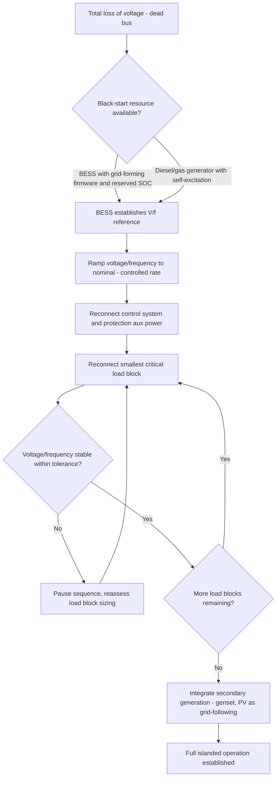

## Black Start Capability from Distributed Resources

### Concept and Traditional Context

**Key Points**

- Black start refers to the process of restoring a power system to operation from a complete shutdown (total loss of voltage, or "dead bus" condition) without relying on external electrical supply from the wider grid.
- In traditional bulk power system practice, black start is provided by dedicated black-start generating units (typically hydro units or small gas turbines with independent starting power, such as diesel-driven starting motors or batteries) designated under NERC reliability standards and utility restoration plans.
- Distributed Resource (DER) black start extends this same fundamental concept down to the microgrid or local distribution level, using inverter-based resources — primarily battery energy storage systems (BESS) — as the black-start-capable asset instead of, or in addition to, conventional generators.

The essential technical requirement for any black-start-capable resource, conventional or distributed, is the ability to energize a de-energized system from zero voltage without an external reference — meaning the resource must operate in grid-forming mode from the very first instant of energization, establishing both voltage magnitude and frequency autonomously.

### Why Black Start Is Non-Trivial for Inverter-Based Resources

**Key Points**

- Conventional synchronous generators inherently produce a voltage waveform via mechanical rotation and electromagnetic induction the moment they are spun up, making black start a matter of governor/excitation control rather than a fundamentally different operating mode.
- Grid-following inverters (the dominant configuration for standard grid-tied solar and storage installations) cannot black start at all, because their control architecture requires an existing external voltage/frequency reference (via a Phase-Locked Loop) to synchronize to — with no external reference present, the inverter has nothing to lock onto and will not operate.
- Only grid-forming inverters, purpose-built or reconfigured to autonomously establish voltage and frequency via droop or virtual synchronous machine control, are capable of black start.

**Sequencing challenge for solar PV**

Solar PV inverters present a specific complication: even where a PV inverter is technically capable of grid-forming operation, solar generation is inherently variable and non-dispatchable — it cannot be commanded to produce a specific amount of power on demand (it can only be curtailed below its available irradiance-driven maximum). This makes PV inverters unsuitable as the *primary* black-start reference source in most designs; PV is instead typically integrated as a grid-following resource relative to a BESS or generator that has already established the black-start reference, contributing energy only once the local grid-forming reference is stable.

### Black Start Sequence Using BESS

**Key Points**

- A BESS with grid-forming inverter capability, sufficient stored energy, and appropriate control firmware is currently the most common practical black-start resource for microgrids and DER-based local restoration.
- The BESS must have sufficient state of charge reserved (often via a dedicated "black start reserve" state-of-charge floor never used for normal economic dispatch) to guarantee availability when needed.
- Sequential load pickup (adding loads incrementally rather than all at once) is essential, since a BESS's transient power capability, while often high, is still finite, and reconnecting large blocks of load simultaneously can cause a voltage/frequency excursion that trips the newly re-energized system.

**Sequence steps**

1. **Reference establishment**: The BESS inverter, configured for grid-forming operation, energizes the local bus from zero voltage, ramping up to nominal voltage and frequency over a controlled interval (to avoid an instantaneous voltage step that could stress transformers or other equipment via inrush).
2. **Auxiliary/critical control load pickup**: The smallest, most essential loads are reconnected first — often the microgrid's own control system power supplies, communication equipment, and protection relay auxiliary power, ensuring the restoration process itself remains observable and controllable.
3. **Incremental load block reconnection**: Larger load blocks are reconnected sequentially, with the BESS's grid-forming control monitoring voltage and frequency response after each block, pausing or slowing the sequence if the response approaches stability limits.
4. **Secondary generation resource integration**: Once the bus is stable, other resources (diesel/gas generators, which may still require synchronization to the now-established BESS reference; solar PV, integrated as grid-following) are brought online to relieve the BESS and begin serving load directly, preserving BESS state of charge for continued frequency support.
5. **Full local restoration**: The microgrid reaches its target islanded operating state, sustaining critical loads until either utility service is restored (triggering resynchronization) or the islanded period continues under sustained internal generation.

### Black Start Sequence (svg_diagram)

<svg xmlns="http://www.w3.org/2000/svg" viewBox="0 0 880 420" font-family="Arial, sans-serif">
<text x="440" y="26" font-size="17" font-weight="bold" text-anchor="middle">BESS-Initiated Black Start Sequence (svg_diagram)</text>
<rect x="40" y="60" width="180" height="60" rx="8" fill="#fee2e2" stroke="#dc2626" stroke-width="2" />
<text x="130" y="85" font-size="12" font-weight="bold" text-anchor="middle">Dead Bus</text>
<text x="130" y="103" font-size="10" text-anchor="middle" fill="#666">Zero voltage condition</text>
<line x1="220" y1="90" x2="290" y2="90" stroke="#333" stroke-width="2" marker-end="url(#bs1)" />
<rect x="290" y="60" width="200" height="60" rx="8" fill="#dbeafe" stroke="#2563eb" stroke-width="2" />
<text x="390" y="85" font-size="12" font-weight="bold" text-anchor="middle">BESS Grid-Forming</text>
<text x="390" y="103" font-size="10" text-anchor="middle" fill="#666">Establishes V, f reference</text>
<line x1="390" y1="120" x2="390" y2="160" stroke="#333" stroke-width="2" marker-end="url(#bs1)" />
<rect x="290" y="160" width="200" height="60" rx="8" fill="#fef3c7" stroke="#d97706" stroke-width="2" />
<text x="390" y="185" font-size="12" font-weight="bold" text-anchor="middle">Control/Aux Loads</text>
<text x="390" y="203" font-size="10" text-anchor="middle" fill="#666">Smallest critical loads first</text>
<line x1="390" y1="220" x2="390" y2="260" stroke="#333" stroke-width="2" marker-end="url(#bs1)" />
<rect x="290" y="260" width="200" height="60" rx="8" fill="#fef3c7" stroke="#d97706" stroke-width="2" />
<text x="390" y="285" font-size="12" font-weight="bold" text-anchor="middle">Incremental Load Blocks</text>
<text x="390" y="303" font-size="10" text-anchor="middle" fill="#666">Monitor V/f after each step</text>
<line x1="490" y1="290" x2="560" y2="290" stroke="#333" stroke-width="2" marker-end="url(#bs1)" />
<rect x="560" y="200" width="220" height="60" rx="8" fill="#dcfce7" stroke="#16a34a" stroke-width="2" />
<text x="670" y="225" font-size="12" font-weight="bold" text-anchor="middle">Generator/PV Integration</text>
<text x="670" y="243" font-size="10" text-anchor="middle" fill="#666">Synchronize, relieve BESS</text>
<line x1="670" y1="260" x2="670" y2="310" stroke="#333" stroke-width="2" marker-end="url(#bs1)" />
<rect x="560" y="310" width="220" height="60" rx="8" fill="#dcfce7" stroke="#16a34a" stroke-width="2" />
<text x="670" y="335" font-size="12" font-weight="bold" text-anchor="middle">Full Islanded Operation</text>
<text x="670" y="353" font-size="10" text-anchor="middle" fill="#666">Sustained critical load service</text>
</svg>

### Black Start Restoration Logic (Mermaid)

### Sizing and Reserve Requirements

**Key Points**

- Black start reserve capacity (state of charge held back from normal dispatch) must be sized to cover both the energy needed to complete the restoration sequence itself and a reasonable buffer period of critical load service before other generation resources are brought online.
- Transient power capability — not just steady-state power rating — governs how large a load block can be safely reconnected in a single step, since inrush currents from transformers and motor loads during energization can substantially exceed steady-state operating current.
- A resource's dynamic voltage/frequency response characteristics under sudden load application (droop gain, control loop bandwidth) directly determine the maximum safe load-block size per restoration step.

$$SOC_{reserve} \geq \frac{E_{restoration} + E_{buffer}}{E_{rated}} \times 100\%$$

Where $SOC_{reserve}$ is the minimum state-of-charge percentage reserved exclusively for black-start duty, $E_{restoration}$ is the estimated energy consumed during the restoration sequence itself, $E_{buffer}$ is the additional energy held for sustained critical-load service before secondary generation comes online, and $E_{rated}$ is the BESS's total rated energy capacity.

### Practical Example: Data Center Campus Black Start

Consider a data center campus microgrid with a 4 MW / 8 MWh grid-forming-capable BESS, a 3 MW backup diesel generator (non-black-start-capable governor, requiring an external reference to synchronize), and total critical IT load of 2.5 MW.

1. **Reserve verification**: The BESS maintains a dedicated 15% SOC black-start reserve (1.2 MWh), separate from its normal economic-dispatch operating range, specifically because a prior total outage event demonstrated the need for a guaranteed restoration energy buffer.
2. **Reference establishment**: Upon total loss of both utility and any other reference, the BESS grid-forming inverter ramps bus voltage from zero to nominal over a controlled 2–3 second interval.
3. **Aux/control pickup**: Data center building management system, cooling plant controls, and protection relay power supplies are reconnected first (a load of roughly 50 kW), verified stable.
4. **Sequential IT load pickup**: IT load is reconnected in four blocks of approximately 625 kW each, with a stabilization pause of several seconds between blocks to confirm voltage/frequency remain within the BESS's islanded-mode tolerance band.
5. **Generator synchronization**: Once the bus is stable and the diesel generator can now synchronize to the BESS-established reference, it is brought online and gradually loaded, allowing the BESS to reduce its own output and preserve remaining state of charge.

**Output**

Full 2.5 MW critical IT load is restored within approximately 60–90 seconds of the black-start sequence initiating, with the diesel generator subsequently assuming the majority of steady-state load — allowing the BESS to return to a standby/frequency-support role while retaining sufficient charge for a potential subsequent restoration event without recharging from the grid.

### Related Topics

- Grid-Forming vs. Grid-Following Inverter Control
- Microgrid Architectures and Control Hierarchies
- Grid-Connected and Islanded Operating Modes
- Seamless Transition and Resynchronization Control
- NERC Reliability Standards for Bulk Power System Restoration
- Battery Energy Storage System (BESS) Sizing and State-of-Charge Management
- Droop Control Design and Parameter Tuning
- Protection Coordination Challenges in Low-Fault-Current Islanded Systems