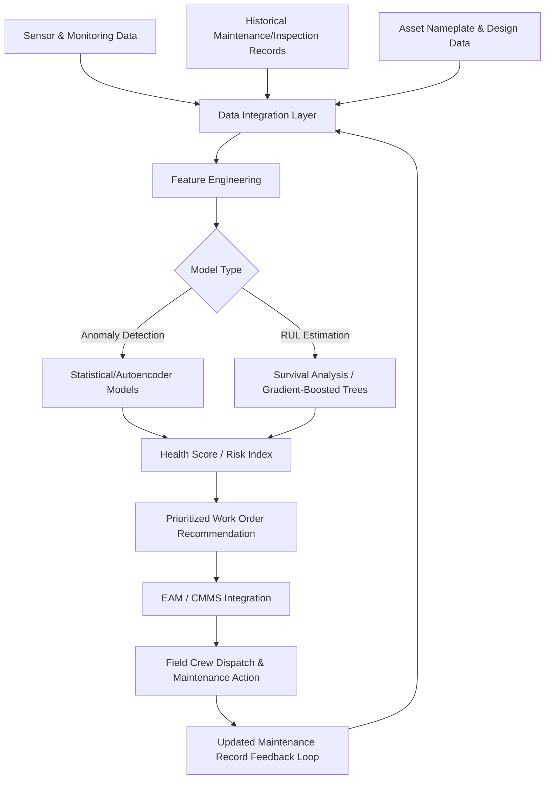

## Predictive Maintenance and Asset Health Analytics

### Maintenance Strategy Evolution

**Key Points**

- Predictive maintenance (PdM) represents the third stage in a widely referenced maintenance strategy progression: reactive (run-to-failure), preventive (time/usage-based scheduled maintenance), and predictive (condition- and data-driven maintenance triggered by actual asset health indicators).
- Asset Health Analytics is the underlying data science discipline that PdM programs rely on — combining sensor data, historical failure records, and statistical/machine-learning models to estimate an asset's current condition and remaining useful life (RUL).
- The core economic driver is that grid assets (transformers, circuit breakers, underground cable, overhead conductor) are extremely expensive to replace and often have long procurement lead times, making unplanned failure both costly and operationally disruptive, while pure time-based preventive maintenance wastes resources servicing assets that are still in good condition.

**Maintenance strategy comparison**

| Strategy | Trigger | Advantage | Disadvantage |
| --- | --- | --- | --- |
| Reactive (run-to-failure) | Asset fails | No unnecessary maintenance cost | Unplanned outages, potential collateral damage, safety risk |
| Preventive (time-based) | Fixed calendar/usage interval | Predictable scheduling, simple to administer | Over-maintains healthy assets, under-maintains rapidly degrading ones |
| Predictive (condition-based) | Data-driven health/risk threshold | Maintenance performed only when actually needed, optimized timing | Requires sensor investment, data infrastructure, and analytical capability |
| Prescriptive (optimization-based) | Predictive output plus optimized action recommendation | Recommends *what* action and *when*, factoring cost/risk tradeoffs | Highest data/model maturity requirement |

### Core Data Sources for Asset Health Analytics

**Key Points**

- Effective asset health analytics requires integrating multiple, often historically siloed, data sources: real-time sensor/monitoring data, historical maintenance and inspection records, asset nameplate/design data, and environmental/operational context.
- Dissolved Gas Analysis (DGA) is the most established and widely used condition-monitoring technique specifically for oil-filled power transformers, providing decades of industry-standard interpretive frameworks.
- Data quality and completeness are frequently the primary practical bottleneck in PdM program effectiveness, since many utilities' historical maintenance records exist in inconsistent, incomplete, or paper-based formats that require substantial data engineering effort before analytics can be applied.

**Key data categories by asset class**

- **Power transformers**: DGA (key gases including hydrogen, methane, ethane, ethylene, acetylene, carbon monoxide, carbon dioxide), moisture-in-oil, furan analysis (indicating paper insulation degradation), winding temperature, partial discharge monitoring, load history.
- **Circuit breakers**: Operation counts, contact wear (often estimated from interrupted current history via an $I^2t$-based wear model), timing/travel curve analysis from mechanism monitoring, SF6 gas pressure/quality (for gas-insulated breakers).
- **Underground cable**: Partial discharge monitoring, insulation resistance/tan-delta testing, thermal monitoring (distributed temperature sensing via fiber optic cable in some installations), soil thermal resistivity context.
- **Overhead conductor and structures**: Thermal imaging (from drone or fixed camera inspection), LiDAR-based sag/clearance measurement, corrosion inspection, vegetation encroachment data.

### Dissolved Gas Analysis Interpretation Example

**Key Points**

- DGA interpretation methods (such as the Duval Triangle, Rogers Ratio, and IEEE/IEC key gas methods) translate measured gas concentrations into likely fault type classifications (thermal fault, partial discharge, arcing).
- Rate-of-change (gas generation rate over time) is often more diagnostically significant than absolute gas concentration at a single point in time, since a rapidly increasing trend indicates active, worsening degradation even at concentrations still within a nominally "normal" absolute range.

$$R_{gas} = \frac{C_{t2} - C_{t1}}{t_2 - t_1}$$

Where $R_{gas}$ is the gas generation rate, $C_{t1}$ and $C_{t2}$ are gas concentrations measured at times $t_1$ and $t_2$ respectively; utilities commonly compare $R_{gas}$ against established alert thresholds (e.g., IEEE C57.104 guidance) to flag transformers requiring more frequent sampling or investigation.

### Analytics Architecture and Machine Learning Approaches

**Key Points**

- A typical asset health analytics pipeline includes data ingestion/integration, feature engineering, model training/scoring, and an alerting/work-order-generation output layer that feeds into existing utility Enterprise Asset Management (EAM) or Computerized Maintenance Management System (CMMS) platforms.
- Remaining Useful Life (RUL) estimation is commonly approached via survival analysis techniques (adapted from reliability engineering), gradient-boosted tree models trained on historical failure/censored-data records, or deep learning approaches (LSTM/temporal convolutional networks) for assets with rich time-series sensor data.
- Anomaly detection (identifying when an asset's current behavior deviates from its own historical normal operating envelope, or from a peer-group baseline of similar assets) is frequently a simpler and more immediately deployable first step than full RUL prediction, particularly for utilities early in their analytics maturity journey.

**Common modeling techniques**

1. **Statistical process control / control charts**: Flagging when a monitored parameter (DGA gas level, partial discharge count, vibration amplitude) exceeds a statistically derived control limit relative to its own historical baseline.
2. **Survival analysis (Cox proportional hazards, Weibull models)**: Estimating failure probability over time, explicitly handling "censored" data (assets that haven't failed yet, which is the majority of any well-maintained fleet).
3. **Gradient-boosted trees / random forests**: Widely used for RUL and failure-probability classification tasks due to strong performance on structured, tabular utility data and reasonable interpretability via feature importance analysis.
4. **Deep learning (LSTM, temporal CNN, autoencoders)**: Applied where dense time-series sensor data is available (e.g., continuous partial discharge or vibration monitoring), particularly for autoencoder-based anomaly detection that flags unusual patterns without requiring labeled failure examples.

### Asset Health Analytics Pipeline (Mermaid)

### Health Index Construction

**Key Points**

- A composite Health Index (HI) aggregates multiple individual condition indicators into a single, interpretable score (often 0–100 or a categorical rating), enabling prioritization across a large, heterogeneous fleet.
- Weighting individual factors within a Health Index requires domain expertise to reflect the relative criticality of different failure modes and typically follows established industry frameworks (such as those published by CIGRE or EPRI for transformer health indices) rather than a purely data-driven weighting scheme alone.

$$HI = \sum_{i=1}^{n} w_i \cdot s_i$$

Where $HI$ is the composite health index, $w_i$ is the weighting factor for condition indicator $i$ (e.g., DGA status, moisture content, age, loading history), $s_i$ is the normalized sub-score for that indicator, and weights sum to 1 across all $n$ indicators considered.

### Practical Example: Transformer Fleet Prioritization

Consider a utility with a fleet of 450 distribution substation power transformers, seeking to prioritize a limited annual maintenance/replacement budget.

1. **Data integration**: DGA sampling results (where available — historically only around 60% of the fleet had regular DGA sampling), age, loading history from SCADA, and prior inspection findings are integrated into a unified asset database.
2. **Gap identification and remediation**: The analytics team identifies the 40% of the fleet lacking regular DGA sampling as a data gap, prioritizing a sampling campaign for the oldest quartile of that subset before full fleet-wide health scoring can be considered reliable.
3. **Health index scoring**: For transformers with adequate data, a composite Health Index is calculated incorporating DGA-derived fault indicators, age relative to expected service life, loading history (including through-fault event count), and prior inspection notes.
4. **Risk-based prioritization**: Health Index scores are combined with a criticality factor (accounting for the transformer's role — e.g., serving a hospital or other critical load) to produce a risk-ranked maintenance and replacement priority list.

**Output**

The analysis identifies 12 transformers in the top-priority "high risk, high criticality" quadrant, warranting immediate detailed inspection and near-term replacement budgeting, versus a much larger group of transformers in the "low risk" category that can safely remain on an extended inspection interval — allowing the limited maintenance budget to be allocated where it most reduces the fleet's aggregate failure risk, rather than spread evenly (and less effectively) across the entire fleet under a traditional time-based schedule.

### Implementation Challenges

**Key Points**

- Sensor retrofit costs for legacy assets (many decades-old transformers and breakers were not originally designed with continuous monitoring in mind) can be substantial, requiring a cost-benefit prioritization of which assets receive new monitoring instrumentation first.
- Organizational and workflow integration — ensuring that analytics-generated recommendations actually translate into field crew work orders and are trusted by maintenance personnel — is frequently as significant a challenge as the analytical modeling itself.
- Data governance and interoperability standards (such as IEC 61850 for substation data or Common Information Model/CIM for broader utility data integration) are increasingly important as utilities integrate asset health analytics with broader ADMS (Advanced Distribution Management System) and outage management platforms.

[Speculation] As sensor costs continue to decline and more utilities accumulate multi-year historical failure datasets, the industry trend is likely toward increasingly sophisticated fleet-wide, cross-utility benchmarking models (potentially via industry consortia data-sharing arrangements), though the pace of this shift depends heavily on unresolved data-sharing, competitive-sensitivity, and cybersecurity considerations across the utility industry.

### Related Topics

- IEEE C57.104 Guide for Dissolved Gas Analysis Interpretation
- Digital Twin Applications in Transmission and Distribution Asset Management
- Advanced Distribution Management Systems (ADMS) Architecture
- Machine Learning Model Validation for Critical Infrastructure Applications
- Enterprise Asset Management (EAM) and CMMS Integration Patterns
- Partial Discharge Monitoring Techniques for Cable and Switchgear
- Survival Analysis and Weibull Reliability Modeling
- Common Information Model (CIM) for Utility Data Interoperability