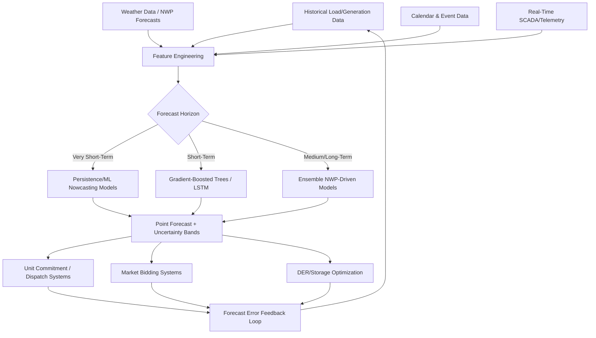

## Machine Learning for Load and Renewable Forecasting

### Forecasting Problem Landscape

**Key Points**

- Grid forecasting spans two related but distinct problem domains: load forecasting (predicting electricity demand) and renewable generation forecasting (predicting variable output from wind and solar resources) — both essential inputs to grid operations, economic dispatch, and market participation.
- Forecasts are further categorized by time horizon: very short-term (seconds to minutes, for real-time balancing and regulation), short-term (hours to days, for unit commitment and day-ahead market bidding), medium-term (weeks to months, for maintenance scheduling and fuel procurement), and long-term (years, for capacity planning and infrastructure investment).
- Machine learning has progressively supplemented and, in many applications, surpassed traditional statistical time-series methods (ARIMA, exponential smoothing) for these tasks, particularly as weather data integration and nonlinear renewable generation behavior have become more central to forecast accuracy requirements.

### Load Forecasting Fundamentals

**Key Points**

- Load exhibits strong, well-understood periodicity (daily, weekly, and seasonal cycles) combined with weather sensitivity (temperature-driven HVAC load being the dominant weather-correlated component in most regions) and calendar effects (holidays, special events).
- Feature engineering for load forecasting models typically includes lagged load values, weather variables (temperature, humidity, and increasingly cooling/heating degree days), calendar features (day of week, holiday indicators, time of day), and in many modern models, embedded representations of recurring patterns.
- Aggregation level matters significantly: system-level (bulk) load forecasting benefits from the statistical smoothing effect of aggregating many diverse individual loads, while feeder- or customer-level forecasting faces much higher relative volatility and is increasingly important as DER penetration and behind-the-meter generation reduce the visibility of "net load" at finer granularity.

**Common load forecasting model families**

1. **Gradient-boosted trees (XGBoost, LightGBM)**: Widely adopted for short-term load forecasting due to strong performance on structured tabular data incorporating weather and calendar features, with good interpretability via feature importance.
2. **Recurrent neural networks (LSTM, GRU)**: Capture temporal dependencies directly from sequential load data, often outperforming tree-based methods when very high-resolution (sub-hourly) temporal patterns matter.
3. **Temporal Convolutional Networks and Transformer-based architectures**: Increasingly applied for their ability to capture both short-term and long-range dependencies efficiently, with attention mechanisms in Transformer variants offering some interpretability into which historical periods most influence a given forecast.
4. **Hybrid statistical-ML ensembles**: Combining a traditional statistical baseline (capturing well-understood seasonality robustly) with an ML residual-correction model (capturing remaining nonlinear patterns the statistical model misses).

### Renewable Generation Forecasting

**Key Points**

- Solar forecasting relies heavily on Numerical Weather Prediction (NWP) model outputs (cloud cover, irradiance forecasts) combined with site-specific physical models (accounting for panel orientation, tilt, and shading) and, for very short-term forecasts, sky-imaging or satellite-derived cloud motion vectors.
- Wind forecasting similarly depends on NWP wind speed/direction forecasts translated through a turbine power curve, but faces the added complexity of wind speed's cubic relationship to power output making small forecast errors in wind speed translate into large power forecast errors.
- Both solar and wind forecasting benefit substantially from ensemble NWP approaches (combining multiple weather model runs) to quantify forecast uncertainty, since deterministic single-model forecasts systematically understate the true forecast error distribution, especially at longer horizons.

**Wind power curve relationship**

$$P(v) = \begin{cases} 0 & v < v_{cut-in} \\ P_{rated} \cdot \dfrac{v^3 - v_{cut-in}^3}{v_{rated}^3 - v_{cut-in}^3} & v_{cut-in} \leq v < v_{rated} \\ P_{rated} & v_{rated} \leq v < v_{cut-out} \\ 0 & v \geq v_{cut-out} \end{cases}$$

Where $P(v)$ is turbine power output as a function of wind speed $v$, $v_{cut-in}$ is the minimum wind speed for power generation, $v_{rated}$ is the wind speed at which rated power $P_{rated}$ is achieved, and $v_{cut-out}$ is the wind speed above which the turbine shuts down for safety. The cubic term in the ramp-up region is the key driver of forecast error sensitivity: a modest wind-speed forecast error near the steep part of the curve produces a disproportionately large power forecast error.

**Solar forecasting horizon-dependent techniques**

| Horizon | Primary Technique | Typical Accuracy Driver |
| --- | --- | --- |
| Intra-hour (0–1 hr) | Sky imaging, cloud motion vectors, persistence models | Local cloud tracking accuracy |
| Intra-day (1–6 hr) | Satellite-derived irradiance, short-range NWP | Satellite update frequency, NWP initialization |
| Day-ahead | NWP (global/regional models), ML post-processing | NWP model skill, site-specific bias correction |
| Multi-day | Ensemble NWP, climatological blending | Ensemble spread, seasonal climatology |

### Forecasting Pipeline Architecture (Mermaid)

### Probabilistic Forecasting and Uncertainty Quantification

**Key Points**

- Point forecasts (a single predicted value) are increasingly supplemented or replaced by probabilistic forecasts (a full predicted distribution or a set of quantiles), since grid operators must plan for forecast uncertainty, not just the expected value, particularly for reserve requirement determination.
- Quantile regression and quantile-loss-trained gradient-boosted models are common practical approaches for generating calibrated prediction intervals without requiring a full distributional assumption.
- Ensemble NWP-based approaches naturally produce a spread of scenarios that can be translated into a probabilistic power forecast by propagating each weather ensemble member through the power curve or solar conversion model separately.

$$L_\tau(y, \hat{y}) = \begin{cases} \tau (y - \hat{y}) & y \geq \hat{y} \\ (1-\tau)(\hat{y} - y) & y < \hat{y} \end{cases}$$

The pinball (quantile) loss function above, used to train quantile regression models, penalizes under- and over-prediction asymmetrically according to the target quantile $\tau$ — for example, training with $\tau = 0.95$ produces a forecast intended to be exceeded by the actual value only 5% of the time, useful for setting conservative reserve margins.

### Practical Example: Day-Ahead Net Load Forecast for a High-Solar-Penetration Utility

Consider a utility service territory with 35% behind-the-meter and utility-scale solar penetration, where net load (total demand minus solar generation) has become the operationally relevant forecasting target rather than gross load alone.

1. **Gross load forecast**: A gradient-boosted tree model, trained on five years of historical load, temperature, humidity, and calendar features, produces an hourly gross load forecast for the next day.
2. **Solar generation forecast**: A separate physical-plus-ML hybrid model combines day-ahead NWP irradiance forecasts with site-specific PV system models (accounting for known installed capacity, panel orientation distributions, and inverter clipping behavior) to forecast aggregate solar output.
3. **Net load composition**: The two forecasts are combined ($NetLoad = GrossLoad - SolarGeneration$), with uncertainty bands propagated from both underlying forecasts (solar forecast uncertainty is typically the dominant contributor to net load forecast uncertainty on partly cloudy days).
4. **Ramp identification**: The combined net load forecast specifically flags the projected evening ramp period (as solar output declines while gross load remains elevated), a critical operational planning input given the utility's known "duck curve" challenge.

**Output**

The forecast identifies a projected 1-hour net load ramp of approximately 800 MW during the 5:00–6:00 PM window, with a 90% prediction interval of ±120 MW driven primarily by cloud-cover forecast uncertainty for the late-afternoon period — enabling the utility's operations team to pre-position fast-ramping resources (BESS, quick-start gas generation) and confirm adequate operating reserves ahead of the anticipated ramp, rather than reacting to it in real time.

### Model Evaluation and Operational Considerations

**Key Points**

- Standard evaluation metrics include Mean Absolute Percentage Error (MAPE), Root Mean Square Error (RMSE), and for probabilistic forecasts, the Continuous Ranked Probability Score (CRPS) and calibration/reliability diagrams assessing whether stated prediction intervals actually contain the true value at the stated frequency.
- Forecast accuracy requirements differ meaningfully by application: a 5% MAPE that is entirely acceptable for long-term capacity planning may be operationally significant for real-time balancing, where even small errors translate directly into regulation and reserve costs.
- Model retraining cadence and drift monitoring are operationally important, since load and generation patterns shift over time (changing appliance mix, EV adoption, evolving building efficiency, DER growth), and a model trained on older data can silently degrade without active monitoring.

[Inference] As EV adoption and behind-the-meter storage continue to grow, load and net load forecasting models are likely to increasingly incorporate EV charging behavior and dynamic storage dispatch patterns as explicit features rather than treating them as unobserved noise within aggregate load, though the specific feature engineering approaches best suited to this remain an active area of utility analytics development rather than a settled industry standard.

### Related Topics

- Predictive Maintenance and Asset Health Analytics
- Numerical Weather Prediction (NWP) Models and Grid Applications
- Probabilistic Forecasting and Quantile Regression Techniques
- Duck Curve and Net Load Ramp Management Strategies
- Unit Commitment and Economic Dispatch Optimization
- FERC Order 2222 and Wholesale Market Participation of DERs
- Battery Energy Storage System (BESS) Sizing and Dispatch Optimization
- Demand Response and Demand-Side Management