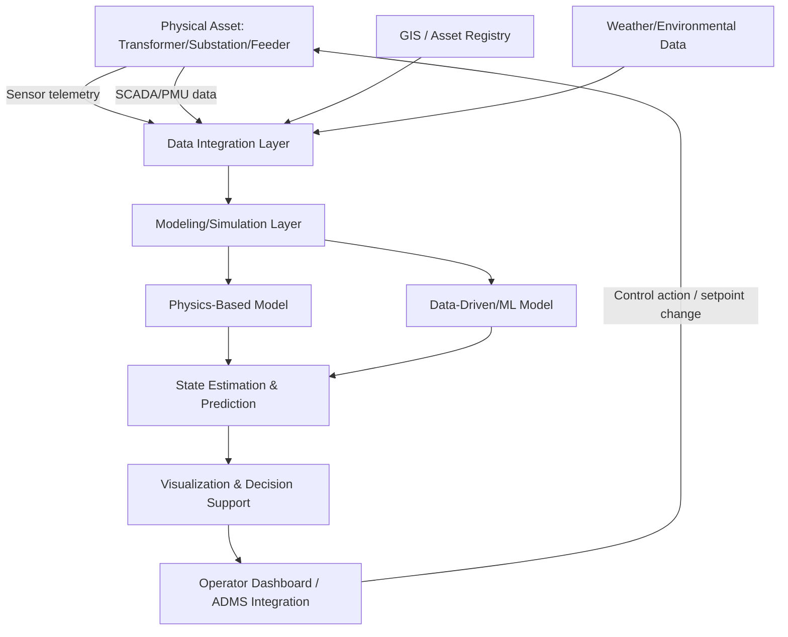

## Digital Twins of Grid Infrastructure

### Definition and Conceptual Foundation

**Key Points**

- A digital twin, in the grid infrastructure context, is a dynamic, continuously updated virtual representation of a physical asset, system, or network that is synchronized with real-world data (sensor telemetry, operational state, environmental conditions) to mirror the actual behavior and condition of its physical counterpart.
- The defining characteristic distinguishing a digital twin from a conventional simulation model or a static 3D/CAD model is bidirectional, near-real-time data synchronization: the digital twin updates continuously as the physical asset's state changes, and in more advanced implementations, insights from the twin can feed back to influence physical operations.
- Digital twins in the power sector are commonly implemented at multiple scales simultaneously: component-level (a single transformer), system-level (a substation or a feeder), and network-level (an entire transmission or distribution network topology).

### Digital Twin Fidelity Spectrum

**Key Points**

- Not all "digital twins" achieve the same level of fidelity or synchronization; the term is applied across a spectrum ranging from relatively simple digital shadows to fully bidirectional, physics-based digital twins.
- A **digital model** is a static or manually updated virtual representation with no automatic data connection to the physical asset — the most basic level, often just a detailed engineering model.
- A **digital shadow** has automated one-way data flow from the physical asset to the virtual model (the model updates based on real data), but changes to the model do not feed back to influence the physical asset.
- A **true digital twin** has bidirectional data flow: real-time synchronization from physical to virtual, and the virtual model's outputs (optimization results, predicted failure risk, recommended control actions) actively inform decisions or automated control actions on the physical asset.

### Digital Twin Fidelity Progression (svg_diagram)

<svg xmlns="http://www.w3.org/2000/svg" viewBox="0 0 880 300" font-family="Arial, sans-serif">
<text x="440" y="26" font-size="17" font-weight="bold" text-anchor="middle">Digital Twin Fidelity Spectrum (svg_diagram)</text>
<rect x="30" y="80" width="220" height="100" rx="8" fill="#fee2e2" stroke="#dc2626" stroke-width="2" />
<text x="140" y="115" font-size="13" font-weight="bold" text-anchor="middle">Digital Model</text>
<text x="140" y="135" font-size="10" text-anchor="middle" fill="#666">No automated data link</text>
<text x="140" y="150" font-size="10" text-anchor="middle" fill="#666">Manually updated</text>
<line x1="250" y1="130" x2="320" y2="130" stroke="#333" stroke-width="2" marker-end="url(#dt1)" />
<rect x="320" y="80" width="220" height="100" rx="8" fill="#fef3c7" stroke="#d97706" stroke-width="2" />
<text x="430" y="115" font-size="13" font-weight="bold" text-anchor="middle">Digital Shadow</text>
<text x="430" y="135" font-size="10" text-anchor="middle" fill="#666">One-way: physical to virtual</text>
<text x="430" y="150" font-size="10" text-anchor="middle" fill="#666">Auto-updated, no feedback</text>
<line x1="540" y1="130" x2="610" y2="130" stroke="#333" stroke-width="2" marker-end="url(#dt1)" />
<rect x="610" y="80" width="240" height="100" rx="8" fill="#dcfce7" stroke="#16a34a" stroke-width="2" />
<text x="730" y="115" font-size="13" font-weight="bold" text-anchor="middle">True Digital Twin</text>
<text x="730" y="135" font-size="10" text-anchor="middle" fill="#666">Bidirectional data flow</text>
<text x="730" y="150" font-size="10" text-anchor="middle" fill="#666">Virtual insights inform physical action</text>

<text x="440" y="220" font-size="11" text-anchor="middle" fill="#555">Increasing synchronization, automation, and operational integration</text>

<line x1="30" y1="240" x2="850" y2="240" stroke="#999" stroke-width="1.5" marker-end="url(#dt1)" />

</svg>

### Technical Architecture

**Key Points**

- A grid digital twin architecture typically comprises four layers: the physical asset/sensor layer, a data integration and historian layer, a modeling/simulation layer (physics-based, data-driven, or hybrid), and a visualization/decision-support layer.
- Physics-based models (grounded in first-principles engineering equations — thermal models, electrical network equations, mechanical stress models) provide interpretability and extrapolation reliability beyond the range of historical training data, while data-driven (ML-based) models often capture complex behaviors physics-based models simplify away, but with less extrapolation reliability.
- Hybrid physics-informed machine learning approaches, which constrain or augment ML models using known physical laws (e.g., conservation of energy, network power flow equations), are an increasingly prominent architecture pattern intended to combine the strengths of both approaches.

**Architecture layers in detail**

1. **Physical/sensor layer**: SCADA RTUs, phasor measurement units (PMUs), IoT sensors (temperature, vibration, gas), smart meters, and inspection/drone imagery feeding raw telemetry.
2. **Data integration layer**: Historians (e.g., PI System-class platforms), data lakes, and increasingly, Common Information Model (CIM)-based data standardization to unify data from disparate legacy systems (GIS, EAM/CMMS, SCADA, weather services) into a coherent asset and network model.
3. **Modeling/simulation layer**: Power flow solvers, thermal/electrical physics models, and ML models (as discussed in Predictive Maintenance and Asset Health Analytics) that compute the twin's current state estimate and forward-looking predictions.
4. **Visualization/decision-support layer**: 3D/GIS-based visualization interfaces, dashboards, and increasingly, integration with Advanced Distribution Management Systems (ADMS) or Energy Management Systems (EMS) so twin-derived insights directly inform operator decisions or automated control logic.

### Digital Twin Data and Control Flow (Mermaid)

### Application Domains in Grid Infrastructure

**Key Points**

- Substation and transformer digital twins are among the most mature applications, integrating DGA, thermal, and loading data (as discussed under Predictive Maintenance and Asset Health Analytics) into a continuously updated risk and remaining-useful-life model.
- Network-level digital twins model the topology and power flow behavior of an entire distribution feeder or transmission network, supporting planning studies, real-time state estimation, and "what-if" scenario analysis (e.g., evaluating hosting capacity for new DER interconnection requests).
- Emerging applications include microgrid digital twins (used for control system testing and operator training in a risk-free virtual environment before deployment to physical hardware) and full network digital twins supporting grid modernization planning under increasing DER and electrification-driven load growth.

**Distribution network digital twin use case: hosting capacity analysis**

A network-level digital twin enables a utility to rapidly evaluate how much additional DER capacity (new solar, storage, or EV charging) a given feeder can accommodate without violating voltage, thermal, or protection coordination limits — replacing a traditionally slow, manual engineering study process with a continuously updated, queryable model that can respond to interconnection requests far faster than conventional study timelines allow.

### Practical Example: Substation Digital Twin for Transformer Fleet Management

Consider a utility implementing a digital twin for a critical 230/69 kV substation transformer fleet.

1. **Sensor integration**: Existing DGA sensors, winding temperature RTDs, and load tap changer (LTC) operation counters are integrated into a unified data historian, supplemented by newly installed continuous online DGA monitors for the highest-criticality units.
2. **Physics-based thermal model**: A thermal aging model (based on IEEE C57.91 loading guide principles) continuously calculates hot-spot temperature and cumulative insulation aging based on real-time load and ambient temperature data.
3. **Data-driven anomaly layer**: A machine learning anomaly detection model (as described under Predictive Maintenance and Asset Health Analytics) runs in parallel, flagging DGA or thermal patterns that deviate from the physics model's expected behavior — potentially indicating a developing fault the pure physics model wouldn't capture (since physics models generally assume normal, non-faulted operation).
4. **Decision support integration**: The combined twin output feeds a risk dashboard used by asset management engineers, and during system emergencies, feeds real-time emergency loading capability estimates to system operators (answering "how much can we safely overload this transformer right now, given its actual current condition, rather than a generic nameplate rating").

**Output**

During a summer heat event requiring emergency transformer loading above nameplate rating, the digital twin's real-time thermal and condition-based assessment confirms the specific unit can safely sustain 115% of nameplate rating for the required 4-hour period without exceeding safe hot-spot temperature or accelerating insulation aging beyond an acceptable threshold — a determination based on the unit's actual current condition and ambient conditions rather than a generic, conservative static rating table, enabling the system operator to avoid load shedding that a more conservative static approach might have required.

### Implementation Challenges and Considerations

**Key Points**

- Data integration across legacy utility IT/OT systems (often decades-old SCADA, GIS, and asset management platforms not originally designed for real-time interoperability) is frequently the most significant practical barrier to digital twin deployment, more so than the modeling/analytics techniques themselves.
- Model validation and maintaining synchronization accuracy over time (ensuring the virtual model doesn't silently drift from actual physical asset behavior as the asset ages or as sensors degrade/fail) require ongoing governance processes, not just an initial deployment effort.
- Cybersecurity considerations are elevated for true bidirectional digital twins with control-feedback capability, since a compromised twin model could potentially issue erroneous control commands to physical grid infrastructure — making the twin's control-interface security posture as critical as the underlying OT system it interfaces with.

[Speculation] As utilities accumulate more mature digital twin implementations at the substation and feeder level, the industry trajectory likely trends toward increasingly interconnected, network-wide digital twins spanning transmission-to-distribution boundaries, though the pace of this consolidation depends substantially on resolving cross-organizational data governance, legacy system interoperability, and the practical challenge of maintaining model fidelity at very large scale — none of which are fully solved industry-wide as of the current state of deployment.

### Related Topics

- Predictive Maintenance and Asset Health Analytics
- Advanced Distribution Management Systems (ADMS) Architecture
- Common Information Model (CIM) for Utility Data Interoperability
- Hosting Capacity Analysis for DER Interconnection
- Phasor Measurement Units (PMUs) and Wide-Area Monitoring Systems
- Physics-Informed Machine Learning for Power System Applications
- Microgrid Architectures and Control Hierarchies
- Cybersecurity Considerations for OT/IT Convergence in Grid Systems