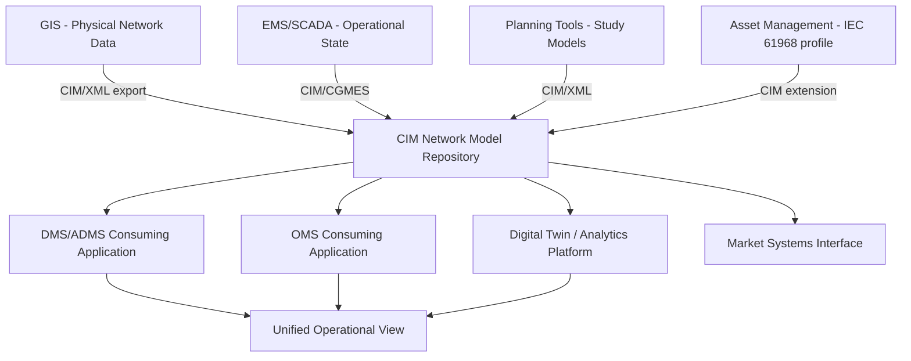

## Common Information Model and Grid Data Interoperability

### Definition and Purpose

**Key Points**

- The Common Information Model (CIM) is a set of IEC standards (primarily IEC 61970 for energy management systems and IEC 61968 for distribution management) defining a standardized, vendor-neutral object-oriented data model for representing electric power system components, topology, and operational data.
- CIM's core purpose is enabling semantic interoperability — ensuring that when two different systems (from different vendors, built at different times, serving different functions) exchange data about "a transformer" or "a circuit breaker," they mean the same thing in the same structured way, rather than requiring costly custom point-to-point integration mapping for every system pairing.
- CIM is maintained and developed under IEC Technical Committee 57 (TC57), with significant utility industry and vendor participation shaping its ongoing evolution to cover new domains (DER integration, market operations, asset management).

### The Interoperability Problem CIM Addresses

**Key Points**

- Utilities historically operate dozens of separate software systems — SCADA/EMS, Geographic Information Systems (GIS), Distribution Management Systems (DMS), Outage Management Systems (OMS), Enterprise Asset Management (EAM), Customer Information Systems (CIS) — each often from different vendors with proprietary internal data models.
- Without a common data standard, integrating these systems requires custom, brittle point-to-point interfaces for every pair of systems that need to exchange data, creating an integration complexity that grows quadratically with the number of systems (an "N-squared" integration problem).
- CIM addresses this by providing a single common semantic reference model that each system maps to once, reducing the integration problem from N-squared point-to-point mappings to N mappings to a common standard.

### N-Squared Integration Problem vs. CIM Hub Model (svg_diagram)

<svg xmlns="http://www.w3.org/2000/svg" viewBox="0 0 900 420" font-family="Arial, sans-serif">
<text x="450" y="26" font-size="17" font-weight="bold" text-anchor="middle">Point-to-Point vs. CIM-Based Integration (svg_diagram)</text>

<text x="220" y="60" font-size="13" font-weight="bold" text-anchor="middle" fill="`#dc2626`">Without CIM: Point-to-Point</text>

<circle cx="120" cy="140" r="35" fill="`#fee2e2`" stroke="`#dc2626`" stroke-width="2" />

<text x="120" y="145" font-size="10" text-anchor="middle">SCADA</text>

<circle cx="320" cy="140" r="35" fill="`#fee2e2`" stroke="`#dc2626`" stroke-width="2" />

<text x="320" y="145" font-size="10" text-anchor="middle">GIS</text>

<circle cx="120" cy="280" r="35" fill="`#fee2e2`" stroke="`#dc2626`" stroke-width="2" />

<text x="120" y="285" font-size="10" text-anchor="middle">OMS</text>

<circle cx="320" cy="280" r="35" fill="`#fee2e2`" stroke="`#dc2626`" stroke-width="2" />

<text x="320" y="285" font-size="10" text-anchor="middle">EAM</text>

<line x1="150" y1="140" x2="290" y2="140" stroke="#dc2626" stroke-width="1.5" />
<line x1="120" y1="175" x2="120" y2="245" stroke="#dc2626" stroke-width="1.5" />
<line x1="320" y1="175" x2="320" y2="245" stroke="#dc2626" stroke-width="1.5" />
<line x1="150" y1="280" x2="290" y2="280" stroke="#dc2626" stroke-width="1.5" />
<line x1="145" y1="165" x2="295" y2="255" stroke="#dc2626" stroke-width="1.5" />
<line x1="295" y1="165" x2="145" y2="255" stroke="#dc2626" stroke-width="1.5" />

<text x="220" y="370" font-size="10" text-anchor="middle" fill="#666">6 custom mappings for 4 systems</text>

<text x="680" y="60" font-size="13" font-weight="bold" text-anchor="middle" fill="`#16a34a`">With CIM: Hub Model</text>

<circle cx="680" cy="210" r="45" fill="`#dcfce7`" stroke="`#16a34a`" stroke-width="2.5" />

<text x="680" y="207" font-size="11" font-weight="bold" text-anchor="middle">CIM</text>

<text x="680" y="221" font-size="10" text-anchor="middle">Common Model</text>

<circle cx="580" cy="110" r="30" fill="#dbeafe" stroke="#2563eb" stroke-width="2" />
<text x="580" y="115" font-size="10" text-anchor="middle">SCADA</text>
<circle cx="780" cy="110" r="30" fill="#dbeafe" stroke="#2563eb" stroke-width="2" />
<text x="780" y="115" font-size="10" text-anchor="middle">GIS</text>
<circle cx="580" cy="310" r="30" fill="#dbeafe" stroke="#2563eb" stroke-width="2" />
<text x="580" y="315" font-size="10" text-anchor="middle">OMS</text>
<circle cx="780" cy="310" r="30" fill="#dbeafe" stroke="#2563eb" stroke-width="2" />
<text x="780" y="315" font-size="10" text-anchor="middle">EAM</text>
<line x1="600" y1="130" x2="655" y2="190" stroke="#16a34a" stroke-width="1.5" />
<line x1="760" y1="130" x2="705" y2="190" stroke="#16a34a" stroke-width="1.5" />
<line x1="600" y1="290" x2="655" y2="230" stroke="#16a34a" stroke-width="1.5" />
<line x1="760" y1="290" x2="705" y2="230" stroke="#16a34a" stroke-width="1.5" />

<text x="680" y="370" font-size="10" text-anchor="middle" fill="#666">4 mappings to a common standard</text>

</svg>

### CIM Standard Family Structure

**Key Points**

- IEC 61970 defines the CIM as applied to Energy Management Systems (EMS), covering transmission network topology, state estimation, and related application interfaces (notably the Component Interface Specification, or CIS, for EMS application integration).
- IEC 61968 extends CIM to distribution management system (DMS) domains, covering additional business functions including asset management, work management, customer information, and metering.
- IEC 61850 is a related but distinct standard, focused specifically on substation automation communication (protection relays, IEDs — Intelligent Electronic Devices) rather than the broader enterprise data modeling scope of 61970/61968, though CIM and 61850 models are increasingly harmonized to avoid duplicative or conflicting representations of shared concepts (e.g., a circuit breaker modeled consistently across both standards).

**Key CIM data exchange formats**

- **CIM/XML**: RDF-based XML serialization commonly used for exchanging network model data (bus-branch or node-breaker topology) between planning and operational tools.
- **CIM/CGMES (Common Grid Model Exchange Standard)**: A profile of CIM specifically standardized for exchanging power system models between transmission system operators, notably adopted for pan-European network model exchange coordinated by ENTSO-E, and increasingly referenced in North American contexts for similar multi-utility model exchange needs.
- **CIM RDF/OWL semantic web representations**: Increasingly used to enable more flexible, queryable representations of grid data compatible with modern graph database and semantic web tooling.

### CIM Object Model Concepts

**Key Points**

- CIM organizes grid data using object-oriented principles: classes representing real-world power system elements (ConductingEquipment, PowerTransformer, Breaker, ACLineSegment), with inheritance hierarchies capturing shared properties (e.g., all ConductingEquipment share terminal connection concepts).
- Topology is represented through a combination of physical connectivity (which equipment terminals connect to which nodes) and electrical topology (which nodes are electrically connected considering switch states), allowing the same underlying model to support both an "as-built" physical view and a "current operating state" electrical view.
- Profiles are subsets of the full CIM model tailored to a specific exchange purpose (e.g., a network model exchange profile, a switching plan profile, a metering profile), since the complete CIM standard is extensive and most individual use cases require only a relevant subset.

**Simplified class hierarchy example**

$$\text{PowerSystemResource} \rightarrow \text{Equipment} \rightarrow \text{ConductingEquipment} \rightarrow \{\text{PowerTransformer, Breaker, ACLineSegment, ...}\}$$

This illustrates CIM's inheritance-based structure: increasingly specific equipment classes inherit common attributes and relationships (such as terminal connections and asset/location references) from more general parent classes, reducing redundant modeling effort across the many specific equipment types found in a real power system.

### CIM-Based Data Integration Architecture

**Key Points**

- A CIM-based integration architecture typically involves a CIM-compliant data repository or "network model management" system serving as the authoritative source of truth for network topology and equipment data, with individual applications (EMS, DMS, OMS, planning tools) importing/exporting CIM-formatted data rather than maintaining fully independent proprietary models.
- The Generic Interface Definition (GID) and related IEC 61970 Component Interface Specification (CIS) standards define standardized application programming interfaces for real-time data access, complementing the static/near-static model exchange role that CIM/XML file exchange serves.
- Practical CIM adoption is often incremental — utilities frequently begin with CIM-based network model exchange between planning and operational systems before extending CIM-based interoperability to broader domains like asset management and customer systems.

### CIM Data Flow Across Utility Systems (Mermaid)

### Practical Example: Multi-System Outage Management Integration

Consider a utility integrating its GIS, ADMS, and OMS using CIM to enable accurate real-time outage prediction and crew dispatch.

1. **Baseline model establishment**: The utility's GIS, containing the authoritative physical network connectivity model (poles, conductors, transformers, switches), is exported in CIM/XML format according to the IEC 61968 distribution profile, establishing the canonical network topology reference.
2. **Real-time state integration**: The ADMS consumes this CIM network model and overlays real-time SCADA switch-state and fault-indicator data, computing the current electrical topology (which customers are actually connected to which upstream source given current switch positions).
3. **Outage prediction logic**: When a fault indicator or protective device operation is detected, the ADMS uses the CIM-based network topology (rather than a separately maintained, potentially inconsistent proprietary topology) to accurately predict the extent of the outage and the affected customer count.
4. **OMS crew dispatch integration**: The predicted outage extent and affected customer list, referenced against the same underlying CIM equipment identifiers, flow directly into the OMS for crew dispatch, avoiding the data reconciliation errors that historically arose when GIS, ADMS, and OMS each maintained independently synchronized (and sometimes inconsistent) copies of network topology.

**Output**

Following CIM-based integration, the utility's outage prediction accuracy and customer-count estimates improve because all three systems reference a single consistent network topology source rather than three independently synchronized copies — reducing the historical problem of "phantom outages" or missed customers caused by topology data drifting out of sync between GIS, ADMS, and OMS over time as field crews made undocumented or delayed-documentation network changes.

### Implementation Challenges

**Key Points**

- Full CIM compliance is extensive and complex; many vendor products implement only partial CIM support or proprietary extensions, requiring careful validation of actual interoperability claims rather than assuming any two "CIM-compliant" systems will exchange data seamlessly without integration testing.
- Legacy system migration to CIM-based data models is a substantial undertaking for utilities with decades of accumulated proprietary data structures, often requiring a multi-year phased migration strategy rather than a single cutover.
- Maintaining CIM model currency (ensuring the CIM-based network model accurately reflects real-world as-built conditions as the network changes) requires disciplined data governance processes, since a CIM model is only as valuable as its accuracy relative to the actual physical network.

[Inference] As DER penetration and third-party DERMS/aggregator platforms (relevant to FERC Order 2222 compliance) increasingly need to exchange data with utility distribution systems, CIM extensions covering DER-specific data elements are likely to see growing adoption pressure, though the pace and specific profile standardization for DER-related CIM extensions is still developing within IEC TC57 working groups rather than being a fully mature, universally implemented capability today.

### Related Topics

- IEC 61850 for Substation and DER Automation
- Digital Twins of Grid Infrastructure
- Advanced Distribution Management Systems (ADMS) Architecture
- Outage Management System (OMS) Design and Integration
- FERC Order 2222 and Wholesale Market Participation of DERs
- Predictive Maintenance and Asset Health Analytics
- Network Topology Processing and State Estimation
- CGMES and Multi-TSO Network Model Exchange (ENTSO-E Context)