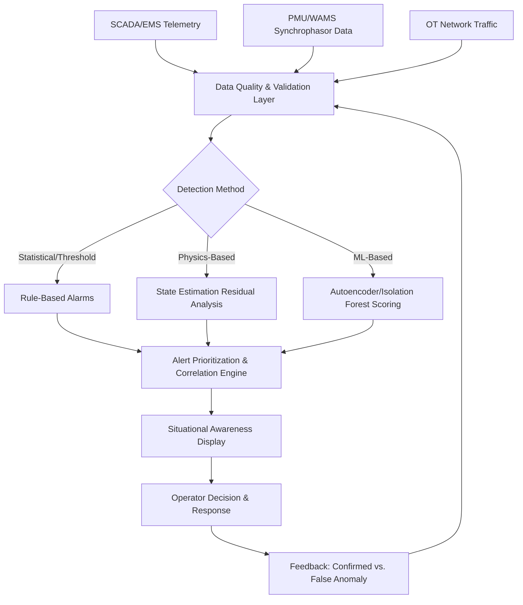

## Anomaly Detection and Situational Awareness Tools

### Conceptual Foundation

**Key Points**

- Anomaly detection in grid operations refers to the automated identification of data patterns, measurements, or events that deviate significantly from expected normal system behavior, serving as an early-warning mechanism for equipment faults, cyberattacks, data quality issues, or emerging operational risks.
- Situational awareness tools are the broader operator-facing systems that synthesize anomaly detection outputs, real-time telemetry, and contextual information into a coherent, actionable picture of overall grid state, supporting rapid and correct operator decision-making, especially during abnormal or emergency conditions.
- These two capabilities are deeply interconnected: anomaly detection algorithms generate the alerts and flags that populate situational awareness displays, while effective situational awareness design determines whether operators can actually act on those alerts correctly and in time.

### Categories of Grid Anomalies

**Key Points**

- Anomalies relevant to grid operations span several distinct categories, each often requiring different detection techniques: equipment/asset anomalies, power quality and stability anomalies, data/telemetry anomalies, and cybersecurity anomalies.
- Distinguishing a genuine physical anomaly from a data quality issue (a faulty sensor or communication error producing spurious readings) is a persistent and operationally important challenge, since acting on a false anomaly can itself introduce risk or waste operational resources.
- Anomalies also differ by temporal signature: point anomalies (a single measurement wildly out of range), contextual anomalies (a value normal in isolation but anomalous given the current context, such as unusually high load at 3 AM), and collective anomalies (a sequence of individually unremarkable measurements that together indicate an abnormal pattern, such as a slow developing oscillation).

**Anomaly category examples**

1. **Equipment/asset anomalies**: Unusual vibration signatures, unexpected temperature rise, abnormal DGA gas trends (see Predictive Maintenance and Asset Health Analytics).
2. **Power quality/stability anomalies**: Voltage sag/swell events, harmonic distortion spikes, frequency oscillations, sub-synchronous resonance indicators.
3. **Telemetry/data anomalies**: Sensor dropout, stuck-at values, communication timeouts, GPS time-synchronization errors in PMU data.
4. **Cybersecurity anomalies**: Unusual network traffic patterns on OT networks, unauthorized configuration change attempts, command sequences inconsistent with normal operational patterns (potentially indicating a compromised control system, as famously demonstrated in real-world grid cyber incidents).

### Detection Techniques

**Key Points**

- Statistical and rule-based methods (threshold alarms, rate-of-change limits, statistical process control) remain the most widely deployed anomaly detection approach in legacy SCADA/EMS environments due to their simplicity, interpretability, and low computational requirements.
- Machine learning approaches — particularly unsupervised methods such as autoencoders, isolation forests, and clustering-based techniques — are increasingly deployed where labeled anomaly examples are scarce (as is typical, since true grid anomalies and faults are, by definition, rare events) but normal-operation data is abundant.
- Physics-based anomaly detection, leveraging known power system equations (state estimation residual analysis, power flow consistency checks), provides a complementary detection layer specifically well-suited to detecting anomalies that violate fundamental physical laws (e.g., a measurement inconsistent with Kirchhoff's current law at a given bus).

**State estimation residual-based detection**

A foundational technique in EMS-level anomaly detection uses the residual between measured values and the state estimator's calculated (expected) values:

$$r_i = z_i - h_i(\hat{x})$$

Where $r_i$ is the residual for measurement $i$, $z_i$ is the actual measured value, and $h_i(\hat{x})$ is the value predicted by the state estimator's model given the estimated system state $\hat{x}$. Measurements with residuals exceeding a statistically derived threshold (often based on a chi-squared test against the expected residual distribution) are flagged as potential bad data or, if a coordinated pattern across multiple measurements emerges, potential false data injection.

**Unsupervised ML anomaly scoring**

For sensor/time-series anomaly detection without labeled fault examples, autoencoder-based approaches train a neural network to reconstruct normal-operation data, then flag high reconstruction error as anomalous:

$$A(x) = \| x - \hat{x}_{reconstructed} \|^2$$

Where $A(x)$ is the anomaly score for input $x$, and $\hat{x}_{reconstructed}$ is the autoencoder's reconstruction of that input; because the autoencoder is trained only on normal data, it reconstructs normal patterns well (low error) but struggles to reconstruct genuinely novel/anomalous patterns (high error), making reconstruction error a useful anomaly indicator.

### Wide-Area Situational Awareness Architecture

**Key Points**

- Wide-Area Monitoring Systems (WAMS), built on synchrophasor/Phasor Measurement Unit (PMU) data, represent the leading edge of transmission-level situational awareness, providing GPS-time-synchronized, high-resolution (typically 30–60 samples per second) measurements across geographically distributed points, enabling detection of dynamic phenomena invisible to traditional SCADA's slower update rates.
- Situational awareness display design draws on human factors and cognitive engineering principles, since even excellent underlying anomaly detection is operationally worthless if the resulting alerts overwhelm operators (alarm fatigue) or fail to convey the necessary context for rapid correct decision-making.
- Modern situational awareness platforms increasingly integrate geospatial visualization (linking anomalies to physical network location via GIS/CIM-based topology, as discussed under Common Information Model and Grid Data Interoperability), historical pattern comparison, and prioritized/filtered alerting to manage information volume.

**PMU-enabled dynamic phenomena detection**

Because PMUs sample at much higher rates than conventional SCADA (which typically updates every few seconds), WAMS platforms can detect dynamic phenomena that would be entirely invisible to SCADA-only situational awareness, including:

- Inter-area oscillations (low-frequency power swings between regions of an interconnected grid, potentially indicating inadequate damping and a risk of instability).
- Voltage stability margin degradation, observable through phasor angle separation trends across a transmission corridor.
- Frequency events and their propagation characteristics across a wide geographic area, valuable for post-event forensic analysis and for real-time under-frequency load shedding scheme validation.

### Anomaly Detection and Situational Awareness Pipeline (Mermaid)

### Alert Correlation and Alarm Management

**Key Points**

- A single underlying grid event (such as a transmission line fault) can trigger dozens or hundreds of individual telemetry alarms nearly simultaneously; alert correlation engines group these related alarms into a single coherent event narrative rather than presenting operators with an overwhelming flood of individually unremarkable-seeming alerts.
- Alarm flooding during major grid disturbances has been identified as a contributing factor in several historical major blackout events, where operators lost effective situational awareness precisely because the volume of simultaneous alarms exceeded human cognitive processing capacity during the critical response window.
- Alarm rationalization — a structured, ongoing process of reviewing and tuning alarm thresholds, priorities, and suppression logic — is an essential and often underinvested operational practice for maintaining an effective (rather than degraded-by-noise) situational awareness system over time.

### Practical Example: Transmission Corridor Oscillation Detection

Consider a transmission operator monitoring a critical interconnection corridor between two regional grid areas, using a WAMS platform built on PMU data from substations along the corridor.

1. **Baseline establishment**: The WAMS platform continuously calculates the phase angle difference between PMUs at each end of the corridor under normal operating conditions, establishing a statistical baseline of typical angle-difference behavior and its normal range of variation.
2. **Oscillation detection**: Following a significant generation trip elsewhere in the interconnection, the platform detects a growing-amplitude, low-frequency (approximately 0.3 Hz) oscillation in the phase angle difference — a signature consistent with a poorly damped inter-area oscillation mode.
3. **Situational awareness escalation**: The anomaly is flagged with high priority on the operator's situational awareness display, showing the affected corridor, the oscillation frequency and current amplitude trend, and a comparison against known stability margin thresholds for that specific interconnection.
4. **Correlation with underlying cause**: The alert correlation engine links this oscillation event to the earlier generation trip event already logged in the system, providing the operator immediate causal context rather than requiring manual investigation to connect the two events.

**Output**

The operator, provided with clear situational awareness of both the oscillation's characteristics and its likely triggering cause, initiates a pre-established mitigation action (such as adjusting a Power System Stabilizer setpoint on a nearby generating unit or coordinating with the neighboring system operator) before the oscillation amplitude grows to a level that would risk protective relay operation or cascading instability — a response made possible specifically because PMU-based WAMS detected the developing pattern at a resolution and speed conventional SCADA-based monitoring could not have provided.

### Cybersecurity-Focused Anomaly Detection

**Key Points**

- OT (operational technology) network anomaly detection for cybersecurity purposes focuses on identifying traffic patterns, command sequences, or configuration changes inconsistent with an established baseline of normal industrial control system communication, since OT networks typically exhibit far more predictable, repetitive traffic patterns than general-purpose IT networks.
- Because OT anomaly detection sits at the intersection of physical grid safety and cybersecurity, alerts require careful triage to distinguish malicious activity from legitimate but unusual operational activity (planned maintenance, emergency switching operations), avoiding both dangerous false negatives and disruptive false positives.
- Integration between IT/OT security operations centers (SOCs) and traditional grid operations situational awareness is an increasingly emphasized organizational practice, reflecting the recognition that a cyber anomaly and a physical grid anomaly may be two views of the same underlying incident.

[Inference] As grid operators increasingly deploy ML-based anomaly detection across both operational and cybersecurity domains, the trend toward converged IT/OT situational awareness platforms combining physical grid state and cyber threat indicators into a unified operator view is likely to continue, though the organizational and technical integration required to achieve genuinely unified situational awareness (rather than merely co-located but separate displays) remains an active challenge across the industry rather than a solved problem.

### Related Topics

- Predictive Maintenance and Asset Health Analytics
- Phasor Measurement Units (PMUs) and Wide-Area Monitoring Systems
- Digital Twins of Grid Infrastructure
- Cybersecurity Considerations for OT/IT Convergence in Grid Systems
- Common Information Model and Grid Data Interoperability
- State Estimation and Bad Data Detection in Power Systems
- Alarm Management and Human Factors in Control Room Design
- Under-Frequency Load Shedding Scheme Design and Validation