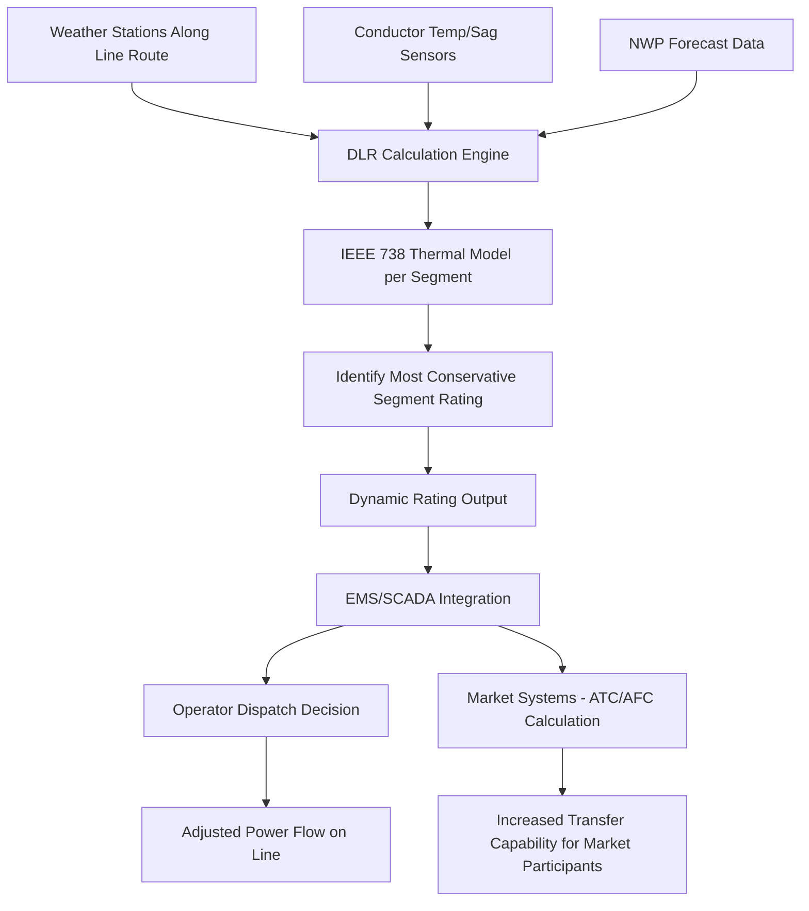

## Dynamic Line Rating

### Concept and Motivation

**Key Points**

- Dynamic Line Rating (DLR) is a Grid-Enhancing Technology (GET) that continuously calculates a transmission line's real-time maximum safe current-carrying capacity (ampacity) based on actual, measured or forecasted environmental conditions, rather than relying on a fixed, conservative Static Line Rating (SLR) or a limited set of seasonal ratings.
- Conductor ampacity is fundamentally governed by heat balance: a conductor's temperature rises due to resistive (I²R) heating and solar heating, and falls due to convective cooling (wind) and radiative cooling — since wind cooling in particular varies enormously with actual weather conditions, static ratings based on worst-case (typically low-wind, high-ambient-temperature) assumptions leave substantial unused thermal headroom under most real operating conditions.
- Industry studies and utility deployments have repeatedly found that DLR can unlock meaningful additional transfer capability on existing transmission corridors — commonly cited ranges suggest average capacity increases in the range of roughly 10–40% depending on line characteristics and local wind/weather patterns, without requiring new transmission line construction.

**[Unverified]** Specific percentage capacity increase figures vary considerably by study, line configuration, geographic wind regime, and the specific static rating methodology being compared against; the range cited above reflects commonly referenced industry figures rather than a single authoritative universal value, and any specific line's actual achievable DLR benefit requires site-specific analysis.

### Conductor Thermal Heat Balance

**Key Points**

- The foundational engineering basis for both static and dynamic line ratings is the steady-state (or transient) thermal heat balance equation governing conductor temperature, standardized in IEEE Std 738 (IEEE Standard for Calculating the Current-Temperature Relationship of Bare Overhead Conductors).
- Static ratings fix conservative assumed values for the weather-dependent terms (typically assuming a specific low wind speed, a specific high ambient temperature, and full solar heating) and solve for the maximum current that keeps conductor temperature at its design limit.
- Dynamic ratings instead measure or estimate the actual real-time values of these weather-dependent terms and recalculate the maximum permissible current in near-real-time (commonly updated every several minutes to a few times per hour).

**IEEE 738 heat balance equation**

$$q_c + q_r = q_s + I^2 R(T_c)$$

Where $q_c$ is convective heat loss (a strong function of wind speed and direction relative to the conductor), $q_r$ is radiative heat loss, $q_s$ is solar heat gain, $I$ is conductor current, and $R(T_c)$ is the conductor's electrical resistance at conductor temperature $T_c$ (resistance itself being temperature-dependent). Solving this equation for $I$ at the conductor's maximum allowable design temperature yields the ampacity rating — static ratings use fixed conservative inputs for $q_c$, $q_r$, and $q_s$; dynamic ratings use real-time measured or forecasted values.

**Convective cooling sensitivity**

Convective heat loss $q_c$ is highly sensitive to wind speed, following an approximately power-law relationship (with the exact exponent depending on the specific correlation and flow regime used within IEEE 738's forced/natural convection formulas). This sensitivity is the primary physical reason DLR unlocks additional capacity: even modest wind speeds well above the conservative low-wind assumption used in static ratings can substantially increase a conductor's actual cooling capability and thus its safe current-carrying capacity.

### Static vs. Dynamic Rating Comparison (svg_diagram)

<svg xmlns="http://www.w3.org/2000/svg" viewBox="0 0 880 380" font-family="Arial, sans-serif">
<text x="440" y="26" font-size="17" font-weight="bold" text-anchor="middle">Static Rating vs. Dynamic Line Rating Over Time (svg_diagram)</text>
<line x1="70" y1="330" x2="820" y2="330" stroke="#333" stroke-width="1.5" />
<line x1="70" y1="330" x2="70" y2="60" stroke="#333" stroke-width="1.5" />
<text x="440" y="360" font-size="12" text-anchor="middle">Time (24-hour period)</text>
<text x="30" y="200" font-size="12" text-anchor="middle" transform="rotate(-90 30 200)">Ampacity (A)</text>

<line x1="70" y1="260" x2="820" y2="260" stroke="#dc2626" stroke-width="2.5" stroke-dasharray="6,3" />
<text x="720" y="250" font-size="11" fill="#dc2626" font-weight="bold">Static Rating (fixed, conservative)</text>

<path d="M70,240 C150,180 220,90 320,80 C420,75 480,150 560,200 C650,240 700,150 780,110 L820,100" fill="none" stroke="`#16a34a`" stroke-width="2.5" />

<text x="330" y="65" font-size="11" fill="`#16a34a`" font-weight="bold">Dynamic Line Rating (real-time)</text>

<path d="M70,240 C150,180 220,90 320,80 C420,75 480,150 560,200 C650,240 700,150 780,110 L820,100 L820,260 L70,260 Z" fill="`#bbf7d0`" opacity="0.4" />

<text x="440" y="230" font-size="11" fill="`#166534`" font-weight="bold">Unlocked additional capacity</text>

<text x="120" y="150" font-size="10" fill="#666">High wind — high DLR</text>

<text x="560" y="280" font-size="10" fill="#666">Low wind, high temp — DLR near/below static</text>

</svg>

### DLR System Architecture and Measurement Approaches

**Key Points**

- DLR systems are broadly classified by measurement approach: weather-station-based (measuring local wind speed, direction, and ambient temperature near the line and applying the IEEE 738 model), direct conductor monitoring (measuring actual conductor temperature, sag, or tension directly), and forecast-based (using numerical weather prediction to project ratings ahead of real-time for operational planning purposes).
- Direct conductor monitoring approaches include conductor temperature sensors, sag/tension monitoring systems (since conductor sag is directly related to conductor temperature via thermal expansion), and increasingly, distributed fiber-optic sensing where fiber is co-located with or integrated into the conductor or an adjacent optical ground wire (OPGW).
- A hybrid approach — combining weather-station data at multiple points along a line's length with periodic direct conductor validation — is common in practice, since wind conditions can vary substantially along a line's route, and the most conservative (lowest-cooling) segment of the line ultimately governs the safe rating for the entire circuit.

**Weather-station-based DLR data flow**

1. Weather stations (wind speed/direction anemometers, ambient temperature sensors) are installed at representative points along the transmission line route, typically at multiple locations to capture spatial variation in wind exposure.
2. Real-time weather data streams to a central DLR calculation engine.
3. The IEEE 738 thermal model calculates the maximum safe current for each monitored line segment given current conditions.
4. The most conservative (lowest) segment rating becomes the overall line's dynamic rating, since a transmission line's safe operating current is limited by its most thermally stressed section.
5. The calculated dynamic rating is transmitted to the system operator's EMS/SCADA system, typically updated on an interval ranging from a few minutes to roughly 15 minutes.

### DLR Calculation and Dispatch Flow (Mermaid)

### Operational Integration and Reliability Considerations

**Key Points**

- DLR ratings must be integrated into system operator EMS/SCADA and market systems (Available Transfer Capability / Available Flowgate Capacity calculations) to actually translate into usable additional transfer capacity, rather than existing merely as an informational data feed.
- A conservative "fallback to static rating" protocol is essential: if DLR sensor data becomes unavailable, stale, or fails validation checks, the system must automatically revert to the conservative static rating to maintain reliability margins rather than continuing to operate on a stale (and potentially now-invalid) dynamic value.
- DLR is particularly valuable for unlocking additional capacity on specific transmission corridors that are frequent congestion points or that would otherwise require costly and time-consuming new line construction or reconductoring to relieve — making it an attractive near-term option for accommodating growing renewable generation interconnection and load growth (including data center and electrification-driven demand).

**FERC and regulatory context**

FERC has increasingly emphasized ambient-adjusted and dynamic ratings as part of broader transmission planning reform efforts, reflecting recognition that static, overly conservative fixed seasonal ratings can leave substantial existing transmission capacity unused. Specific implementation requirements and timelines are governed by evolving FERC orders and individual RTO/ISO tariff provisions, which continue to develop.

**[Unverified]** Given the pace of FERC rulemaking activity regarding transmission planning and ratings methodologies, the specific current regulatory requirements for DLR adoption by RTOs/ISOs should be verified against the most recent FERC orders and individual RTO/ISO tariff filings, as this is an area of active regulatory development rather than a static, settled requirement set.

### Practical Example: Wind-Corridor Transmission Line DLR Deployment

Consider a 230 kV transmission line running through a high-wind-resource corridor with substantial nearby wind generation, where the line frequently experiences congestion during high-wind-output periods.

1. **Sensor deployment**: The utility installs weather stations at three representative points along the 45-mile line route, selected to capture the range of terrain and wind exposure conditions (open plains sections versus more sheltered sections near tree lines or terrain features).
2. **Baseline validation**: For an initial validation period, the DLR system's calculated ratings are compared against the existing static seasonal ratings and, where available, direct conductor temperature measurements, to confirm model accuracy before the dynamic rating is used for actual operational dispatch decisions.
3. **Operational integration**: Once validated, the calculated dynamic rating feeds into the system operator's EMS and the RTO's Available Transfer Capability calculation, replacing the conservative static summer rating during periods when the DLR calculation indicates higher capacity is safely available.
4. **Correlation with the driving use case**: Because the line's congestion is often correlated precisely with high wind generation output (windy conditions that also happen to provide strong conductor cooling), the DLR benefit is particularly well-aligned with the operational need — high wind output coincides with high wind-driven cooling capacity, an especially favorable correlation pattern for this specific application.

**Output**

During a high-wind event where wind generation output is near its maximum and the static rating would otherwise force curtailment of wind output to avoid exceeding the line's conservative summer rating, the DLR system calculates a safely available rating approximately 25% above the static value (reflecting the strong convective cooling from the concurrent high wind speeds), allowing the full wind generation output to be delivered without curtailment — directly monetizing what would otherwise have been curtailed, zero-marginal-cost renewable generation.

### Comparison with Other Grid-Enhancing Technologies

| Technology | Mechanism | Typical Deployment Complexity | Primary Benefit |
| --- | --- | --- | --- |
| Dynamic Line Rating (DLR) | Real-time thermal capacity calculation | Moderate (sensor deployment, EMS integration) | Unlocks existing conservative rating headroom |
| Advanced Power Flow Control (e.g., series FACTS devices) | Active impedance/power flow redirection | High (power electronics installation) | Redirects flow away from congested paths |
| Topology Optimization | Reconfiguring network switching to relieve congestion | Low-to-moderate (primarily software/analytical) | Redistributes flow using existing switching capability |
| Reconductoring with advanced conductors | Physical conductor replacement (higher-capacity materials) | High (construction-intensive) | Permanently increases thermal/mechanical capacity |

### Related Topics

- IEEE 738 Standard for Conductor Thermal Rating Calculation
- Grid-Enhancing Technologies: Advanced Power Flow Control and Topology Optimization
- Available Transfer Capability (ATC) and Available Flowgate Capacity Calculation
- Machine Learning for Load and Renewable Forecasting
- Transmission Congestion Management in RTO/ISO Markets
- Distributed Fiber-Optic Sensing for Transmission Line Monitoring
- Reconductoring with High-Temperature Low-Sag (HTLS) Conductors
- FERC Transmission Planning Reform and Ratings Methodology Rules