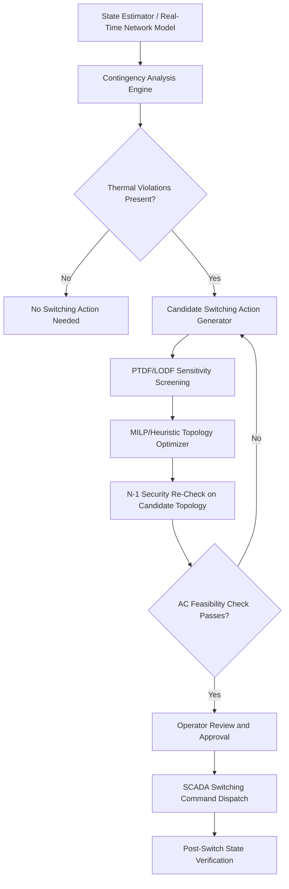

## Transmission Topology Optimization

### Definition and Conceptual Foundation

Transmission Topology Optimization (TTO), also referred to as Topology Control or Corrective Switching, is a grid-enhancing technology (GET) that treats the transmission network's connective structure — which lines, transformers, and buses are in service and how they are interconnected — as a decision variable rather than a fixed input. Conventional transmission operation assumes the network topology is static, with power flow controlled only through generation redispatch. TTO instead uses switching actions (opening or closing circuit breakers) to change the effective impedance paths of the network, thereby redistributing power flows to relieve congestion, reduce losses, improve reliability margins, or defer capital investment.

The underlying physical principle is that power flow on an AC transmission network is not dispatchable in the way generation is — it follows Kirchhoff's laws and distributes according to the impedances of parallel paths. Because loop flows can cause certain lines to be overloaded while parallel paths carry less than their thermal capacity, deliberately removing a line from service (de-energizing it) can force flow onto underutilized paths and relieve the binding constraint, often at lower cost than redispatch or new construction.

**Key Points**

- TTO is fundamentally a discrete (combinatorial) optimization problem layered on top of continuous power flow physics
- It is most valuable at substations with multiple parallel lines, ring buses, breaker-and-a-half schemes, or double-bus arrangements where genuine topological alternatives exist
- It is typically formulated as a security-constrained optimization that must respect N-1 (and sometimes N-1-1) contingency criteria after the switching action

### Mathematical Formulation

**Base DC Power Flow Model**

TTO problems are most commonly formulated using the DC power flow approximation for computational tractability, since full AC optimal power flow with discrete switching variables is a mixed-integer nonlinear, non-convex problem that does not scale to real grid sizes within operational time windows.

The DC power flow for line $ij$ is:

$$f_{ij} = \frac{\theta_i - \theta_j}{x_{ij}}$$

where $\theta_i$ and $\theta_j$ are voltage phase angles at buses $i$ and $j$, and $x_{ij}$ is the line reactance.

**Big-M Disjunctive Formulation for Switching**

To allow a line to be switched out of service, a binary variable $z_{ij} \in \{0,1\}$ is introduced, where $z_{ij}=1$ indicates the line is in service. The flow equation becomes a disjunctive constraint using a large constant $M$:

$$-M(1-z_{ij}) \leq f_{ij} - \frac{\theta_i - \theta_j}{x_{ij}} \leq M(1-z_{ij})$$

$$-z_{ij} f_{ij}^{max} \leq f_{ij} \leq z_{ij} f_{ij}^{max}$$

When $z_{ij}=1$, the first constraint forces $f_{ij}$ to equal the standard DC power flow value; when $z_{ij}=0$, the flow is forced to zero (the line is effectively removed from the admittance matrix) and the angle-difference relationship is relaxed.

**Objective Function (Optimal Transmission Switching, OTS)**

The classic OTS formulation minimizes generation cost subject to the switched network's power balance and thermal limits:

$$\min \sum_{g \in G} C_g(P_g)$$

subject to:

- Power balance at each bus (nodal injection = net flow out)
- Thermal limits: $|f_{ij}| \leq f_{ij}^{max}$ for all in-service lines
- Generator limits: $P_g^{min} \leq P_g \leq P_g^{max}$
- A cardinality constraint limiting the number of switching actions: $\sum_{ij} (1 - z_{ij}) \leq K$

The cardinality constraint $K$ (often 1–5 in practice) reflects operational risk tolerance — each switch introduces execution risk, so operators bound the number of simultaneous actions.

**Key Points**

- The Big-M formulation is a mixed-integer linear program (MILP), solvable with commercial solvers (CPLEX, Gurobi, or open-source alternatives like CBC/HiGHS)
- $M$ must be chosen carefully: too small and it under-constrains the relaxed case; too large and it weakens the LP relaxation bound, slowing branch-and-bound convergence
- AC-feasibility is not guaranteed by the DC-based solution; a full AC power flow or AC-OPF feasibility check is required as a post-processing step before implementation

### Security-Constrained Formulation (N-1 Compliant TTO)

Real-world TTO cannot be deployed on a base-case solution alone; it must remain N-1 secure. The security-constrained OTS (SCOTS) formulation extends the base problem by requiring that, for every credible contingency $c$ in a contingency set $\mathcal{C}$, the post-contingency flows (given the chosen topology) also respect thermal limits:

$$|f_{ij}^{(c)}| \leq f_{ij}^{max} \quad \forall ij \in \text{lines}, \forall c \in \mathcal{C}$$

This multiplies the problem size by $|\mathcal{C}|$, since each contingency requires its own set of flow variables and constraints (using the Line Outage Distribution Factor, LODF, or Power Transfer Distribution Factor, PTDF, methodology to avoid re-solving a full power flow per contingency).

**PTDF/LODF-Based Screening**

Rather than solving full AC or DC power flow for every candidate topology and every contingency, practical implementations use linear sensitivity factors:

$$\Delta f_{ij} = PTDF_{ij,k} \cdot \Delta P_k$$

$$f_{ij}^{(c)} = f_{ij}^{(0)} + LODF_{ij,c} \cdot f_c^{(0)}$$

where $PTDF_{ij,k}$ is the sensitivity of flow on line $ij$ to an injection change at bus $k$, and $LODF_{ij,c}$ is the sensitivity of flow on line $ij$ to the outage of line/element $c$. These factors allow rapid re-screening of thousands of topology/contingency combinations without full re-solves, and are the computational backbone of most production-grade TTO engines.

### Solution Approaches

**Key Points**

- **Exact MILP solving**: Full Big-M or convex-hull formulations solved to optimality or a small MIP gap; accurate but computationally expensive for large networks with many candidate switches
- **Heuristic/greedy switching search**: Iteratively evaluate single-line switches using LODF sensitivity screening, apply the best relieving switch, re-evaluate, repeat — much faster, used in many real-time or near-real-time deployments
- **Machine learning-assisted screening**: [Inference] Recent research applies classification/ranking models trained on historical topology-flow relationships to pre-filter promising candidate switches before rigorous MILP or AC verification, reducing the search space; this remains an active research area rather than a settled industry-standard practice
- **Metaheuristics** (genetic algorithms, simulated annealing, tabu search): used in academic literature for large candidate sets where exact methods are intractable, trading optimality guarantees for tractable runtime

### Operational Workflow in Practice

This workflow typically runs as an application within or adjacent to the Energy Management System (EMS), consuming the state estimator's real-time network model and feeding recommendations to system operators, who retain final approval authority before any breaker operation is dispatched via SCADA.

### Relationship to Other Grid-Enhancing Technologies

TTO is frequently deployed alongside other GETs, and the interaction matters for combined benefit estimation:

- **Dynamic Line Ratings (DLR)**: TTO can be used to route flow toward lines currently benefiting from favorable weather-derived higher ratings
- **Advanced Power Flow Control (APFC) devices** (e.g., distributed series reactors): Where physical devices are unavailable or too costly for a given corridor, switching can achieve a similar flow-redistribution effect at near-zero marginal hardware cost
- **FACTS devices** (SVC, STATCOM, UPFC): TTO is a discrete, zero-marginal-cost complement to continuously controllable FACTS devices; some formulations co-optimize switching decisions with FACTS setpoints

**Example**

Consider a simplified three-bus system where Bus A (generation-heavy) connects to Bus C (load center) via two parallel paths: a direct line A–C with reactance $x=0.1$ pu and thermal limit 300 MW, and an indirect path A–B–C with combined reactance $x=0.3$ pu and thermal limit 150 MW on segment B–C. If total transfer from A to C is 350 MW, DC power flow (inversely proportional to reactance) would allocate roughly:

$$f_{AC} = 350 \times \frac{1/0.1}{1/0.1 + 1/0.3} = 262.5 \text{ MW (within 300 MW limit)}$$

$$f_{ABC} = 350 \times \frac{1/0.3}{1/0.1 + 1/0.3} = 87.5 \text{ MW (within 150 MW limit)}$$

This case has no violation. But suppose a third, higher-impedance parallel line A–C′ ($x=0.15$ pu, limit 100 MW) is added to the network and loop flow physics allocates 105 MW to it — a 5 MW violation. Rather than redispatching generation (costly) or building new capacity, TTO would evaluate opening line A–B (removing the indirect path) or open A-C' temporarily, forcing more flow onto the higher-capacity direct corridor if doing so does not itself create a new violation and N-1 security is preserved after the switch. The optimizer solves this via the MILP formulation above rather than trial-and-error, since real networks have far more candidate switches than can be manually evaluated.

### Risk Considerations and Limitations

- **DC approximation error**: DC power flow ignores reactive power, voltage magnitude effects, and losses; a topology that appears secure under DC-OPF may violate voltage limits or create unacceptable losses under full AC conditions. AC feasibility verification is mandatory before implementation, not optional
- **N-1-1 and cascading risk**: A topology optimized for the base case and single contingencies may create latent vulnerability to specific contingency sequences; some jurisdictions require N-1-1 (sequential single contingencies with time for operator response) screening for switching actions
- **Protection system coordination**: Changing topology can alter fault current levels and paths, potentially desensitizing protective relays calibrated for the original topology. Switching plans must be cross-checked against protection settings, not just thermal/security limits
- **Operational complexity and human factors**: Each switching action carries execution risk (breaker failure, mis-operation) and increases operator cognitive load; this motivates the cardinality constraints ($K$) discussed above
- **Market and cost-allocation implications** [Unverified]: In organized wholesale markets, TTO changes congestion patterns and therefore locational marginal prices (LMPs); the treatment of TTO-driven price changes for cost allocation and market power mitigation varies by RTO/ISO tariff design and is an area of ongoing regulatory discussion

### Industry Adoption Status

Optimal transmission switching has moved from academic literature (predominantly through the 2000s–2010s, notably work associated with PJM and MISO research collaborations) toward limited operational deployment. PJM has operated a corrective switching solution within its EMS for select congestion-relief scenarios. Several RTOs and ISOs have evaluated or piloted topology optimization as part of broader GET adoption driven by FERC Order 2023 interconnection reforms and growing interest in low-capital-cost congestion relief. [Inference] Full real-time, fully automated closed-loop TTO (without operator-in-the-loop approval) remains rare in North American practice as of the current period; most deployments retain human approval before switching commands are dispatched, given the protection-coordination and cascading-risk concerns noted above.

**Next Steps**

- Power Transfer Distribution Factors (PTDF) and Line Outage Distribution Factors (LODF): Derivation and Computation
- AC Feasibility Verification and Post-Switching Voltage/Reactive Power Impacts
- Integration of Topology Optimization with Security-Constrained Unit Commitment (SCUC)
- Protection System Coordination Challenges in Dynamic Topology Environments
- Market Design Implications: LMP Formation Under Switched Topologies
- Combinatorial Complexity and Scalability of MILP-Based Switching for Large-Scale Networks