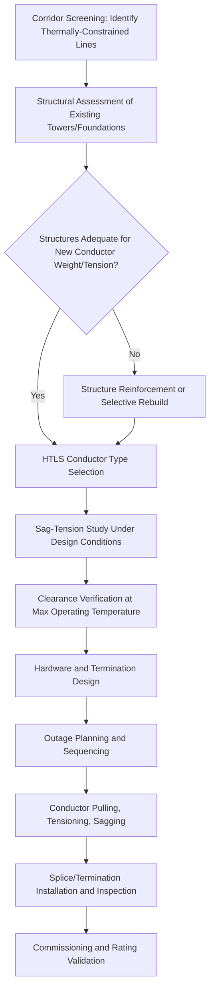

## High-Temperature Low-Sag Conductor Reconductoring

### Definition and Conceptual Foundation

High-Temperature Low-Sag (HTLS) conductor reconductoring is a grid-enhancing technology (GET) that replaces existing overhead conductors on an established transmission corridor with advanced composite conductors capable of operating at significantly higher continuous and emergency temperatures while exhibiting substantially less thermal sag than conventional conductors of equivalent diameter. Because most transmission line thermal ratings are ultimately constrained by sag-driven ground clearance requirements rather than conductor material failure, HTLS reconductoring allows a line to carry more current on its existing towers, right-of-way, and foundations without the cost, permitting delay, and land-acquisition burden of new corridor construction.

The core physical enabler is conductor core material. Conventional Aluminum Conductor Steel-Reinforced (ACSR) conductors use a steel core for tensile strength, but steel's coefficient of thermal expansion and the annealing behavior of standard aluminum strands limit safe continuous operation to roughly 75–100°C before excessive sag or permanent strength loss occurs. HTLS conductors replace the steel core with materials that expand less under heat and/or use aluminum-zirconium alloys resistant to annealing at high temperature, enabling continuous operation at 150–250°C and emergency operation up to 210–250°C+ depending on conductor type.

**Key Points**

- Reconductoring is distinct from full rebuild: towers and foundations are typically reused, which is the primary source of cost savings versus new-build transmission
- The rating gain is achieved without increasing conductor diameter significantly in most designs, preserving wind and ice loading assumptions on existing structures
- HTLS is a capital investment (not merely an operational/software GET like dynamic line ratings or topology optimization), but has a materially lower cost and permitting timeline than new transmission corridors

### HTLS Conductor Technology Families

**ACSS (Aluminum Conductor Steel Supported)**

Uses fully annealed (soft) aluminum strands over a conventional steel core. Because the aluminum is already annealed, it does not lose additional strength at high temperature — the steel core carries essentially all mechanical tension. Continuous operating temperature: typically 200°C, emergency 250°C.

- [Inference] Considered the most mature and lowest-cost HTLS option, often used as the baseline comparison for newer composite-core technologies, though exact market-share figures are not consistently published

**ACCC (Aluminum Conductor Composite Core)**

Replaces the steel core with a carbon-fiber composite core surrounded by a glass-fiber layer for galvanic isolation from the aluminum strands. The carbon-fiber core has a much lower coefficient of thermal expansion than steel and roughly half the weight, allowing use of trapezoidal (fully annealed) aluminum strands that increase the aluminum cross-section without increasing overall diameter — increasing ampacity further. Continuous operating temperature: typically 180°C, emergency 200°C.

- Lower sag than ACSS at equivalent temperature due to the composite core's low thermal expansion coefficient
- Reduced conductor weight can reduce structural loading on existing towers, sometimes enabling reconductoring where ACSR-to-ACSS substitution alone would exceed structural limits

**ACCR (Aluminum Conductor Composite Reinforced)**

Uses an aluminum-matrix composite core (aluminum oxide fibers embedded in an aluminum matrix) rather than carbon fiber, combined with aluminum-zirconium alloy strands. Continuous operating temperature: typically 210°C, emergency up to 240°C.

- [Inference] Generally positioned as a premium/highest-capacity option with correspondingly higher per-unit material cost, though pricing varies significantly by manufacturer, order volume, and market conditions and should be sourced from current vendor quotes rather than treated as fixed

**Gap-Type Conductors (GTACSR/GZTACSR)**

A steel core (often Invar, a low-thermal-expansion steel-nickel alloy in the ZT variant) with a small annular gap between the core and the aluminum strand layers, filled with heat-resistant grease. The gap allows the aluminum strands to move independently of the core during installation tensioning, so the core alone bears tension after installation while the fully annealed aluminum carries current. Continuous operating temperature: typically 150–210°C depending on variant.

**Key Points**

- Core material selection drives the trade-off between sag performance, weight, installation complexity, and cost
- Composite-core conductors (ACCC, ACCR) generally offer the best sag performance per unit of added ampacity but require specialized installation training due to reduced bending radius tolerance and different clamping/termination hardware than steel-core conductors
- All HTLS types require new compatible hardware (dead-ends, splices, suspension clamps) engineered for the specific core material — steel-core hardware is not compatible with composite cores

### Sag-Tension Physics

**Governing Relationship**

Conductor sag under a given span and tension follows the catenary (or parabolic approximation for typical span-to-sag ratios) relationship:

$$D = \frac{w L^2}{8T}$$

where $D$ is sag, $w$ is conductor weight per unit length, $L$ is span length, and $T$ is horizontal tension. As conductor temperature rises, thermal expansion increases the conductor's unstressed length, which — at constant support-point positions — reduces tension and increases sag for a fixed weight and span.

**Thermal Elongation**

The change in conductor length due to temperature is governed by the coefficient of linear thermal expansion (CTE) of the core material (since the core dominates mechanical behavior at operating tension):

$$\Delta L = L_0 \cdot \alpha \cdot \Delta T$$

Representative CTE values: steel core (ACSR/ACSS) $\approx 11.5 \times 10^{-6}$/°C; carbon-fiber composite core (ACCC) $\approx 1.6 \times 10^{-6}$/°C or lower; Invar steel core (GZTACSR) $\approx 3.5\times10^{-6}$/°C. This roughly order-of-magnitude reduction in CTE for composite and Invar cores is the direct physical mechanism behind "low sag" performance — the core simply does not lengthen as much for the same temperature rise, so tension and clearance are preserved at temperatures that would cause unacceptable sag in a steel-core conductor.

**Ampacity Relationship (Simplified Steady-State Heat Balance)**

Conductor current rating is derived from the steady-state thermal balance, where resistive (Joule) heating and solar heat gain equal convective and radiative heat loss:

$$I^2 R(T_c) + q_s = q_c + q_r$$

where $R(T_c)$ is AC resistance at conductor temperature $T_c$, $q_s$ is solar heat gain, $q_c$ is convective heat loss (a function of wind speed and temperature differential), and $q_r$ is radiative heat loss (a function of $T_c^4 - T_{ambient}^4$ per the Stefan-Boltzmann relationship, scaled by conductor emissivity). Raising the maximum allowable $T_c$ from, e.g., 90°C (typical ACSR) to 200°C (typical ACSS/HTLS) substantially increases the left-hand-side thermal budget available for $I^2R$ heating, directly increasing the ampacity solution for $I$ — often by 50–100% or more depending on conductor and ambient conditions, though the exact multiplier is conductor- and site-specific.

**Example**

Consider a 795 kcmil ACSR "Drake" conductor rated for 900A continuous at a 100°C maximum design temperature, on a line with 300 m spans, sagging 8 m at that temperature and satisfying minimum ground clearance with a small margin. If this line is reconductored with an ACCC conductor of similar outer diameter rated for continuous operation at 180°C:

1. The higher permissible $T_c$ (180°C vs 100°C) increases the ampacity solution from the heat-balance equation — commonly cited industry figures suggest reconductoring can roughly double thermal rating on comparable corridors, though the precise value depends on conductor selection, span geometry, and design ambient/wind assumptions [Inference: figure should be verified against project-specific sag-tension software output, not treated as a universal constant]
2. Despite operating at a much higher temperature (180°C vs 100°C), the ACCC's carbon-fiber core CTE (~1.6×10⁻⁶/°C) is roughly one-seventh that of the original ACSR's steel core, so the sag increase from thermal elongation at 180°C may be comparable to or less than the original conductor's sag at 100°C — meaning the line can carry substantially more current without violating ground clearance requirements or requiring taller towers

### Reconductoring Project Workflow

**Key Points**

- Structural assessment is often the critical path item: while HTLS conductors are frequently lighter than the ACSR they replace (favorable), higher-tension stringing to control sag at high temperature can increase longitudinal loads on dead-end and angle structures
- Existing towers designed to older loading codes (e.g., pre-NESC 2017 extreme wind/ice provisions) may require case-by-case evaluation even when conductor weight decreases
- Outage coordination is a significant scheduling constraint since reconductoring typically requires the circuit to be de-energized for the duration of the pulling and tensioning work, unless live-line reconductoring techniques are used

### Comparative Position Among Grid-Enhancing Technologies

| Attribute | HTLS Reconductoring | Dynamic Line Rating (DLR) | Topology Optimization |
| --- | --- | --- | --- |
| Capital intensity | High (conductor + hardware + possible structure work) | Low (sensors/weather stations + software) | Very low (software/operational) |
| Rating gain mechanism | Permanent increase in max design temperature | Real-time use of actual (vs. conservative static) weather conditions | Redistribution of existing flow via switching |
| Typical ampacity gain | 50–100%+ (conductor- and design-specific) | 10–30% average, higher in favorable weather | Line/contingency-specific, often 5-15% effective headroom |
| Permanence | Permanent physical upgrade | Conditional/weather-dependent | Reversible, situational |
| Outage requirement | Yes, for installation | No | No |

**Key Points**

- These technologies are complementary, not mutually exclusive: a reconductored HTLS line can also be equipped with DLR sensors to capture additional headroom above even the higher static HTLS rating during favorable weather
- HTLS reconductoring is generally the appropriate solution when the constraint is structural/permanent (a corridor is chronically and predictably congested), whereas DLR and topology optimization address variable or intermittent congestion at lower capital cost

### Risk Considerations and Limitations

- **Creep and long-term sag behavior**: Aluminum-matrix and composite-core materials exhibit different long-term creep (permanent inelastic elongation under sustained tension) characteristics than steel; sag-tension calculations must use manufacturer-specific creep curves rather than legacy ACSR creep models, and errors here directly translate into clearance violations over the line's service life
- **Thermal cycling and connector integrity**: Repeated cycling to high temperatures stresses splices, dead-ends, and connectors; hardware must be specifically rated and tested for the conductor's full thermal cycling range, and substandard connectors are a documented failure mode in HTLS installations industry-wide
- **Corona and audible noise/electromagnetic field considerations** [Unverified]: Changes in conductor surface geometry (stranding pattern, diameter) between the original and replacement conductor can alter corona performance and associated audible noise/radio interference; this is typically evaluated in the engineering design phase and is conductor-specific
- **Substation terminal equipment ratings**: Reconductoring the line segment does not automatically increase the rating of the overall transmission path — substation equipment (circuit breakers, current transformers, bus work, transformer terminals) at each end must also be verified or upgraded to avoid simply shifting the binding constraint from the line to the terminal equipment
- **Cost-effectiveness threshold** [Inference]: HTLS reconductoring is generally most cost-effective on corridors where new right-of-way acquisition would be difficult, expensive, or face long permitting timelines; on corridors with abundant available right-of-way and no permitting friction, new parallel construction may be more cost-effective per unit of added capacity depending on project-specific economics, though this varies by jurisdiction and project

### Industry Adoption Context

HTLS reconductoring has seen increasing attention as a component of broader GET portfolios promoted in the context of FERC Order 1920 and Order 2023 transmission planning reforms in the United States, alongside growing renewable interconnection queues that require additional transfer capacity on existing corridors faster than new transmission can be permitted and built. Utilities and transmission owners have increasingly used reconductoring as a "no new right-of-way" strategy to unlock interconnection capacity, particularly on corridors identified as thermally (rather than voltage- or stability-) constrained.

**Next Steps**

- Sag-Tension Analysis Software and Creep Curve Modeling for Composite-Core Conductors
- Structural Load Assessment Methodologies for Existing Transmission Towers
- Live-Line (Energized) Reconductoring Techniques and Safety Protocols
- Substation Terminal Equipment Rating Coordination with Reconductored Lines
- Economic Comparison Frameworks: Reconductoring vs. New Transmission Corridor Construction
- Corona, Audible Noise, and EMF Design Verification for Replacement Conductors