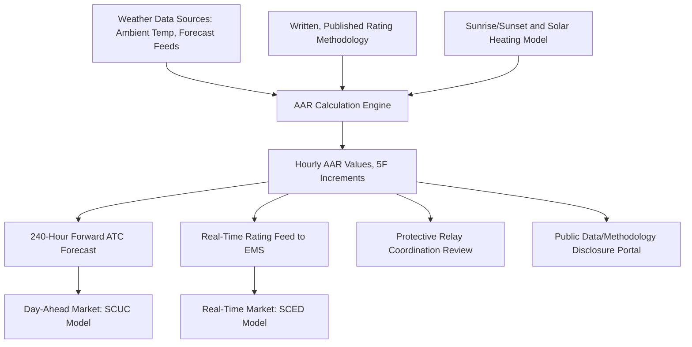

## FERC Order 881 and Ambient-Adjusted Ratings

### Regulatory Background and Purpose

FERC Order No. 881, titled "Managing Transmission Line Ratings," was issued by the Federal Energy Regulatory Commission in December 2021, with a companion clarifying order (881-A) issued subsequently. The order responds to a long-standing inefficiency in U.S. transmission operations: transmission line thermal ratings had historically been calculated using **static ratings** — fixed, conservative values based on assumed worst-case weather conditions such as high ambient temperature, minimal wind cooling, and maximum solar radiation — applied uniformly regardless of actual real-time weather. Because actual ambient conditions are favorable (cooler, windier) far more often than the conservative design assumption, static ratings systematically understate a line's true available thermal capacity across most operating hours, leaving usable transfer capability unexploited and contributing to artificial congestion. [Ampacimon - FERC Order 881: Comprehensive Handbook for Dynamic Line Rating Implementation +2](https://www.ampacimon.com/news/ferc-order-881-comprehensive-handbook-for-dynamic-line-rating-implementation)

FERC Order Nos. 881 and 881-A were issued to improve the accuracy and transparency of transmission line ratings, to ensure just and reasonable wholesale rates, and to better align the transmission grid with actual operating conditions. The order sits within the broader FERC grid-enhancing technology and transmission planning reform agenda (alongside subsequent Orders 2023 and 1920), reflecting a regulatory push toward using existing transmission assets more fully before requiring new capital construction. [ISO New England](https://www.iso-ne.com/participate/support/participant-readiness-outlook/ferc-order-no-881-mtlr)

**Key Points**

- Order 881 mandates Ambient-Adjusted Ratings (AAR), not full Dynamic Line Ratings (DLR); the order does not mandate the use of dynamic line ratings, which would incorporate additional real-time factors such as wind speed, though it provides a framework for future exploration of such technologies [FERC Order 881](https://ferc-order-881.com/)
- The order applies broadly: FERC Order Nos. 881 and 881-A are not applicable solely to transmission owners — other equipment owners submitting ratings data under regional operating procedures are also in scope [ISO New England](https://www.iso-ne.com/participate/support/participant-readiness-outlook/ferc-order-no-881-mtlr)
- Transmission providers both inside and outside organized RTO/ISO markets are subject to the requirements [LineVision, Inc.](https://www.linevisioninc.com/news/ferc-order-881-are-you-prepared)

### Ambient-Adjusted Ratings (AAR) Defined

AARs adjust transmission line ratings according to real-time weather conditions, ensuring that the system's actual carrying capacity is utilized more accurately and safely, rather than relying on conservative static ratings. Specifically, AAR/881 ratings incorporate continuously updated ambient and forecast ambient temperatures and distinguish between daytime and nighttime hours, since solar heat gain contributes meaningfully to conductor thermal loading during daylight and is absent at night. [Sentrisense](https://www.sentrisense.com/blog/what-is-ferc-order-881/)[Lindsey Systems](https://lindsey-usa.com/aar-ferc-order-881/)

This distinguishes AAR from the two ratings methodologies it sits between in the maturity spectrum:

| Rating Type | Inputs | Update Frequency | Regulatory Status |
| --- | --- | --- | --- |
| Static Rating | Fixed worst-case seasonal assumptions | Seasonal (2-4x/year) | Legacy baseline |
| Ambient-Adjusted Rating (AAR) | Ambient temperature (forecast + real-time), day/night solar state | Hourly | Mandated by Order 881, deadline July 12, 2025 |
| Dynamic Line Rating (DLR) | Ambient temperature, wind speed, wind direction, solar irradiance, often direct sensor measurement | Real-time (minutes) | Not mandated; voluntary/emerging |

**Key Points**

- AAR is deliberately positioned as a lower-complexity, more universally implementable step than full DLR, since it does not require wind-speed input (the most operationally significant and most variable driver of convective cooling, but also the hardest to forecast/measure reliably at scale)
- Ambient-Adjusted Ratings adjust transmission line capacities based on actual ambient weather conditions including temperature, wind speed and direction, and solar radiation per some vendor characterizations — in practice, implementations vary in how many of these variables they incorporate beyond the core temperature and solar/day-night requirement, and the specific mandatory minimum is defined by the order's technical requirements below [Ampacimon](https://www.ampacimon.com/news/ferc-order-881-comprehensive-handbook-for-dynamic-line-rating-implementation)

### Technical Compliance Requirements

Order 881 specifies granular technical parameters that AAR calculation methodologies must satisfy:

**Temporal and Update Requirements**

- Line rating applies to a period not greater than 1 hour, with updates occurring hourly [FERC Order 881](https://ferc-order-881.com/)
- Forecast requirements call for estimation of 240 hours of Available Transfer Capability (ATC) at hourly resolution — i.e., a rolling 10-day-ahead hourly forecast horizon [FERC Order 881](https://ferc-order-881.com/)
- Assessments must be updated at least hourly and incorporate short-term weather forecasts extending up to 10 days [Ampacimon](https://www.ampacimon.com/news/ferc-order-881-comprehensive-handbook-for-dynamic-line-rating-implementation)

**Measurement Granularity**

- Implementation of ambient-adjusted ratings at 5-degree Fahrenheit measurement increments [FERC Order 881](https://ferc-order-881.com/)
- Methods used to determine AARs must be valid for at least the range of local historical temperatures, plus or minus a 10-degree Fahrenheit margin, and providers must update AARs with every 5-degree Fahrenheit change [P&R Tech](https://pr-tech.com/news/ferc-order-881-2025-requirements/)

**Solar Heating Treatment**

- Ratings must reflect the absence of solar heating during nighttime hours and update sunrise/sunset times at least monthly, since day-length and solar angle shift seasonally and materially affect the solar heat gain term in the underlying thermal balance calculation [FERC Order 881](https://ferc-order-881.com/)

**Methodology Transparency**

- FERC Order 881 requires that line ratings be computed in accordance with a written, publicly available transmission line rating methodology [Lindsey Systems](https://lindsey-usa.com/aar-ferc-order-881/)
- Order 881 mandates that transmission providers publicly share their line rating methodologies, data, and models, fostering transparency so that providers, market participants, and regulators have access to the same information [Sentrisense](https://www.sentrisense.com/blog/what-is-ferc-order-881/)

**Market and Dispatch Integration**

- RTOs and ISOs are required to implement AARs within their Security-Constrained Economic Dispatch (SCED) and Security-Constrained Unit Commitment (SCUC) models, in both day-ahead and real-time markets [FERC Order 881](https://ferc-order-881.com/)
- The use of AARs in the Day-Ahead Market and Real-Time Market allows energy, ancillary services, and transmission service wholesale rates to more accurately reflect the actual cost of delivering wholesale energy to transmission customers [ISO New England](https://www.iso-ne.com/participate/support/participant-readiness-outlook/ferc-order-no-881-mtlr)

### Compliance Timeline

The order set a July 12, 2025 compliance deadline for stakeholders to implement AAR methodologies. FERC Order 881 requires all transmission providers to use ambient-adjusted ratings as the basis for evaluating near-term transmission service, with the shift required by that July 12, 2025 deadline. [Unverified — given the current date, confirm current compliance status and any subsequent enforcement or extension actions directly against FERC's compliance filings, since post-deadline implementation status across individual transmission providers is not comprehensively captured in general reference sources.] [Ampacimon](https://www.ampacimon.com/news/ferc-order-881-comprehensive-handbook-for-dynamic-line-rating-implementation)[ReliabilityFirst](https://www.rfirst.org/news/when-updates-to-ambient-adjusted-ratings-to-comply-with-ferc-order-881-require-a-certification-review/)

Order 881 also addressed transmission line relay coordination, emphasizing the importance of ensuring protective relay settings remain properly coordinated as line ratings change more frequently under AAR than under legacy static ratings. This is a materially important secondary requirement: protective relays with overcurrent or thermal-based tripping elements calibrated against a fixed static rating can become miscoordinated — either nuisance-tripping below true capability or failing to protect the conductor — when the operative rating changes hourly. [P&R Tech](https://pr-tech.com/news/ferc-order-881-2025-requirements/)

### Implementation Architecture

Several vendors have developed turnkey AAR compliance platforms. One representative sensor-free implementation approach develops ambient adjusted ratings for any line without requiring sensors to be installed on the conductor itself, relying instead on ambient weather station and forecast data combined with published conductor thermal models — a lower-cost compliance path relative to full sensor-based DLR deployment. [Lindsey Systems](https://lindsey-usa.com/aar-ferc-order-881/)

**Example**

A transmission provider operating a 230 kV line with a legacy static summer rating of 800 A (based on a conservative 40°C ambient, no wind, full sun assumption) implements AAR compliant with Order 881. At 6:00 AM on a given day, forecast ambient temperature is 22°C and the sun has not yet risen (per the monthly-updated sunrise table). The AAR calculation engine, using the same underlying steady-state heat-balance equation described in HTLS conductor analysis (Joule heating balanced against convective and radiative loss, with solar gain set to zero pre-sunrise), computes a rating of approximately 1,050 A for that hour — updated to the nearest 5°F-equivalent temperature bucket per the order's granularity requirement. This value is published to the RTO's SCED/SCUC models for that hour's day-ahead and real-time dispatch, then recalculated for the following hour as forecast conditions change. Across the 240-hour forecast window, the provider publishes an hourly ATC profile reflecting this same calculation repeated for each forecast hour.

### Relationship to Other Grid-Enhancing Technologies

**Key Points**

- AAR is the regulatory floor; DLR (incorporating wind speed and direction, the dominant driver of convective cooling and thus the single largest source of additional headroom beyond AAR) remains voluntary and is typically pursued by providers seeking further capacity unlock on specifically congested corridors
- AAR compliance infrastructure (weather data ingestion, hourly EMS rating feeds, SCED/SCUC integration) provides much of the architectural foundation that a subsequent DLR upgrade would reuse, making AAR compliance a practical stepping stone rather than a parallel/separate investment
- Transmission Topology Optimization and HTLS reconductoring operate on different levers (network configuration and conductor material property, respectively) and are unaffected by AAR compliance status, but all three GETs are frequently evaluated together in congestion-relief portfolios responding to the same underlying driver: interconnection queue growth outpacing new transmission construction

### Risk Considerations and Limitations

- **Weather forecast accuracy risk**: AAR's 240-hour forward forecast requirement depends on the accuracy of the underlying weather forecast provider; forecast error propagates directly into ATC accuracy and can affect market participants' scheduling decisions
- **Protective relay miscoordination**: As referenced above, hourly-changing ratings create an ongoing coordination burden between the rating calculation system and protection engineering; providers must establish a process to keep relay settings aligned with the AAR methodology, not just a one-time implementation
- **Data and methodology disclosure burden**: The public methodology and data transparency requirement creates ongoing compliance and documentation obligations beyond the initial calculation engine buildout, including responsiveness to stakeholder methodology challenges
- **Conservative-to-AAR transition risk** [Inference]: Providers transitioning from long-standing static ratings to hourly AAR values may see rating volatility that was previously smoothed out by conservative static assumptions; this could affect market participants' risk assessment and scheduling practices, though the operational impact varies by region and is best assessed against provider-specific compliance filings rather than treated as a generalized effect

**Next Steps**

- Dynamic Line Rating (DLR): Technical Implementation and Sensor Architecture
- Steady-State Thermal Balance Modeling for Conductor Rating Calculations (IEEE 738 Methodology)
- Protective Relay Coordination Under Time-Varying Line Ratings
- SCED/SCUC Model Integration of Hourly Rating Inputs
- Available Transfer Capability (ATC) Forecasting Methodologies
- Comparative Regulatory Approaches: FERC Order 881 vs. International AAR/DLR Mandates