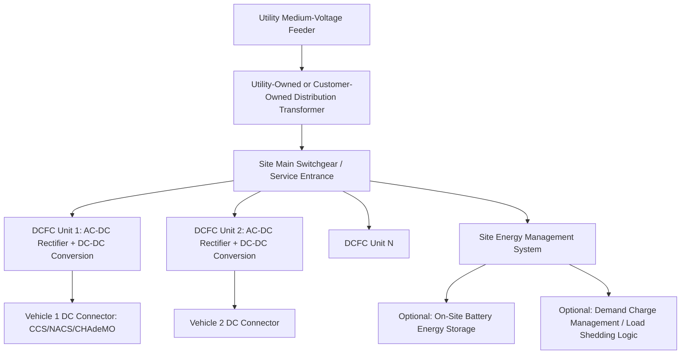

## EV Charging Infrastructure Classes and Grid Interfaces

### Charging Level Classification Overview

Electric vehicle charging infrastructure is classified primarily by power delivery method (AC vs. DC) and power level, which together determine the grid interface point, the equipment required, and the operational impact on distribution and transmission systems. The classification framework used across North America follows SAE J1772 (AC connector/communication standard) and the associated Level 1/Level 2/DC Fast Charging taxonomy, while international deployments (particularly Europe and much of Asia) follow IEC 61851 and related standards with a broadly analogous but not identical structure.

**Key Points**

- The fundamental engineering distinction is where AC-to-DC rectification occurs: onboard the vehicle (Level 1, Level 2) versus offboard in the charging station itself (DC Fast Charging)
- This single design choice drives orders-of-magnitude differences in power level, grid interface voltage, equipment cost, and grid impact
- Classification directly determines which distribution voltage class and which utility interconnection process applies to a given charger installation

### Level 1 Charging (AC, On-Board Rectification)

Level 1 charging uses a standard single-phase 120V (North America) or 230V (most other regions) residential outlet, delivering power at the vehicle's onboard charger, which performs AC-to-DC conversion and battery management.

- **Power range**: Typically 1.4–1.9 kW at 120V/12-16A in North America
- **Grid interface**: Standard residential branch circuit, NEMA 5-15 or 5-20 outlet, no dedicated electrical infrastructure required beyond existing household wiring
- **Charging rate**: Roughly 3-5 miles of range added per hour, making Level 1 primarily suited to overnight charging of plug-in hybrids or low-daily-mileage battery electric vehicles
- **Grid impact**: Negligible at the distribution level; comparable to a space heater or window air conditioner load

### Level 2 Charging (AC, On-Board Rectification)

Level 2 charging uses 208V or 240V single-phase or split-phase AC supply, still relying on the vehicle's onboard charger for AC-to-DC conversion, but at substantially higher current.

- **Power range**: Typically 3.3–19.2 kW, with most residential installations in the 7-11 kW range (limited by onboard charger capacity, commonly 6.6-11 kW in most consumer EVs) and commercial/fleet installations reaching higher power where vehicle onboard chargers support it
- **Grid interface**: Dedicated circuit from a 208V or 240V panel, typically 40-100A breaker depending on installed charger power; requires a dedicated Electric Vehicle Supply Equipment (EVSE) unit that handles communication (via the J1772 pilot signal) and safety interlocks but does not perform power conversion
- **Connector standards**: SAE J1772 (North America), Type 2/Mennekes (Europe)
- **Grid impact**: Material at the individual-service level (comparable to adding a second central air conditioning system), but grid impact studies generally treat Level 2 as manageable through standard residential service upgrades and time-of-use rate design rather than requiring dedicated utility infrastructure planning, except in cases of concentrated multi-unit or fleet deployment

**Key Points**

- Level 2 is the dominant charging class for both residential overnight charging and workplace/destination charging (retail, parking garages)
- Because rectification is onboard the vehicle, Level 2 EVSE cost is comparatively low (hundreds to low thousands of dollars per unit) since the EVSE itself is essentially a relay, ground-fault protection, and communication controller rather than a power-conversion device

### DC Fast Charging (DCFC, Off-Board Rectification)

DC Fast Charging performs AC-to-DC rectification within the charging station itself, delivering DC power directly to the vehicle's battery and bypassing the onboard charger's power limitations entirely.

- **Power range**: Commonly deployed at 50-150 kW (legacy/first-generation), 150-350 kW (current high-power deployments), with some emerging ultra-fast architectures targeting 350 kW+ per vehicle for compatible high-voltage battery platforms (800V architectures)
- **Grid interface**: Requires a dedicated medium-voltage utility service, typically served from a distribution transformer sized specifically for the charging site, often at primary distribution voltage (e.g., 12.47 kV or 4.16 kV class, varying by utility) stepped down on-site to the charger's internal DC power conversion equipment
- **Connector standards**: CCS1 (Combined Charging System, North America — combines J1772 AC pins with two additional DC pins), CCS2 (Europe), CHAdeMO (legacy, primarily older Japanese vehicles, declining in new deployment), NACS (North American Charging Standard, originally Tesla-proprietary, now undergoing broader industry adoption and SAE standardization as J3400)
- **Grid impact**: Substantial and site-specific; a single high-power DCFC stall can draw more instantaneous power than several typical residential services combined, and multi-stall DCFC sites (common at highway corridor and fleet depot locations) can present aggregate demand in the multi-megawatt range, comparable to a small commercial or light industrial customer

**Key Points**

- DCFC EVSE cost is substantially higher than Level 2 (tens of thousands to hundreds of thousands of dollars per unit/site) because the power electronics (rectification, high-frequency conversion, cooling) reside in the charging equipment rather than the vehicle
- DCFC site development timelines are frequently gated by utility interconnection and distribution upgrade lead times rather than equipment procurement, since a new medium-voltage service or feeder capacity upgrade may be required

### Grid Interface Comparison Table

| Characteristic | Level 1 | Level 2 | DC Fast Charging |
| --- | --- | --- | --- |
| Rectification location | Onboard vehicle | Onboard vehicle | Offboard (station) |
| Typical power | 1.4-1.9 kW | 3.3-19.2 kW | 50-350+ kW |
| Grid interface voltage | 120V (NA) | 208/240V | Medium voltage (typically 4-35 kV class, site-dependent) |
| Utility interconnection process | None (existing service) | Minor/standard residential process | Typically requires dedicated utility engineering review |
| Typical siting | Residential | Residential, workplace, destination | Highway corridor, fleet depot, high-traffic retail |
| Equipment cost order of magnitude | Hundreds of dollars | Low thousands of dollars | Tens to hundreds of thousands of dollars |

### Electrical Architecture of a DCFC Site

**Key Points**

- Multi-stall DCFC sites frequently deploy a shared power cabinet architecture where multiple dispensers (the connector/cable end presented to the driver) draw from a shared, larger power conversion system, allowing dynamic power allocation between simultaneously charging vehicles rather than fixed per-stall capacity
- On-site battery energy storage is increasingly used at DCFC sites specifically to manage utility demand charges (see below) and to reduce the peak grid interconnection capacity required, at the cost of additional capital investment and site footprint

### Grid Impact and Utility Interconnection Considerations

**Distribution System Impact**

DCFC site loads are fundamentally different from typical distribution planning loads in their power factor characteristics, load factor (ratio of average to peak demand), and rate of demand change. A single vehicle beginning a fast-charge session can present a step-change load of 50-350 kW within seconds, and multi-stall sites can see aggregate demand fluctuate significantly based on how many vehicles are simultaneously charging and at what point in their charging curve (charging power typically tapers as battery state-of-charge increases, following the battery's charge acceptance curve).

- **Demand charges**: Because DCFC load factor is often low (chargers sit idle much of the time, punctuated by high-power sessions), commercial demand charge rate structures — which bill based on the single highest 15-minute peak demand interval in a billing period — can make DCFC site economics challenging even when average energy throughput is modest; this has driven significant interest in battery storage and managed charging as mitigation strategies
- **Transformer and feeder capacity**: A DCFC site's peak demand must be accommodated by the serving distribution transformer and upstream feeder; utilities conducting interconnection studies assess whether existing infrastructure has headroom or whether upgrades (transformer replacement, feeder reconductoring, or new feeder construction) are required
- **Voltage and power quality**: High-power rectification equipment can introduce harmonic distortion onto the distribution system; utility interconnection requirements typically specify total harmonic distortion (THD) limits (commonly referencing IEEE 519 guidelines) that charging equipment power electronics must meet

**Aggregate/System-Level Impact**

[Inference] At high EV adoption levels, the aggregate charging demand across many individual chargers becomes relevant to bulk system and transmission planning, not just individual distribution interconnections — this is an active area of utility integrated resource planning and load forecasting, with significant regional variation in methodology and projected magnitude, and specific load-growth figures should be sourced from current utility integrated resource plans (IRPs) rather than treated as universal.

### Managed and Smart Charging Interfaces

Beyond the physical power-level classification, charging infrastructure increasingly includes communication and control interfaces that allow grid operators or charge point operators to modulate charging behavior:

- **OCPP (Open Charge Point Protocol)**: The dominant open communication standard between charging stations and charge point management systems, enabling remote monitoring, load management, and (in newer versions) smart charging profile signals
- **ISO 15118**: Enables vehicle-to-grid communication including Plug and Charge authentication and, in its bidirectional extensions, the signaling framework that underlies Vehicle-to-Grid (V2G) power flow
- **Demand response and managed charging programs**: Utility programs that incentivize or directly control charging timing/rate to align with grid conditions (avoiding peak demand periods, or conversely, absorbing surplus renewable generation during high-output periods)

**Example**

A fleet depot installing 10 DCFC stalls rated at 150 kW each (1.5 MW theoretical simultaneous peak) undergoes a utility interconnection study. The utility determines the existing distribution feeder has only 800 kW of available headroom without a feeder upgrade. Rather than fund a costly feeder reconductoring project (analogous to the HTLS reconductoring economics discussed elsewhere in this chapter set, but at distribution rather than transmission scale) or wait through a multi-year upgrade queue, the site is designed with a shared power cabinet architecture and an energy management system that dynamically allocates the available 800 kW across whichever vehicles are actively charging, combined with a 500 kWh on-site battery that discharges during peak fleet-return periods to supplement grid supply above the 800 kW interconnection limit, then recharges from the grid during off-peak overnight hours when the full fleet is not simultaneously charging.

### Risk Considerations and Limitations

- **Interconnection queue and timeline risk**: DCFC site development is frequently the critical path item for EV charging network buildout, since utility distribution upgrade timelines (particularly where transformer or feeder capacity additions are required) can extend well beyond typical construction schedules for the charging equipment itself
- **Standard fragmentation**: The connector standard landscape (CCS1/CCS2/CHAdeMO/NACS) has historically fragmented charging networks by vehicle compatibility; [Inference] the ongoing industry shift toward NACS/J3400 standardization in North America is expected to reduce this fragmentation over time, though the pace and completeness of this transition across existing installed charging infrastructure should be verified against current OEM and charging network adoption announcements rather than assumed complete
- **Harmonic and power quality compliance**: Non-compliant or poorly filtered charging equipment can degrade power quality for other customers on the same distribution circuit; utility interconnection review specifically screens for this risk
- **Demand charge exposure**: Site economics for DCFC operators are materially sensitive to the specific utility rate structure applied, and rate design (demand charges vs. energy-only vs. specialized EV charging rate classes) varies significantly by utility and jurisdiction

**Next Steps**

- Vehicle-to-Grid (V2G) and Bidirectional Charging: Technical Architecture and ISO 15118-20
- Utility Interconnection Study Processes for High-Power DCFC Sites
- On-Site Battery Storage Sizing for Demand Charge Mitigation at Charging Sites
- Managed/Smart Charging Protocols: OCPP Smart Charging Profiles
- Distribution Transformer Sizing and Loss-of-Life Analysis Under EV Charging Load Profiles
- Aggregate EV Load Forecasting Methodologies in Utility Integrated Resource Planning