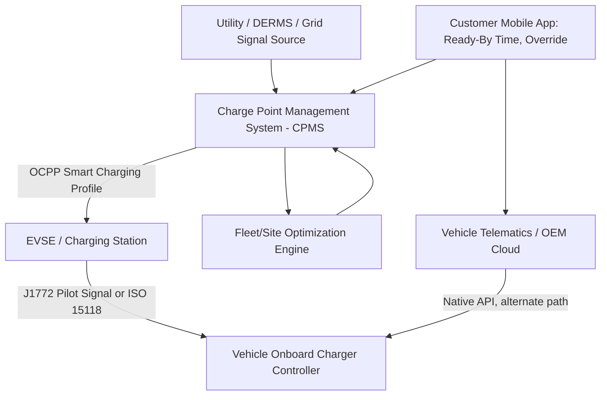

## Managed and Smart Charging Strategies

### Conceptual Foundation and Motivation

Managed and smart charging refers to the class of control strategies that shift, modulate, or coordinate electric vehicle charging load in time and/or magnitude, in contrast to uncontrolled (or "dumb") charging where a vehicle draws maximum available power immediately upon being plugged in until fully charged. The motivation is that uncontrolled charging, especially as EV adoption scales, tends to synchronize with existing residential and commercial demand peaks — vehicles are commonly plugged in upon arrival home in early evening, directly coincident with the pre-existing residential system peak in most utility territories — compounding rather than diversifying peak demand.

Managed charging decouples the timing of energy delivery from the timing of the plug-in event, using price signals, direct control, or optimization algorithms to shift the bulk of charging to periods more favorable for the grid (off-peak hours, periods of high renewable output, or periods of spare distribution/transmission headroom) while still meeting the vehicle owner's stated availability and range requirements.

**Key Points**

- Managed charging is a demand-side flexibility resource; unlike generation or storage, it does not add capacity but reshapes when existing charging demand is served
- The technical feasibility of managed charging rests on the fact that most EV charging sessions have substantial temporal slack — a vehicle plugged in for 8-10 hours overnight but requiring only 2-3 hours of charging time at typical Level 2 power has 5-8 hours of schedulable flexibility
- Managed charging strategies exist on a spectrum from passive (price-signal-based, no direct control) to fully active (utility or aggregator directly commands charging rate)

### Strategy Taxonomy

**Time-of-Use (TOU) Rate-Based Charging**

The simplest and most widely deployed managed charging mechanism. Utilities offer differentiated per-kWh rates by time period (e.g., low overnight rates, high late-afternoon/early-evening rates), and either the vehicle or the EVSE is programmed to delay charging until the low-rate window begins.

- Implementation is typically vehicle-side (via the OEM's mobile app scheduling feature) or EVSE-side (programmable start-time delay)
- No real-time communication with the utility or grid operator is required; the customer/vehicle simply follows a pre-published static schedule
- [Inference] Effectiveness depends heavily on whether a meaningful share of the EV population actually enrolls in and correctly configures TOU-responsive charging, since participation is generally voluntary and requires customer action unless bundled into a mandatory EV rate class

**Passive/Indirect Load Control (Price and Signal-Based)**

Extends beyond static TOU to dynamic pricing or grid-condition signals (e.g., real-time price feeds, grid stress indicators, or renewable output signals) that the vehicle or EVSE responds to algorithmically, without the utility directly commanding a specific charging rate.

- Requires a communication pathway (cellular, Wi-Fi, or utility AMI-adjacent signaling) to deliver the dynamic signal to the charging endpoint
- Vehicle or EVSE-side logic interprets the signal and adjusts charging start time or rate accordingly, typically subject to a user-specified "ready by" deadline that constrains how much delay is acceptable

**Active/Direct Load Control**

The utility, grid operator, or a third-party aggregator directly modulates charging rate or start/stop status via a control signal sent to the EVSE or vehicle telematics system, typically as part of a demand response program the customer has enrolled in (often in exchange for a bill credit or incentive payment).

- Requires bidirectional communication infrastructure and a defined control protocol (see OCPP smart charging profiles below)
- Provides the grid operator with much higher confidence of realized load impact compared to passive/price-based approaches, since the response is not contingent on end-user behavior or correct configuration
- Typically bounded by program rules limiting the frequency, duration, and magnitude of curtailment events to preserve customer trust and vehicle readiness

**Aggregated Fleet/Portfolio Management**

For commercial and fleet operators managing many vehicles at a single site or across multiple sites, a site or fleet energy management system optimizes charging schedules across the full vehicle portfolio against site-level constraints (utility demand charge avoidance, interconnection capacity limits) and fleet operational requirements (which vehicles must be ready and by when).

- This is the direct control-layer counterpart to the shared power cabinet / energy management system architecture described for DC Fast Charging sites
- Optimization is typically formulated as a scheduling/allocation problem, often linear or mixed-integer programming, minimizing cost or peak demand subject to per-vehicle energy and deadline constraints

**Key Points**

- These four categories are not mutually exclusive; a mature managed charging deployment often layers TOU rate incentives, dynamic price signals, and active control capability (used only during high-stress events) together
- The degree of control granted to the utility/aggregator versus retained by the vehicle owner is the central design and customer-acceptance trade-off across all active strategies

### Mathematical Formulation: Optimal Charging Schedule

A representative smart charging optimization for a single vehicle (or generalized to a fleet) minimizes a cost objective subject to energy delivery and operational constraints:

$$\min \sum_{t=1}^{T} c_t \cdot P_t \cdot \Delta t$$

subject to:

$$\sum_{t=1}^{T} P_t \cdot \Delta t = E_{required}$$

$$0 \leq P_t \leq P_{max}$$

$$P_t = 0 \quad \forall t \notin [t_{arrival}, t_{deadline}]$$

where $c_t$ is the electricity price (or grid-condition cost signal) in period $t$, $P_t$ is charging power in period $t$, $E_{required}$ is the total energy needed to reach the target state of charge, $P_{max}$ is the charger's maximum power (constrained by the lesser of vehicle onboard charger capacity and EVSE rating), and the final constraint restricts charging to the window between plug-in and the driver's specified deadline.

For fleet-level or aggregator-level optimization, this extends to a multi-vehicle formulation with an added site-level power constraint:

$$\sum_{v=1}^{V} P_{v,t} \leq P_{site,max} \quad \forall t$$

which is the mechanism by which fleet depot demand-charge-avoidance scheduling (as in the DCFC site example) and aggregator-level grid service provision are mathematically formulated — the site or aggregate power cap becomes a hard constraint that the per-vehicle schedules must collectively respect at every time period.

**Key Points**

- This is a convex optimization problem for a single vehicle with linear price signals and can be solved efficiently even for large fleets using standard linear programming solvers
- Real-world implementations add complexity: charging efficiency losses (typically modeled as a fixed percentage derate on delivered energy), non-linear tapering of charge acceptance rate at high state-of-charge, and uncertainty in actual arrival/departure times requiring either robust or stochastic optimization formulations
- When multiple vehicles compete for constrained site capacity, the allocation approach (proportional, priority-based, or cost-optimal) becomes a policy design choice, not merely a technical one

### Communication and Control Protocol Architecture

- **OCPP (Open Charge Point Protocol)**: The dominant vendor-neutral protocol between EVSE and a Charge Point Management System (CPMS); its smart charging extensions allow the CPMS to send time-varying power limit profiles ("charging profiles") to a station, which the station's firmware then enforces at the connector level
- **ISO 15118**: Enables vehicle-side smart charging participation directly through the charging cable, including Plug and Charge authentication and, in its bidirectional extensions, the higher-level signaling that underlies both managed unidirectional charging and Vehicle-to-Grid power export
- **OEM telematics-based control**: An alternative pathway where the vehicle manufacturer's own cloud platform (rather than the EVSE/CPMS chain) receives scheduling or signal information and controls the vehicle's onboard charger directly; common in residential contexts where the charging equipment itself may be a simple non-networked EVSE and the "smart" logic resides entirely in the vehicle

**Key Points**

- Because two distinct control pathways exist (EVSE/CPMS-side versus vehicle/OEM-side), a given managed charging program's technical integration approach depends on which pathway it targets, and programs increasingly need to support both to achieve broad participation across a heterogeneous vehicle and EVSE population
- [Unverified] The relative market share and long-term convergence of these two control pathways is an active area of industry standardization effort and should be assessed against current OEM and charging network partnership announcements rather than treated as settled

### Grid Services Enabled by Managed Charging

Beyond simple peak avoidance, sufficiently mature managed charging deployments (particularly aggregated fleet or large residential program scale) can provide formal grid services:

- **Peak shaving / demand charge management**: The site or portfolio-level application already described, primarily a customer-economics-driven use case
- **Renewable curtailment reduction**: Shifting charging load toward periods of high renewable (particularly solar) output helps absorb generation that would otherwise be curtailed due to insufficient demand or export capacity, effectively using EV batteries as a temporal demand-shifting sink
- **Frequency regulation and ancillary services**: [Inference] Aggregated EV charging load, when sufficiently fast-responding and precisely controllable, can in principle participate in fast-response ancillary service markets in a manner analogous to other controllable loads; actual market participation is more commonly associated with bidirectional (V2G) capability than unidirectional managed charging alone, and the specific market rules for EV aggregation vary significantly by RTO/ISO and should be verified against current market participation models rather than assumed uniformly available
- **Distribution non-wires alternatives**: Utilities have explored managed charging as an alternative to physical distribution capacity upgrades in specific constrained circuits, using contracted or incentivized load shifting to defer capital investment — the demand-side analog to the DCFC feeder-upgrade-deferral example given for on-site battery storage

### Example

A residential utility program enrolls EV owners in a managed charging rate: in exchange for a per-kWh bill credit, customers install a networked EVSE and allow the utility's aggregator platform to receive their vehicle's plug-in and target-ready-by time. The optimization engine solves the single-vehicle scheduling problem above nightly for each enrolled vehicle: a customer plugging in at 6:00 PM with a "ready by 7:00 AM" deadline and requiring 24 kWh to reach target state of charge, on a Level 2 charger rated 7.2 kW, has roughly 13 hours of available window against roughly 3.3 hours of required charging time — over 9 hours of schedulable slack. The aggregator schedules this vehicle's charging to begin at approximately 1:00 AM, after the region's evening residential peak has passed and wholesale/marginal generation cost has typically fallen, while still comfortably meeting the 7:00 AM deadline. Across thousands of enrolled vehicles with similarly staggered arrival times and deadlines, the aggregator's site-level constraint (analogous to $P_{site,max}$ above, here representing the utility's desired system-level charging load shape) is satisfied by solving the multi-vehicle allocation across the full enrolled population simultaneously each evening.

### Risk Considerations and Limitations

- **Customer acceptance and override behavior**: Active control strategies depend on customer trust that vehicles will be ready when needed; programs universally provide an override/opt-out mechanism for a given session, but frequent overrides undermine the program's aggregate load-shifting value and must be accounted for in program impact estimates
- **Telemetry and communication reliability**: Both passive signal-based and active control strategies depend on reliable communication to the vehicle or EVSE; connectivity gaps (cellular dead zones, home Wi-Fi outages, OEM cloud service disruptions) can cause a scheduled charging event to fail to execute as planned
- **Equity and access considerations** [Unverified]: Managed charging program design, particularly TOU rate structures, can have differential impacts depending on a customer's ability to shift charging timing (e.g., renters without dedicated overnight parking, or customers with inflexible daily driving schedules); this is a recognized area of utility rate-design and regulatory discussion but specific policy treatment varies significantly by jurisdiction
- **Rebound/synchronization risk**: [Inference] Poorly designed static TOU rates with a single sharp price transition can inadvertently create a new synchronized demand spike at the start of the low-price window, as many vehicles begin charging simultaneously the moment the rate drops — a phenomenon sometimes discussed in utility planning literature as "TOU rebound peak," which more sophisticated dynamic/randomized-start or directly-controlled approaches are specifically designed to avoid
- **Cybersecurity surface**: Direct load control pathways (CPMS-to-EVSE, OEM telematics) represent a control surface that, if compromised, could be used to manipulate charging behavior at scale; this is an active area of grid cybersecurity standards development for distributed energy resource management generally, not unique to EV charging

**Next Steps**

- Vehicle-to-Grid (V2G) and Bidirectional Power Flow: Technical and Market Architecture
- OCPP Smart Charging Profile Specification and Implementation Details
- Stochastic and Robust Optimization Formulations for Uncertain Arrival/Departure Times
- Distributed Energy Resource Management System (DERMS) Integration with EV Aggregation
- Utility Non-Wires Alternative Program Design Using Managed EV Charging
- Behavioral and Program Design Factors in Managed Charging Customer Enrollment and Retention