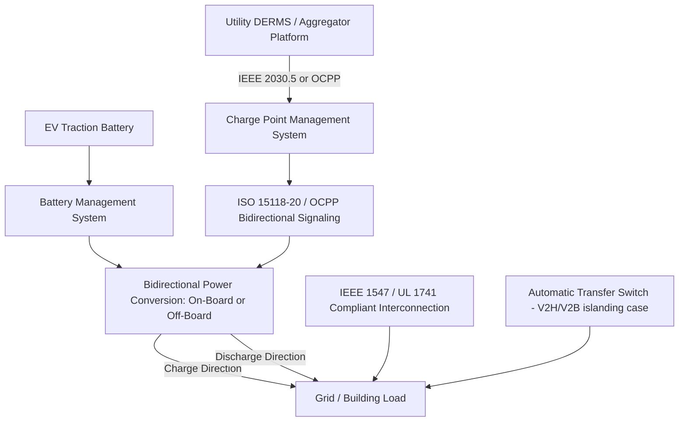

## Vehicle-to-Grid and Bidirectional Power Flow

### Conceptual Foundation

Vehicle-to-Grid (V2G) refers to the capability of an electric vehicle to discharge energy from its traction battery back onto the electrical grid (or onto a building's electrical system, in the related but distinct Vehicle-to-Home/V2H and Vehicle-to-Building/V2B configurations), converting the EV battery from a pure load into a dispatchable, mobile energy storage resource. This requires bidirectional power conversion hardware capable of both AC-to-DC rectification (charging) and DC-to-AC inversion (discharging) synchronized to grid voltage and frequency, along with the metering, communication, and control infrastructure needed to safely and verifiably manage two-way power flow.

V2G sits within a broader taxonomy of vehicle-grid integration (VGI) capabilities, distinguished by direction of power flow and destination:

| Mode | Power Flow | Destination | Primary Use Case |
| --- | --- | --- | --- |
| V1G (unidirectional managed charging) | Grid → Vehicle only, time/rate modulated | N/A | Load shifting, demand management |
| V2H (Vehicle-to-Home) | Vehicle → Building | Behind-the-meter, isolated from grid during outage | Backup power |
| V2B (Vehicle-to-Building) | Vehicle → Building | Behind-the-meter, grid-connected | Peak shaving, demand charge reduction |
| V2G (Vehicle-to-Grid) | Vehicle → Grid | Utility distribution/transmission system | Grid services, wholesale market participation |
| V2X (Vehicle-to-Everything) | Umbrella term | Any of the above | General bidirectional capability |

**Key Points**

- The Managed and Smart Charging Strategies content in this chapter covers V1G; this entry covers the bidirectional extension where the vehicle can also export power
- V2H/V2B typically require an automatic transfer switch or islanding-capable inverter to safely disconnect from the grid during a utility outage, since exporting power onto a de-energized grid during a utility outage creates a safety hazard for line workers (the same anti-islanding requirement that applies to residential solar-plus-storage systems)
- True V2G (grid export, grid-connected) requires utility interconnection approval and compliance with grid-tied inverter standards, distinct from the islanded V2H/V2B case

### Power Electronics Architecture

**On-Board Bidirectional Charging**

The vehicle's onboard charger performs both AC-to-DC conversion (charging) and DC-to-AC inversion (discharging) using the same power electronics stage, communicating with the EVSE/grid via a bidirectional-capable protocol.

- Enables bidirectional power flow through a standard AC (Level 2-class) connection, since the inverter stage resides in the vehicle
- Power levels are constrained by the onboard charger's rated capacity, typically in the same range as Level 2 charging (3.3-19.2 kW), making on-board bidirectional architectures well-suited to V2H/V2B and lower-power V2G applications but not high-power grid services
- Requires the vehicle itself to be designed with bidirectional-capable power electronics; not all EVs support this even if physically compatible with a bidirectional-capable EVSE, since it depends on the vehicle's onboard charger hardware and software

**Off-Board (DC-Coupled) Bidirectional Charging**

The charging station itself contains the bidirectional inverter, communicating with the vehicle over a DC fast-charging-class connector and protocol (extending the CCS/CHAdeMO/NACS DC architecture described in the charging infrastructure entry of this chapter to support power flow in both directions).

- Enables substantially higher bidirectional power levels, since the conversion equipment is not constrained by onboard vehicle packaging and thermal limits in the same way
- CHAdeMO was an early mover in standardizing bidirectional DC fast charging protocol support; CCS bidirectional capability has been an area of more recent standards development, and NACS/J3400 bidirectional specification is still maturing [Unverified — verify current connector-specific bidirectional standard maturity against current SAE/CharIN documentation, as this is an actively evolving standards area]
- Off-board architecture places the higher-cost bidirectional power electronics in the charging station rather than every vehicle, which is often more capital-efficient for fleet or site-level V2G deployments where a smaller number of stations serve many vehicles over their lifetime

**ISO 15118-20**

The current generation of the ISO 15118 vehicle-to-grid communication standard extends the plug-and-charge and smart charging signaling framework described in the Managed and Smart Charging Strategies entry to explicitly support bidirectional power transfer negotiation, including the vehicle communicating its available discharge capacity and the charging station/grid signaling desired export power and duration.

**Key Points**

- The on-board versus off-board architectural choice is the central design trade-off for V2G deployment, mirroring but distinct from the AC/DC classification for unidirectional charging: on-board favors lower cost per vehicle and broader connector compatibility with existing AC infrastructure, off-board favors higher power capability and concentrates specialized hardware cost at the station rather than the vehicle
- Both architectures require battery management system (BMS) coordination to ensure discharge events do not violate the battery's safe operating parameters or accelerate degradation beyond acceptable limits

### Grid Interconnection and Interoperability Standards

- **IEEE 1547**: The foundational U.S. standard for interconnecting distributed energy resources (including bidirectional EV chargers functioning as DER) with electric power systems, governing voltage/frequency ride-through behavior, anti-islanding protection, and power quality requirements
- **UL 1741**: Product safety and functional standard for grid-connected inverters, applicable to V2G-capable charging equipment functioning as a grid-tied inverter
- **IEEE 2030.5**: A common application-layer protocol used for DER communication with utility systems, sometimes used as the utility-facing signaling layer for V2G programs alongside or instead of OCPP/ISO 15118 on the vehicle-facing side

**Key Points**

- V2G-capable equipment must satisfy the same fundamental grid-tied inverter interconnection requirements as any other distributed energy resource (residential solar, battery storage), since from the grid's perspective, a discharging EV is functionally a mobile battery storage DER
- This means V2G deployment inherits both the technical maturity and the regulatory/utility tariff structure that has developed around DER interconnection more broadly, rather than requiring an entirely separate interconnection framework

### System Architecture

### Value Streams and Grid Services

**Behind-the-Meter Value (V2H/V2B)**

- **Backup power**: The EV battery serves as an emergency power source during grid outages, functionally similar to a stationary home battery but with substantially larger typical capacity (most EV batteries are 40-100+ kWh versus 10-20 kWh for typical residential storage), given an appropriately rated islanding-capable inverter and transfer switch
- **Demand charge / peak shaving**: For commercial/fleet sites, discharging vehicle batteries during peak demand periods reduces the facility's peak grid draw, directly analogous to the on-site battery storage strategy described for DCFC sites, but using otherwise-idle fleet vehicle batteries rather than dedicated stationary storage

**Grid-Facing Value (V2G)**

- **Wholesale energy arbitrage**: Charging during low-price periods and discharging during high-price periods, capturing the price spread, subject to battery degradation cost and round-trip efficiency losses
- **Frequency regulation**: Fast-responding charge/discharge modulation to help maintain grid frequency, a service that specifically rewards rapid, precise bidirectional response — a capability profile bidirectional EV batteries are well-suited to, similar to stationary battery storage participation in the same markets
- **Capacity/resource adequacy**: Aggregated V2G fleets participating in capacity markets, committing to be available to discharge during system peak or emergency conditions
- **Renewable integration support**: Absorbing surplus renewable generation (charging) and discharging during periods of renewable shortfall, extending the renewable curtailment reduction use case described for unidirectional managed charging into an active two-way balancing resource

**Key Points**

- [Inference] The relative economic value of these use cases to a vehicle owner or fleet operator depends heavily on local wholesale/retail rate structures, program incentive design, and the specific ancillary service market rules of the relevant RTO/ISO, and should not be treated as universally favorable; V2G program economics are an active area of pilot deployment and evaluation rather than uniformly commercialized practice
- Aggregation (pooling many individual EV batteries under a single aggregator platform to meet minimum market participation size thresholds) is typically required for V2G to participate meaningfully in wholesale or ancillary service markets, mirroring the aggregated fleet/portfolio management pattern described for unidirectional managed charging

### Battery Degradation Considerations

A central technical and economic question for V2G is the incremental battery degradation caused by additional charge/discharge cycling beyond what driving alone would cause.

- Battery degradation is driven by cycling depth, cycling rate, and time spent at high/low state-of-charge extremes and elevated temperature; V2G operation adds cycling activity beyond driving-only usage, and the incremental degradation cost must be weighed against the grid service revenue or benefit captured
- [Unverified] Published estimates of V2G-attributable degradation vary considerably across studies, battery chemistries, and operating protocols (e.g., state-of-charge windows used, discharge rate limits imposed by V2G program design); specific degradation figures should be sourced from current peer-reviewed studies or OEM warranty guidance for the relevant vehicle/battery chemistry rather than treated as a fixed industry-wide value
- Vehicle OEM warranty treatment of V2G-related cycling is a practical adoption gating factor: some OEMs have introduced V2G-compatible vehicles with warranty terms that explicitly account for bidirectional use, while others have historically excluded or limited warranty coverage for non-driving discharge cycling

**Example**

A school district operates a fleet of 20 electric buses, each with an 80 kWh battery, participating in a utility-sponsored V2G demand response program. Buses complete their driving routes by mid-morning and are typically idle (plugged into off-board bidirectional DC chargers at the depot) from late morning through early afternoon — coinciding with a regional summer peak demand period driven by air conditioning load. The utility's aggregator platform, communicating via the fleet's charge point management system, calls a discharge event during a peak afternoon period: each bus discharges at a controlled rate (limited by program rules to preserve adequate reserve capacity for the afternoon return route and to bound cycling-related degradation) contributing an aggregate 200+ kW to the local distribution feeder for the duration of the event, then recharges overnight during off-peak hours as in a standard managed charging schedule. This deployment pattern is representative of why school and transit bus fleets — characterized by predictable idle windows that align with peak demand periods — have been an early focus area for V2G pilot programs. [Inference: the specific power and duration figures in this example are illustrative of typical program design parameters, not a representation of any specific real deployment.]

### Risk Considerations and Limitations

- **Battery degradation and warranty uncertainty**: As discussed above, quantifying and compensating for V2G-attributable degradation remains a technical and commercial challenge that affects both vehicle owner willingness to participate and program economic design
- **Interconnection and metering complexity**: V2G requires bidirectional revenue-grade metering and utility interconnection approval processes that are, in many jurisdictions, less standardized and mature than the equivalent processes for unidirectional charging or even stationary battery storage, since regulatory frameworks have historically been developed with those simpler cases in mind first
- **Standards fragmentation**: As noted above, bidirectional capability across the CCS/CHAdeMO/NACS connector ecosystem is less uniformly mature than unidirectional DC fast charging capability; deployment planning must verify specific vehicle-charger-protocol compatibility rather than assuming general interoperability
- **Cybersecurity and control integrity**: Bidirectional power flow control represents a higher-consequence control surface than unidirectional charging control, since a compromised system could in principle be used to affect grid stability through coordinated, incorrect discharge commands across an aggregated fleet — an important design consideration for DERMS and aggregator platform security architecture
- **Program and market maturity**: [Unverified] V2G remains predominantly in pilot and early commercial deployment status across most jurisdictions rather than fully mature standard practice; the pace of transition toward broader commercial V2G programs varies significantly by region and should be assessed against current program announcements and regulatory dockets rather than assumed to follow a uniform trajectory

**Next Steps**

- Battery Degradation Modeling Under V2G Cycling Profiles
- IEEE 1547 and UL 1741 Interconnection Requirements for Bidirectional DER
- Fleet Electrification and V2G Program Design for Transit and School Bus Applications
- Aggregator Platform Architecture for Wholesale and Ancillary Service Market Participation
- Comparative Economics: V2G versus Stationary Battery Storage for Grid Services
- ISO 15118-20 Bidirectional Power Transfer Negotiation Protocol Details