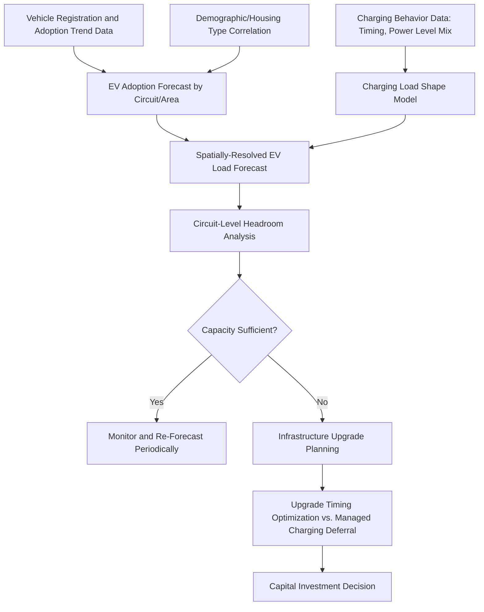

## Distribution Planning for EV Load Growth

### Conceptual Foundation

Distribution planning for EV load growth is the discipline of forecasting, quantifying, and proactively upgrading distribution system infrastructure (feeders, distribution transformers, substations) to accommodate the additional electrical demand created by electric vehicle charging, before that demand causes equipment overload, voltage violations, or service reliability degradation. Unlike bulk generation and transmission planning, which typically operate on system-wide aggregate load forecasts, EV load growth planning is distinctly a distribution-level and often circuit-level or even individual-transformer-level problem, because charging load — particularly residential Level 2 and concentrated DCFC deployment — can create highly localized capacity constraints well before they are visible in aggregate system-level load forecasts.

**Key Points**

- EV load growth is qualitatively different from traditional organic load growth (population growth, new construction) in its spatial concentration potential: a single neighborhood with high EV adoption, or a single fleet depot/DCFC corridor site, can create a step-change local demand increase that is invisible in a utility's traditional service-territory-wide forecast
- The planning challenge spans multiple voltage/equipment levels simultaneously: service transformers (serving one to a few residential customers), distribution feeders (serving hundreds to thousands of customers), and substations (aggregating multiple feeders)
- Distribution planning for EV load sits at the intersection of the infrastructure classes and grid interfaces, managed/smart charging, and V2G content already covered in this chapter — the planning problem is fundamentally about sizing and timing infrastructure investment against forecast demand that managed charging and V2G can partially mitigate

### Distribution Transformer-Level Impact

The residential distribution transformer (commonly serving 1-8 households depending on system design) is frequently the first point of infrastructure stress from EV adoption, because transformers are typically sized based on historical (pre-EV) diversified peak demand with limited headroom margin.

- **Loss-of-life analysis**: Transformer insulation degrades as a function of operating temperature over time, following an accelerated-aging relationship (commonly modeled via the IEEE C57.91 loss-of-life methodology) where sustained operation above nameplate rating consumes transformer insulation life at an accelerated, temperature-dependent rate
- **Diversity and coincidence factors**: Traditional distribution transformer sizing relies on load diversity — the assumption that not all connected customers reach their individual peak demand simultaneously. Residential EV charging, particularly if uncontrolled and synchronized to a common evening arrival-home pattern, can reduce this diversity benefit by causing multiple customers on the same transformer to charge simultaneously, effectively raising the coincident peak demand the transformer must serve
- **Hot-spot temperature and thermal cycling**: Even where average loading remains acceptable, the step-change nature of EV charging load (a large, discrete addition to otherwise smoothly varying household load) can create more pronounced thermal cycling than traditional load growth, which is a secondary consideration in some loss-of-life modeling approaches

**Example**

A distribution transformer serving 4 residential customers, sized at 25 kVA based on historical diversified peak demand of approximately 18 kVA (72% utilization, a typical planning margin), sees 2 of the 4 customers acquire EVs and begin Level 2 charging (7.2 kW each) shortly after arriving home around 6 PM, coincident with the existing household peak. Uncontrolled, this adds up to 14.4 kW (roughly 16 kVA at typical power factor) at the moment of highest pre-existing load, pushing coincident peak demand to approximately 34 kVA — well above the 25 kVA nameplate rating and into sustained overload territory that would trigger accelerated loss-of-life per IEEE C57.91 modeling. A managed charging program (as described in this chapter's Managed and Smart Charging Strategies entry) that delays the start of charging for these two customers until after 10 PM avoids this overload entirely without requiring transformer replacement, illustrating the direct planning interaction between demand-side management programs and traditional infrastructure capital investment avoidance.

### Feeder and Substation-Level Planning

At the feeder level (typically serving hundreds to low thousands of customers), EV load growth planning shifts from individual-transformer overload risk to aggregate feeder capacity, voltage regulation, and protection coordination considerations.

- **Feeder capacity headroom analysis**: Utilities assess forecast aggregate EV charging demand against available feeder thermal capacity, informed by adoption forecasts (often using vehicle registration trends, demographic/income correlation models, and stated utility EV adoption scenarios) combined with assumed or measured charging behavior profiles
- **Voltage regulation impact**: Concentrated charging load, particularly at the far end of long rural or suburban feeders where voltage drop is already a planning concern, can push voltage below acceptable ANSI C84.1 service voltage range limits during high-charging periods, potentially requiring voltage regulation equipment upgrades (capacitor banks, voltage regulators) independent of thermal capacity concerns
- **Protection coordination**: As with the topology optimization and reconductoring content earlier in this domain, adding substantial new load (or, in V2G-enabled scenarios, bidirectional power flow) at various points along a feeder can require re-verification of protective relay coordination, since fault current contribution and load flow assumptions underlying the original protection scheme may no longer hold

**Substation and Bulk System Interface**

At sufficient EV adoption scale, aggregate charging demand becomes relevant to substation transformer capacity and, ultimately, the transmission system feeding that substation — connecting this entry back to the bulk system planning concerns (thermal ratings, GET deployment) covered earlier in this chapter set, since sufficiently large aggregate EV load growth is, from a bulk system perspective, simply additional forecast peak demand that must be served by adequate generation and transmission capacity, potentially informed by the same AAR/DLR rating improvements and topology optimization strategies used to defer bulk transmission investment.

### Load Forecasting Methodology

**Key Points**

- Because EV adoption is spatially and demographically non-uniform (correlated with housing type, income, and charging access), utilities increasingly use spatially-resolved (circuit- or even transformer-level) forecasting models rather than relying solely on aggregate service-territory forecasts, to identify localized hot spots before they cause equipment failures or service quality complaints
- The charging load shape assumption (what fraction of vehicles charge immediately upon arrival at what power level, versus how much managed/TOU-responsive behavior is assumed) is one of the most consequential and uncertain modeling inputs, since it directly determines whether a given forecast adoption level triggers a capacity violation or remains within existing headroom
- [Inference] The degree to which utilities currently rely on granular circuit-level EV forecasting versus more traditional aggregate approaches varies substantially by utility sophistication and regulatory driver (e.g., states with aggressive EV adoption targets and associated utility filing requirements tend toward more granular approaches); this should be assessed against specific utility integrated resource plans and distribution system planning filings rather than assumed uniform across the industry

### Mitigation and Deferral Strategies

Utilities have several tools to address forecast EV load growth constraints, spanning traditional capital investment and newer non-wires alternatives:

- **Traditional infrastructure upgrade**: Transformer replacement/upsizing, feeder reconductoring or new feeder construction, substation capacity addition — capital-intensive but permanent solutions
- **Managed/smart charging programs**: As covered extensively in this chapter, shifting charging timing to avoid coincident peak can directly defer or eliminate the need for capacity upgrades in specific constrained circuits, functioning as a distribution-level non-wires alternative
- **Targeted rate design**: EV-specific TOU rates or separately metered EV circuits with their own rate structure, providing both a demand-management incentive and, in the separately-metered case, better utility visibility into EV-specific load for planning purposes
- **Make-ready programs**: Utility programs that proactively upgrade the utility-side distribution infrastructure (transformer, service drop) in anticipation of or in response to a customer's EV charger installation request, sometimes bundled with a broader area-wide capacity upgrade rather than addressed purely reactively on a customer-by-customer basis
- **Strategic siting guidance for DCFC**: For higher-impact DCFC and fleet depot siting specifically, utilities increasingly publish hosting capacity maps or engage in pre-application consultation to steer large new loads toward locations with available capacity, avoiding the longest interconnection queue delays described in the EV Charging Infrastructure Classes entry

**Key Points**

- The choice between capital upgrade and managed-charging-based deferral is fundamentally an economic and risk comparison: managed charging avoids or delays capital cost but depends on continued program participation and effectiveness, while capital upgrades are permanent but front-load cost and construction lead time
- Regulatory treatment of utility investment in managed charging programs versus traditional infrastructure (i.e., whether non-wires alternative program costs are treated comparably to capital investment in utility rate base and cost recovery) varies by jurisdiction and materially affects which mitigation path utilities are incentivized to pursue

### Risk Considerations and Limitations

- **Forecast uncertainty and lead time mismatch**: Distribution infrastructure upgrades (particularly substation and feeder-level projects) often have multi-year planning and construction lead times, while EV adoption in a specific area can accelerate faster than traditional load forecasting methodologies anticipate, creating a structural risk of infrastructure lagging actual demand growth in high-adoption areas
- **Data and visibility gaps**: Utilities' ability to forecast and respond to localized EV load growth depends on granular data (vehicle registration by location, actual charging behavior, transformer-level loading telemetry) that not all utilities have fully deployed (particularly older service territories without widespread smart meter or transformer-level monitoring infrastructure)
- **Equity in infrastructure investment timing**: [Unverified] Reactive (customer-request-driven) versus proactive (forecast-driven) infrastructure planning approaches can create different outcomes for early EV adopters versus later adopters in the same area, and specific utility practices and regulatory guidance on this point vary by jurisdiction
- **Interaction effects with other electrification trends**: EV charging load growth is frequently concurrent with other electrification-driven load growth (heat pump adoption, building electrification), and distribution planning increasingly must account for combined electrification load growth rather than evaluating EV impact in isolation, which [Inference] adds forecasting complexity beyond what EV-specific models alone can capture

**Next Steps**

- IEEE C57.91 Transformer Loss-of-Life Methodology in Detail
- Hosting Capacity Analysis Methods for Distribution Circuits
- Non-Wires Alternative Program Design and Regulatory Cost Recovery Treatment
- Combined Electrification Load Forecasting: EV Charging and Heat Pump Adoption
- Utility Make-Ready Program Design and Customer Interconnection Process Optimization
- Spatially-Resolved EV Adoption Forecasting Using Demographic and Registration Data