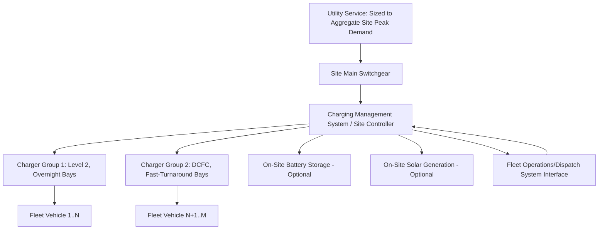

## EV Fleet and Depot Charging Considerations

### Conceptual Foundation

EV fleet and depot charging is the design discipline concerned with electrifying multiple vehicles operating and charging from a shared, centrally managed site — transit and school buses, delivery vans, ride-hail vehicles, utility service trucks, and similar commercial/institutional fleets — as distinguished from the residential single-vehicle and distributed public/workplace charging contexts covered elsewhere in this chapter. Fleet depot charging is characterized by high load concentration at a single site, predictable (though operationally critical) vehicle scheduling, and a direct commercial relationship between charging cost/reliability and the fleet operator's core business function, which together create a distinct engineering and planning problem from residential or public charging infrastructure.

**Key Points**

- Fleet depots combine the highest per-site power demands discussed in this chapter (frequently multi-megawatt aggregate, per the DCFC and V2G entries) with the tightest reliability requirements, since a charging failure directly threatens the fleet's ability to complete its operational duty cycle
- Depot charging design draws directly on the infrastructure classes, managed charging, V2G, and distribution planning content already covered in this chapter, but combines them into a single integrated site design problem rather than treating each in isolation
- Fleet electrification is frequently mandated or incentivized by policy (transit agency electrification mandates, municipal fleet policies, corporate sustainability commitments), making depot charging design a near-term practical priority in many jurisdictions rather than a purely optional infrastructure investment

### Duty Cycle Analysis and Charger Sizing

The foundational engineering step in depot design is characterizing the fleet's operational duty cycle — the pattern of vehicle departure times, route distances/energy consumption, and return/dwell times — since this determines both how much energy must be delivered and how much time is available to deliver it.

- **Energy requirement per vehicle**: Determined by route distance, vehicle efficiency (kWh/mile, which varies by vehicle class, route terrain, climate/HVAC load, and payload), and a target reserve margin (typically not planning to fully deplete the battery, both for battery health and operational contingency)
- **Available charging window**: The time between a vehicle's return to depot and its next required departure; for transit and school buses this is often a large overnight window plus a shorter midday layover window, while for delivery/logistics fleets the pattern may be more continuous with shorter, more frequent charging opportunities between routes
- **Charger power level selection**: Determined by dividing required energy by available time, then selecting the charging infrastructure class (Level 2 versus DC Fast Charging, per this chapter's infrastructure classes entry) that can deliver that power within the available window, with margin for charging efficiency losses and non-ideal scheduling

**Key Points**

- Overnight-dominant duty cycles (most transit, school bus, and last-mile delivery fleets) with 6-10+ hour available windows can frequently be served by Level 2-class charging despite substantial daily energy requirements, since the long available window compensates for lower power, at meaningfully lower capital cost than DCFC-based depot design
- Duty cycles with short turnaround windows (high-utilization ride-hail, some logistics operations, transit routes with minimal midday layover) require DC Fast Charging-class power to fit adequate energy delivery into the available time, at correspondingly higher capital and grid interconnection cost
- [Inference] Route and duty cycle electrification suitability assessment — determining which specific routes/vehicles in a mixed fleet are well-suited to electrification given range and charging window constraints — is commonly performed as an early planning step before infrastructure design, since not all routes in a fleet may be equally suited to early-phase electrification

### Site Power Architecture

- **Shared power allocation architecture**: As introduced in the DCFC entry's shared power cabinet discussion, depot sites frequently deploy a site-level power management system that dynamically allocates available capacity across simultaneously charging vehicles, rather than statically dedicating fixed circuit capacity to every charging bay — improving utilization of the site's utility interconnection capacity
- **Integration with fleet dispatch/operations systems**: Distinguishing depot charging from most other charging contexts, the charging management system frequently integrates directly with the fleet operator's dispatch or telematics system, so that charging prioritization can account for which vehicles are scheduled for imminent departure versus which have more schedule slack — a fleet-specific extension of the scheduling optimization introduced in the Managed and Smart Charging Strategies entry
- **On-site generation and storage**: Given the high aggregate power demands and (for many fleet operators) sustainability commitments, on-site solar generation and battery storage are more commonly integrated into depot design than into typical residential or public charging deployments, serving the dual purpose of demand charge mitigation (as in the DCFC example in this chapter) and emissions/cost reduction

### Utility Interconnection and Rate Considerations

Fleet depot electrification frequently represents one of the largest single new-load additions a distribution utility processes in a given service area, directly engaging the distribution planning considerations covered earlier in this chapter.

- **Interconnection study and timeline**: As with high-power DCFC sites, depot interconnection is frequently gated by utility distribution capacity availability and study/construction lead time; fleet electrification project timelines commonly identify utility interconnection as the critical path item, sometimes exceeding vehicle procurement and facility construction timelines
- **Demand charge exposure**: Depot sites are particularly exposed to commercial demand charge rate structures given their high peak-to-average load ratio (especially for overnight-charging fleets with near-zero daytime charging demand), making the demand charge mitigation strategies covered in the DCFC and V2G entries (managed charging scheduling, on-site storage) directly financially material to depot operating economics
- **Utility make-ready and fleet-specific rate programs**: Given the policy priority often attached to fleet electrification (particularly transit and school bus fleets, frequently subject to specific state or municipal electrification mandates), utilities in a number of jurisdictions have developed dedicated make-ready programs and/or EV fleet-specific rate structures intended to reduce the effective capital and operating cost barrier to depot electrification, mirroring but often more developed than the general make-ready programs described in the distribution planning entry

### Vehicle-to-Grid Applicability at Depots

Fleet depots are widely considered a particularly favorable context for V2G/V2B deployment, for reasons connecting directly to the V2G entry's discussion:

- Fleet vehicles are typically owned/controlled by a single operator (rather than the fragmented individual ownership of residential/public charging contexts), simplifying the aggregation and control coordination needed for V2G participation
- Duty cycles with substantial predictable idle time (the transit/school bus midday layover example given in the V2G entry) provide a reliable, schedulable discharge opportunity
- The demand charge and backup power value streams described in the V2G entry's "behind-the-meter value" discussion are directly and immediately valuable to the fleet operator's own site economics and operational resilience, providing a clearer near-term business case than some V2G grid-services use cases that depend on wholesale/ancillary market participation

**Example**

A regional delivery company electrifying a 50-van depot analyzes its duty cycle: vans depart in staggered waves from 6 AM to 9 AM, return between 3 PM and 7 PM, and require an average of 120 kWh per van per day (accounting for route distance and vehicle efficiency). With a 10-14 hour overnight window available for the bulk of the fleet, the company selects a predominantly Level 2 architecture (19.2 kW per bay, the higher end of Level 2 capability, chosen to comfortably complete a full charge within the available overnight window even accounting for staggered return times) for the majority of bays, supplemented by 2 DCFC bays for vans on tighter turnaround routes or as contingency for vans returning later than planned. A site-level charging management system, integrated with the company's route dispatch software, prioritizes charging for vans assigned to the earliest morning departure waves. The utility interconnection study determines the existing site service (a legacy 500 kW commercial connection from the depot's prior use) is insufficient for the calculated 2.8 MW theoretical simultaneous peak; rather than fund the full utility service upgrade to accommodate a peak that would rarely actually occur (since not all 50 vans charge at full power simultaneously in practice, given staggered arrivals and duty cycle variation), the company deploys the dynamic power allocation architecture described above sized to a more realistic 1.2 MW coincident peak informed by the duty cycle analysis, substantially reducing both the utility upgrade scope and cost relative to a naive sum-of-nameplate-ratings sizing approach.

### Risk Considerations and Limitations

- **Duty cycle assumption risk**: Charger sizing and site power architecture depend heavily on the assumed duty cycle (return times, energy requirements, charging window); operational reality (route changes, weather-driven range reduction, schedule disruptions) that deviates from planning assumptions can create charging shortfalls, motivating conservative margin in both energy and power sizing
- **Interconnection timeline risk**: As emphasized above, utility interconnection lead time is frequently the critical path and least controllable element of a depot electrification timeline, creating project risk that is largely outside the fleet operator's direct control
- **Single point of failure concentration**: Centralizing an entire fleet's charging at one depot site creates concentrated operational risk (a site-level power outage or major equipment failure affects the whole fleet simultaneously) that distributed residential or public charging does not present to the same degree; some fleet designs mitigate this through multi-site depot strategies or backup power/V2H-style contingency capability
- **Capital cost and total cost of ownership uncertainty** [Unverified]: While operating cost comparisons between electric and conventional fleet vehicles are widely modeled, the specific capital cost of depot infrastructure (which varies enormously based on site-specific utility interconnection cost, which is often the largest and most variable cost component) makes generalized total-cost-of-ownership claims for fleet electrification highly project-specific, and specific figures should be sourced from current project-level studies rather than generalized industry averages

**Next Steps**

- Duty Cycle and Route Suitability Analysis Methodologies for Fleet Electrification
- Dynamic Power Allocation and Charging Management System Architecture in Detail
- Transit and School Bus Electrification: Policy Mandates and Funding Mechanisms
- Fleet-Specific Utility Rate Design and Make-Ready Program Structures
- Multi-Site Depot Strategy and Redundancy Planning for Fleet Resilience
- Total Cost of Ownership Modeling Frameworks for Electric Fleet Transition