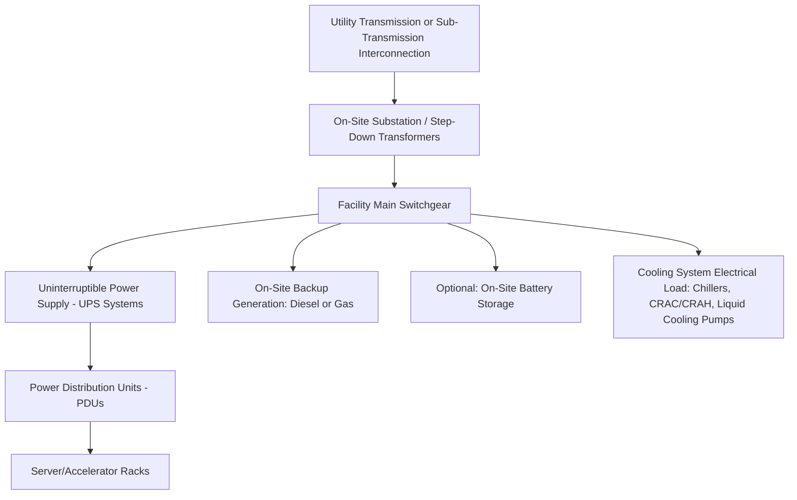

## Data Center and Hyperscale Load Characteristics

### Conceptual Foundation and Emerging Scale

Data center and hyperscale computing load has emerged as one of the most consequential new large-load categories for grid capacity planning, driven substantially by the rapid growth in artificial intelligence training and inference workloads alongside continued growth in conventional cloud computing demand. Unlike most traditional large industrial loads (steel mills, chemical plants, manufacturing facilities), modern hyperscale data centers combine very high power density, distinctive electrical load characteristics driven by power electronics rather than rotating machinery, and — in the case of AI training workloads specifically — load volatility patterns that differ meaningfully from traditional steady industrial process load.

**Key Points**

- Individual hyperscale data center campuses can now represent single-site demand in the hundreds of megawatts to (for the largest announced AI training facilities) gigawatt-class scale, placing them among the largest individual loads a transmission or distribution system may need to accommodate
- The combination of rapid announced growth, long typical interconnection queue timelines, and uncertain long-term load trajectory (given the pace of AI hardware efficiency improvement and workload evolution) creates a distinctive planning challenge relative to more predictable traditional large industrial load additions
- Because this is a rapidly evolving domain, current published capacity figures, interconnection queue statistics, and specific project announcements should be verified against current sources rather than treated as stable reference values

### Load Density and Facility Power Architecture

**Power Density Trends**

Traditional enterprise data centers historically operated at power densities on the order of 5-10 kW per rack. Modern hyperscale facilities, and particularly AI-optimized facilities housing GPU/accelerator clusters, operate at substantially higher densities, with high-performance AI training racks reaching into the tens of kW per rack and, for the most densely packed liquid-cooled configurations, higher still.

- [Inference] The specific power density figures associated with current-generation AI accelerator hardware are evolving rapidly with each hardware generation and should be verified against current vendor and hyperscaler technical disclosures rather than treated as fixed, given the pace of change in this specific sub-domain

**Facility Electrical Architecture**

- **UPS systems**: Provide ride-through power during the transition to backup generation and filter/condition power for sensitive electronic loads; from the grid's perspective, UPS systems (particularly double-conversion designs, which continuously rectify incoming AC to DC and re-invert to AC) present the load as a power-electronics-dominated, rather than direct-motor-dominated, interface
- **Backup generation**: Diesel or natural gas generators sized to carry full facility critical load during utility outages, typically not grid-interactive under normal operation but relevant to interconnection agreements and, in some emerging arrangements, potentially available for grid support services
- **Cooling system load**: A substantial fraction of total facility power (historically commonly cited in the range of 30-40%+ of total facility power for traditional air-cooled designs, though this fraction has been decreasing with efficiency improvements and the shift toward liquid cooling for high-density AI workloads) — cooling load is itself a function of IT load, ambient conditions, and cooling system design, making total facility power a compound function of computing demand and thermal management approach rather than IT load alone

**Key Points**

- Power Usage Effectiveness (PUE), defined as total facility power divided by IT equipment power, is the standard industry metric for cooling and infrastructure overhead efficiency; modern hyperscale facilities commonly target PUE values approaching 1.1-1.2 (meaning only 10-20% overhead beyond IT load itself), a substantial improvement over older enterprise data center designs that commonly operated at PUE 1.5-2.0+
- The shift toward liquid cooling (direct-to-chip or immersion cooling) for high-density AI accelerator racks is driven partly by the thermal limits of air cooling at the power densities modern accelerators require, and has secondary electrical implications (different pump/cooling infrastructure load profile compared to traditional CRAC/CRAH air handling systems)

### Grid-Facing Load Characteristics

**Power Quality and Harmonics**

The power-electronics-dominated nature of data center load (UPS rectifier/inverter stages, server power supplies, increasingly variable-frequency-drive-controlled cooling equipment) introduces harmonic distortion considerations analogous to, though at much larger aggregate scale than, the DCFC power quality considerations discussed in the EV Integration chapter. Utility interconnection agreements for large data center loads typically specify harmonic distortion limits (commonly referencing IEEE 519) that facility power electronics and any on-site power conditioning must satisfy.

**Load Factor and Steadiness**

Traditional enterprise and conventional cloud computing data center load has historically been characterized as notably steady and high-load-factor compared to many other commercial/industrial loads — servers draw relatively consistent power across the day with modest diurnal variation tied to workload scheduling, in contrast to the sharp peaks characteristic of, for example, DCFC or certain industrial batch processes.

- [Inference] AI training workloads specifically have been observed and discussed in industry and research contexts to introduce more pronounced power fluctuation than traditional steady cloud computing load, arising from the synchronized computational phases of large-scale distributed training jobs (periods of intense synchronized GPU computation alternating with communication/synchronization phases across the training cluster) — this is an area of active technical discussion regarding grid impact and should be verified against current published grid-operator and hyperscaler technical analyses rather than treated as fully characterized, since the phenomenon, its magnitude, and effective mitigation approaches are still being actively studied and documented as of the current period

**Key Points**

- The distinction between traditional steady data center load and potentially more volatile AI training load is significant for grid planning because sudden, large, rapid power swings (rather than just high average demand) create distinct challenges for frequency regulation and local voltage stability that differ from simply serving a large but steady new load
- Facility-level mitigation approaches under industry discussion include on-site battery buffering (smoothing rapid load swings before they reach the grid interconnection point) and workload scheduling coordination, conceptually parallel to the managed charging and on-site storage strategies discussed in the EV Integration chapter, though applied to a fundamentally different load type and timescale

### Interconnection Scale and Timeline Considerations

Given the transmission-class power levels of many hyperscale and AI data center projects, interconnection processes and timelines for these facilities frequently engage transmission-level (rather than purely distribution-level) interconnection study processes, in contrast to the predominantly distribution-focused interconnection discussion in the EV Integration chapter's fleet depot and DCFC content.

- **Interconnection queue position and study timelines**: Large load interconnection requests of this scale commonly require multi-year utility and, where applicable, transmission planning region study processes to assess system impact, required upgrades, and cost allocation — a timeline dynamic that has become a significant factor in hyperscale data center site selection and project timelines
- **Speed-to-power as a siting factor**: [Inference] Given competitive pressure to bring AI computing capacity online quickly, interconnection timeline has reportedly become a significant, and in some cases primary, site selection criterion for new hyperscale facilities, sometimes discussed alongside or ahead of traditional siting factors like land cost, water availability (relevant to cooling), and fiber connectivity — this characterization reflects general industry discussion and should be verified against current site selection announcements and analysis for specific claims
- **Behind-the-meter and co-located generation arrangements**: Partly in response to interconnection timeline and grid capacity constraints, a range of arrangements involving dedicated or co-located generation (including, in some announced projects, dedicated gas generation or nuclear arrangements) have emerged as an alternative or supplement to conventional grid interconnection for large data center loads; the specific regulatory, market, and technical framework for these arrangements varies by jurisdiction and is an evolving area that should be assessed against current regulatory dockets and project announcements rather than treated as a settled practice

### Example

A hyperscale operator proposes a 500 MW AI training campus in a utility's service territory. The utility's interconnection study process identifies that the existing regional transmission network has approximately 150 MW of readily available headroom without upgrades; serving the full 500 MW request requires either a multi-year transmission upgrade project (new transmission line segments and substation capacity, engaging planning considerations analogous to the topology optimization, reconductoring, and rating-improvement technologies discussed earlier in this domain, though at a scale where those tools alone are unlikely to close a 350 MW gap) or a phased interconnection approach where the facility initially operates at the 150 MW available capacity while the transmission upgrade proceeds, or a hybrid arrangement incorporating dedicated on-site or co-located generation to serve some portion of load independent of the grid interconnection. The operator's ultimate approach reflects a project-specific balance between speed-to-power priorities and the cost/complexity of alternative generation arrangements, illustrating why large-load interconnection has become a central and active area of transmission planning and utility large-load interconnection policy development.

### Risk Considerations and Limitations

- **Forecast and commitment uncertainty**: [Unverified] The aggregate pipeline of announced hyperscale/AI data center load across many utility service territories substantially exceeds what is likely to be realized, since not all announced or queued projects proceed to completion at announced capacity and timeline; utilities and transmission planners face a genuine forecasting challenge in distinguishing credible load commitments from speculative or overlapping queue positions, and this has become a distinct area of utility large-load interconnection policy development (including proposals for capacity deposits, minimum-take contract terms, and other commitment mechanisms) that varies significantly by jurisdiction
- **Rapid technology change risk**: Given the pace of AI accelerator hardware efficiency improvement, [Inference] the long-term load trajectory implied by current-generation hardware power density and facility plans carries meaningful uncertainty, since future hardware generations could plausibly deliver similar computational capability at different power draw levels, affecting both individual facility load and aggregate system-level forecasts over the multi-year timescales relevant to transmission planning
- **Cost allocation and rate impact concerns**: The scale of transmission and distribution investment potentially required to serve large data center load growth has raised active regulatory discussion in multiple jurisdictions regarding appropriate cost allocation between the large-load customer and the broader utility rate base, an area of ongoing regulatory proceedings that varies by jurisdiction
- **Power quality and grid stability at scale**: As discussed above, the potentially volatile load characteristics of AI training workloads specifically, at the aggregate scale now being proposed, represent a technical area still being actively characterized by grid operators and researchers rather than a fully mature, well-understood load category with established mitigation standards

**Next Steps**

- Large Load Interconnection Policy Development: Capacity Deposits and Commitment Mechanisms
- AI Training Workload Power Fluctuation: Technical Characterization and Grid Impact Studies
- Behind-the-Meter and Co-Located Generation Arrangements for Large Loads
- Liquid Cooling Electrical Infrastructure and Power Density Trends
- Transmission Planning Region Cost Allocation for Large Load-Driven Upgrades
- Comparative Grid Impact: Traditional Industrial Load versus Hyperscale Data Center Load Profiles