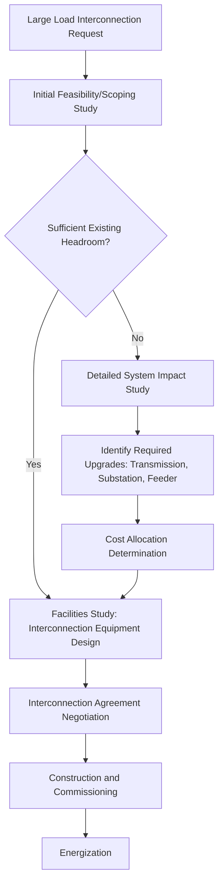

## Large-Load Interconnection Processes and Queue Management

### Conceptual Foundation

Large-load interconnection is the regulatory and technical process by which a new large electricity consumer (data centers, industrial facilities, large fleet depots, and similar multi-megawatt to multi-gigawatt loads) obtains utility or transmission system capacity and formal approval to connect to and draw power from the grid. Historically, load interconnection received substantially less formalized regulatory and planning attention than generator interconnection, since new large loads were comparatively rare, grew more gradually, and rarely individually threatened system reliability in the way a large new generator's operational characteristics might. The rapid emergence of gigawatt-scale data center and industrial electrification demand (as discussed in the Data Center and Hyperscale Load Characteristics entry) has driven a substantial shift toward more formalized, generator-interconnection-like large-load interconnection processes across many utilities and transmission planning regions.

**Key Points**

- Large-load interconnection sits conceptually parallel to, but historically less mature than, the generator interconnection queue processes that have received decades of regulatory attention (particularly amid the renewable generation interconnection queue backlogs widely discussed in industry and regulatory contexts)
- The core planning challenge — determining whether existing infrastructure can serve a new load without violating thermal, voltage, or reliability criteria, and if not, what upgrades are needed and how their cost is allocated — mirrors the distribution planning methodology discussed in the EV Integration chapter, but at transmission scale and typically for a single large customer rather than an aggregate/forecast customer class
- This is an actively evolving regulatory area; specific queue reform proposals, FERC/state regulatory actions, and utility-specific process details should be verified against current filings and announcements rather than treated as settled practice

### Interconnection Study Process

**Key Points**

- The general study sequence — initial system impact screening, detailed system impact study, facilities study, and interconnection agreement — parallels the well-established generator interconnection study framework used by most U.S. RTOs/ISOs and utilities, adapted for load rather than generation characteristics
- Unlike generator interconnection, where the primary technical concerns are around injection impact on power flow, voltage, and stability, large-load interconnection studies focus on withdrawal impact: whether the new load can be served without violating thermal ratings on the serving transmission/distribution elements, without causing unacceptable voltage drop, and without compromising N-1 (and where applicable N-1-1) contingency performance of the serving system

- **Feasibility/scoping study**: A relatively rapid initial assessment of whether the requested load can plausibly be served given existing system headroom, providing an early go/no-go and rough cost/timeline signal before committing to a full detailed study
- **System impact study**: Detailed power flow, thermal, voltage, and contingency analysis (using the PTDF/LODF sensitivity methodologies and N-1 security criteria discussed in the Transmission Topology Optimization entry earlier in this domain) to determine precisely what upgrades, if any, are required to serve the load reliably
- **Facilities study**: Detailed engineering design of the specific interconnection facilities (substation equipment, metering, protection) required to physically connect the load
- **Interconnection agreement**: The legal and commercial contract governing the terms of interconnection, including cost responsibility, in-service milestones, and often increasingly (per the discussion below) load commitment and curtailability provisions

### Queue Management Challenges

**The Speculative/Duplicate Interconnection Request Problem**

A central challenge that has emerged, particularly for data center load, is distinguishing credible, committed load interconnection requests from speculative or duplicative ones. Because large-load developers (particularly data center developers competing for the fastest available interconnection timeline) may submit interconnection requests at multiple candidate sites or with multiple utilities simultaneously while evaluating options, aggregate queued load volume can substantially overstate the load that will actually materialize, complicating utility and transmission planners' ability to accurately forecast which upgrades are genuinely needed.

- [Inference] This dynamic is conceptually analogous to, and in some regulatory discussions explicitly compared to, the long-standing "phantom" or speculative interconnection request problem documented in generator interconnection queues, where utilities and RTOs have implemented reforms (increased financial commitment requirements, site control demonstration requirements, at-risk deposits) specifically to filter out non-credible requests and improve queue processing efficiency — similar reform concepts are increasingly being discussed and, in some jurisdictions, implemented for large-load interconnection specifically, though the maturity and specific mechanism design varies substantially by jurisdiction and should be verified against current utility tariff filings

**Queue Position and Cost Allocation Approaches**

- **First-come, first-served / sequential study**: The traditional approach where requests are studied and offered interconnection capacity in the order received, which can create long queues when early, large requests consume available headroom that later requests must then fund additional upgrades to access
- **Cluster study approaches**: Adapted from generator interconnection queue reform, grouping multiple pending requests in a defined geographic or temporal cluster for simultaneous study, allowing shared upgrade costs to be allocated proportionally rather than assigning the full cost of a shared upgrade to whichever request happened to be studied first
- **Cost allocation between customer and rate base**: A recurring and actively contested regulatory question is the degree to which large-load-driven infrastructure upgrade costs should be borne directly by the requesting large-load customer (through interconnection facility charges or contribution-in-aid-of-construction payments) versus socialized across the broader utility rate base as a general system investment; specific treatment varies significantly by jurisdiction and is the subject of active regulatory proceedings in multiple states as of the current period

### Load Commitment and Flexibility Mechanisms

In response to both the speculative-request problem and the general scale of required infrastructure investment, utilities and regulators have increasingly explored contractual mechanisms that trade load flexibility for faster or lower-cost interconnection:

- **Minimum-take / take-or-pay provisions**: Contractual commitments requiring the large-load customer to pay for a minimum level of capacity or energy regardless of actual usage, intended to give the utility greater confidence in the revenue stream supporting infrastructure investment and to discourage speculative or over-sized requests
- **Curtailable/flexible interconnection service**: Interconnection offered on a conditional or curtailable basis — the load may be served at full requested capacity for most of the year but subject to curtailment during defined system stress conditions — potentially allowing interconnection to proceed at initially lower-cost/faster timelines by avoiding upgrades sized only for rare peak conditions, conceptually parallel to the managed charging and demand response mechanisms discussed extensively in the EV Integration chapter's Managed and Smart Charging Strategies entry, but applied to load interconnection capacity itself rather than to a specific charging schedule
- **Large flexible load tariffs**: [Inference] A number of utilities and regulatory dockets have specifically explored or proposed tariff structures allowing data center and similar large loads to accept a defined degree of curtailment or demand flexibility in exchange for faster interconnection timelines or reduced infrastructure cost responsibility, on the premise that a data center's actual computational workload may have more scheduling flexibility (particularly for non-latency-sensitive batch/training workloads, as distinguished from latency-sensitive inference workloads) than the facility's nameplate power draw alone would suggest; the specific design, adoption status, and effectiveness of such tariffs varies by jurisdiction and is an active area of regulatory development that should be assessed against current dockets rather than treated as broadly established practice

### Example

A data center developer submits interconnection requests to three different utilities in three different states for a proposed 300 MW facility, while evaluating final site selection based on which utility can offer the fastest interconnection timeline (reflecting the speed-to-power siting dynamic discussed in the Data Center and Hyperscale Load Characteristics entry). Each utility's interconnection queue must now account for this 300 MW request in its planning, even though only one of the three sites will ultimately proceed. If each utility's tariff requires only a modest, refundable initial deposit to maintain queue position, all three requests may remain active and consume planning attention and potentially trigger preliminary upgrade studies, until the developer's site selection is finalized — the queue management challenge this creates is a direct illustration of why utilities and regulators in multiple jurisdictions have moved toward larger at-risk financial commitments, site control documentation requirements, and other credibility-filtering mechanisms earlier in the interconnection process, aiming to reduce the planning burden created by non-credible duplicate requests.

### Risk Considerations and Limitations

- **Queue reform is jurisdiction-specific and evolving**: Given the pace of regulatory development in this area, generalized descriptions of "current" large-load interconnection practice risk becoming outdated quickly; project-specific planning should reference the current tariff and interconnection procedures of the specific utility or transmission planning region involved
- **Tension between speed and cost allocation fairness**: Mechanisms designed to filter speculative requests (higher deposits, site control requirements) can also create barriers for smaller or less-capitalized large-load developers, raising a policy tension between queue efficiency and market access that is actively debated in ongoing regulatory proceedings
- **Flexible/curtailable interconnection uncertainty**: [Unverified] While curtailable interconnection service is conceptually attractive as a way to accelerate large-load interconnection using existing headroom, the specific reliability, contractual enforceability, and customer risk tolerance considerations of such arrangements are still being worked out in most jurisdictions, and adoption remains comparatively limited relative to conventional firm interconnection as of the current period
- **Interaction with generator interconnection queues**: [Inference] In some transmission planning regions, large new load and large new generation interconnection requests can interact (e.g., a large load and nearby generation project competing for the same limited transmission headroom, or conversely a large load potentially justifying transmission upgrades that also benefit generation interconnection), creating planning interdependencies between what have historically been largely separate generator and load interconnection processes; the degree of formal coordination between these processes varies by transmission planning region

**Next Steps**

- Cluster Study Methodologies Adapted from Generator Interconnection Queue Reform
- Large Flexible Load Tariff Design: Case Studies and Regulatory Status
- Financial Commitment and Site Control Requirements for Queue Credibility Filtering
- Cost Allocation Methodologies for Shared Large-Load-Driven Infrastructure Upgrades
- Coordination Between Generator and Large-Load Interconnection Queues
- Curtailable Interconnection Service: Reliability and Contractual Design Considerations