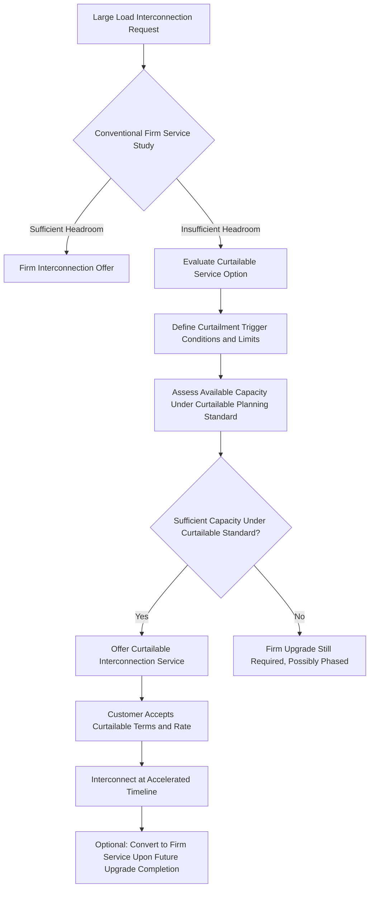

## Flexible and Curtailable Large-Load Interconnection Service

### Conceptual Foundation

Flexible and curtailable large-load interconnection service is an emerging class of interconnection arrangement in which a large load customer accepts a defined, contractually bounded degree of demand reduction or curtailment during specified system conditions, in exchange for faster interconnection timelines, reduced infrastructure upgrade requirements, or lower-cost service relative to conventional firm (uncurtailable) interconnection. The underlying premise, introduced in the Large-Load Interconnection Processes and Queue Management entry, is that conventional interconnection studies size required infrastructure upgrades to accommodate a load's full nameplate or contracted demand at all times, including rare peak or contingency conditions — but a load's actual demand profile, or its operational tolerance for occasional reduction, may not require infrastructure sized for that theoretical worst case, and capturing that flexibility can substantially reduce both the magnitude and the timeline of required system upgrades.

**Key Points**

- This concept extends the same fundamental logic underlying the managed EV charging and V2G demand-shifting mechanisms discussed extensively in the EV Integration chapter — using demand flexibility to reduce required infrastructure investment — but applied at transmission-class large-load interconnection scale rather than distributed residential/fleet charging scale
- The core value proposition operates in both directions: the utility avoids or defers costly infrastructure upgrades sized for a peak condition that may rarely occur, while the large-load customer potentially gains a faster path to interconnection than waiting for conventional firm-service infrastructure upgrades to be completed
- This is a rapidly developing area of interconnection policy and tariff design as of the current period, driven substantially by the scale of data center interconnection requests discussed in this chapter's other entries; specific program designs, adoption status, and regulatory treatment should be verified against current utility tariff filings and regulatory dockets rather than treated as settled or uniform practice

### Technical Basis: Why Curtailable Service Can Unlock Capacity Faster

**Key Points**

- Transmission and distribution infrastructure is conventionally planned to serve firm load under N-1 (and often N-1-1) contingency conditions — meaning the system must be able to serve the full firm load even with one (or a sequential second) major system element out of service
- A curtailable load, by contract, does not need to be served under some or all of these contingency conditions, since the interconnection agreement itself specifies that the load may be reduced or interrupted when the relevant system stress condition occurs
- This means the infrastructure sizing calculation can be based on a lower effective firm capacity requirement, potentially allowing interconnection using existing headroom that would be insufficient for the same load under a conventional firm-service contingency planning standard — directly analogous to how the cardinality-constrained switching actions in Transmission Topology Optimization or the demand-charge-avoidance battery/managed-charging strategies in the EV Integration chapter extract additional usable capacity from existing infrastructure without new construction, here achieved contractually rather than through switching or storage

### Service Design Parameters

Curtailable interconnection arrangements are typically defined along several key contractual dimensions, which together determine both the customer's operational risk exposure and the magnitude of infrastructure benefit the utility can realize:

- **Curtailment trigger conditions**: The specific system conditions that activate curtailment — commonly tied to defined contingency events (e.g., specific transmission element outages), system-wide peak demand periods, or explicit reliability emergency declarations, rather than at the utility's unconstrained discretion
- **Curtailment magnitude and duration limits**: The maximum amount of load reduction that may be called (e.g., load reduced to X% of contracted capacity) and the maximum duration and/or frequency of curtailment events per year, providing the customer a bounded worst-case operational impact to plan around
- **Notice period**: How much advance notice the customer receives before a curtailment event, ranging from real-time/immediate (for contingency-triggered curtailment) to day-ahead or longer (for planned peak-period curtailment), which significantly affects how disruptive a given curtailment program is to the customer's operations
- **Compensation or rate discount structure**: The financial mechanism by which the customer is compensated for accepting curtailment risk — typically either a reduced interconnection/demand charge rate relative to firm service, a direct capacity payment for curtailable availability, or some combination
- **Firm service conversion pathway**: Many arrangements include a defined pathway (often tied to completion of a longer-term infrastructure upgrade) by which the customer's service can convert from curtailable to firm once adequate permanent capacity becomes available, meaning curtailable service functions as a bridge arrangement rather than necessarily a permanent operating condition

### Applicability to Data Center Load Specifically

A significant driver of current interest in curtailable large-load interconnection is the specific operational characteristics of data center computing workloads, which — per the Data Center and Hyperscale Load Characteristics entry — are not monolithic in their flexibility:

- **Latency-sensitive inference/serving workloads**: Real-time or near-real-time computing workloads serving live user requests, which generally have limited tolerance for capacity reduction without directly degrading user-facing service quality, making this workload category poorly suited to significant curtailment
- **Batch/training workloads**: Large-scale AI model training and other batch computing workloads, which [Inference] are widely discussed in industry and research contexts as having meaningfully more scheduling flexibility — a training job can often be paused, checkpointed, and resumed, or its intensity throttled, with primarily a timeline (rather than a hard failure) consequence — making this workload category a more natural candidate for curtailable interconnection arrangements, though the practical degree of flexibility varies by specific training methodology, checkpointing infrastructure maturity, and the customer's schedule tolerance, and should be assessed against current technical practice rather than assumed uniformly available across all training workloads
- **Facility-level flexibility implementation**: Translating a curtailment signal into an actual computing workload response requires facility and software-level infrastructure (workload scheduling systems capable of responding to an external curtailment signal) that is a distinct technical capability from the electrical interconnection arrangement itself, meaning a data center's contractual willingness to accept curtailable service and its practical operational ability to execute a curtailment event gracefully are related but separate considerations

### Program and Policy Landscape

**Key Points**

- A number of utilities and regulatory dockets across multiple jurisdictions have explored or proposed large flexible/curtailable load tariff structures specifically motivated by data center interconnection volume, though the specific design, adoption status, and maturity of these programs varies substantially by jurisdiction as of the current period and is best assessed against current regulatory filings rather than treated as broadly standardized practice
- [Unverified] The degree to which large-load customers, particularly data center developers, have shown willingness to accept curtailable terms in exchange for faster interconnection — versus preferring to wait for firm service or pursue behind-the-meter/co-located generation alternatives as discussed in the Data Center and Hyperscale Load Characteristics entry — is not yet well-established as a general market pattern and likely varies by customer risk tolerance and the specific economics of alternative options available at a given site

### Example

A utility receives an interconnection request for a 400 MW data center campus. The conventional firm-service system impact study determines only 250 MW of firm capacity is available without a transmission upgrade estimated to take four years to complete. The utility offers the developer a curtailable service arrangement: interconnection at the full requested 400 MW, but subject to curtailment down to 250 MW during specific defined contingency conditions (estimated, based on historical system performance, to occur on the order of a modest number of hours per year) with day-ahead notice for planned peak-period curtailment and shorter notice for contingency-triggered events, at a reduced demand charge rate reflecting the non-firm nature of the incremental 150 MW. The developer's facility, having separated its workload into a latency-sensitive inference tier (planned to be served preferentially from the firm 250 MW portion) and a more schedule-flexible training tier (planned to absorb the bulk of any curtailment impact by pausing or throttling training jobs during called events), determines the arrangement is operationally workable and accepts curtailable terms, allowing the facility to begin full-capacity operation years earlier than waiting for the transmission upgrade, with a contractual conversion to firm service once that upgrade is completed.

### Risk Considerations and Limitations

- **Reliability and enforceability of curtailment commitments**: The value of curtailable service to the utility depends on the large-load customer reliably executing curtailment when called; contractual and, in some designs, technical enforcement mechanisms (e.g., remote curtailment signaling with automatic facility response rather than relying solely on customer manual compliance) are a significant program design consideration, and the maturity of such enforcement mechanisms varies across current program proposals
- **Workload flexibility assumptions may not hold uniformly**: As discussed above, the assumption that data center load (or a defined portion of it) can gracefully absorb curtailment depends on facility-level technical capability and workload mix that is customer- and facility-specific; a program designed around an assumed degree of flexibility that does not materialize in practice creates risk for both the utility (reduced reliability benefit) and the customer (unexpected operational disruption)
- **Customer risk tolerance and adoption uncertainty**: As noted above, it remains [Unverified] how broadly large-load customers, particularly given the competitive and capital-intensive nature of data center development, will find curtailable terms an acceptable trade-off relative to firm service or alternative generation arrangements, and adoption patterns should be tracked against current market developments rather than assumed
- **Precedent and equity considerations across customer classes**: [Inference] Offering accelerated, potentially preferential interconnection treatment to large-load customers willing to accept curtailment risk raises policy questions about consistency and fairness relative to other interconnection customers and existing ratepayers, particularly regarding whether curtailable-service infrastructure planning adequately protects overall system reliability for firm customers; this is an area of active regulatory scrutiny in jurisdictions considering such tariffs, and the specific safeguards required vary by jurisdiction
- **Interaction with cost allocation**: The rate discount or compensation structure for accepting curtailable service must be calibrated carefully against the actual infrastructure cost avoided; a discount that is too generous undermines the utility's cost recovery, while one that is too small may not provide sufficient incentive for large-load customers to accept curtailment risk, making the specific rate design a consequential and technically nontrivial element of program success

**Next Steps**

- Remote Curtailment Signaling and Automatic Facility Response Architecture
- Data Center Workload Scheduling Systems and Curtailment-Responsive Computing Infrastructure
- Regulatory Precedent Review: Curtailable Large-Load Tariff Filings by Jurisdiction
- Rate Design Methodologies for Curtailable Service Discount Calibration
- Reliability Impact Assessment of Curtailable Load on System Contingency Planning
- Comparative Analysis: Curtailable Interconnection versus Behind-the-Meter Generation as Large-Load Solutions