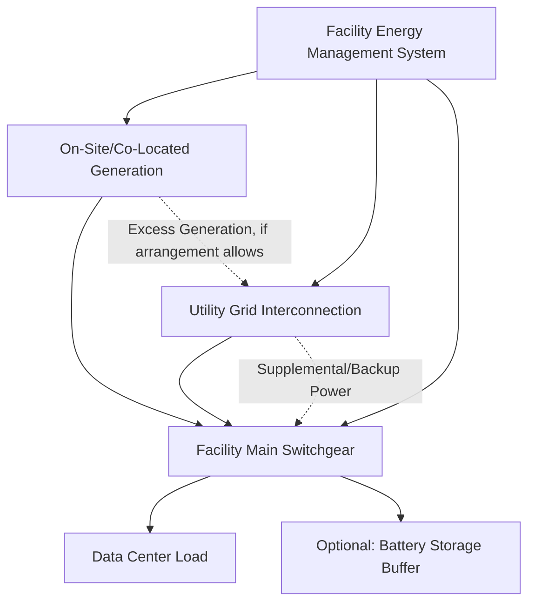

## Behind-the-Meter Generation and Co-Location Strategies

### Conceptual Foundation

Behind-the-meter (BTM) generation and co-location strategies refer to arrangements in which a large load — most prominently data centers, per this chapter's ongoing discussion — obtains some or all of its power from generation located at or near the load site and electrically connected on the customer side of the utility metering/interconnection point, rather than relying exclusively on power delivered through conventional utility transmission and distribution interconnection. These arrangements have gained significant attention as a strategy for large-load developers to address the interconnection queue timeline and capacity constraints discussed throughout this chapter, by reducing or bypassing dependence on grid capacity that may take years to become available through conventional interconnection processes.

**Key Points**

- The defining technical distinction from conventional grid interconnection is the electrical location of the generation relative to the utility meter/point of interconnection: BTM generation serves load directly, with only the net difference (if any) flowing through the utility interconnection point, versus front-of-meter generation that delivers power to the grid for the utility/market to then deliver back to the load through normal transmission and distribution service
- Co-location and BTM strategies span a spectrum from full grid independence (islanded operation, rare and technically demanding) through partial self-supply with grid backup/supplement (the more common arrangement) to arrangements that are contractually rather than electrically behind-the-meter (e.g., a power purchase agreement with a nearby but grid-connected generator, sometimes loosely described using similar terminology despite different technical characteristics)
- This is an actively evolving commercial and regulatory area as of the current period, with specific project structures, regulatory treatment, and technology choices varying significantly by jurisdiction, generation technology, and project; general descriptions here should be supplemented with verification against current project announcements and regulatory dockets for specific claims

### Generation Technology Options

**Natural Gas Generation**

On-site or co-located natural gas generation (reciprocating engines or gas turbines, potentially in combined-cycle configuration for larger installations) has emerged as a comparatively fast-to-deploy option given generally shorter equipment lead times and construction timelines relative to major transmission upgrades, and the relative maturity and dispatchability of the technology.

- Provides firm, dispatchable power largely independent of weather or time-of-day constraints, well-suited to the high-load-factor characteristics of data center load discussed in the Data Center and Hyperscale Load Characteristics entry
- [Inference] Emissions and local air quality permitting considerations are a significant project development factor for on-site gas generation, with specific requirements varying substantially by jurisdiction and potentially serving as a meaningful project timeline factor in some locations, partially offsetting the interconnection-timeline advantage the approach is intended to capture
- Fuel supply arrangements (pipeline capacity/access at the site) are a necessary parallel infrastructure consideration analogous in concept to electrical interconnection, meaning gas-fired BTM generation trades electrical interconnection queue risk for gas infrastructure availability risk rather than eliminating infrastructure dependency entirely

**Nuclear (Including Small Modular Reactors and Existing Plant Arrangements)**

Two distinct nuclear-related arrangements have received significant industry attention: dedicated co-location with new nuclear generation (including small modular reactor, SMR, concepts still in various stages of development and deployment as of the current period) and commercial arrangements tied to existing, previously grid-connected nuclear plants (including some publicly discussed cases of data center developers entering long-term power purchase arrangements with existing nuclear facilities, in some cases discussed alongside plant life-extension or restart decisions).

- [Unverified] SMR technology maturity, cost, and realistic deployment timelines vary substantially across the numerous SMR designs currently in development, and specific technology and timeline claims should be verified against current vendor and regulatory (NRC licensing) status rather than treated uniformly, given this is one of the most rapidly evolving and closely watched sub-areas of the current large-load generation landscape
- Existing nuclear plant arrangements (rather than new-build) offer a faster path to firm, low-carbon, high-load-factor power supply given the plant is already operating or readily restartable, but the electrical and contractual structure of these arrangements (e.g., whether power is delivered genuinely behind-the-meter versus through a contractual financial arrangement layered on top of conventional grid delivery) varies by specific project and has been the subject of regulatory review in some cases regarding appropriate treatment and cost allocation to other grid customers

**Solar, Wind, and Battery Storage**

On-site or co-located renewable generation paired with battery storage is also pursued, particularly where sustainability commitments are a driver alongside capacity considerations, though the intermittency of solar/wind generation relative to the steady, high-load-factor demand characteristic of data center load (per the Data Center and Hyperscale Load Characteristics entry) generally necessitates either substantial battery storage, a firm generation complement, or continued grid supplement to achieve high reliability.

**Key Points**

- No single generation technology uniformly dominates BTM/co-location strategy selection; technology choice reflects a project-specific balance of deployment timeline, firm capacity/reliability requirements, emissions and sustainability commitments, fuel/resource availability at the specific site, and regulatory/permitting environment
- Hybrid approaches combining multiple generation technologies (e.g., gas generation for firm baseload capacity paired with solar and battery storage for partial renewable supply and cost optimization) are commonly discussed as a way to balance these competing considerations

### Electrical Architecture Patterns

- **Full BTM with grid supplement/backup**: The generation is sized to serve most or all normal load, with grid interconnection retained for backup, supplemental capacity during generation shortfall (e.g., renewable intermittency, or gas plant maintenance outages), or excess power export where commercially and technically arranged
- **Partial BTM with grid as primary**: On-site generation serves a defined portion of load (often the portion facing the longest interconnection wait or the portion targeted for specific sustainability commitments), while the majority of load continues to be served through conventional grid interconnection, sized to whatever capacity is available on a nearer-term timeline
- **Islanded/fully independent operation**: [Inference] Rare in practice for large-scale continuous facilities given the reliability and redundancy benefits of grid interconnection even where BTM generation could theoretically supply full facility needs; most publicly discussed large-load BTM arrangements retain some form of grid connection rather than pursuing genuine full electrical islanding, though specific project architecture should be verified for individual announced projects rather than assumed

### Regulatory and Market Considerations

**Key Points**

- **Interconnection and standby service treatment**: Even facilities pursuing substantial BTM generation typically still require some form of utility interconnection for backup/standby service, and the rate design and technical requirements for standby service to a large, primarily self-supplied load is itself a distinct and, in a number of jurisdictions, actively contested regulatory question, since a large facility drawing backup power only occasionally can create cost allocation questions analogous to (though distinct from) the demand charge dynamics discussed for DCFC and fleet depot sites in the EV Integration chapter
- **Environmental and permitting review**: On-site generation, particularly combustion-based generation, is typically subject to its own permitting process (air quality, and depending on technology and location, additional environmental review) that operates on a timeline and regulatory track largely separate from, though sometimes coordinated with, the electrical interconnection process
- **Wholesale market and RTO/ISO participation implications**: [Unverified] The specific treatment of BTM generation with respect to wholesale market participation, capacity market obligations, and RTO/ISO operational visibility varies by market and specific arrangement structure, and is an area of ongoing market rule development in several regions given the emerging scale of these arrangements
- **Grid reliability and cost-shifting concerns**: A recurring theme in current regulatory discussion is whether large-load BTM/co-location arrangements, by reducing the load's reliance on (and cost contribution to) the conventional grid, could shift infrastructure and reliability costs onto remaining grid customers, particularly in cases where the facility retains meaningful backup/standby reliance on the grid without bearing cost responsibility proportional to that reliance — this concern parallels, at a different scale, the equity and cost allocation discussions raised in the Large-Load Interconnection Processes and Flexible/Curtailable Interconnection Service entries

### Example

A data center developer facing a projected five-year wait for firm grid interconnection at a preferred site instead pursues a hybrid approach: an on-site natural gas generation facility sized to serve approximately 70% of the facility's projected load on a firm, dispatchable basis, paired with a grid interconnection sized to the roughly 150 MW currently available without major upgrades (serving the remaining 30% of load plus providing backup capacity in the event of a gas generation outage). This allows the facility to begin operation at close to full capacity well ahead of the conventional interconnection timeline, while the developer separately pursues the standard interconnection queue process (potentially benefiting from the flexible/curtailable interconnection concepts discussed in the prior entry) to eventually access firm grid capacity for further facility expansion. The gas generation facility undergoes its own separate air quality permitting process in parallel with construction, and the developer negotiates a standby service rate with the utility for the backup/supplemental grid capacity — illustrating how a real large-load project frequently combines several of the strategies discussed across this chapter (curtailable service, BTM generation, phased capacity growth) rather than relying on any single approach in isolation.

### Risk Considerations and Limitations

- **Technology and permitting timeline risk**: While BTM generation is often pursued specifically to avoid the multi-year timeline associated with grid interconnection upgrades, generation technology procurement (particularly gas turbine equipment, which has been subject to widely discussed industry-wide lead time extensions given surging demand) and environmental permitting can themselves introduce significant, and not necessarily shorter, timeline risk that should be weighed against the interconnection timeline the strategy is meant to avoid
- **Cost and complexity of dual infrastructure**: Facilities pursuing substantial BTM generation while retaining grid backup are effectively developing and maintaining two parallel power supply infrastructures, with corresponding capital and operational cost and complexity, that a facility relying solely on conventional grid interconnection does not bear
- **Regulatory uncertainty regarding standby rates and market rules**: As discussed above, the rate and market treatment of large-load BTM arrangements remains an area of active regulatory development in multiple jurisdictions, creating a degree of commercial uncertainty for projects structured under current rules that could be subject to future regulatory revision
- **Fuel and resource dependency risk**: On-site generation, particularly gas-fired, substitutes electrical grid dependency for fuel supply chain dependency (pipeline access, gas market price volatility), which is a materially different but not necessarily lower risk profile, and should be evaluated on its own terms rather than assumed to be a strictly lower-risk alternative to grid interconnection
- **Nuclear-specific technology and timeline uncertainty**: As noted above, [Unverified] SMR-based co-location strategies in particular carry meaningful technology maturity and regulatory approval timeline uncertainty given the early stage of most SMR designs' commercial deployment as of the current period, and should not be treated as an equivalently mature option to gas generation or existing nuclear plant arrangements for near-term project planning purposes

**Next Steps**

- Standby and Backup Service Rate Design for Large Self-Supplied Loads
- Gas Turbine Procurement Lead Times and Supply Chain Constraints for BTM Generation
- Small Modular Reactor Technology and Regulatory Status Review
- Wholesale Market Rule Treatment of Behind-the-Meter Generation Across RTOs/ISOs
- Environmental Permitting Processes for On-Site Combustion Generation
- Comparative Risk-Timeline Analysis: BTM Generation versus Curtailable Interconnection versus Firm Grid Interconnection