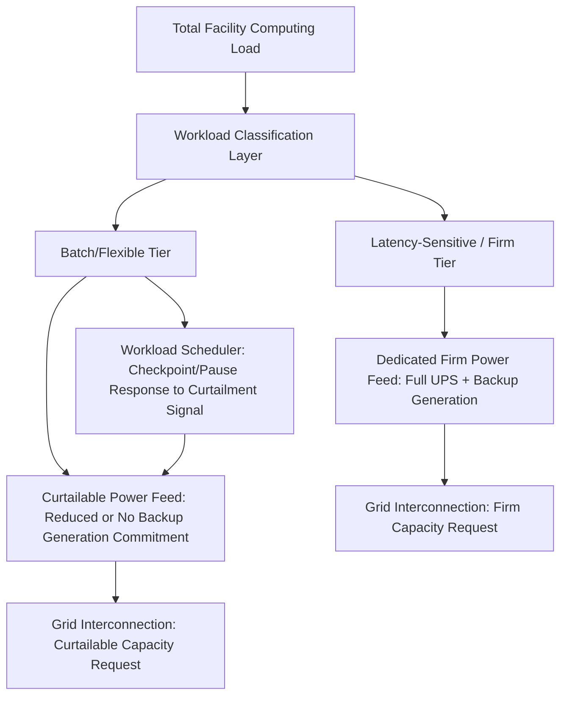

## Computational Load Classification and Reliability Treatment

### Conceptual Foundation

Computational load classification is the practice of disaggregating a data center facility's total power demand by the operational and reliability characteristics of the underlying computing workloads it serves, rather than treating facility load as a single homogeneous demand quantity. This classification matters directly for grid planning and interconnection design because, as introduced in the Data Center and Hyperscale Load Characteristics and Flexible and Curtailable Large-Load Interconnection Service entries, different workload categories carry meaningfully different tolerance for power interruption, curtailment, and demand variability — and treating a facility's full nameplate load as uniformly latency-critical and uncurtailable, when only a fraction of it genuinely requires that treatment, results in both grid infrastructure and facility backup systems being sized more conservatively (and expensively) than operationally necessary.

**Key Points**

- This entry connects the workload-flexibility concepts introduced in the Flexible and Curtailable Large-Load Interconnection Service entry with the facility-level electrical architecture (UPS, backup generation) discussed in the Data Center and Hyperscale Load Characteristics entry, focusing specifically on how workload classification informs both grid-facing interconnection design and facility-internal reliability tier design
- Computational load classification is as much a facility operations and IT infrastructure discipline as a grid engineering one; the grid engineering relevance is in how classification outputs (which load segments are curtailable, which require uninterrupted firm power) become inputs to interconnection and reliability planning decisions
- Practices in this area are evolving alongside the growth of AI-specific workloads, which have introduced categories (large-scale distributed training in particular) with materially different flexibility characteristics than the historically more homogeneous enterprise/cloud serving workloads that dominated prior data center planning norms

### Primary Workload Categories

**Latency-Sensitive Serving/Inference Workloads**

Real-time or near-real-time computing that directly serves live user or application requests — web services, transactional databases, real-time AI inference (e.g., responding to a live user query) — where service degradation or interruption has immediate, user-visible consequences.

- Requires continuous, uninterrupted power at the reliability tier conventionally associated with critical data center infrastructure (UPS ride-through plus backup generation transfer, per the facility architecture discussed in the Data Center and Hyperscale Load Characteristics entry)
- Generally has limited tolerance for curtailment beyond very brief ride-through windows, making this workload category the primary driver of a facility's firm/uncurtailable capacity requirement

**Batch and Asynchronous Processing Workloads**

Computing work that does not directly and immediately serve a live user request and can tolerate some degree of delay, pausing, or rescheduling without a hard failure — including large-scale AI model training, and more traditional data processing/analytics batch jobs.

- [Inference] AI training workloads specifically are widely discussed in industry contexts as possessing meaningful operational flexibility due to checkpointing capability (periodically saving training progress state so a job can be paused and resumed without losing substantial prior computational work), though the practical degree of flexibility depends on checkpointing frequency, the computational cost of a pause/resume cycle, and the training job's schedule constraints, and should not be assumed uniform across all training workloads or all points in a training run
- The distinction between "curtailable" and "delayable" matters technically: some batch workloads can tolerate power reduction/throttling during active execution, while others are better suited to being paused entirely and resumed later, and facility/software workload management systems must be designed around which specific flexibility mode a given workload supports

**Key Points**

- The inference/training distinction is the most commonly discussed classification boundary in current industry and policy discussion specifically because of the scale and growth of AI-related data center demand, but the underlying latency-sensitivity-based classification principle predates and extends beyond AI-specific workloads to general enterprise/cloud computing reliability tiering practice
- A single physical facility frequently hosts a mix of both workload categories simultaneously, meaning facility-level (rather than purely workload-level) power classification requires either physical/electrical segregation of workload types to different power feeds, or software-level workload placement and prioritization logic that can differentially respond to a power event based on which workloads are running where

### Reliability Tier Design Implications

**Key Points**

- Facilities designed with explicit power-tier segregation between latency-sensitive and flexible workloads can request a correspondingly tiered interconnection arrangement from the utility — a firm-service request for the portion of load supporting latency-sensitive workloads, and a curtailable-service request (per the Flexible and Curtailable Large-Load Interconnection Service entry) for the portion supporting flexible batch workloads — potentially achieving a faster and/or lower-cost overall interconnection than requesting the facility's full nameplate capacity as uniformly firm
- This same tiering logic extends to on-site backup generation sizing (discussed in the Data Center and Hyperscale Load Characteristics and Behind-the-Meter Generation entries): backup generation capacity can potentially be sized to the firm/latency-sensitive tier alone rather than full facility nameplate capacity, reducing both capital cost and the scale of on-site generation permitting/fuel supply requirements, provided the flexible tier's workload management system can reliably respond to a grid or backup generation shortfall by pausing or reducing that portion of load
- [Inference] The degree to which current data center facility designs actually implement this kind of granular power-tier segregation, versus treating full facility load as uniformly firm by default, likely varies significantly across the industry and by facility vintage/purpose, and should be assessed against current facility design practice and specific project disclosures rather than assumed to be standard practice

### Interaction with Grid-Facing Load Volatility

The Data Center and Hyperscale Load Characteristics entry noted that AI training workloads specifically have been discussed as a source of more pronounced power fluctuation than traditional steady data center load, arising from synchronized computational phases across a distributed training cluster. Computational load classification connects to this consideration in two ways:

- **Isolating volatile load for grid impact assessment**: If a facility's power fluctuation risk is concentrated specifically in its training/batch tier rather than uniformly across the whole facility, grid impact studies and any facility-level power quality mitigation (e.g., on-site battery buffering, discussed in the Data Center and Hyperscale Load Characteristics entry) can potentially be targeted specifically at that tier's interconnection point rather than applied to the facility's full load, improving the precision and potentially the cost-effectiveness of mitigation design
- **Curtailment as a dual-purpose tool**: A curtailable interconnection arrangement designed primarily to address capacity/headroom constraints (per the Flexible and Curtailable Large-Load Interconnection Service entry) may, depending on program and trigger design, also serve as a mechanism to manage rapid load fluctuation impact, since both concerns center on the same flexible/batch workload tier — though [Unverified] whether curtailment programs designed around discrete trigger events (contingencies, peak periods) are technically well-suited to addressing faster, more continuous power fluctuation dynamics is a distinct technical question that should be evaluated separately rather than assumed automatically addressed by capacity-focused curtailment program design

### Example

A hyperscale operator designing a new AI-focused campus separates the facility's electrical architecture into two distinct power domains from initial design: a "serving" domain supporting inference and other latency-sensitive workloads, sized at 150 MW and provisioned with full UPS and backup generation supporting the facility's standard critical-infrastructure reliability tier, and a "training" domain supporting large-scale distributed model training, sized at 350 MW and provisioned with reduced backup generation (sized only to support graceful checkpointing and shutdown rather than sustained operation through an extended outage) and explicit software-level integration between the facility's power monitoring system and its training job scheduler, such that a grid curtailment signal or on-site generation shortfall triggers automatic checkpointing and pausing of active training jobs rather than an uncontrolled facility-wide power loss. This architecture allows the operator to request firm grid interconnection for the 150 MW serving domain (justifying the associated infrastructure investment given its uninterruptible reliability requirement) while requesting curtailable interconnection service for the 350 MW training domain, potentially achieving faster overall interconnection than a single undifferentiated 500 MW firm request would allow, consistent with the tiered-request pattern discussed above.

### Risk Considerations and Limitations

- **Checkpointing and resume cost is not zero**: While checkpointing enables training workload flexibility, the pause/resume cycle itself has a computational and time cost (re-loading state, potential loss of in-progress but uncheckpointed work depending on checkpoint frequency), meaning "flexible" is not equivalent to "free to interrupt," and facility/program design should account for this cost rather than treating batch workload flexibility as costless to the customer
- **Software-electrical integration complexity**: Achieving the kind of coordinated power-tier and workload-scheduler response described above requires nontrivial integration between facility electrical monitoring/control systems and IT workload orchestration systems, a cross-domain engineering challenge that combines electrical, controls, and software engineering disciplines not traditionally integrated in conventional data center design practice
- **Workload mix is not always cleanly separable**: [Inference] Some computing workloads may not fit cleanly into a binary latency-sensitive-versus-flexible classification (for example, workloads with moderate but non-zero latency sensitivity, or training workloads running close to a delivery deadline with limited pause tolerance), and real facility workload portfolios likely require more nuanced, potentially continuous rather than binary, classification and prioritization schemes than the simplified two-tier framework presented here for illustrative purposes
- **Verification and trust in classification claims**: From a utility/grid-planning perspective, a curtailable interconnection request premised on a customer's workload classification depends on the utility having some basis for confidence that the claimed flexible tier will actually respond as represented when called upon; the specific verification, metering, or enforcement mechanisms utilities may require to gain this confidence are a program design consideration connected to the reliability and enforceability concerns raised in the Flexible and Curtailable Large-Load Interconnection Service entry

**Next Steps**

- Checkpointing Architecture and Pause/Resume Cost Analysis for Distributed AI Training
- Facility Electrical-to-IT Workload Orchestration Integration Design
- Metering and Verification Approaches for Curtailable Load Compliance
- Tiered Backup Generation Sizing Methodologies for Mixed-Workload Data Centers
- Continuous (Non-Binary) Workload Flexibility Classification Frameworks
- Case Studies in Power-Tiered Data Center Electrical Architecture