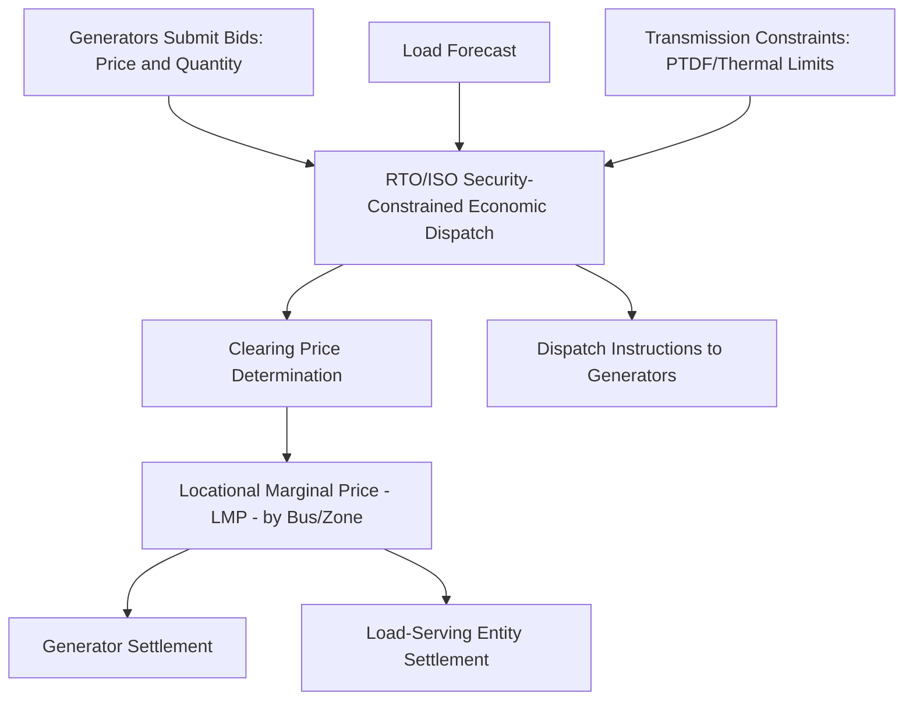

## Regulated versus Restructured Market Structures

### Conceptual Foundation

Regulated and restructured market structures represent the two fundamental institutional models governing how electricity generation, transmission, and delivery to end customers are organized, priced, and overseen in the United States and, with analogous frameworks, in many other countries. The distinction centers on whether electricity generation and retail supply are provided as a regulated monopoly service (vertically integrated utility model) or opened to competition among multiple generation and/or retail supply entities operating within a market framework, while transmission and distribution — recognized as natural monopolies in both models — remain regulated regardless of which structure applies to generation and retail.

**Key Points**

- This distinction fundamentally shapes nearly every other topic in this chapter and in the broader Electrical Grid Engineering curriculum where market or economic mechanisms are discussed (interconnection cost allocation, capacity markets, ancillary services, large-load rate design), since the applicable market structure determines which institutions make which decisions and through what pricing mechanism
- Neither structure is uniformly "better"; both represent different answers to the trade-off between the coordination and long-term planning benefits of centralized utility control versus the efficiency and innovation benefits potentially achievable through competition, and empirical outcomes have been debated extensively in the economics and regulatory literature without a settled consensus favoring one structure universally
- The United States presents a patchwork of both models by state/region, making "the U.S. electricity market" a misleading singular concept; specific rules, market participants, and outcomes vary substantially by the specific state or RTO/ISO region in question

### Regulated (Vertically Integrated Utility) Model

**Structure**

In the traditional regulated model, a single vertically integrated utility owns and operates generation, transmission, and distribution assets serving a defined geographic service territory, typically as a legally sanctioned monopoly. The utility's rates (what it charges customers) are set through a regulatory process — typically overseen by a state public utility commission (PUC) — using cost-of-service ratemaking, in which the utility's allowed revenue is determined by its prudently incurred operating costs plus a regulator-approved rate of return on its capital investment (rate base).

**Key Points**

- The utility bears the obligation to serve all customers in its territory reliably, and in exchange receives a regulator-guaranteed opportunity (though not an absolute guarantee, since regulators can disallow imprudent costs) to recover its costs and earn a reasonable return
- Generation resource decisions (what power plants to build, retire, or contract for) are made by the utility, typically subject to regulatory review through an integrated resource planning (IRP) process, rather than being determined by a competitive market signal
- This model remains the predominant structure across much of the southeastern, western (outside California and a few other states), and parts of the central United States, among other regions, though the specific regulatory details vary by state

### Restructured (Competitive Wholesale/Retail) Model

**Structure**

In restructured markets, generation ownership and dispatch are opened to competition: multiple independent generation owners compete to sell power, typically through organized wholesale markets operated by a Regional Transmission Organization (RTO) or Independent System Operator (ISO), which use market-based mechanisms (bid-based economic dispatch, discussed further below) to determine which generators run and at what price, rather than a single utility's internal generation planning and dispatch decisions. Transmission and distribution remain regulated monopoly functions even in restructured markets, since the economic case for competition in wired transport infrastructure is generally regarded as much weaker than for generation.

- **Wholesale market restructuring**: The RTO/ISO operates day-ahead and real-time energy markets, along with capacity markets (in many, though not all, restructured regions) and ancillary service markets, determining generator dispatch and settlement prices through the market mechanisms described below
- **Retail restructuring (where adopted)**: In some restructured states, retail customers can additionally choose their electricity supplier from among competing retail electricity providers, rather than being served exclusively by the regulated utility for the supply/generation portion of their bill (distribution service and delivery remain with the regulated utility regardless); other restructured states maintain wholesale market competition without extending full retail choice to all customer classes

**Key Points**

- Wholesale market restructuring and retail choice are conceptually and often institutionally separable — a state or region can have organized wholesale markets (RTO/ISO dispatch) without extending retail choice to residential customers, and the specific combination varies by jurisdiction
- RTOs/ISOs operating organized wholesale markets in the United States include, among others, PJM Interconnection, MISO, ERCOT (Texas, operating as a largely electrically isolated market with some distinct structural features), CAISO, ISO New England, NYISO, and SPP, each with jurisdiction-specific market rules, though the fundamental economic dispatch and market mechanisms share substantial common structure across most of these entities
- [Inference] The specific boundary and membership of RTO/ISO footprints, along with market rule details, evolve over time through both organic growth/departure of member utilities and regulatory reform processes, so current RTO/ISO territorial and rule specifics should be verified against current sources rather than treated as static

### Wholesale Market Mechanics in Restructured Regions

- **Security-constrained economic dispatch (SCED)**: The core market-clearing algorithm, directly connected to the optimization and power flow concepts discussed in the Transmission Topology Optimization entry earlier in this domain — the RTO/ISO selects the least-cost combination of generator output that meets forecast load while respecting transmission thermal limits and N-1 security constraints, producing a market-clearing price
- **Locational Marginal Pricing (LMP)**: In most U.S. organized markets, the clearing price varies by location (bus or zone) to reflect the marginal cost of serving load at that specific location, including the cost impact of any binding transmission constraints; LMP is directly connected to the congestion and topology concepts discussed earlier in this domain, since transmission congestion is precisely what causes LMPs to diverge across locations rather than clearing at a single system-wide price
- **Day-ahead and real-time markets**: Most organized markets operate both a day-ahead market (where generators and load-serving entities transact based on forecast conditions for the next operating day) and a real-time market (settling actual deviations from day-ahead positions based on real-time system conditions), a two-settlement structure that provides both forward price certainty and real-time balancing
- **Capacity markets**: A subset of RTOs/ISOs (notably PJM, ISO-NE, and with a somewhat different design MISO) operate separate capacity markets intended to ensure adequate resource adequacy (sufficient installed generation capacity to reliably meet peak demand plus a reserve margin) beyond what the energy market alone might incentivize, given that energy market revenue alone may not always provide sufficient investment signal for capacity that is needed primarily for rare peak/reliability events

### Comparative Structural Summary

| Dimension | Regulated (Vertically Integrated) | Restructured (Competitive Wholesale) |
| --- | --- | --- |
| Generation ownership | Utility-owned | Multiple competing owners |
| Generation dispatch decision | Utility internal decision | RTO/ISO market-based SCED |
| Generation investment signal | Regulatory approval via IRP process | Market price signals (energy + capacity market revenue) |
| Cost recovery mechanism | Cost-of-service rate base regulation | Market revenue (generation); cost-of-service remains for transmission/distribution |
| Retail supply | Utility default, limited/no choice typically | Varies: some states offer retail choice, others do not |
| Primary regulatory body | State PUC (with FERC oversight of any wholesale transactions) | State PUC (distribution/retail) + FERC (wholesale market rules) + RTO/ISO governance |

**Key Points**

- Transmission planning and cost allocation processes, including the large-load interconnection processes discussed extensively in this chapter, operate somewhat differently between the two structures: RTO/ISO regions typically have formalized, stakeholder-governed transmission planning processes (subject to FERC oversight, including the Order 1920 reforms referenced in the EV Integration chapter's HTLS reconductoring content) while vertically integrated utility regions conduct transmission planning more directly within the utility's own IRP and capital planning process, subject to state PUC review
- Federal Energy Regulatory Commission (FERC) jurisdiction generally extends to wholesale electricity transactions and transmission service in interstate commerce regardless of market structure, while state public utility commissions retain jurisdiction over retail rates and, in vertically integrated states, generation resource approval — this federal/state jurisdictional split is a recurring structural feature relevant to understanding how regulatory authority over topics discussed throughout this curriculum (interconnection, large-load rate design, transmission cost allocation) is actually allocated

### Example

Consider a large data center developer (connecting to the Large-Load Interconnection content earlier in this chapter) evaluating two candidate sites: one in a vertically integrated utility's service territory, the other within a restructured RTO market region. In the vertically integrated territory, the developer's interconnection and service arrangement is negotiated directly with the incumbent utility, which must separately justify to its state PUC (through the IRP process) any new generation capacity or transmission investment needed to serve the load, with the utility's cost recovery for that investment subject to prudency review in a future rate case. In the RTO region, the developer's interconnection request is processed through the RTO's formal large-load interconnection study process (as discussed in the Large-Load Interconnection Processes entry), and once interconnected, the facility's energy costs reflect the locational marginal price at its specific delivery point — meaning if the facility is sited in a transmission-constrained area, it may face higher energy costs reflecting local congestion, an outcome the developer could potentially mitigate through siting choice or hedging arrangements, in contrast to the vertically integrated case where the developer's rate is set through the regulated utility's approved tariff rather than varying with real-time locational market conditions.

### Risk Considerations and Limitations

- **Neither structure eliminates the need for regulatory oversight**: Even in fully restructured markets, transmission and distribution remain rate-regulated, and wholesale market rules themselves are subject to FERC oversight and periodic reform, meaning "restructured" does not mean "unregulated" but rather reflects a different allocation and mechanism of regulatory and market function
- **Resource adequacy design remains a live challenge in both structures**: [Inference] Both regulated IRP processes and restructured capacity markets have faced ongoing scrutiny and reform efforts regarding whether they adequately incentivize sufficient and appropriately-timed generation investment, particularly amid the load growth pressures from data centers and electrification discussed throughout this and the prior chapter, and specific current resource adequacy concerns and reform proposals in any given region should be assessed against current regulatory dockets rather than treated as settled
- **Market design details matter enormously within the "restructured" category**: The comparative summary above presents restructured markets as a relatively unified category, but substantial design differences exist across specific RTOs/ISOs (capacity market design or absence thereof, specific LMP zonal versus nodal granularity, market monitoring and mitigation rules), such that generalized restructured-market statements should be treated as directional rather than precisely applicable to any specific RTO/ISO without further verification
- **Ongoing structural evolution**: [Unverified] The regulated/restructured landscape itself is not static — states have periodically considered restructuring or, less commonly, re-regulating, and RTO/ISO membership and market rules continue to evolve, meaning the current structural map should be verified against current sources for any application requiring precision about a specific jurisdiction's status

**Next Steps**

- Security-Constrained Economic Dispatch and Locational Marginal Pricing: Mathematical Formulation
- Capacity Market Design: PJM, ISO-NE, and MISO Comparative Approaches
- Integrated Resource Planning Process and Regulatory Review in Vertically Integrated States
- FERC and State PUC Jurisdictional Boundaries in Electricity Regulation
- Resource Adequacy Mechanisms and Reform Proposals Across Market Structures
- Retail Choice Program Design and Consumer Outcomes in Restructured States